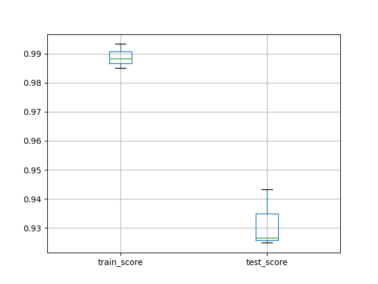

> Scikit-learn（以前称为scikits.learn，也称为sklearn）是针对Python 编程语言的免费软件机器学习库。它具有各种分类，回归和聚类算法，包括支持向量机，随机森林，梯度提升，k均值和DBSCAN

## Train & Test

### `load_digits`

`scikit-learn`中自带了很多的数据集在`sklearn.datasets`模块中，`load_digits`是其中一个用于识别手写数字的数据集

导入`load_digits`并展示其数据集和结果

~~~python
from sklearn.datasets import load_digits
# 关于手写数字识别的数据集
import matplotlib.pyplot as plt

# X的每行是64个图像像素的强度
# y是每个图片识别出来的数字0-9
X, y = load_digits(return_X_y=True)
print("X:\n", X)
print("y:\n", y)

# 绘制一下图片，灰度图
plt.imshow(X[0].reshape(8,8), cmap='gray')
plt.axis('off') # 关闭坐标轴
plt.show()
print("\nthe digit in the image is: ", y[0])
~~~

~~~bash
the digit in the image is:  0
~~~

通过`train_test_split`将数据集分割成独立的多个

- 若干独立的数据集和测试集可以用于训练机器学习模型

~~~python
# 手动分割数据集
# 用多个独立的数据集训练模型
from sklearn.model_selection import train_test_split

X_train, X_test, y_train, y_test = train_test_split(X, y, stratify=y, random_state=12)
print(X_test)
~~~

- 这里`X_test`为两个独立的数据集（矩阵）

建立模型并进行训练、测试

- 用`classifier.fit(x, y)`进行训练，传入的是数据集
- 用`classifier.score(x, y)`进行测试，传入的是准确的测试用例，即测试集

~~~python
# 一旦拥有独立的训练和测试集，就可以使用fit方法学习机器学习模型
# 用score方法测试此方法
from sklearn.linear_model import LogisticRegression # 选择线性回归模型
# 建立线性回归模型
clf1 = LogisticRegression(solver='lbfgs',
                         multi_class='ovr', max_iter=5000, random_state=12)
# 通过已有数据集进行学习
clf1.fit(X_train, y_train)
accuracy1 = clf1.score(X_test, y_test)
print('Accuracy score of the {} is {:.2f}'.format(clf1.__class__.__name__, accuracy1))
~~~

~~~bash
Accuracy score of the LogisticRegression is 0.97
~~~

- 这里使用的是线性回归模型，`scikit_learn`的`api`在各模型中保持一致

随机森林模型

~~~python
# 同样我们还可以使用RandomForest模型进行学习，api基本保持一致
from sklearn.ensemble import RandomForestClassifier
# 建立模型
clf2 = RandomForestClassifier(n_estimators=100, n_jobs=-1,
                              random_state=12)
clf2.fit(X_train, y_train)
accuracy2 = clf2.score(X_test, y_test)
print('Accuracy score of the {} is {:.2f}'.format(clf2.__class__.__name__, accuracy2))
~~~

~~~bash
Accuracy score of the RandomForestClassifier is 0.99
~~~

### `load_breast_cancer`

用同样的方法训练和测试`load_breast_cancer`乳腺癌数据集

导入数据集并对数据集进行独立分割

~~~python
from sklearn.datasets import load_breast_cancer

X, y = load_breast_cancer(return_X_y=True)
print(len(X))
print(y[0])

from sklearn.model_selection import train_test_split
X_train, X_test, y_train, y_test = train_test_split(X, y, stratify=y, random_state=12)
print(X_train)
~~~

使用`GradientBoostingClassifier`梯度提升分类器建模进行训练和测试

~~~python
from sklearn.ensemble import GradientBoostingClassifier
clf1 = GradientBoostingClassifier(n_estimators=100, random_state=12)
clf1.fit(X_train, y_train)
accuracy11 = clf1.score(X_test, y_test)
~~~

这里提供另一种测试精度的方法，使用`predict`预测函数对`X_test`进行预测得到`y_pred`，再调用`balanced_accuracy_score`评估方法对`y_pred`和`y_test`进行比对，进行精准度测试

~~~python
from sklearn.metrics import balanced_accuracy_score
y_pred = clf1.predict(X_test)
accuracy12 = balanced_accuracy_score(y_test, y_pred)
print(accuracy11)
print(accuracy12)
~~~

- 这里`score`函数和`balanced_accuracy_score`方法的精准度测试结果并不一样

使用其他的模型进行建模训练并测试

- 线性回归模型
- 随机森林模型

~~~python
from sklearn.linear_model import LogisticRegression
clf2 = LogisticRegression(solver='lbfgs', max_iter=5000,
                          multi_class='ovr', random_state=12)
clf2.fit(X_train, y_train)
accuracy2 = clf2.score(X_test, y_test)
print(accuracy2)

from sklearn.ensemble import RandomForestClassifier
clf3 = RandomForestClassifier(n_estimators=100, n_jobs=-1, random_state=12)
clf3.fit(X_train, y_train)
accuracy3 = clf3.score(X_test, y_test)
print(accuracy3)
~~~

经测试，拟合效果梯度提升>随机森林>线性回归

## Preprocess the Data

> 在训练和测试分类器之前预处理数据

### 预处理数据集

正常的分割、训练、测试过程

~~~python
from sklearn.datasets import load_digits

X, y = load_digits(return_X_y=True)

from sklearn.model_selection import train_test_split

X_train, X_test, y_train, y_test = train_test_split(X, y, stratify=y, random_state=12)

from sklearn.linear_model import LogisticRegression

clf = LogisticRegression(solver='lbfgs', multi_class='auto', max_iter=1000, random_state=42)
clf.fit(X_train, y_train)
accuracy = clf.score(X_test, y_test)
print('Accuracy score of the {} is {:.2f}'.format(clf.__class__.__name__, accuracy))
print('{} required {} iterations to be fitted'.format(clf.__class__.__name__, clf.n_iter_[0]))
~~~

- Accuracy score of the LogisticRegression is 0.96
- LogisticRegression required 1000 iterations to be fitted

用`MinMaxScaler`对数据集进行预处理

~~~python
from sklearn.preprocessing import MinMaxScaler

scaler = MinMaxScaler()
X_train_scaled = scaler.fit_transform(X_train)
X_test_scaled = scaler.transform(X_test)

clf = LogisticRegression(solver='lbfgs', multi_class='auto', max_iter=1000, random_state=42)
clf.fit(X_train_scaled, y_train)
accuracy = clf.score(X_test_scaled, y_test)
print('\nAccuracy score of the {} is {:.2f}'.format(clf.__class__.__name__, accuracy))
print('{} required {} iterations to be fitted'.format(clf.__class__.__name__, clf.n_iter_[0]))
~~~

- Accuracy score of the LogisticRegression is 0.97
- LogisticRegression required 189 iterations to be fitted

预处理的数据大大减少了训练时的迭代次数，能够有效提高训练效率

### 错误的预处理模式

预处理未拆分的数据集

- 即对`X`直接进行预处理，再用`train_test_split`方法拆分

~~~python
from sklearn.preprocessing import MinMaxScaler

scaler = MinMaxScaler()
X_scaled = scaler.fit_transform(X)

X_train_scaled, X_test_scaled, y_train, y_test = train_test_split(X_scaled, y, stratify=y, random_state=12)
~~~

对训练集和测试集独立预处理

- 即多次使用`fit_transform`对数据多次拟合，这将导致在不同的拟合结果下进行标准化

~~~python
from sklearn.preprocessing import MinMaxScaler

X_train, X_test, y_train, y_test = train_test_split(X, y, stratify=y, random_state=12)

scaler = MinMaxScaler()
X_train_scaled = scaler.fit_transform(X_train)
X_test_scaled = scaler.fit_transform(X_test)
~~~

### Scikit-Learn 管道连接器

使用管道连接器在训练的同时预处理数据

- 这里涉及到`preprocessing, pipeline, linear_model`三个模块，前者提供数据标准化方法，中者构造管道，后者选定模型
- 使用`pipe = 9make_pipeline(预处理数据方法, 学习模型(模型设置))`的形式构造管道
- 使用`pipe.fit/score`函数对数据集进行训练和测试

~~~python
from sklearn.datasets import load_digits
X, y = load_digits(return_X_y=True)

from sklearn.model_selection import train_test_split
X_train, X_test, y_train, y_test = train_test_split(X, y, random_state=12, stratify=y)

from sklearn.preprocessing import MinMaxScaler
from sklearn.pipeline import make_pipeline
from sklearn.linear_model import LogisticRegression

pipe = make_pipeline(MinMaxScaler(),
                     LogisticRegression(solver='lbfgs', multi_class='auto', random_state=12, max_iter=1000))
pipe.fit(X_train, y_train)
accuracy = pipe.score(X_test, y_test)
print('Accuracy score of the {} is {:.2f}'.format(pipe.__class__.__name__, accuracy))
~~~

### 使用管道处理 `breast_cancer`

为什么要用管道训练，因为管道可以在`fit`的同时进行多个操作，如预处理和分类器学习

1. 导入数据集：`sklearn.datasets`
2. 拆分数据集：`sklearn.model_selection`
3. 构建管道
   - 数据预处理：`sklearn.preprocessing`
   - 模型选择：`sklearn.linear_model`
   - 管道构建：`from sklearn.pipeline import make_pipeline`
4. 模型测试：`score(test)`或`from sklearn.metrics import balanced_accuracy_score(test, pred)`

~~~python
from sklearn.datasets import load_breast_cancer
X, y = load_breast_cancer(return_X_y=True)

from sklearn.model_selection import train_test_split
X_train, X_test, y_train, y_test = train_test_split(X, y, random_state=12, stratify=y)

from sklearn.preprocessing import StandardScaler
from sklearn.linear_model import SGDClassifier
from sklearn.pipeline import make_pipeline

pipe = make_pipeline(StandardScaler(), SGDClassifier(max_iter=1000))
pipe.fit(X_train, y_train)
y_pred = pipe.predict(X_test)

from sklearn.metrics import balanced_accuracy_score
accuracy = balanced_accuracy_score(y_test, y_pred)
print('Accuracy score of the {} is {:.2f}'.format(pipe.__class__.__name__, accuracy))
~~~

## Cross-Validation

> 交叉验证，当数据越多越好时使用交叉验证的方式拆分数据集

交叉验证的步骤如下

1. 导入数据：注意这里不需要独立分割数据，即使用`X,y`即可
2. 构建管道
   - 选定模型
   - 选定预处理方法
   - `make_pipeline`
3. 交叉验证进行训练和测试
4. 通过`DataFrame`和`pyplot`绘图

### 导入数据并构建管道

导入数字识别数据集`load_digits`，预处理模式选择`MinMaxScaler`，学习模型选择`LogisticRegression`

~~~python
from sklearn.datasets import load_digits
from sklearn.preprocessing import MinMaxScaler
from sklearn.linear_model import LogisticRegression
from sklearn.pipeline import make_pipeline

# 导入数据
X, y = load_digits(return_X_y=True)
# 构建管道
pipe = make_pipeline(MinMaxScaler(),
                    LogisticRegression(max_iter=1000, solver='lbfgs', multi_class='auto', random_state=12))
~~~

### 交叉验证和绘图

从模块`model_selection`中导入交叉验证函数`cross_validate`（`train_test_split`也在该模块），直接传入原数据集`X,y`获取验证结果`scores`

~~~python
from sklearn.model_selection import cross_validate
# 交叉验证
scores = cross_validate(pipe, X, y, cv=3, return_train_score=True)
~~~

转化为`DataFrame`输出并作图

- 使用`DataFrame`自带的`boxplot`函数做箱型图
- 要用`plt.show()`进行展示

~~~python
import pandas as pd
import matplotlib.pyplot as plt

# 构建DataFrame并绘制箱型图
df_scores = pd.DataFrame(scores)
df_scores[['train_score', 'test_score']].boxplot()
plt.show()
print(df_scores)
~~~

~~~bash
   fit_time  score_time  test_score  train_score
0  0.120385    0.000562    0.926544     0.988314
1  0.097318    0.000464    0.943239     0.984975
2  0.098848    0.000470    0.924875     0.993322
~~~

### `load_breast_cancer`

使用交叉验证在乳腺癌数据集上测试管道

~~~python
from sklearn.datasets import load_breast_cancer

X, y = load_breast_cancer(return_X_y=True)

from sklearn.preprocessing import StandardScaler
from sklearn.model_selection import cross_validate
from sklearn.pipeline import make_pipeline
from sklearn.linear_model import SGDClassifier

pipe = make_pipeline(StandardScaler(), SGDClassifier(max_iter=1000))
scores = cross_validate(pipe, X, y,  scoring='balanced_accuracy',
                        cv=3, return_train_score=True)

import pandas as pd
import matplotlib.pyplot as plt

df_scores = pd.DataFrame(scores)
df_scores[['train_score', 'test_score']].boxplot()
plt.show()
print(df_scores)
~~~

~~~bash
   fit_time  score_time  test_score  train_score
0  0.002559    0.017959    0.964907     0.985160
1  0.001544    0.000525    0.959226     0.976757
2  0.001338    0.000481    0.976050     0.987336
~~~

- 步骤与上完全相同
- 不同之处在于
  - 数据集不同
  - 学习模型使用`SGDClassifier`
  - 预处理模式使用`StandardScaler`

