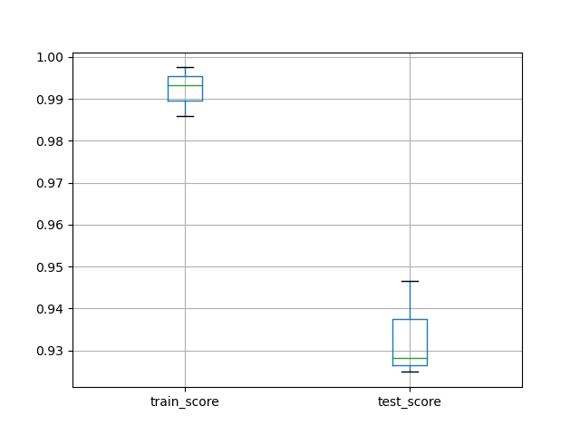
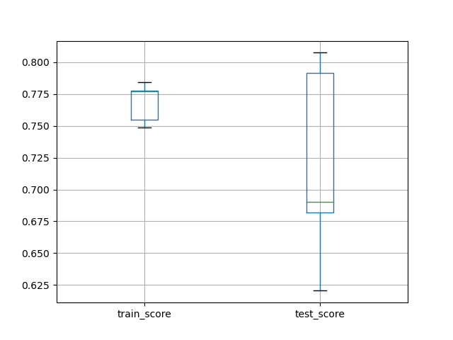

## Optimization

> 微调管道内部，超参数优化
>
> Hyper-parameters optimization

### 构建管道和准备数据

构建管道

~~~python
from sklearn.pipeline import make_pipeline
from sklearn.linear_model import SGDClassifier
from sklearn.preprocessing import MinMaxScaler

pipe = make_pipeline(MinMaxScaler(), SGDClassifier(max_iter=1000))
~~~

查看管道参数

~~~python
print(pipe.get_params())
~~~

准备数据

~~~python
from sklearn.datasets import load_digits
from sklearn.model_selection import train_test_split

X, y = load_digits(return_X_y=True)
X_train, X_test, y_train, y_test = train_test_split(X, y, stratify=y, random_state=12)
~~~

### GridSearchCV 调优

使用`GridSearchCV`搜索当前训练集下的最优参数

~~~python
# 使用网格搜索找到当前训练集下最优参数
from sklearn.model_selection import GridSearchCV
import pandas as pd

param = {'logisticregression__C': [0.1, 1.0, 10],
         'logisticregression__penalty': ['l2', 'l1']}
grid = GridSearchCV(pipe, param_grid=param, cv=3, n_jobs=1, return_train_score=True)
grid.fit(X_train, y_train)
print(grid.get_params())
~~~

- 这里要调优的参数为`C`和`penalty`，需要在`param`手动中写明
- 注意这里的`grid`就是一个机器学习模型，和管道`pipe`，分类器`clf`相同
- 只有当`grid`已经经过训练，并且调用了`score`函数后，其最优函数才会确定下来，否则不认为当前训练集已经结束

查看各参数对训练的影响以及结果

~~~python
df_grid = pd.DataFrame(grid.cv_results_)
print(df_grid)
~~~

~~~bash
   mean_fit_time  std_fit_time  mean_score_time  std_score_time param_logisticregression__C  ... split0_train_score split1_train_score  split2_train_score  mean_train_score  std_train_score
0       0.126961      0.001999         0.006072        0.007825                         0.1  ...           0.949889           0.953229            0.949889          0.951002         0.001575
1       0.247481      0.017783         0.000620        0.000040                         0.1  ...           0.891982           0.909800            0.904232          0.902004         0.007442
2       0.425019      0.011945         0.000617        0.000032                         1.0  ...           0.989978           0.988864            0.984410          0.987751         0.002406
3       1.135990      0.046367         0.000678        0.000057                         1.0  ...           0.982183           0.982183            0.979955          0.981440         0.001050
4       1.080702      0.094789         0.000640        0.000035                          10  ...           0.998886           0.998886            0.998886          0.998886         0.000000
5       5.193207      0.190867         0.000609        0.000019                          10  ...           1.000000           1.000000            1.000000          1.000000         0.000000

[6 rows x 18 columns]
~~~

查看当前训练集下最优的`C/penalty`

~~~python
print(grid.best_params_)
~~~

~~~bash
{'logisticregression__C': 1.0, 'logisticregression__penalty': 'l2'}
~~~

对模型`grid`进行精准度测试

~~~python
accuracy = grid.score(X_test, y_test)
print('Accuracy score of the {} is {:.2f}'.format(grid.__class__.__name__, accuracy))
~~~

~~~bash
Accuracy score of the GridSearchCV is 0.97
~~~

### 交叉验证调优后管道

前面已经提到，这里的`grid`是同`clf/pipe`一样的机器学习模型，自然可以对原数据进行交叉验证

~~~python
from sklearn.model_selection import cross_validate
import matplotlib.pyplot as plt

scores = cross_validate(grid, X, y, cv=3, n_jobs=1, return_train_score=True)
df_scores = pd.DataFrame(scores)
print(df_scores)
df_scores[['train_score', 'test_score']].boxplot()
plt.show()
~~~

~~~bash
    fit_time  score_time  test_score  train_score
0  23.017125    0.000651    0.928214     0.985810
1  25.200372    0.000676    0.946578     0.997496
2  23.103306    0.000675    0.924875     0.993322
~~~

### 调优训练 `breast_cancer`

在乳腺癌数据集上对管道进行调优并训练测试

1. 导入数据，分割数据
2. 构建管道，调优参数
3. 训练测试，交叉验证

~~~python
from sklearn.datasets import load_breast_cancer
from sklearn.metrics import balanced_accuracy_score

X, y = load_breast_cancer(return_X_y=True)

from sklearn.model_selection import train_test_split

X_train, X_test, y_train, y_test = train_test_split(X, y, random_state=12, stratify=y)

from sklearn.pipeline import make_pipeline
from sklearn.linear_model import SGDClassifier
from sklearn.preprocessing import StandardScaler

pipe = make_pipeline(StandardScaler(), SGDClassifier(max_iter=1000))

from sklearn.model_selection import GridSearchCV

param = {'sgdclassifier__loss': ['hinge', 'log'],
         'sgdclassifier__penalty': ['l2','l1']}
grid = GridSearchCV(pipe, cv=3, n_jobs=1, param_grid=param, return_train_score=True)
grid.fit(X_train, y_train)

accuracy = grid.score(X_test, y_test)

from sklearn.model_selection import cross_validate
import pandas as pd
import matplotlib.pyplot as plt

scores = cross_validate(grid, X, y, scoring='balanced_accuracy',
                        cv=3, return_train_score=True)
df_scores = pd.DataFrame(scores)
df_scores[['train_score', 'test_score']].boxplot()
plt.show()

print(grid.best_params_)
print(df_scores)
print("the accuracy is ", accuracy)
~~~

~~~bash
{'sgdclassifier__loss': 'hinge', 'sgdclassifier__penalty': 'l1'}

   fit_time  score_time  test_score  train_score
0  0.031983    0.000585    0.962067     0.980303
1  0.034171    0.000492    0.949343     0.987261
2  0.032296    0.000593    0.963445     0.988076

the accuracy is 0.9440559440559441
~~~

## Summary

使用`scikit-learn`十行以内训练并测试一个管道

~~~python
import pandas as pd
from sklearn.preprocessing import MinMaxScaler
from sklearn.linear_model import LogisticRegression
from sklearn.pipeline import make_pipeline
from sklearn.model_selection import GridSearchCV
from sklearn.model_selection import cross_validate
from sklearn.datasets import load_digits
import matplotlib.pyplot as plt

X, y = load_digits(return_X_y = True)

pipe = make_pipeline(MinMaxScaler(),
                     LogisticRegression(solver='saga', multi_class='auto', random_state=42, max_iter=5000))
param = {'logisticregression__C': [0.1, 1.0, 10],
        'logisticregression__penalty': ['l2', 'l1']}
grid = GridSearchCV(pipe, param_grid=param, cv=3, n_jobs=-1)
scores = pd.DataFrame(cross_validate(grid, X, y, cv=3, n_jobs=-1, return_train_score=True))
scores[['train_score', 'test_score']].boxplot()

plt.show()
~~~

## Heterogeneous Data

> Heterogeneous data
>
> 处理除数字以外的数据

导入外部数据集

注意`shell`的位置，这里找的是当前`shell`路径的相对路径

- 通过`os.getcwd()`获取当前路径（pwd）

~~~python
import pandas as pd
import os

print(os.getcwd())

data = pd.read_csv(os.path.join('data','titanic_openml.csv'), na_values='?')
print(data.head(7))
print(data.tail(4))
~~~

### 先拟合再学习

从原始数据中提取出数据集

- 在该泰坦尼克模型中，自变量为年龄、性别、是否上船、恐惧等因素，因变量为是否存活

分割数据集为训练集和测试集，采用线性回归模型进行学习

~~~python
y = data['survived']
X = data.drop(columns='survived')

print(y)

from sklearn.model_selection import train_test_split

X_train, X_test, y_train, y_test = train_test_split(X, y, random_state=12)

from sklearn.linear_model import LogisticRegression

clf = LogisticRegression()
clf.fit(X_train, y_train)
~~~

- 必然报错，因为`fit`方法接收的数据集要求数据为数字型，而这里的很多数据如性别、是否上船并不是数字数据

使用管道处理非数字数据，同时使用管道标准化数字数据，这里实际上都是预处理数据的过程

- 处理非数字数据，即转化为数字数据同时处理缺失数据
  - `SimpleImputer(strategy='constant')`
  - `OneHotEncoder()`
- 标准化数字数据同时处理缺失数据
  - `SimpleImputer(strategy='mean')`
  - `StandardScaler()`

`OneHotEncoder`示例

~~~python
from sklearn.impute import SimpleImputer
from sklearn.preprocessing import OneHotEncoder
ohe = make_pipeline(SimpleImputer(strategy='constant'), OneHotEncoder())
X_encoded = ohe.fit_transform(X_train[['sex', 'embarked']])
X_encoded.toarray()
~~~

~~~bash
[[0. 1. 1. 0. 0. 0.]
 [0. 1. 0. 0. 1. 0.]
 [0. 1. 1. 0. 0. 0.]
 ...
 [0. 1. 0. 0. 1. 0.]
 [1. 0. 0. 0. 1. 0.]
 [0. 1. 1. 0. 0. 0.]]
~~~

处理`titanic`数据

1、提取非数字列和数字列

~~~python
col_cat = ['sex', 'embarked']
col_num = ['age', 'sibsp', 'parch', 'fare']

X_train_cat = X_train[col_cat]
X_test_cat = X_test[col_cat]
X_train_num = X_train[col_num]
X_test_num = X.test[col_num]
~~~

2、构建管道预处理数据

为什么要用管道而不是单独预处理，因为需要同时处理缺失数据

- 数字化非数字数据
- 标准化数字数据
- 处理缺失数据

~~~python
from sklearn.pipeline import make_pipeline
from sklearn.impute import SimpleImputer
from sklearn.preprocessing import OneHotEncoder
from sklearn.preprocessing import StandardScaler

scaler_cat = make_pipeline(SimpleImputer(strategy='constant'), OneHotEncoder())
scaler_num = make_pipeline(SimpleImputer(strategy='mean'), StandardScaler())

X_train_cat_scaled = scaler_cat.fit_transform(X_train_cat)
X_test_cat_scaled = scaler_cat.transform(X_test_cat)
X_train_num_scaled = scaler_num.fit_transform(X_train_num)
X_tes
~~~

3、合并预处理后的数字数据和非数字数据，采用矩阵横向合并的方法（即合并列为一张大表）

~~~python
import numpy as np
from scipy import sparse
X_train_scaled = sparse.hstack((X_train_cat_scaled, 
                sparse.csr_matrix(X_train_num_scaled)))
X_test_scaled = sparse.hstack((X_test_cat_scaled, 
                sparse.csr_matrix(X_test_num_scaled)))
~~~

4、现在已经有完整的数字标准化后的训练、测试数据，直接构建模型开始学习`(fit)`即可

~~~python
from sklearn.linear_model import LogisticRegression

clf = LogisticRegression()
clf.fit(X_train_scaled, y_train)
accuracy = clf.score(X_test_scaled, y_test)
print("Accuracy score of the {} is {:.2f}".format(clf.__class__.__name__, accuracy))
~~~

### 通过管道学习

上述过程可以概括为：

1. 预处理数据
   - 提取数据的非数字列和数字列
   - 通过管道分别数字化、标准化处理非数字、数字数据，同时处理缺失数据
   - 合并处理后的数据
2. 建立模型学习并测试

和之前的学习一样，上述过程可以揉合到一个管道中进行，即构建一个含有预处理功能和学习功能的管道

这里有一个问题，就是对于数字数据和非数字数据，其预处理的方式并不同，所以管道的预处理功能应该针对特定列有不同的处理方法

这里用到`sklearn.compose.make_column_transformer(transformer, col_name)`合并多个管道并使之作用于不同列

1. 导入数据，独立分割
   - `data = pd.read_csv(os.path.join(), na_values='?')`
   - `train_test_split`
2. 构建预处理管道
   - `make_pipeline(空值处理器, 预处理器)`
3. 合并预处理管道
   - `make_column_transformer((预处理管道, 列名)...)`
4. 构建总管道
   - `make_pipeline(预处理器, 分类器)`
5. 学习并测试
   - `fit()/score()`

~~~python
from sklearn import preprocessing
from sklearn.linear_model import LogisticRegression
from sklearn.model_selection import train_test_split
import os
from sklearn.preprocessing import StandardScaler
from sklearn.preprocessing import OneHotEncoder
from sklearn.impute import SimpleImputer
from sklearn.pipeline import make_pipeline
import pandas as pd
import numpy as np

data = pd.read_csv(os.path.join('data','titanic_openml.csv'), na_values='?')
y = data['survived']
X = data.drop(columns='survived')

# print(X)

X_train, X_test, y_train, y_test = train_test_split(X, y, random_state=12)

# print(y_train)

col_cat = ['sex', 'embarked']
col_num = ['age', 'sibsp', 'parch', 'fare']

pre_cat = make_pipeline(SimpleImputer(strategy='constant'), OneHotEncoder(handle_unknown='ignore'))
pre_num = make_pipeline(SimpleImputer(strategy='mean'), StandardScaler())

from sklearn.compose import make_column_transformer

preprocessor = make_column_transformer((pre_cat, col_cat), (pre_num, col_num))
pipe = make_pipeline(preprocessor, LogisticRegression(solver='lbfgs'))
pipe.fit(X_train, y_train)
accuracy = pipe.score(X_test, y_test)
print('Accuracy score of the {} is {:.2f}'.format(pipe.__class__.__name__, accuracy))
~~~

### 优化管道参数

在上述包含预处理功能和学习功能的管道的基础上，在正式测试之前使用网格搜索`GridSearchCV`对其参数进行调优

~~~python
from sklearn.model_selection import GridSearchCV
from sklearn.model_selection import cross_validate
import pandas as pd
import matplotlib.pyplot as plt

# 调优参数
param = {'columntransformer__pipeline-2__simpleimputer__strategy': ['mean', 'median'],
        'logisticregression__C': [0.1, 1.0, 10]}
grid = GridSearchCV(pipe, param_grid=param, cv=5, n_jobs=1)

grid.fit(X_train, y_train)
print(grid.score(X_test, y_test))
# 交叉验证得分
scores = cross_validate(grid, X, y, scoring='balanced_accuracy', cv=5, n_jobs=-1, return_train_score=True)
# 绘制箱型图
df_scores = pd.DataFrame(scores)
df_scores[['train_score', 'test_score']].boxplot()
plt.show()
~~~

### `adult_openml.csv`

使用同样的方法处理`adult_openml`数据集

#### 预处理再拟合

~~~python
import os
import pandas as pd

data = pd.read_csv(os.path.join('data', 'adult_openml.csv'), na_values='?')
# print(data.head(7))

y = data['class']
X = data.drop(columns=['class', 'fnlwgt', 'capitalgain', 'capitalloss'])

from sklearn.model_selection import train_test_split

X_train, X_test, y_train, y_test = train_test_split(X, y, random_state=12)
# print(y_train)

col_cat = ['workclass', 'education', 'marital-status', 'relationship', 'race', 'sex', 'native-country']
col_num = ['age', 'education-num', 'hoursperweek']

X_train_cat = X_train[col_cat]
X_test_cat = X_test[col_cat]
X_train_num = X_train[col_num]
X_test_num = X_test[col_num]

from sklearn.preprocessing import KBinsDiscretizer
from sklearn.preprocessing import StandardScaler
from sklearn.preprocessing import OneHotEncoder
from sklearn.impute import SimpleImputer
from sklearn.pipeline import make_pipeline

cat_pipe = make_pipeline(SimpleImputer(strategy='constant'), OneHotEncoder())
num_pipe = make_pipeline(SimpleImputer(strategy='mean'), StandardScaler())

X_train_cat_scaled = cat_pipe.fit_transform(X_train_cat)
X_test_cat_scaled = cat_pipe.transform(X_test_cat)
X_train_num_scaled = num_pipe.fit_transform(X_train_num)
X_test_num_scaled = num_pipe.transform(X_test_num)

import numpy as np
from scipy import sparse

X_train_scaled = sparse.hstack((X_train_cat_scaled, 
                sparse.csr_matrix(X_train_num_scaled)))
X_test_scaled = sparse.hstack((X_test_cat_scaled, 
                sparse.csr_matrix(X_test_num_scaled)))

from sklearn.linear_model import LogisticRegression

clf = LogisticRegression(max_iter=1000)
clf.fit(X_train_scaled, y_train)
accuracy = clf.score(X_test_scaled, y_test)
print('accuracy of the {} is {:.2f}'.format(clf.__class__.__name__, accuracy))
~~~

~~~bash
accuracy of the LogisticRegression is 0.83
~~~

#### 优化管道处理

~~~python
import os
import pandas as pd

data = pd.read_csv(os.path.join('data', 'adult_openml.csv'), na_values='?')
# print(data.head(3))
y = data['class']
X = data.drop(columns=['class', 'fnlwgt', 'capitalgain', 'capitalloss'])
# print(X)

from sklearn.preprocessing import LabelEncoder
from sklearn.model_selection import train_test_split

X_train, X_test, y_train, y_test = train_test_split(X, y, random_state=12)
# print(y_train)
encoder = LabelEncoder()
y_train = encoder.fit_transform(y_train)
y_test = encoder.transform(y_test)

from sklearn.pipeline import make_pipeline
from sklearn.impute import SimpleImputer
from sklearn.preprocessing import StandardScaler
from sklearn.preprocessing import OneHotEncoder
from sklearn.compose import make_column_transformer
from sklearn.linear_model import LogisticRegression
from sklearn.model_selection import GridSearchCV

pre_cat = make_pipeline(SimpleImputer(strategy='constant'), OneHotEncoder(handle_unknown='ignore'))
pre_num = make_pipeline(SimpleImputer(strategy='mean'), StandardScaler())

col_cat = ['workclass', 'education', 'marital-status', 'relationship', 'race', 'sex', 'native-country']
col_num = ['age', 'education-num', 'hoursperweek']

preprocessor = make_column_transformer((pre_cat, col_cat), (pre_num, col_num))
# preprocessor.fit(X_train, y_train)

pipe = make_pipeline(preprocessor, LogisticRegression(solver='lbfgs', max_iter=5000))
# pipe.fit(X_train, y_train)

param = {'logisticregression__C': [0.1, 1.0, 10]}
grid = GridSearchCV(pipe, param_grid=param, cv=5, n_jobs=1)
grid.fit(X_train, y_train)
accuracy = grid.score(X_test, y_test)
print('accuracy of the {} is {:.2f}'.format(grid.__class__.__name__, accuracy))

from sklearn.model_selection import cross_validate
import matplotlib.pyplot as plt
scores = pd.DataFrame(cross_validate(grid, X, y, scoring='balanced_accuracy', cv=3, n_jobs=-1, return_train_score=True))
print(scores)
scores[['train_score', 'test_score']].boxplot(whis=10)
plt.show()
~~~

~~~bash
accuracy of the GridSearchCV is 0.83

    fit_time  score_time  test_score  train_score
0  11.303147    0.064652    0.719383     0.729532
1  12.427096    0.067366    0.730889     0.723769
2  12.042301    0.078128    0.723290     0.725647
~~~

