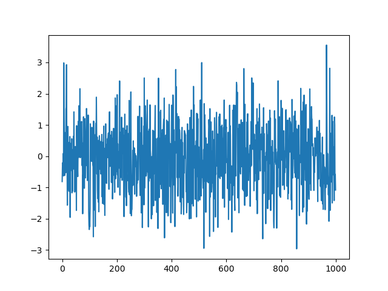
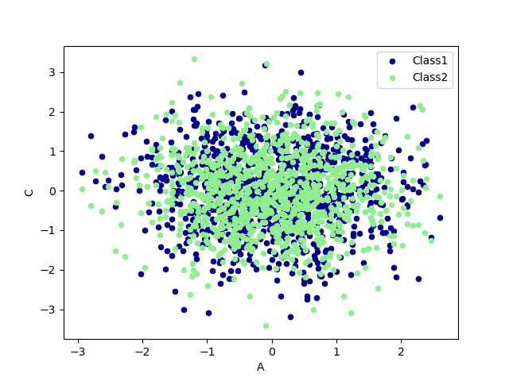

> Pandas是基于Numpy构建的库，目的是让Numpy为中心的应用变得更加简单

## Pandas For Beginner

### Series

创建一个系列

~~~python
# Series
s = pd.Series([1,3,6,np.nan,44,1], index=[6,5,4,3,2,1])
print(s)
s.index = [1,2,3,4,5,6]
print(s)
~~~

- 系列即一串带有索引的数据

其输出结果为

~~~python
6     1.0
5     3.0
4     6.0
3     NaN
2    44.0
1     1.0
dtype: float64
1     1.0
2     3.0
3     6.0
4     NaN
5    44.0
6     1.0
dtype: float64
~~~

- 默认的索引从`0`开始，步长为`1`

### DataFrame

创建一个数据框架

- 创建连续日期数组`pd.date_range('2018-08-19',periods=6)`，意为从8.19日起往后数6天构成的日期数组
- 返回标准正态分布样本`np.random.randn(6,4)`意为返回`6x4`个样本，于`numpy.random.rand(d0, d1, …, dn)`不同，其返回的随机样本位于`[0, 1)`中

~~~python
import pandas as pd
import numpy as np

# DataFrame
dates = pd.date_range('2018-08-19',periods=6)
# dates = pd.date_range('2018-08-19','2018-08-24') # 起始、结束  与上述等价

df = pd.DataFrame(np.random.randn(6,4),index=dates,columns=['a','b','c','d'])
print(df)
~~~

~~~bash
                   a         b         c         d
2018-08-19 -0.147933  0.726108  2.725752  1.373449
2018-08-20 -0.512244  0.218556  0.820553  0.582996
2018-08-21 -0.455171  0.361705  1.196131 -0.577475
2018-08-22 -1.600681 -0.987295  1.361328  0.427573
2018-08-23 -1.683981 -1.075722 -0.360446  0.651535
2018-08-24 -0.652182 -0.516795 -1.100374  1.577188
~~~

数据框架的转置

~~~python
print(df.T)
~~~

~~~bash
   2018-08-19  2018-08-20  ...  2018-08-23  2018-08-24
a   -0.147933   -0.512244  ...   -1.683981   -0.652182
b    0.726108    0.218556  ...   -1.075722   -0.516795
c    2.725752    0.820553  ...   -0.360446   -1.100374
d    1.373449    0.582996  ...    0.651535    1.577188
~~~

- 实际上这里的`DataFrame`就是一个`a[0][0]`为空，第一列、第一行为属性的矩阵

打印某一个属性值

~~~python
print(df['d'])
~~~

~~~bash
[4 rows x 6 columns]
2018-08-19    1.373449
2018-08-20    0.582996
2018-08-21   -0.577475
2018-08-22    0.427573
2018-08-23    0.651535
2018-08-24    1.577188
Freq: D, Name: d, dtype: float64
~~~

- 第一列为索引，第二列为属性`d`的值

打印索引

~~~python
print(df.index)
~~~

~~~bash
DatetimeIndex(['2018-08-19', '2018-08-20', '2018-08-21', '2018-08-22',
               '2018-08-23', '2018-08-24'],
              dtype='datetime64[ns]', freq='D')
~~~

打印行属性

~~~python
print(df.columns)
~~~

~~~bash
Index(['a', 'b', 'c', 'd'], dtype='object')
~~~

打印所有数据

~~~python
print(df.values)
~~~

~~~bash
[[-0.14793322  0.72610839  2.72575215  1.3734486 ]
 [-0.5122437   0.21855648  0.82055337  0.58299647]
 [-0.45517147  0.3617052   1.19613096 -0.57747469]
 [-1.6006812  -0.98729492  1.36132808  0.42757327]
 [-1.68398091 -1.07572233 -0.36044647  0.65153468]
 [-0.65218188 -0.51679505 -1.10037376  1.57718844]]
~~~

打印数据统计总结

~~~python
print(df.describe())
~~~

~~~bash
              a         b         c         d
count  6.000000  6.000000  6.000000  6.000000
mean  -0.842032 -0.212240  0.773824  0.672544
std    0.641976  0.752936  1.351658  0.766898
min   -1.683981 -1.075722 -1.100374 -0.577475
25%   -1.363556 -0.869670 -0.065197  0.466429
50%   -0.582213 -0.149119  1.008342  0.617266
75%   -0.469440  0.325918  1.320029  1.192970
max   -0.147933  0.726108  2.725752  1.577188
~~~

在创建`DataFrame`时不规定行列属性，索引将默认从`0`开始

~~~python
df1 = pd.DataFrame(np.arange(12).reshape((3,4)))
print(df1)
print(df1[1])
print(df1.index)
print(df1.columns)
~~~

~~~bash
   0  1   2   3
0  0  1   2   3
1  4  5   6   7
2  8  9  10  11
0    1
1    5
2    9
Name: 1, dtype: int64
RangeIndex(start=0, stop=3, step=1)
RangeIndex(start=0, stop=4, step=1)
~~~

另一种以对象的形式构建`DataFrame`

~~~python
df2 = pd.DataFrame({ 'A' : 1.,
                     'B' : pd.Timestamp('20130102'),
                     'C' : pd.Series(1,index=list(range(4)),dtype='float32'),
                     'D' : np.array([3]*4,dtype='int32'),
                     'E' : pd.Categorical(["test","train","test","train"]),
                     'F' : 'foo' })
print(df2)
~~~

~~~bash
     A          B    C  D      E    F
0  1.0 2013-01-02  1.0  3   test  foo
1  1.0 2013-01-02  3.0  3  train  foo
2  1.0 2013-01-02  6.0  3   test  foo
3  1.0 2013-01-02  9.0  3  train  foo
~~~

排序：使用函数`df.sort_index(axis, ascending)`

- `axis=1`表示排序列属性，`axis=0`表示排序行属性，这里的排序的对象其实是索引，通过排序索引更改数据的位置
- `ascending=True`表示升序，`ascending=False`表示降序

对列进行降序排列

~~~python
df21 = df2.sort_index(axis=1, ascending=False) # 降序排列列属性
print(df21)
~~~

~~~bash
     F      E  D    C          B    A
0  foo   test  3  1.0 2013-01-02  1.0
1  foo  train  3  3.0 2013-01-02  1.0
2  foo   test  3  6.0 2013-01-02  1.0
3  foo  train  3  9.0 2013-01-02  1.0
~~~

降序排列行属性

~~~python
df22 = df2.sort_index(axis=0, ascending=False)
print(df22)
~~~

~~~bash
     A          B    C  D      E    F
3  1.0 2013-01-02  9.0  3  train  foo
2  1.0 2013-01-02  6.0  3   test  foo
1  1.0 2013-01-02  3.0  3  train  foo
0  1.0 2013-01-02  1.0  3   test  foo
~~~

- 这里的排序都是不改变原数据矩阵的

根据特定属性进行排列：使用函数`df.sort_values(by, ascending)`

- `by=某一属性`，将按照这一属性的具体值进行排列
- `ascengding=True`表示升序排列

~~~python
df23 = df2.sort_values(by='C', ascending=False)
print(df23)
~~~

~~~bash
     A          B    C  D      E    F
3  1.0 2013-01-02  9.0  3  train  foo
2  1.0 2013-01-02  6.0  3   test  foo
1  1.0 2013-01-02  3.0  3  train  foo
0  1.0 2013-01-02  1.0  3   test  foo
~~~

### 选择数据

> 基于`DataFrame`对其中数据进行筛选排除

~~~python
import pandas as pd
import numpy as np

dates = pd.date_range('20220706', periods=6)
df = pd.DataFrame(np.arange(24).reshape((6,4)), index=dates, columns=['A','B','C','D'])
print(df)
~~~

检索某一列

~~~python
print(df['A'])
print(df.A)
~~~

检索多行，含头不含尾，即`0,1,2`行

~~~python
print(df[0:3])
~~~

也可以用行属性名来检索，此时含头含尾，即表示检索从`2022-07-06`到`2022-07-11`的数据

~~~python
print(df['2022-07-06':'2022-07-11'])
~~~

- 这里的日期也可以用`20220706`的形式，即省略`-`

检索特定行：使用`dataframe`的`loc`数组

~~~python
print(df.loc['2022-07-09'])
print(df.loc['2022-07-09':'2022-07-11'])
~~~

检索特定列，同样使用`loc`数组，第一个入参为行，第二个入参为列，当单独搜索多列时，令第一个入参为`:`即可

~~~python
print(df.loc[:, 'A':'C'])
~~~

当然也可以限定列

~~~python
print(df.loc['20220707', 'A':'C'])
print(df.loc['20220707':'20220709', 'A':'C'])
~~~

使用`iloc`列表进行筛选

~~~python
# 第三行第一列元素
print(df.iloc[3,1])

# 第3,4行，第1,2列元素
print(df.iloc[3:5, 1:3])

# 第1,3,5行，第1,2列元素
print(df.iloc[[1,3,5], 1:3])

# 第0,1,2行，第0,2列元素
print(df.iloc[:3,[0,2]])
~~~

通过值进行筛选，选出`A`属性大于`8`的行

~~~python
print(df[df.A>8])
print(df.loc[df.A>8])
~~~

- 这两种写法等价

总结一波

| 单列             | 单行                 | 多列                 | 多行                                    |
| ---------------- | -------------------- | -------------------- | --------------------------------------- |
| `df['A']`        | `df.loc['20220707']` | `df.loc[:, 'A':'C']` | `df[0,3]`                               |
| `df.A`           |                      |                      | `df['20220707','20220711']`（含头含尾） |
| `df.loc[:, 'A']` |                      |                      | `df.loc['20220707','20220711']`         |

- `loc/iloc`是最全能的，可以搜任意行/列
- `iloc`只能接收整型参数，即严格依靠坐标取值
- `loc`只能接收字符串参数，依靠行、列属性值进行取值
- 均用`:`代表全体
- `ix`似乎被废弃了

### 设置值

基本设置，就是通过`loc/iloc`确定范围，然后直接赋值

~~~python
import pandas as pd
import numpy as np

dates = pd.date_range('20220706',periods=6)
df = pd.DataFrame(np.arange(24).reshape((6,4)), index=dates, columns=['A','B','C','D'])
print(df)

df.iloc[0,0] = 23
print(df)
df.loc['20220711','D'] = 0
print(df)
~~~

设置整行/列数据

~~~python
df.iloc[0] = 'nmsl'
print(df)
df.iloc[:,1] = 'hahaha'
print(df)
df.loc['20220706'] = 'sad'
df.loc[:, 'A'] = 'hehe'
print(df)
~~~

设置多行/多列

~~~python
df.iloc[[1,2]] = 1
print(df)
df.loc[:, ['B','C']] = 2
print(df)
~~~

根据条件设置

~~~python
df.B[df.A>4] = np.nan
df.B.loc[df.A>4] = np.nan
df['B'][df.A>4] = np.nan
df['B'].loc[df.A>4] = np.nan
~~~

- 将`A`属性大于`4`的行的`B`属性设置为`np.nan`
- 四种写法均可

添加行

~~~python
date = pd.to_datetime('20220712')
df.loc[date] = [24,25,26,27]
print(df)
~~~

添加列

~~~python
df['E'] = pd.Series([1,2,3,4,5,6], index=pd.date_range('20220706',periods=6))
print(df)
~~~

- 这里的数据个数必须和已有索引保持一致，不然会报错
- 这里的索引最好和已有的数据对齐，没有对齐的索引所对应的数据将变为`NaN`

### 处理丢失数据

> 丢失数据即指`NaN`

~~~python
import pandas as pd
import numpy as np

dates = pd.date_range('20220706', periods=6)
df = pd.DataFrame(np.arange(24).reshape((6,4)), index=dates, columns=['A','B','C','D'])
df.iloc[2,2] = np.nan
df.iloc[5,3] = np.nan
print(df)
~~~

上述数据中有两个丢失数据`NaN`

删除有丢失数据的行/列

~~~python
df1 = df.dropna()
print(df1)
~~~

- 无参的`dropna()`默认删除所有含有`NaN`的行，并返回没有`NaN`的矩阵，不改变原矩阵

其实有两个参数：`axis`和`how`

~~~python
df2 = df.dropna(axis=1, how='any')
print(df2)
~~~

- `axis=1`时表示删除`Nan`所在列，默认`axis=0`
- `how='any'`表示只要存在`Nan`即删除，`how='all'`表示要这一行/列全为`Nan`时才删除，默认为`any`

将`Nan`替换为`0`或其他

~~~python
df3 = df.fillna(value='nmsl')
print(df3)
~~~

在各元素上判断是否有`Nan`或`NULL`，输出一个布尔矩阵

~~~python
df4 = df3.isnull()
df5 = df.isnull()
print(df4)
print(df5)
~~~

在各元素上判断是否有`Nan`，输出一个布尔矩阵

~~~python
df6 = df.isna()
print(df6)
~~~

判断各列是否有缺失数据

~~~python
df7 = df.isna().any()
print(df7)
~~~

~~~bash
A    False
B    False
C     True
D     True
dtype: bool
~~~

判断整张表中是否有缺失数据

~~~python
flag = np.any(df.isnull())
print(flag)
~~~

### 导入导出

导入现成数据

~~~python
import pandas as pd

data = pd.read_csv('student.csv')
print(data)
~~~

- 注意这里要把`student.csv`放在`.py`的同一目录下，或者用相对、绝对路径去找

前三行和后四行（就像`linux`的命令）

~~~python
print(data.head(3))
print(data.tail(4))
~~~

导出数据

~~~python
data.to_pickle('student.pickle')
print(pd.read_pickle('student.pickle'))
~~~

- 均在当前目录下完成

### 合并操作

> 很像数据库表的合并

#### Concat

~~~python
import pandas as pd
import numpy as np

df1 = pd.DataFrame(np.zeros((3,4)), columns=['A','B','C','D'])
df2 = pd.DataFrame(np.ones((3,4)), columns=['A','B','C','D'])
df3 = pd.DataFrame(np.ones((3,4))*2, columns=['A','B','C','D'])

print(df1)
print(df2)
print(df3)
~~~

- 列索引均为`A,B,C,D`
- 行索引均为`0,1,2,3`

上下合并

~~~python
res1 = pd.concat([df1,df2,df3], axis=0)
print(res1)
~~~

这种合并方式，其行索引会重复，即为`0,1,2,3,0,1,2,3,0,1,2,3`

在合并时可以手动忽略索引，重新从`0`开始建立行索引

~~~python
res2 = pd.concat([df1,df2,df3], axis=0, ignore_index=True)
print(res2)
~~~

使用`append`函数进行合并

~~~python
df7 = pd.DataFrame(np.ones((3,4))*0, columns=['a','b','c','d'])
df8 = pd.DataFrame(np.ones((3,4))*1, columns=['a','b','c','d'])
df9 = pd.DataFrame(np.ones((3,4))*2, columns=['a','b','c','d'])
s = pd.Series([1,2,3,4], index=['a','b','c','d'])
# 将df2合并到df1下面,以及重置index,并打印出结果
res7 = df7.append(df8,ignore_index=True)
print(res7)
res8 = df7.append([df8,df9], ignore_index=True)
print(res8)
res9 = df7.append(s, ignore_index=True)
print(res9)
~~~

- 这里的`append`均为上下合并，要求列数相同，不然报错

内外连接

外连接

~~~python
df3 = pd.DataFrame(np.ones((3,4))*0, columns=['a','b','c','d'], index=[1,2,3])
df4 = pd.DataFrame(np.ones((3,4))*1, columns=['b','c','d','e'], index=[2,3,4])
print(df3)
print(df4)

res3 = pd.concat([df3,df4], ignore_index=True, join='outer')
print(res3)
~~~

- 和数据库表的外连接一样（左右外连接）
- 首先是上下连接
- 由于`df1`和`df2`的列属性不尽相同，列属性相同的列直接合并，对于不同的列属性，各自不存在的数据均用`NaN`填充

内连接

~~~python
res4 = pd.concat([df3,df4], ignore_index=True, join='inner')
print(res4)
~~~

- 只保留相同的列，舍弃掉不同的列属性

左右合并

~~~python
df5 = pd.DataFrame(np.ones((3,4))*0, columns=['a','b','c','d'], index=[1,2,3])
df6 = pd.DataFrame(np.ones((3,4))*1, columns=['b','c','d','e'], index=[2,3,4])
print(df5)
print(df6)

res5 = pd.concat([df5,df6], axis=1)
print(res5)
~~~

不同的行、列元素用`NaN`填充，注意这里的横向连接即使列属性名字一样，也视作不同的列

#### Merge

`pandas.merge(df1, df2, on='', how='', indicator='', left_index=True/False, right_index=True/False, suffixes=[])`

- `df1,df2`是要合并的两个数据集
- `how=inner/outer`表示合并方式，内连接或外连接
- `left_index/right_index`表示是否用索引进行连接
- `suffixes`用于分开相同的列，如`df1,df2`中均有列属性`age`，加入参数`suffixes['_boy', '_girl']`，其合并的数据集中将出现两个`age`属性，即`age_boy, age_girl`
- `indicator`会在合并的数据集中新建一列，表明每行的连接方式，有`left_only, right_only, both`，分别代表左外连接，右外连接，全连接

~~~python
import pandas as pd
import numpy as np

import pandas as pd
# 依据一组key合并
# 定义资料集并打印出
left = pd.DataFrame({'key' : ['K0','K1','K2','K3'],
                     'A' : ['A0','A1','A2','A3'],
                     'B' : ['B0','B1','B2','B3']})

right = pd.DataFrame({'key': ['K0', 'K1', 'K2', 'K3'],
                      'C' : ['C0', 'C1', 'C2', 'C3'],
                      'D' : ['D0', 'D1', 'D2', 'D3']})
print(left)
print(right)
~~~

通过列属性`key`进行合并

~~~python
res = pd.merge(left, right, on='key')
print(res)
~~~

得到数据集
$$
merge(
\begin{bmatrix}
  & key & A  &  B\\
0 & K0  & A0 & B0\\
1 & K1  & A1 & B1\\
2 & K2  & A2 & B2\\
3 & K3  & A3 & B3\\
\end{bmatrix}
,
\begin{bmatrix}
  & key & C  &  D\\
0 & K0  & C0 & D0\\
1 & K1  & C1 & D1\\
2 & K2  & C2 & D2\\
3 & K3  & C3 & D3\\
\end{bmatrix}
,on='key')=
\begin{bmatrix}
  & key & A  & B  & C  & D\\
0 & K0  & A0 & B0 & C1 & D1\\
1 & K1  & A1 & B1 & C2 & D2\\
2 & K2  & A2 & B2 & C3 & D3\\
3 & K3  & A3 & B3 & C4 & D4
\end{bmatrix}
$$
两列合并

~~~python
left = pd.DataFrame({'key1': ['K0', 'K0', 'K1', 'K2'],
                      'key2': ['K0', 'K1', 'K0', 'K1'],
                      'A': ['A0', 'A1', 'A2', 'A3'],
                      'B': ['B0', 'B1', 'B2', 'B3']})
right = pd.DataFrame({'key1': ['K0', 'K1', 'K1', 'K2'],
                       'key2': ['K0', 'K0', 'K0', 'K0'],
                       'C': ['C0', 'C1', 'C2', 'C3'],
                       'D': ['D0', 'D1', 'D2', 'D3']})
print(left)
print(right)

res = pd.merge(left, right, on=['key1','key2'])
print(res)
~~~

- 这里默认为内连接，即只保留`left`和`right`公共的`(key1,key2)`组合所在的行

当然可以设置为外连接，左外连接，右外连接

~~~python
res1 = pd.merge(left, right, on=['key1', 'key2'], how='outer')
res2 = pd.merge(left, right, on=['key1', 'key2'], how='left')
res3 = pd.merge(left, right, on=['key1', 'key2'], how='right')
~~~

根据索引连接

~~~python
left = pd.DataFrame({'A': ['A0', 'A1', 'A2'],
                     'B': ['B0', 'B1', 'B2']},
                     index=['K0', 'K1', 'K2'])
right = pd.DataFrame({'C': ['C0', 'C2', 'C3'],
                      'D': ['D0', 'D2', 'D3']},
                     index=['K0', 'K2', 'K3'])
print(left)
print(right)

res = pd.merge(left, right, left_index=True, right_index=True, how='outer')
print(res)
~~~

- 令`left_index, right_index`均为`True`表示用二者的索引连接，同样有四种连接方式`outer, inner, left, right`

解决列重叠问题

~~~python
boys = pd.DataFrame({'k': ['K0', 'K1', 'K2'], 'age': [1, 2, 3]})
girls = pd.DataFrame({'k': ['K0', 'K0', 'K3'], 'age': [4, 5, 6]})
print(boys)
print(girls)
~~~

可以注意到这里的数据集`boys, girls`均有列属性`age`，表示`ki`班级的男/女平均年龄，在合并时若想把二者分开统计，则令名字相同的列属性添加后缀`_boy, _girl`，注意这里会把每个相同的列属性均分开，同时对两个数据集按照先后顺序添加后缀

~~~python
res = pd.merge(boys,girls,on='k',suffixes=['_boy','_girl'],how='inner')
print(res)
~~~

~~~bash
    k  age_boy  age_girl
0  K0        1         4
1  K0        1         5
~~~

### plot出图

调用库`matplotlib.pyplot`对`Series`和`DataFrame`进行绘图

绘制`Series`的曲线图，横轴为索引，纵轴为值

~~~python
import pandas as pd
import numpy as np
import matplotlib.pyplot as plt

data = pd.Series(np.random.randn(1000), index=np.arange(1000))
print(data)
print(data.cumsum())

data.plot()
plt.show()
~~~

绘制`DataFrame`四个列属性的坐标图，横轴为行索引，纵轴为数据值，每个列属性代表一条曲线

~~~python
data1 = pd.DataFrame(np.random.randn(1000,4), index=np.arange(1000), columns=list("ABCD"))
data1.cumsum()
data1.plot()
plt.show()
~~~

绘制`data1`的`x-y`坐标图

~~~python
ax = data1.plot.scatter(x='A',y='B',color='DarkBlue',label='Class1')
# 将之下这个 data 画在上一个 ax 上面
data1.plot.scatter(x='A',y='C',color='LightGreen',label='Class2',ax=ax)
plt.show()
~~~

## Pandas 50

