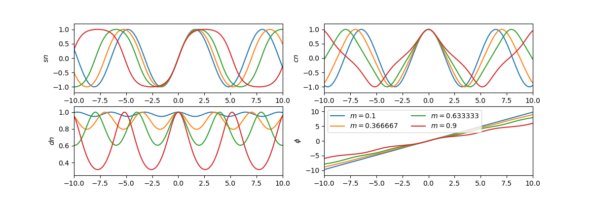

> Scipy是一个用于数学、科学、工程领域的常用软件包，是一个数值计算库，可以处理插值、积分、优化、图像处理、常微分方程数值解的求解、信号处理等问题
>
> 它能够有效计算Numpy矩阵，使Numpy和Scipy协同工作，高效处理数据

## Intro

导入

~~~python
import numpy as np
import scipy
import matplotlib.pyplot as plt

print(scipy.__version__)
~~~

`pyplot`是绘图库`matplotlib`下的一个模块

- `pyplot`和`matlab`高度相似
- 还有另一个模块叫做`pylab`，`pylab = pyplot + 部分numpy`，更加冗余
- 引入`pylab`不用加`maplotlib`，即直接`import pylab`

常数和特殊函数

~~~python
from scipy import constants as C

# 真空光速
print(C.c)
# 普朗克常数
print(C.h)
# pyysical_constants是一个常量字典，物理常量名为键，对应一个三元组，分别为常数值、单位和误差
print(C.physical_constants["electron mass"])

# 1英里等于多少米, 1英寸等于多少米, 1克等于多少千克, 1磅等于多少千克
print(C.mile)
print(C.inch)
print(C.gram)
print(C.pound)
~~~

科学计算

~~~python
import scipy.special as S

print (1 + 1e-20)
print (np.log(1+1e-20))
print (S.log1p(1e-20))
~~~

线代计算

~~~python
m = np.linspace(0.1, 0.9, 4)
u = np.linspace(-10, 10, 200)
results = S.ellipj(u[:, None], m[None, :])

print([y.shape for y in results])
~~~

绘图

~~~python
m = np.linspace(0.1, 0.9, 4)
u = np.linspace(-10, 10, 200)
results = S.ellipj(u[:, None], m[None, :])
#%figonly=使用广播计算得到的`ellipj()`返回值
fig, axes = plt.subplots(2, 2, figsize=(12, 4))
labels = ["$sn$", "$cn$", "$dn$", "$\phi$"]
for ax, y, label in zip(axes.ravel(), results, labels):
    ax.plot(u, y)
    ax.set_ylabel(label)
    ax.margins(0, 0.1)
    
axes[1, 1].legend(["$m={:g}$".format(m_) for m_ in m], loc="best", ncol=2);
plt.show()
~~~

## Optimize

> 拟合与优化

~~~python
import matplotlib.pyplot as plt
import numpy as np
~~~

### 非线性方程组求解

从`math`库中引入`sin,cos`函数，引入`scipy`的`potimize`模块

~~~python
from math import sin,cos
from scipy import optimize

def f(x):
    x0,x1,x2 = x.tolist()
    return [5*x1+3, 4*x0**2-2*sin(x1*x2), x1*x2-1.5]

result = optimize.fsolve(f, [1,1,1])
print(result)
print(f(result))
~~~

- `fsolve`的第一个参数为方程组，第二个参数为未知数初始值

- 方程组的形式由一个数组返回，`=0`省略，如上述代码表示方程组
  $$
  \begin{cases}
  5\times x_1+3=0\\
  4\times x_0^2-2\sin{(x_1\times x_2)}=0\\
  x_1\times x_2-1.5=0
  \end{cases}
  $$

- 该函数使用最速梯度下降法求解局部最优解，故要设置未知数的初始值

最速（梯度）下降法，先求原函数在原点的梯度，再设步长并求出使函数值最小的步长，原点减去步长乘以梯度得次点，令次点为原点，重复以上操作

- 梯度：偏导的集合

- 对于上述方程组，其对应函数为
  $$
  f(x_0,x_1,x_2)=4x_0^2+5x_1-2\sin{(x_1x_2)}+x_1x_2+1.5
  $$

- 其偏导即为
  $$
  f'(x)=[f_{x_0}'(x_0), f_{x_1}'(x_1), f_{x_2}'(x_2)]
  $$

- 代入`[1,1,1]`即为原点的梯度

- 令`f(1,1,1)-af'(1,1,1)`取最小值，求得步长`a`

- 次点即为`[1,1,1]-af'(1,1,1)`

~~~python
def g(x):
    return [[0, 5, 0],
           [8*x[0], -2*cos(x[1]*x[2]), -2*x[1]*cos(x[1]*x[2])],
           [0, x[2], x[1]]]
result1 = optimize.fsolve(f, [1,1,1], fprime=g)
print(result1) 
~~~

- `fprime`： 可调用 `f(x, *args)` ，可选

  用于计算 func 的雅可比行列式的函数，该函数具有跨行的导数。默认情况下，将估计雅可比行列式

### 最小二乘拟合

> 最小二乘法（又称最小平方法）是一种数学优化技术。它通过最小化误差的平方和寻找数据的最佳函数匹配。利用最小二乘法可以简便地求得未知的数据，并使得这些求得的数据与实际数据之间误差的平方和为最小
>
> 最小二乘法还可用于曲线拟合，其他一些优化问题也可通过最小化能量或最大化熵用最小二乘法来表达 

简单来说，就是通过构造函数，使计算结果和已知数据的平方差最小

使用`optimize.leastsq`拟合一次函数

~~~python
X = np.array([ 8.19,  2.72,  6.39,  8.71,  4.7 ,  2.66,  3.78])
Y = np.array([ 7.01,  2.78,  6.47,  6.71,  4.1 ,  4.23,  4.05])

def residuals(p):
    "计算以p为参数的直线和原始数据之间的误差"
    k, b = p
    return Y - (k*X + b)

# leastsq使得residuals()的输出数组的平方和最小，参数的初始值为[1,0]
r = optimize.leastsq(residuals, [1, 0])
k, b = r[0]
print ("k =",k, "b =",b)
~~~

- 拟合的结果`r[0]`为一个向量，按函数`residuals`入参`p`的顺序存放着未知参数的估计值

### 计算局域最小值

### 计算全域最小值

## Spatial

> 空间算法库

### 最近旁点

对于一维序列，寻找最近旁点

~~~python
import numpy as np
from scipy import spatial

x = np.sort(np.random.rand(100))
# print(x)

idx = np.searchsorted(x,0.5)
print(x[idx], x[idx-1])
~~~

- `np.random.rand`将随机生成`[0,1)`的浮点数，接收参数整型为生成浮点数个数
- 用`np.searchsorted(迭代器, 数)`寻找最近旁点的下标（取上限），即最近的大于该数的数组元素的下标（自然最近旁点有可能是`x[idx-1]`，即最近的小于该数的元素下标）

对于二维的点阵，寻找最近旁点：用`cKDTree`寻找

1、`query`

~~~python
np.random.seed(42)
N = 100
# 生成(-1,1)的随机数共一百行，每行两列
points = np.random.uniform(-1,1,(N,2))
kd = spatial.cKDTree(points)
# 要寻找旁点的点
targets = np.array([[0, 0], [0.5, 0.5],
                    [-0.5, 0.5], [0.5, -0.5],
                    [-0.5, -0.5]])
print(targets)
dist, idx = kd.query(targets, 3)
print(dist)
print(idx)
print(points[83])
~~~

- `np.random.seed(42)`对随机数做种，使每次生成的随机数一样，`seed()`无参实际上就是随便调了一个整型做种生成随机数
- `kd = spatial.cKDTree(points)`对已知所有点构造`cKDTree`
- 用`np.array()`构造目标点
- 用`query(targets, 3)`搜索最近旁点，`3`表示搜索最近的三个旁点，因为一共五个目标点，所以结果是一个`5x3`的矩阵，每行表示一个目标点的`3`旁点
- `query`返回的两个值分别为
  - `dist`：旁点距目标点距离
  - `idx`：旁点在`points`的下标

2、`query_ball_point`

~~~python
r = 0.2
idx2 = kd.query_ball_point(targets, r)
print(idx2)
~~~

- `targets`同上，为目标点矩阵
- `r`为旁点距目标点最大距离，意思是将返回距目标点`距离<r`的点的坐标
- 返回的是一个`list`数组，每个`list`储存一个目标点的旁点下标

3、`query_pairs`

~~~python
idx3 = kd.query_pairs(0.1)-kd.query_pairs(0.08)
print(idx3)
~~~

- `query_pairs(r)`返回的是一个`set`集合，集合中存的数据是一对对下标，如`(11,97)`，意思是`points[11]`和`points[97]`之间的距离小于`r`
- 用`set`集合减去`set`，即去掉前者中和后者共有的元素，如上述代码表示距离小于`0.1`但大于`0.08`的点对
