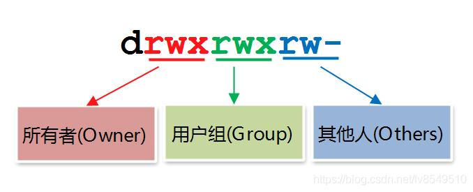

> 第一台服务器：centos7.6（Red Hat Linux），狗阿里
>

## LInux 基础

### linux 基本命令

显示当前文件路径

~~~bash
pwd
~~~

查看当前目录所有文件

~~~bash
ls
~~~

获取root权限

~~~bash
sudo su
~~~

使用vi/vim编辑器编辑文件

~~~bash
vi
vim
~~~

按`:`对vim进行功能选择

- 开始编辑：`i`
- 不保存退出：`q!`
- 保存并退出：`wq!`

创建文件夹

~~~bash
mkdir
~~~

创建文件

~~~bash
touch
~~~

查看文件

~~~bash
cat
tail
less
~~~

删除

~~~bash
sudo rm -rf
~~~

删库跑路

~~~bash
sudo rm -rf /*
~~~

重命名文件：将A改为B

~~~bash
mv A B
~~~

解压缩

~~~bash
tar -zxvf -C
tar -xvf mysql-8.0.16-2.el7.x86_64.rpm-bundle.tar
~~~

进入目录

~~~bash
cd
~~~

退回上一级目录

~~~bash
cd ..
~~~

启动服务

~~~bash
systemctl start .service
~~~

重启服务

~~~bash
systemctl restart .service
~~~

停止服务

~~~bash
systemctl stop .service
~~~

赋予权限：`+rw`为赋予读写权限，`-w`为删除写权限

每个文件的权限由三部分组成

- owner 属主，缩写u
- group 属组，缩写g
- other 其他，缩写o

权限类型有三种

- r：Read 读
- w：Write 写
- x：eXecute 执行

~~~bash
sudo chmod +rw
~~~

权限的数字表示法：所谓数字表示法，是指将r、w和x分别用4、2、1来代表，没有授予权限的则为0，然后把权限相加，如下：

| 原始权限  | 转换为数字      | 数字表示法 |
| --------- | --------------- | ---------- |
| rwxrwxr-x | (421)(421)(401) | 775        |
| rwxr-xr-x | (421)(401)(401) | 755        |

### 连接本地

**用WinSCP和PuTTY连接远程服务器：**

- 下载WinSCP和PuTTY，
- 在WinSCP用服务器外网ip、linux用户名（一般为root）以及登录密码远程连接服务器文件系统

- 在WinSCP中开启PuTTY，远程连接linux终端

### 自定义命令和系统服务

Linux设置快捷键：

~~~bash
vim ~/.bashrc

source .bashrc
~~~

通过配置bashrc文件创建自定义linux命令（快捷键）

在新版本的`linux`中，启动一项服务时，系统会首先找`/etc/systemd/system/`中的 .service文件，通过该文件连接到`/lib/systemd/system`中

即为

~~~bash
systemctl start docker
~~~

的一部分执行过程

更多：

- [Linux命令手册](https://www.linuxcool.com/)
- [第一个Shell脚本](http://c.biancheng.net/view/735.html)

## Nginx

> *Nginx* (engine x) 是一个高性能的[HTTP](https://baike.baidu.com/item/HTTP)和[反向代理](https://baike.baidu.com/item/反向代理/7793488)web服务器，同时也提供了IMAP/POP3/SMTP服务。Nginx是由伊戈尔·赛索耶夫为俄罗斯访问量第二的Rambler.ru站点（俄文：Рамблер）开发的
>
> 其将[源代码](https://baike.baidu.com/item/源代码/3814213)以类[BSD许可证](https://baike.baidu.com/item/BSD许可证/10642412)的形式发布，因它的稳定性、丰富的功能集、简单的配置文件和低系统资源的消耗而闻名
>
> Nginx是一款轻量级的Web服务器/[反向代理](https://baike.baidu.com/item/反向代理/7793488)服务器及[电子邮件](https://baike.baidu.com/item/电子邮件/111106)（IMAP/POP3）代理服务器，在BSD-like 协议下发行。其特点是占有内存少，并发能力强，事实上*Nginx*的并发能力在同类型的网页服务器中表现较好

### 代理

#### 正向代理

VPN：挂在客户端上的代理

客户端 —— VPN ——> 服务器

#### 反向代理

> 挂在服务器上的代理

作为中间代理分发请求给服务器，实现负载均衡

如访问`www.baidu.com`，服务端代理这个域名，将请求分发给不同的服务器去接收请求

### 负载均衡

轮询：请求依次打到服务器（循环链表）

加权轮询：优先打到权重较高的服务器，保证服务器性能最大化

IPHash：

- Session保存在Tomcat中，用Redis共享Session
- 通过IP进行计算，固定的IP打到固定的服务器，这样Session就不会丢失，但一旦这台服务器挂了，Session也全没了

动静分离：静态资源直接通过Nginx返回，不走项目，如前端静态网页

### 基本使用

搭建

安装

上传安装包

~~~bash
tar -axvf nginx-1.20.2.tar.gz

cd nginx-1.20.2.tar.gz

./configure

make && make install

whereis nginx
/usr/local/nginx

cd /usr/local/nginx
~~~

配置命令

~~~bash
cd ..
cd sbin
./nginx

./nginx -s stop #停止

./nginx -s quit #安全退出，处理完请求后退出

./nginx -s reload #重新加载配置

ps aux|grep nginx #查看nginx进程
~~~

使用

核心配置文件 nginx.conf

~~~bash
#user  nobody;
worker_processes  1;

#error_log  logs/error.log;
#error_log  logs/error.log  notice;
#error_log  logs/error.log  info;

#pid        logs/nginx.pid;

events {
	# 最大worker数量
    worker_connections  1024;
}

http {
    include       mime.types;
    default_type  application/octet-stream;

    #log_format  main  '$remote_addr - $remote_user [$time_local] "$request" '
    #                  '$status $body_bytes_sent "$http_referer" '
    #                  '"$http_user_agent" "$http_x_forwarded_for"';

    #access_log  logs/access.log  main;

    sendfile        on;
    #tcp_nopush     on;

    #keepalive_timeout  0;
    keepalive_timeout  65;
    
    #gzip  on;

    server {
        listen       8080;
        server_name  localhost;

        #charset koi8-r;

        #access_log  logs/host.access.log  main;

        location / {
            root   html;
            index  index.html index.htm;
        }

        #error_page  404              /404.html;

        # redirect server error pages to the static page /50x.html
        #
        error_page   500 502 503 504  /50x.html;
        location = /50x.html {
            root   html;
        }

        # proxy the PHP scripts to Apache listening on 127.0.0.1:80
        #
        #location ~ \.php$ {
        #    proxy_pass   http://127.0.0.1;
        #}

        # pass the PHP scripts to FastCGI server listening on 127.0.0.1:9000
        #
        #location ~ \.php$ {
        #    root           html;
        #    fastcgi_pass   127.0.0.1:9000;
        #    fastcgi_index  index.php;
        #    fastcgi_param  SCRIPT_FILENAME  /scripts$fastcgi_script_name;
        #    include        fastcgi_params;
        #}

        # deny access to .htaccess files, if Apache's document root
        # concurs with nginx's one
        #
        #location ~ /\.ht {
        #    deny  all;
        #}
    }

    # another virtual host using mix of IP-, name-, and port-based configuration
    #
    #server {
    #    listen       8000;
    #    listen       somename:8080;
    #    server_name  somename  alias  another.alias;

    #    location / {
    #        root   html;
    #        index  index.html index.htm;
    #    }
    #}

    # HTTPS server
    #
    #server {
    #    listen       443 ssl;
    #    server_name  localhost;

    #    ssl_certificate      cert.pem;
    #    ssl_certificate_key  cert.key;

    #    ssl_session_cache    shared:SSL:1m;
    #    ssl_session_timeout  5m;

    #    ssl_ciphers  HIGH:!aNULL:!MD5;
    #    ssl_prefer_server_ciphers  on;

    #    location / {
    #        root   html;
    #        index  index.html index.htm;
    #    }
    #}
}
~~~

配置server

~~~bash
# 配置负载均衡
upstream PerformanceSystem{
	# 邮件发送服务器资源
	server 127.0.0.1:8084 weight=1;
	server 127.0.0.1:8085 weight=1; 
}

server {
	listen       8080;
	server_name  localhost;

	location / {
		root   html;
		index  index.html index.htm;
		# 配置服务
		proxy_pass http://PerformanceSystem;
	}

	error_page   500 502 503 504  /50x.html;
	location = /50x.html {
		root   html;
	}
}
~~~

热部署

~~~bash
./nginx -s reload
~~~

这样将没有任何征兆地更新配置并添加服务

更多：动静分离、重写

## 内网穿透

> 使用frp进行内网穿透

[FRP 内网穿透反向代理实现 Windows 远程桌面连接 - 合一学院 (unvone.com)](https://www.unvone.com/72356.html)

### 服务端

就是利用`frp`这个软件对端口进行映射，需要一个具有公网`ip`的服务器

配置`frps.ini`文件

~~~bash
[common]
bind_port = 7000
             
dashboard_port = 7500
dashboard_user = admin
dashboard_pwd = 123456
~~~

- 其中`7000`是对外开放的端口，需要开启防火墙供人访问
- `dashboard`是`frp`自提供的一个监控平台，观察各种连接信息
  - `dashboard_port`是网站入口
  - `dashboard_user`是用户名
  - `dashboard_pwd`是密码

启动`frp`

~~~bash
./frps -c frps.ini
~~~

编辑`frps.service`方便开机自启

~~~bash
vim /etc/systemd/system/frps.service
~~~

~~~bash
[Unit]
Description=frps daemon
After=syslog.target  network.target
Wants=network.target
[Service]
Type=simple
# frp的路径
ExecStart=/root/frp_0.34.3_linux_amd64/frps -c /root/frp_0.34.3_linux_amd64/frps.ini
Restart= always
RestartSec=1min
[Install]
WantedBy=multi-user.target
~~~

- 启动frps：sudo systemctl start frps
- 打开开机自启动：sudo systemctl enable frps
- 重启应用：sudo systemctl restart frps
- 停止应用：sudo systemctl stop frps
- 查看应用的日志：sudo systemctl status frps

启动并开机自启

~~~bash
systemctl start frps && systemctl enable frps
~~~

### 客户端

配置`frpc.ini`文件

~~~bash
[common]
# 公网ip地址
server_addr = 80.251.215.170
# frps服务端口号
server_port = 7000

[RDP]
type = tcp
# 自身本地ip
local_ip = 192.168.1.5
# 自身要映射的端口号
local_port = 3389
# 要映射到的端口号
remote_port = 7001
~~~

- 主要`frps`配置的`port:7000`是`frp`服务的端口号，这里映射的`7001`是本地应用服务的端口号，若要访问同样需要开放`7001`端口

启动`frp`客户端

~~~bash
.\frpc.exe -c frpc.ini
~~~

## JAVA

### JAVA转EXE

> 将可运行的jar包转成自带环境的可运行的exe文件

#### Exe4j

> 使用Exe4j打包Jar包为可执行EXE文件

1、准备设置

勾选`"JAR in EXE" mode`

给应用取个小名，设置输出路径

Excutable type 选择 Console application 或其他

设置应用名称、图标、是否允许一次运行多个程序

点击 Advanced Options - 32bit or 64bit，勾选 Generate 64-bit executable

2、JAR包设置

- 点击右侧`+`号添加 JAR 包（勾选 Archive 通过目录打开）

- 点击右下`...`选择 Main 函数入口

- 设置运行环境（JDK）版本

- 一路下一步即可

中间有一些细节配置，可仔细阅读

3、其他

在准备设置中设置的输出目录找到对应 exe 文件，双击运行即可

注意，该 exe 需要机器自带符合版本要求的 JDK 环境

#### Inno Setup

> 使用inno setup打包可执行EXE文件和运行环境为安装包文件

1、准备

用 Exe4j 打包成的 exe 文件需要相应的 JDK 环境才能正常运行，为了解决这一问题，使用 InnoSetup 将 exe 和 jre 打包成一个完整的安装包

将 JDK 中的 jre 文件夹拷出，将 jre 和要打包的 exe 放置在同一文件夹

2、使用

点击右上角 file 选择 new 一个应用，依次填写应用名称、版本、出版者、官网，一直点击下一步直到选择 exe 应用的界面

- 在`Application main executable file`处选择你要打包的 exe 文件
- 添加环境文件夹，即包含了 jre 和 exe 的文件夹，如第一步选择`/user/admin/home/demo/demo.exe`，那么第二步则选择`/user/admin/home/demo/*`，其中 jre 包含在`/demo/`目录下

无脑下一步，直到设置输出目录以及安装包程序名称。继续下一步，使用默认脚本构建安装包程序，等待即可

3、其他

日常使用的 JDK 的 jre 略大，会造成最终程序较大（>200MB），可在网上寻找精简版的 jre 进行打包，效果一样

### JAVA应用部署

#### Docker Tomcat

docker 运行 tomcat 容器，将 war 包 cp 进容器 webapp 文件夹，tomcat 将自动解压并开始工作，在向外提供的端口运行 war 包程序

#### java -jar

启动

~~~bash
nohup java -jar xxxx.jar --server.port=8888 > log.txt &
~~~

查看 java 程序及进程号

~~~bash
ps -ef|grep java
~~~

杀死 java 进程

~~~bash
kill -9 进程号
~~~

## Vercel+Github部署静态网页

其实是部署我的博客

之前我的博客是用的 github page，说不上多好，传的是 build 后的静态页面，这导致我只能在一台机子上部署（因为源文件删删改改版本根本统一不了），于是我转而使用 vercel+github 的方式部署

这是以前的 deploy.sh

~~~bash
npm run build
cd public
git init
git add .
git commit -m "reco"
git push -f git@github.com:NorthBoat/NorthBoat.github.io.git master
# github 仓库名为 NorthBoat.github.io，这样会让域名好看点
~~~

github 仓库存的是博客的原文件，即诸多 markdown、配置文件、图片插件等，vercel 使用 github 仓库中的内容构建项目并部署（完成 github page 的工作）

流程很简单

- 用 github 登录 vercel，赋予 vercel 仓库权限（可以直接在 github 的应用设置里操作）
- 导入仓库，一键 build+deploy

注意要配置输出文件夹的名字（和本地保持一致），如 public，默认为 dist

