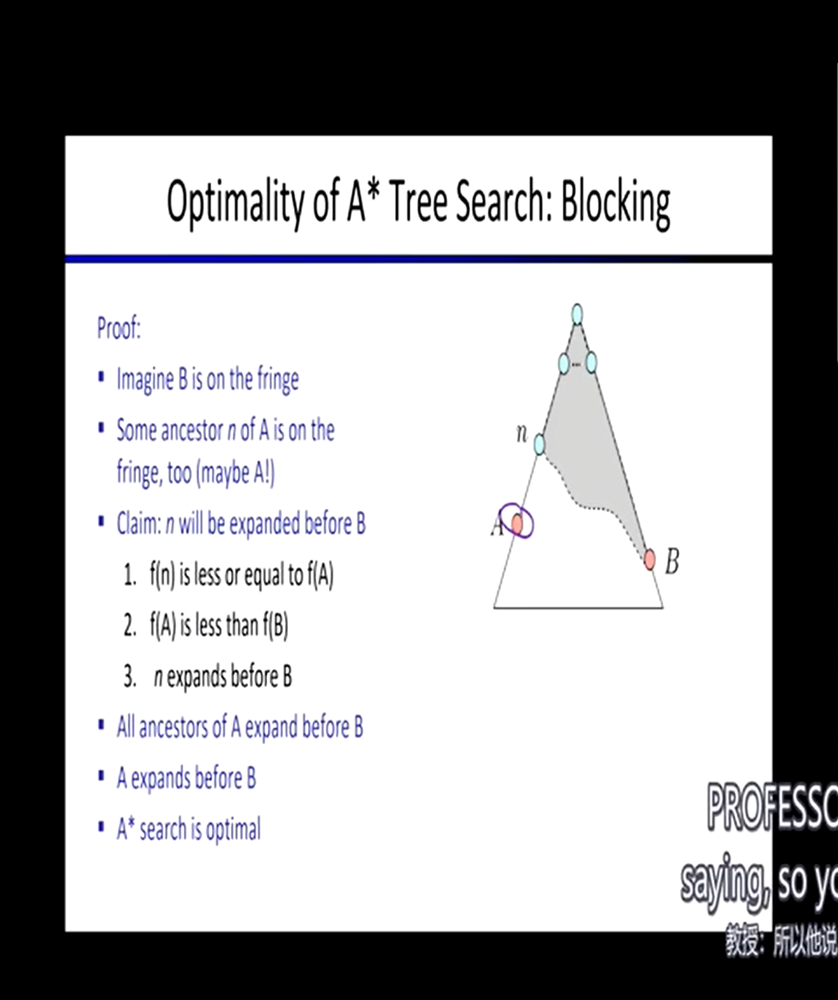

Intro to AI

- think like humam
- think rationally

- act like human

- act rationally

> Search and Planning

## Search

### Uninformed Search

Search Properties

- State
- Successor
- Start
- Solution（Goal） 

State Space Graphs and Search Trees

- node
- expand
- fringe

Search Strategy

- DFS（深度优先搜索）
- BFS（广度优先搜索）
- IDS（迭代加深搜索）
- UCS（统一代价搜索）

Search Algorithm Properties（属性）

- 完备性
- 最优性
- 时间复杂度
- 空间复杂度

When the search tree is finite

| Strategy | space  | complete | optimal | time   |
| -------- | ------ | -------- | ------- | ------ |
| DFS      | O(bm)  | √        | ×       | O(b^m) |
| BFS      | O(b^s) | √        | ×       | O(b^s  |

Trade-Offs BFS&DFS （权衡）

1、Iterative Deepening Search：迭代加深搜索

- base on layer

> 一层一层向下搜的意思
>
> 这样会造成浪费，比如第一次搜5层，第二次搜10层，第二次搜索仍旧需要经历第一次搜索的前五层
>
> 但这种浪费并不是特别大，每加的一层是所有前面层数之和，何不忽略一下

- always run dfs
- cap the depth you are willing to search when get the depth
- if get the solution then return, if not, going on searching the next depth

2、Uniform Cost Search：统一代价搜索

- base on cost so far

> 永远选择代价最小的节点优先扩展
>
> 当找到Goal时，记录他的代价cost，继续搜索代价还没到达cost的路径，直到所有路径的代价都大于等于cost，返回当前Goal

- expand a cheapest node first
- fringe is priority queue

| Strategy | space      | time       | optimal | complete |
| -------- | ---------- | ---------- | ------- | -------- |
| UCS      | O(b^(*/ε)) | O(b^(*/ε)) | √       | √        |

- Issues: it explores every direction, which could be very expensive
- Solution: focus on things that are promising（有希望的）rather than that have been cheap so far

What we should do for example is that use one piece of code to maintains a priority queue by different strategy when facing different situation, Such as using DFS when the search tree is deep, using BFS when the tree is shallow, using UCS when particularly considering the cost so far on current path

### Infomed Search

> 截止日期放到周五下午四点能有效帮助度过一个舒服的周末
>
> 搜索算法是系统的构建搜索树的方法，希望在搜索树的一部分便找到答案，最差的情况是构建了整个搜索树

不同的搜索算法的实际区别其实就是扩展边缘的方法不同

| Algorithm  | check          |
| ---------- | -------------- |
| DFS        | stack          |
| BFS        | queue          |
| some other | priority queue |

#### heurisics（启发式）

> estimate of distance to nearest goal for each state

heurisics function（启发函数）：测量距离goal的距离

通常使用减法而不是测量已走过的距离，即计算剩余的距离，直到距离为`0`找到`goal`

启发式只是一种估算，当遇到非常糟糕的启发式，估算结果可能会非常离谱

#### Greedy Search

通过启发式函数找到最接近goal的fringe，进行扩展

不同于一致代价搜索，一致代价搜索是找的代价最小的fringe，即深度最小的进行搜索，是盲目的，而贪婪搜索基于当前node到goal的距离进行有信息的搜索

选择局部最有利的节点进行扩展，忽略已耗费的代价，很有可能不是全局最有利的，甚至有可能走到头距离不能为0，即找不到goal

ucs is the tortoise（龟）, and greedy is the hare（兔）

#### A Star Search 

> (A* Search)

combine the tortoise and hare

同时考虑代价（g）和距目标距离（h），选择`min(Node.g+Node.h)`的节点进行扩展，当找到goal时（s=0），pop出节点得到结果`d`（实际距离），不宣布成功，继续选择`n`节点满足`f(n)<d`进行扩展，当新弹出的节点实际路径小于`d`，更新`d`，直到没有节点满足`f(n)<d`时，宣布成功

当实际成本小于估计成本，即预估`h`偏大，A*搜索很可能会略过这样的节点从而丢失最优解

可容的（乐观的）启发式：其预估成本总小于或等于实际成本

- 如用城市的直线距离作为启发方式是一种乐观启发

- 0 <= h(n) <= h*(n)

  每个节点的启发式值低于或等于从当前节点到目标成本最少的路径大小

  当h(n)为0时即为统一代价搜索

  当h(n)越接近h*(n)，效率越高

当使用的启发式是可接受的，那么我们说A*的树搜索将是最佳的

由于预计成本总小于实际成本，或许`b`已经很接近`goal`，但它已消耗的代价`h(b)`加上启发式`g(b)`很可能大于一个离`goal`很远的节点`a`，因为`h(a)`必然小于`h(b)`，估计值永远不高于实际值，很有可能`h(a)+g(a)f(a)<f(b)=h(b)+g(b)`

**Proof:**

- b is on the fringe
- n is one of ancestor of a and on the fringe
- Claim: n will be expanded before b
  1. f(n) is less than f(b)
  2. f(a) is less than f(b)
  3. n expanded before b
- all ancestors of a will expand before b
- a will expand before b
- A* search is optimal

当`b`和`n`同时存在于`fringe`，`n`是`a`祖先，若`g(n)<g(b)、f(a)<=f(n)`，又必然`h(a)=h(b)`，在此时一定会选择`n`扩展，达到节点`a`，同理若`f(c)<f(n)`，一定也会往`c`扩展

不可能发生先到达`b`再到达`a`的情况，因为他们总拥有公共祖先，于是具有可容启发式的A*搜索获得了最优性

**8 Puzzle:**

启发式：在一个A*搜索中，你可以使用多个可容的启发式，对于同一个节点，选择其最大的启发式值作为`h(n)`

- 位于错误位置的拼图数量（一定小于他所需要移动的次数）
- 总曼哈顿距离，即没有障碍，各个拼图移动到正确位置步数总和

后继：空位相邻的滑块滑向空位

#### Graph Search

> 永远不要扩展状态两次

在A*搜索的基础上，维护一个`closed`集合记录已经扩展过的节点，在每次扩展时，检查一遍`closed`集合，如果包含，`skip it`

这里数据结构选择`set`而不是`list`，会导致很慢捏

这样会有一个什么问题：第一次选择了一条没走过但很远的路，导致你一定忽略一些很短但已经被走过的路（如果有）。第一次选择必须十分谨慎

为了避免上述问题，我们使用一致性的启发式搜索，又称单调性

- h(n) <= c(n, a, n1) + h(n1)

  h(n)表示节点n的启发函数值，c(n, a, n1)表示从n经过动作a到达n1的代价，h(n1)为节点n1的启发值

- 简单来说，就是说启发函数随着节点推移，一定是递增的

- 这也意味着，你的每一步都将使代价提升，无法后退

于是具有一致性启发式的图搜索获得了最优性

由上可见，高效的启发式搜索是决定性能的关键

## CSPs

> 搜索的前提是世界是确定的
>

### What is CSPs

> Constraint Satisfaction Problems：约束满足问题

搜索

- 规划问题
- 识别问题

不同于标准搜索问题，标准搜索是黑盒的，只有起始和后继，中间发生了什么是位置的

而CSP问题常有以下元素

- Variables
- Domains
- Constraints
  - Implicit
  - Explicit
  - Unary/Binary/N-ary

Goals

- Here：find any solution
- Also：find all, find best. etc

约束限制着域名的选择

Map Coloring

- 变量：WA, NT, 1, NSW, V, SA, T

- 域名：red, green, blue

- 约束

  - implicit: WA != NT
  - explicit: (WA, NT) ∈ {(red, green), (red, blue), (green, red) ...}
  - 即相邻的不同变量颜色不能相同

- 解决方案：

  {WA=red, NT=green, Q=red, NSW=green, V=red, SA=blue, T=green}

N-Queens

- 变量：Xij
- 域名：{0, 1}
- 约束：和平的王国

Constraint Graphs：约束图

- arch show constraint
- variables joined by arch
- domain selected by state

矩形表示约束，弧线表示联系（即存在约束），连接了状态

The Waltz Algorithm

> 根据平面画出3D图

- CSPs are everywhere

试想如何解决CSPs，以地图上色为例

- 若用广度优先搜索

  很明显，所有的解都在最后一层，因为每一层只能给一个州上色，直到底部才能上色完毕，计算量极大

- 若用深度优先搜索

  若是盲目深度搜索，他只会不停给每一层某个state上色后继续加深而不管任何约束，能很快找到不满足约束的解，但这很明显不能解决问题

### Backtracking Serach

回溯搜索

> based on dfs

每次扩展时问一遍自己违反了规则吗，若违反则选择不扩展（说明这个节点之下的整棵树都是错误的），转而考虑其他节点进行扩展

通常使用递归回溯代码进行实现

1. 以某种顺序选择一个未被遗弃的节点
2. 检查
   - 违反约束：回溯，遗弃这颗子树
   - 不违反：loop
   - 找到答案：return

#### Filtering

前瞻搜索

再回溯搜索的基础上，过滤你的候选项，跟踪未分配的域名，进行`forward checking`，检查当前变量们是否都满足约束

- domain cloud
- forward checking

但注意他只会检查立即发生的错误，即只推演一步，而不是多步

同时约束只会传递到相邻的state

这就意味着，只有当问题立即发生，即某个state没有domain选择了，前瞻搜索才会发现出错，这时将进行一个大回溯

直到回溯到，弄清楚到底是哪一步就注定了这次失败（有可能是一开始或是第二步），再重新进行选择

- it's already doomed

**Constraint Propagation**

> 约束传递，约束传递越广，前瞻性越好，能更早的发现问题避免回溯
>
> - Constraint Propagation
> - Forward Checking

约束一致性

- arc consistency

提前消除冲突的约束，每次做出决定后，对所有后继节点进行检查，消除其有冲突的后继

- arc police

每次删除某个domain时，都要对尚未决定的所有节点重新检查，满足约束的一致性

- 即强行执行约束一致性

AC3 Algorithm

- Two loops
- 当每次做出删除操作，内循环需要重置

但他本质上还是一个回溯算法，当强制执行约束一致性无法继续时，仍需要回溯找其他办法

#### Ordering

> 排序的目的：加速算法

**Minimum Remaining Values**

在前瞻搜索的基础上，总是选择值域最少的节点进行扩展

先找到问题的棘手部分

- most constrained variable最多受限变量
- fail-fast机制，有效减少回溯深度

**Least Constraining Value**

最小约束价值

#### Consistency

> graph structure

Arc Consistency and Beyond：检查弧和图形的一致性，即对于节点约束的双方，约束都是能够满足的

比如V有蓝、绿色选，NSW有蓝色选，二者存在约束，此时他们满足弧的一致性，因为NSW选择了蓝色，V仍有绿色可以选择；但若SA只有蓝色选，NT只有蓝色选，二者存在约束，那么他们不满足弧的一致性，这时则需要回溯

与前瞻搜索的区别在于：forward checking只有在问题发生时才能检测到，而arc consistency将领先一步

Limitations of Arc Consistency

After enforcing arc consistency

- Can have on solution left
- Can have multiple solutions left
- Can have no solutions left and not know it（go backtracking）

Arc consistency still runs inside a backtracking search

注意每次进行约束判断后，都需要对以往变量重新进行检查，这很昂贵但很有用

K-Consistency

- K=1，代价是无，即保持自身的约束一致性，只要有任意合法域名，便保持1-consistency，代价可以说是无
- K=2，即为保持弧度一致性
- K=3，Path Consistency

Strong K-Consistency

#### Structure

> 图表的结构可以照亮方式

problem structure

##### Independent Sub-Problem

存在独立的子问题，如地图着色中的岛屿，拉出来单独考虑

##### Tree-Structured CSPs

no loops：没有循环

only on parent：只有一个父母节点，这决定了只需满足上下二者的弧一致性，并一直扩展到叶子，那么一定是满足约束的

时间复杂度随变量增多线性增加

1. order：选择一个节点作为根节点

2. Remove backward：对其余所有节点进行弧一致性约束

   for i = n: 2, apple RemoveInconsistent(Parent(xi). xi)

3. Assign forward：选择未被选择的节点，开始扩展

Runtime：O(n d^2)

这样做之后，从根节点到叶子节点的每一条路径都是弧一致的，因为我们访问了每个子节点并Make it arc-consistency

##### Nearly Tree-Structured CSPs

**delete**

Cutest conditioning Algorithm

- Conditioning：实例化一个变量时，考虑对其邻居的影响，那么当前节点和他的邻居便形成了一种树状结构（残差图），对其邻居的域名进行修剪（prune）
- Cutest condition：实例化一组变量，直到残差图是一棵树
- Cutest size c gives runtime O((d^c)(n-c)d^2)，very fast for small c（c应该是实例化的那组变量）

那么现在的问题就变成了如何高效地进行剪裁，尽量少地实例化变量而得到一颗树结构的残差图，转化为一个树结构的CSP问题，再使用树结构求解算法

delete node until have a tree left

**grouping**

以当前节点为中心，对邻居进行分组

如当前选择了SA，其余均与其有约束，进行如下分组：`{SA, WQA, NT}, {SA, NT, Q}, {SA, Q, NSW}, {SA, NSW, V}`

不能完全单独解决这些子问题，要有一些限制：如相同的变量必须保持相同的值

- 选择必须是连贯的

### Local Search

> 局部搜索
>
> 记住解决CSP问题的基础仍是搜索，这是一个不断优化的过程

Local Serach的思路是：先完整再合法。即先搜索到某一个叶子节点，该路径并不合法，再对其进行矫正使其合法或失败，这完全不同于之前的搜索，即先保证合法，才能继续搜索

即先凑出一个答案，再慢慢修改答案使之合法

#### Iterative Improvement

> 迭代改进

apply to CSPs

- Take an assignment with unsatisfied constraints
- Operators reassign variable values
- No fringe! Live on the edge

`Operator`对应`successor function`，其功能为：重新分配变量值

Algorithm

- Variable selection: randomly select and conflicted variable
- Value selection: **min-conficts heuristic**
  - 选择违反的价值最少的限制，即最大的减少冲突
  - 直到减少的冲突等于违反约束的总数

找寻变量规则：最小冲突启发式

举个例子：有人和你起了冲突要宰你，你有一个机会跑路，那么你总是跑到离他最远的地方。这个地方便是你选择的变量值

- 这有一个致命问题：有可能死锁，即有两个或多个冲突相联系，即解决了1出现了2，解决了2又出现1

适用情况：

- 变量很多，约束很少
- 约束很多

why?

- 当约束很少，你可以随便选，而且很少触发冲突
- 当约束很多，你的选择极少，可能只有一两种改进方法，这也会算的很快

#### Hill Climbing

从一个初始点出发，试着让他变得更好，当无法变得更好时（冲突不会继续减少）， stop and declared finished

- 这无法保证搜索完整性和最优性

就如爬山时始终朝着比自己高的地方爬，很有可能你会停在一个小山包而不是山顶，是一个局部最大值

可怕之处是局部最大值和全局最大值对于身处环境根本没有特征能够区别开来（no sign）

所以本地搜索有很多并行运行的线程，从不同初始点开始搜索，希望找到不同的局部最大值，从而找到全局最大值

#### Simulated Annealing

> 退火模拟

核心思想：jump around

温度表：活跃度

- 当0，stop
- 当非常高，瞎几把乱选
- 当在中间，会根据价值和温度进行考虑，决定是否离开本地

以此来避开局部最佳

#### Genetic Algorithms

> 遗传算法

简单举例：现在有两个完整的解决办法，但他们都有少数冲突，现在我们将两个办法砍开再重组

## Games

> Game Tree and Adversarial Serach
>
> 博弈树和对抗搜索

games with ai

- checkers（solved）
- chess: deep blue
- go
- pacman

types of games

- 确定性（围棋）或随机性（吃豆人）
- 玩家数量
- 零和博弈
- 信息是否公开（扑克、围棋）

Many possible formalizations

- states: S（start at s）
- players: P（1...N）
- Actions: A
- Transition: Function: SxA -> S
- Terminal Test: S -> {t, f}
- Terminal Utilities: SxP -> R

Solution for a player is a policy: S -> A

> the point is: what action should be taken

Zero-Sum Games

- 博弈双方争夺同一组资源（双人红警），一方资源的增加必然等于另一方资源的减少，是为零和，故双方不存在合作的可能
- 属于非合作博弈

General Games

- 有同伴，如MC
- 属于合作博弈

**Adversarial Game Tree**

- 博弈树

Single-Agent Trees

- 单策略树
- Minimax Value：节点的值等于其子节点中的最大值
- Minimum Value：节点的值等于其子结点中的最小值

### Minimax Search

> 井字棋：确定化的零和游戏
>
> like DFS

这常用于解决公开信息的零和问题：因为玩家回合制操作，在自己的回合要求MAX，在对方的回合要求MIN，Minimax算法正合他意

**Tic-Tac-Toe Game Tree**

最小化节点和最大化节点一层一层层交替

- 最小化节点找到下一层节点的最小值为自己赋值
- 最大化节点找到下一层节点的最大值为自己赋值
- 这样的赋值是动态的，实时变化的，直到所有节点被访问

最后将会根据根节点值选择相应叶子节点连接成结果路径

| Strategy | Time   | Space |
| -------- | ------ | ----- |
| Minimax  | O(b^m) | O(bm) |
| DFS      | O(b^m) | O(bm) |

当b>35时，搜索整棵树变得不太可能，效率太低辽（Resource limit）

### α-β Pruning

> 阿尔法贝塔算法：博弈树剪枝的一种方式

在`minimax search`的基础上，进行一些价值判断从而跳过一些节点

比如上层的最大化节点已经遍历到了一个最大值3，搜索当前最小化节点下层时访问到了一个值为3的节点，那么我们可以直接跳过当前这个最小化节点，因为它一定会返回一个`<=3`的最小值，而它总会小于等于上层最大化节点的当前值3，不会大于3，不会更新MAX的值

General configuration (MIN version)

- computing the MIN-VALUE node n
- looping over n's children
- n's estimate of the childrens' min is dropping（丢给上一层判定）
- who cares about n's value? MAX-VALUE node m, assume m's value is a
- when n's estimate worse than a（cur <= a）, skip n and continue computing next MIN-VALUE node

**Alpha-Beta Pruning**

> α-β修剪：减少minimax search的成本

- Alpha：MAX's best option on path to root
- Beta：MIN's best option on path to root

The algorithm like this

~~~python
def max-value(state, a, b):
	v = MIN_VALUE
    for node n in successor:
        v = max(v, value(n, a, b))
        if v>= b: return v
        a = max(a, v)
    return v

def min_value(state, a, b):
    v = MAX_VALUE
    for node n in successor:
        v = min(v, value(n, a, b))
        if v<= a: return v
        b = min(b, v)
    return v
~~~

- it could be very deep and expensive

- good child ordering improves effectiveness of pruning

  如第一次找计算量最小的子树对Top进行赋值

这样仍然会消耗很多资源，顶多开个根

**Depth-Limited Minimax Search**

于是我们选择使用深度受限的Minimax Search以节省资源，将有限最大深度看作叶子节点，这样会不太准，只是近似值（not solved）

- 如下国际象棋，只往后推8步，而不是63步

a danger of replanning agents：

当子节点价值一样，父节点将会左右摇摆

这取决于你的评估功能，当他不够好时，将会出现很奇怪的行为（如左右摇摆）

设计一个细致的评估机制，对各节点适量加权，`even worse always exist`

有限深度的影响

- 当深度过少，很难找到合适的解决方案
- 深度增多会导致计算量增大，但更可能赢得游戏

当算力有限时，评估功能的准确性和搜索深度决定了是否能找到更有前途的解决方案

- Evaluation and Depth matters

### Expectimax Search

> we always have uncertain outcomes
>
> 最大期望搜索
>
> 机会博弈

在`minimax search`和`α-β purning`时，我们对于下层节点的选择都是随机的，但若优先选择到更优的元素，可以有效对无用数据进行修剪

根据概率对各节点进行建模（modeling），但是实际上这种选择是不确定的

Expectimax Search

- Max nodes as in minimax search

  最大节点和最小最大搜索中的最大节点保持一致

- Chance nodes are like min nodes but outcome is uncertain

  机会节点像最小节点，但他的结果是不确定的，是估值、随机的

- Calculate their utilities（均值）

- Take weighted average（expectation） of children

计算最佳游戏下的平均得分，选择均分最高的节点拓展，有一种希望得分为均分的想法，以期望优先（均分=选择概率*节点总值）

- 当没有明确概率时，默认平均

需要注意的是，这里和最大最小搜索的是同一颗博弈树，只是算法不同

举个例子：当你失血过多，是爬出去求救还是立刻自杀

- 若是minimax算法，他将选择下一步价值最高的节点，即立即自杀以减少痛苦

- 若是expectimax算法，他将评估爬出去求救的平均价值（即被救还是痛苦死去）和立刻死去的价值，若求救的均值大于立刻死去，那么他就会选择求救

  但注意，这里是否被救是不确定的，有可能陷入更悲观的结局

Expectimax Search

~~~python
def value(state):
    if the is a terminal state: return the state's utility
    if the next agent is MAX: return max-value(state)
    if the next agent is EXP: return exp-value(state)
    

def max-value(state):
    v = MIN_VALUE
    for node in successor:
        v = max(v, value(node))
    return v

def exp-value(state):
    v = 0
    for node in successor:
        p = probability(node)
        v += p*value(node)
    return v
~~~

**Expectimax Pruning**

最大期望剪枝

由于总有可能存在极端值使均值失衡，最大期望算法不能剪枝

**Depth-Limited Expectimax**

深度受限的最大期望搜索

可以通过机器学习更准确的预测期望值

其核心思想是减少层数的遍历通过均值估计得到一个顶部的近似值

**Probabilities**

根据`world model`，针对不同的情况分配概率

注意概率是动态变化的，当你获得的信息越多，概率越准确，估值也越准确

Expectations：期望值 —— 分布概率加权

- 如三种概率分别对应三种耗时，那么期望值`expectations=0.2x20+0.3x15+0.5x30=24.5`

在Expectimax Search中维护一个概率模型，计算各节点的发生概率，通过简单或复杂的计算或随机确定概率

- 不一定对，只是概率

**Informed Probabilities**

当存在一个竞争对手，进行概率计算时，要同时对自己和对方的概率进行建模，这将使概率计算十分昂贵

因为各自都有一棵博弈树，当搜索算法不同时，二者树也不尽相同，为了相互匹配将带来更多计算

这也意味着在竞争时，你不得不越来越接近你的对手，若对手搜索到了100层，你必须做出相应回应，至少近似的搜索到100层，并希望估值足够好

**The dangers of optimism and pessimism**

乐观和悲观的危险

- assuming chance when the world is adversarial（对抗的）

  太乐观了，太贪了，有时很有效，但不安全

- assuming the worst case when it's not likely

  太怂了，或许最后一个豆就在眼前，鬼在较远处，它也会优先选择远离鬼的方向扩展

分别对应了`Expectimax Search`和`Minimax Search`

Assumptions vs. Reality

| Packman\Ghost | Adversarial      | Random       |
| ------------- | ---------------- | ------------ |
| Minimax       | good             | always waste |
| Expectimax    | always get eaten | good         |

**Other Type Game**

> Mixed Layer Types

Backgammon

每步二十个扩展

深度二搜索 ——> build a world champion

Multi-Agent Utilities

### Utilities

> 效用

Maximum Expected Utility

> 为什么不用minimax，因为他总会太过敏感，做出不合理的选择

搜索方式将决定我们玩游戏的方式，即如何选择下一步的方法

奖品和彩票（actual utility）

- Prizes：确定的
- Lotteries：不确定的（uncertain prizes）

**Rational**

- orderability（明确性）

  a>b&&b>a ——> a==b

- transitivity（传递性）

  a>b&&b>c ——> a>c

- continuity（连续性）

  a>b>c ——> 你需要在a和c之间抽奖

- substitutability（可替代性）

  a~b ——> 那么所有涉及a的判断可以用b替代

- monotonicty（单调性）

  a>b, P(a)>P(b) ——> select a

MEU Principle

偏好和价值

**Human Utility**

极端情况（extremes）

效用函数

平均操作使行为如一（expectimax）

- Money
- Lottery
- Prizes

Human Rationality?
