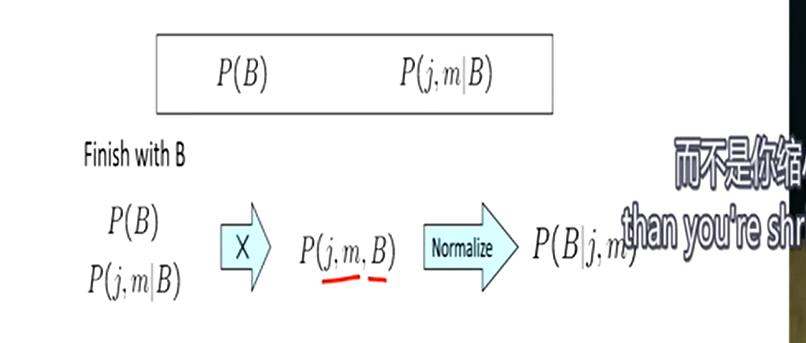

> Probabilistic Reasoning
>
> 概率推理

## Probability

> 概率论：不确定性下建模和计算以及人工智能的基础

example：捉鬼敢死队

- 在一个二维的方阵中，隐藏了一个或多个鬼
- 探针标记坐标：颜色越深鬼越近，但有概率出错，每个点只能标记一次，并且每次标记负分
- 开枪：结束游戏，若打到鬼胜利，若为打到则失败

Models：在这里指巨大的联合分布，一个巨大的概率查找表

### Random Variables

随机变量

简单分类

- R = is it raining（treu/false）

- T = is it hot or cold（hot/cold）

- D = how long will it take to drive to work（[0, x)）

  连续性随机变量

- L = where is ghost（{0，0}，{0，1}...）

有点像CSP问题中`state & domain`（状态和值域）

通常随机变量都是离散型变量

在真实模型中随机变量概率为0是毁灭性的，概率总和为1

简记

- P(hot) = P(T=hot)

### Joint Distributions

> 联合分布：概率模型的核心
>
> 给出推荐概率的关键

联合分布概率，即约束一系列随机变量值的概率，就像真值表

- `P(X1=x1,X2=x2,...,Xn=xn)`
- `P(x1,x2,...xn)`

n variables with n domain distrbution size：d^n

永远不能写出整个概率空间

### Probabilistic Models

概率模型，一组变量和其概率，像是一个巨大的CSP问题，变量对应状态，概率对应值，各变量间存在约束

**Event**

事件是一组随机变量的联合结果，通过联合概率表我们可以计算任一事件的概率

**Marginal Distributions**

边缘分布：联合分布的一个子表格

如有随机变量x、y及其联合分布表a，我们单独提出x的概率分布表b，那么b就是a的一个边缘分布

**Conditional Probabilities**

条件概率，a、b均为某一事件

- P(a|b) = P(a, b) / P(b)

即在b发生的前提下，a发生的概率，可以由联合概率和边缘概率计算得出

### Conditional Distributions

条件分布，这里W、T均为变量，条件分布将是一组概率集，即在T为hot的前提下，变量W的概率分布关系

- P(W|T=hot)

他依据事件发生的事实（具体值），而不是概率分布表，这有区别于边缘分布

- `P(W=s|T=c) = P(W=s, T=c) / ΣP(W=wi, T=c)`

  即某一确定条件概率为其条件和自身都发生的概率除以所有可能发生的概率总和

所有这些事件的概率集合便是W|T的条件分布表

计算条件分布的一般方式：

> the algorithms for base nets

- 在概率分布表中选出条件满足的所有行
- 等比例调整他们的概率使其概率和为1

#### Probabilistic Inference

> 概率推理

从已知的概率基于证据推理未知的概率，得到期望的概率

#### Inference by Enumeration

枚举推理

- Evdence variables：E1...Ek=e1...ek

  已知事实

- Query* variable：Q

  查询变量，即要推理的问题，想要计算的结果

- Hidden variables：H1...Hr

  尚未证实的事实，也属于未知变量

推理过程

step 1：select the entries consistent with the evidence

- 查询出一个与Q有关的联合概率分布表

step 2：sum out H to get joint（联合） of Query and evidence

- Query

  根据Q合并相同特征的行。如Q为推断天气情况，那么温度和季节将是隐藏变量，你将在使隐藏变量塌陷，将所有`W=sun`和`W=rain`提出并合并成两行（subtable）

- Evidence

  根据已知证据（条件），筛选有用的概率分布，如已知是冬天，那么将去掉所有`S!=冬天`的行

  条件越多，筛选结果越少

step 3：normalize

- 即将概率总和等比率扩大至1，转化为一个规范的概率表

隐藏变量均具有转化为证据的潜力

Obvious problems

- worst case time complexity O(d^n)

  查询整张联合概率分布表

- space complexity O(d^n) to store the joint distribution

  需要O(d^n)的空间储存联合概率表

How to produce joint distribution?

**The Product Rule**

- `P(y) * P(x|y) = P(x,y)`

根据局部条件分布推断联合概率分布

#### The Chain Rule

链规则，对于`P(y) * P(x|y) = P(x,y)`的推广

- `P(x1,x2,x3) = P(x1) * P(x2|x1) * P(x3|x1x2)`
- `P(x1,x2,...,xn) = ∏P(xi|x1...xi-1)`

先获得`P(x1)`，通过条件`P(x1),P(x2|x1)`计算`P(x2,x1)`，通过`P(x2,x1),P(x3|x1,x2)`获得`P(x3,x1,x2)`，以此类推，最终可以获得`P(x1,x2,...,xn)`

#### Bayes Rule

Product rule：`P(x,y) = P(x|y)P(y) = P(y|x)P(x)`

移项可得：`P(x|y) = (P(y|x)/P(y)) * P(x)`

why it's helpful?

通过转换条件（在反向条件中构建条件），通过更简单的条件进行建模

**Inference with Bayes' Rule**

例子：诊断病例`P(致病因素|症状)`

- `P(cause|effect) = (P(effect|cause)P(cause)) / P(effect)`

- cause：脑膜炎
- effect：颈部僵硬

已知：颈部僵硬在普通人群中概率，颈部僵硬在脑膜炎患者之间的概率

当你不知道得没得脑膜炎时，因为没有症状，但突然间脖子僵硬了，你就需要重新考虑你得脑膜炎的概率

从果溯因的思想，从更多的结果不断更新因的概率使之准确

**Probabilistic Models**

> 概率建模

- describe how (a part of) the world works

建模总是一个简化过程

- 从哪获取变量
- 怎么计算概率
- 如何学习

> All models are wrong, but some are useful
>
> ——Geoge E. P. Box

我们的任务便是提出有用的模型

**Utility**

> 模型的效用

- 推理未知变量
- 预测，因果推理
- 通过已知变量做出理性决定

### Independence

> 随机变量的独立性

- `P(x,y) = P(x)P(y)`
- `P(x|y) = P(y)`

条件概率等于自身概率，就是说y发不发生对于x是否发生不产生影响，x、y相互独立，是两个一维表，而不是一个联合概率二维表，如抛硬币字面和花面互不影响，二者独立

很多时候很多事都不是完全独立的

如何检验是否独立？

边缘概率相乘是否等于联合概率，若相等则独立，若不等则相关

像抛硬币这样的独立情况是很罕见的，我们可以只通过一组概率推断一个很大的概率分布表（因为每次都不变）

- 变量往往有互动，因为你在建模的时候，为什么会选择两个完全无关的变量参与呢
- 更多时候是有条件独立（Conditional Independence）

**Conditional Independence**

> 条件独立

呃就是说，a和b的相关需要条件c，比如a是发现蛀牙，b是牙疼，c是你有牙

那么，`P(a|b) != P(a)`当且仅当`c`成立，否则`P(a|b) = P(a)`，即a、b相互独立

- 牙疼和发现蛀牙是独立的当没有牙

  toothcache ⊥ catch | no tooth

条件独立：

- `P(x,y|z) = P(x|z)P(y|z)`

- `P(x|z,y) = P(x|z)`

  在z发生时，x、y独立，y是否发生不影响x发生概率

think about these domain

- traffic
- umbrella
- raining

在下雨时交通和雨伞相关联，不下雨时相互独立

- fire
- smoke
- alarm

当没有烟雾，火灾和警报将互不关联（烟雾报警器）

对于一个Chain Rule

- `P(x,y,z) = P(z)P(y|z)P(x|z,y)`

若x、y关于z条件独立，那么这个规则可以简化为

- `P(x,y,z) = P(z)P(y|z)P(x|z)`

  即将`P(x|z,y)`简化为`P(x|y)`

这样我们能通过更少的变量主键确定一张联合概率表

## Bayes' Nets

> 贝叶斯网络
>
> 一种用于构建概率模型的技术，管理和推理超过规模的不确定性

### Representation

> 表示法

#### Big Picture

概率模型等于一整个概率分布表？

- 数学上这很好
- 大小是指数型的，真的很大
- 很难去进行学习、评估

**Example**

Insurance：汽车保险

- a lot of variables：age、car、skill...
- accident：want to prediction

所有这些变量根据联系构建了一张大的关系网

#### Graphical Model Notation

> 图形模式表示法

just like CSPs

- nodes：变量，variables
- domains：值域，变量的值
- arcs：用弧表示条件独立性

**Example**

1、Coin Flips

硬币翻转问题，绝对的独立性，对应一堆没有弧线的节点

2、Traffic

交通问题，变量为天气和交通

- model 1：independence

- model 2：rain causes traffic

  箭头从下雨指向交通

model 2 is better

3、Traffic Ⅱ

交通问题Ⅱ，变量有交通T、下雨R、低气压L、屋顶滴雨D、一个球赛B、蛀牙C

- 低气压影响下雨
- 下雨影响交通、屋顶滴雨、球赛
- 球赛影响交通
- 蛀牙独立于其他变量

4、Alarm Network

报警装置，变量有入室盗窃B、警报响起A、玛丽打电话来M、约翰打电话来J、地震E

- 入室盗窃导致警报响起
- 地震导致警报响起
- 警报响起导致玛丽和约翰打电话来

#### Bayes' Net Semantics

> 贝叶斯网络定义：一种拓扑结构

贝叶斯网络是一组节点，每个变量x对应一个节点

在这些节点中有一个有向无环图，对应变量间的联系（因果关系），注意图中没有定向循环

一个节点可能有多个因，果继承了因的某些功能并且呈指数增长，我理解为条件概率在传递过程中不断变化

每个节点的概率都是相对其父母节点的条件概率，整合所有的条件概率可以获得一张联合概率表，通过链规则或其他

CPT：条件概率表（conditional probability table）

不一定是因果关系，异或等都有可能

**Probabilities in BNs**

基于Chain Rule，链规则的扩展

`P(x1,x2,...,xn) = ∏ P(xi|parents(Xi))`

贝叶斯网络提供保证，通过乘积将得到节点概率

可以通过一个拓扑图将上述例子画出，并提供相应的计算方式

在贝叶斯网中，因果关系被弱化，由数字和字母表示，程序并不知道这些数字和字母背后的因果，只是得到一张巨大的联合概率分布表

### Conditional Independence

> 条件独立

**Size of a Bayes' Net**

N Boolean variables：`2^N`

N-node net and nodes have up to k parents：`O(N*2^(k+1))`

若单纯的计算联合概率分布，指数增长将令算法陷入困境

贝叶斯网络将有效缓解

- 条件概率表远小于完整联合概率表

**Assumptions**

我们总通过条件概率的乘积来表示当前变量概率，不同于链规则调整所有的条件，贝叶斯网络只根据父级概率进行调整，只关心父母节点

举个例子：X ——> Y ——> Z ——> W

Chain Rule：`P(x,y,z,w) = P(x)P(y|x)P(z|x,y)P(w|x,y,z)`

NBs：`P(x,y,z,w) = P(x)P(y|x)P(z|y)P(w|z)`

- 基于条件独立的简化
- 条件独立是可以传递的，如这里w和z条件独立与y，我们也可以说w和x条件独立与y或z

另一个例子：X ——> Y ——> Z

X和Z保证独立吗？

他们不保证独立，X可以影响Z当Y发生，如低气压引发下雨，下雨引发堵车，那么我们有结论则低气压可以引发堵车当低气压引发了下雨

当X发生时，Y发生概率为0时，X和Z保持独立，就像X为抛硬币字面，Y为花面，那么我们可以说这个贝叶斯网络有点智障

#### D-Separation

> D分离算法
>
> 将所有状态分为三元组进行判断
>
> - 链型
> - `^`型
> - `v`型
>
> 根据路径是否活跃判断状态的独立关系

##### Causal Chains

链型

例子：X（low pressure） ——> Y （rain）——> Z（traffic）

- 无法保证X/Z独立

- 能够保证X/Z关于条件Y独立，得到简化

  `P(z|x,y) = P(x,y,z)/P(x,y) = P(x)P(y|x)P(z|y)/P(x)P(y|x) = P(z|y)`

  从公式中可以看到当前节点概率只与其父母节点有关

##### Common Cause

^型，公共条件，即一个诱因对应多个结果，两或多个个效果由同一个条件导致

条件概率选择

例子：X ——> Y ——> Z/W

- 通常X/Z不会独立

- X和Z/W关于Y条件独立，当Y发生，X肯定发生，不对Z/W造成任何影响

  `P(z|x,y) = P(z|y)`

##### Common Effect

v型，相同效果，即多个诱因可能导致相同的结果。一个结果可以由多个因素导致

例子：X/Y ——> Z

- 在这个例子中X/Y是否独立

  yes

- X/Y是否关于Z条件独立

  no，当Z发生，X/Y都有可能发生，当拥有证据X发生了，那么Y的发生概率将会降低

**The General Case**

一般情况，以三元组为例

Reachability：可到达性

通常在贝叶斯网络中将隐藏一些证据节点，观察贝叶斯图中其他节点的结果进行推断

Active/Inactive Paths

- 链结构：中间无证据，活跃
- `V`结构：中间有证据，活跃
- `^`结构：中间无证据，活跃

> 以上为D-Separation的轮廓

Query：`Xi⊥Xj | {Xk1,...,Xkn}`

Check：检查Xi到Xj间的所有路径，若有任一一条路径是活跃的，那么Xi和Xj不相互独立；否则二者独立

Example：

R/B ——> T ——> T'

- R⊥B：yes（独立）
- R⊥B|T：no（关联）
- R⊥B|T'：no（关联）

L ——> R ——> D/T，B ——> T ——> T'

- L⊥T'|T：yes（R-T-T'为非活跃）
- L⊥B：yes
- L⊥B|T：no（条件相关）
- L⊥B|T'：no
- L⊥B|T,R：yes

R ——> T/D，T/D ——> S

- T⊥D：no（^型活跃）
- T⊥D|R：yes（^型不活跃，v型不活跃）
- T⊥D|R,S：no（v型活跃）

我们为什么以及如何调查所有独立性？

基于贝叶斯网络的D分离算法

不同的贝叶斯结构可能表示着相同的独立逻辑 关系，不同的结构的表现

- X <—— Y ——> Z
- X ——> Y ——> Z
- X <—— Y <—— Z

上述三个结构都可以表示：`X⊥Z|Y`

在逻辑上他们是等价的，但在特定情况我们应选择更合理的结构

**Summary**

D分离算法给我们一个检查独立性的方法，为所有变量集运行它，得到所有独立性的完整列表

有一个问题，当某个变量完全独立与其他所有变量，它很难被发现并加入列表当中

### Probabilistic Inference

> 概率推理

有向无环图，使用`arc`表示变量之间的影响（条件概率），代表着各自变量的条件分布

每个节点都是一个概率集，保存了继承自父母节点的条件概率

- the more parents u have, the more action there is inside that node

节点的联合概率将是他们所有父母节点概率的乘积

- `P(x1,x1,...,xn) = ΠP(xi|parents(Xi)), (i∈[i,n])`

他们将膨胀成一个巨大的联合概率表，需要更加优化的算法

枚举推理：Alerm Network

经典的报警模型可以通过五个小的条件概率分布表获取任一组合事件的发生可能性，通过线性组合相乘得到高维的可能性组合结果，这便是枚举推理的一个小应用

#### Inference by Enumeration

> 枚举推理

给定一堆联合分布概率，通常是一堆条件概率，去定义一个贝叶斯网络

- Posterior probability（后验概率）

  `P(Q|E1=e1...Ek=ek)`

- Most likely explanation

  `argmax P(Q=q|E1=e1...)`

**枚举推理**

> 很简单、很慢

查询变量、隐藏变量，`P(Q|e1...ek)`

1、如果有一张联合概率表，我们要做的就是删除没有证据不符合的行，剩下行的概率总和小于1，这个总和称为**证据的可能性**

2、总结出隐藏的变量（无关变量），碰撞在一起并合并（忽略隐藏变量）

3、最终将概率总和化为1，得到你要查的概率

以上是拥有整个贝叶斯网络的一般计算过程

当时间、空间被限制，无法得到整张贝叶斯网，将通过条件概率来计算

比如你要获得某个值的概率，那么你就分析所有能够到达这个值的路径，并计算所有可能性，如

- A ——> B ——> C
- D ——> B ——> C

要获得C的发生概率，就计算所有路径致使C发生/不发生的可能性：如a发生b发生c发生、a不发生b发生c发生、d发生b发生c发生......

总结所有这些概率并进行规范化（概率和化1）

由此可得的所有情况中c发生的概率即为推理的c发生概率

#### Variable Elimination

> 变量消除

在枚举推理中，我们仍然是使用所有路径的概率组成一个一张n维的联合概率表，然后再从这张表中截取获得结果

有没有一种办法不要扩张至n维，而是一步一步计算推理控制在低维度计算

交错计算概率，避免指数喷井

**Factor Zoo**

> 因素动物园

1、P(X,Y)

joint distribution

考虑两个变量的联合概率分布`P(X,Y)`，当两个变量都是不定时且有两个选项，总的概率分布表为2维（2维数组表示），概率总和为`1`

2、P(x0, Y)

selected joint

当选择了某一变量确定其值如`P(x0,Y)`，立马概率分布表将缩小至`2x1`行，概率总和为`P(x0)`，此时变量`X`被称为被选定的关节

- 淘汰了所有`X != x0`的行

此时概率分布表降为1维，我们可以有效的减少数据结构（表）的大小

3、P(Y|x0)

single condition

同样降为1维问题，不同于情况2，他的概率总和为1，得到的时Y的概率分布

4、P(Y|X)

family of conditionals

总和大于1，一系列概率分布

5、P(y|X)

specified family

条件概率的结果知道，但原因有多种选择，其概率总和不确定

**example**

R ——> T ——> L

消去没用的条件概率

- 消去`-l`的行

joining factors（融合条件变量）

- like a database join

- `P(R) x P(T|R) = P(R,T)`

  相应行概率相乘

Multiple joins

- 就像数据库连接，通过相同的字段，连接不同的表，只是在这一过程中多了乘法计算
- 这样总能得到一张更大维度的概率分布表

Eliminate（变量消除）：边缘化

- 显而易见的，多重连接实际上就是一步步进行连接，在每次连接前，我们使一些无关的变量塌陷，如已知P(L|T)求P(L)，R便是无关变量，在得到P(R,L)后对R进行压缩塌陷，便能简化计算，减少维度
- 边连接，边化简（消除变量）
- multiple join + multiple eliminate = inference by enumerateion

Marginalizing Early：Variable elimination（尽早边缘化（塌陷））

- 当某个变量不重要时，立马将它消除塌陷，降低维数
- 对于每一次连接都如此检查，直至得到最简答案

Evidence

- Start with evidence

当有证据出现时，即删除不符合证据的所有行，锁定数据源（query+evdence）

在这群符合证据的数据源上再进行枚举推理或变量消除

最终对得到的概率进行标准化（概率和化为1）

**General Variable Elimination**

- Query：P(Q|E1=e1...Ek=ek)
- Start with initial factors：Local CPTs
- Pick out hidden variable H, use it then eliminate H
- Join all remaining and normalize the result

注意连接的规则，若已知`P(B),P(E),P(j,m|B,E)`

连接和消除应该是这样的：

- `P(E)xP(j,m|B,E) = P(j,m,E|B)`
- `P(j,m,E|B) = P(j,m|B)`

第一步的连接将条件转为结果，在第二步对这个无关的结果进行了塌陷（变量消除）

变量排序

引入变量的顺序决定了消除变量的顺序，在不同的消除过程中，其产生的中间概率矩阵将是不一样的，一定要避免产生指数级的矩阵

- 当一个父节点对应了n个子节点，这一次连接就将是n维的

如何找到好的变量排序？

- 在实践中，通常有规律性的好的排序
- 使用贝叶斯网络解决CSP问题
- NP hard

#### Sampling

> Approximate Inference
>
> 采样、抽样：计算和准确性之间的权衡
>
> 抽样也是一种学习，像是一种模拟（概率模拟），比蛮力计算更快，但有可能完全错误，但总有办法阻止其找到错误的概率

计算一个近似的后验概率，通过不同的小数区间表示变量的不同状态，如`(0.1,0.5)`红色，`[0.5,0.7]`绿色

##### Prior Sampling

> 事先抽样

P(Q)

样本：对变量状态的快照

就是说，对于一系列条件概率分布，通过抛硬币（不是五五开的硬币，而是根据条件概率来的）的方式决定每个变量的状态，使之变为证据，直到得到结果概率，作为一次样本（快照）

只是按顺序抛硬币得到目标概率

- `S(PS)(x1...xn) = ΠP(xi|parents(Xi)) = P(x1...xn)`
- `S(PS)`即一次事先抽样的样本

通常情况下，我们拥有数百万个样本，使用计数而不是概率去获得结果

在这些样本中，直接用除法计算概率（一个经验概率），当样本数不断增加，经验概率将不断逼近真实概率

##### Rejection Sampling

> 拒绝抽样

P(Q|e)

我们带着一些期望状态进入抽样程序，若样品和期望不符合，就被拒绝（丢弃）

以同样的方式获取样本，然后将不符合期望（证据）的样本丢掉，在剩下的样本中进行除法运算获取概率

##### Likelihood Weighting

> 可能性加权

P(Q|e)

我们在证据节点固定使之状态为我们的证据，这样在最后得到的样本中，一个都不需要拒绝（丢弃）

将证据融入你的硬币翻转程序，使之必然发生，同时给这个事件加上权重（从拒绝样本获取的抽样概率转变为条件概率分布表上的通常概率）

- `S(WS)(z,e) = ΠP(zi|Parents(Zi))`
- `w(z,e) = ΠP(ei|Parents(Ei))`
- `S(WS)(z,e) * w(z,e) = ΠP(zi|Parents(Zi)) * ΠP(ei|Parents(Ei))`

在有证据的前提下进行合理的必然概率分配，在这样的前提下进行场景模拟，从上往下取样

- 考虑了证据的参与

注意这里在实际计算时，使用了已经得知的概率，如`P(R|+t)`，`+t`为证据

已知：

- `+r: +t:0.9, -t:0.1`
- `-r: +t:0.5, -t:0.5`

抽取三个样本为：`(+r,+t),(+r,+t),(-r,+t)`

那么现在有：`w(+r)=0.9+0.9=1.8; w(-r)=0.5`

那么得到概率：`p(+r)=1.8/2.3; p(-r)=0.5/2.3`

因为我们固定了变量的值，我们需要对他进行加权，进行一个概率估计

这个过程中我们没有计算R的边缘分布，只是根据R/T的条件概率对样本进行加权并最终计算概率

##### Gibbs Sampling

> 吉布斯采样

P(Q|e)

我们不会从上到下遍历网络，而像一种迭代（迭代改进）

从一个完整实例开始，这个实例将符合已有证据。对于所有非证据节点，一个一个单独进行重新采样

steps：

1. Fix evidence：固定证据节点
2. Initialize other variables：随机根据条件概率初始化其他节点
3. Repeat：继续单个初始化这些节点
   - Choose a non-evidence variable X
   - Resample X from `P(X|all other variables)`
   - keep doing this

以此获取很多根据条件概率得到的样本，随着样本数增多，各概率将逼近真实值

## Decision Networks and VPI

> 决策网和信息价值

### Decision Network

> 决策网络
>
> MEU：maximum expected utility，最大期望效用

根据由贝叶斯网络得出的可能性做出决策

决策+贝叶斯网可能性=效用

- chance node：机会节点（椭圆形表示）
- actions：行为、决策（矩形表示）
- utility node：产生的效用（菱形表示）
- 椭圆形+矩形=菱形

A：action，W：weather，U：Utility

| A     | W    | U(A,W) |
| ----- | ---- | ------ |
| leave | sun  | 100    |
| leave | rain | 0      |
| take  | sun  | 20     |
| take  | rain | 70     |

| W    | P(W) |
| ---- | ---- |
| sun  | 0.7  |
| rain | 0.3  |

我们的机器人根据utility计算最佳决策并执行，做出合理的行为

如何选择行为

- instantiate all evidence

  初始化所有证据节点，固定之

- set action node(s) each passible way

  列出所有可能的行为路径

- calculate posterior for all parents of utility node, given the evidence

  在已有证据下计算每个效用节点父母节点的后验分布（条件概率分布）

- calculate expected utility for each action

  根据条件概率和对应效用对每个行为做出期望效用估计

- choose maximizing action

  选择效用估计最好的行为作为当前决策

就是说对每个行为的不同情况加权再求和，获取一个相对合理的平均值

如选择带伞，你在赌是否下雨

- 下雨0.3，晴天0.7
- 下雨带伞70分，晴天带伞20分

那么你的均值`EU(take) = 20*0.7+70*0.3=35`分

同样的，我们可以计算出`EU(leave) = 100*0.7+0*0.3 = 70`分

那么在这样的奖惩制度下，我们将选择`optimal action=leave`，获得最佳行动

最大期望效用（在预期行为中的最大值）

- `MEU(o) = maxEU(a) = 70`
- `MEU(o)`这里的`o`表示没有任何证据

注意现在没有任何证据参与贝叶斯网络

**Decisions as Outcome Trees**

将这样的决策过程化成一棵树

- 顶点为证据集
- 叶子节点为效用值（utility）
- 弧为行动/状态（action）
- 剩余节点为概率变量（state）

就像一个最大期望的MDP问题

What's changed?

我们必须对每个节点基于证据和贝叶斯网络的预测，计算给出结果的概率

当加入证据后，概率发生变化，相应的效用也将发生变化

如天气预报说天气不好后，晴天和雨天的概率变化

| W    | P（W\|F=bad） |
| ---- | ------------- |
| sun  | 0.34          |
| rain | 0.66          |

这时最佳行动变成了`take`

- `MEU(F=bad) = maxEU(a|bad) = 53`

**Ghostbusters Decision Network**

证据就是你探测过的点

### VPI

> 信息价值：value of perfect information
>
> - 信息计算的价值
>
> 信息能够使我们的决策更加精准

对于互斥问题，一个价值很大，一个价值为零，信息量为零，如石油钻井，A/B区域只有一个有油，一次工作只能选择A/B一个区域

| D    | O    | U    |
| ---- | ---- | ---- |
| a    | a    | k    |
| a    | b    | 0    |
| b    | a    | 0    |
| b    | b    | k    |

此时A/B的期望效用都是`k/2`

做一个调查，揭露石油的位置，假设我们知道了石油的位置，那么很明显我们的最佳预期效用将变为`k`

这样的调查就像天气问题看了天气预报一样

- `MEU(o) = maxEU(a) = 70`
- `MEU(F=bad) = maxEU(a|bad) = 53`
- `MEU(F=good) = maxEU(a|good) = 95`

预测同样是不准确的，即有他自己的概率分布

Forecast distribution

| F    | P(F) |
| ---- | ---- |
| good | 0.59 |
| bad  | 0.41 |

预测给予的差距

- `difference = 0.59*95+0.41*53-70 = 7.8`
- `VPI =  ΣP(e'|e)MEU(e,e') - MEU(e)`

这就是VPI：即是否有预测给推理带来的差异

预测是积极或消极影响预测的MEU大小

当我们有证据E=e时

- `MEU(e) = maxΣP(s|e)U(s,a)`

当我们有证据`e,e'`时

- `MEU(e,e') = maxΣP(s|e,e')U(s,a)`

当我们的证据不确定，而是有很多值供选择时

- `MEU(e,E') = maxΣP(e'|e)U(e,e')`

据此得到VPI为

- `VPI(E'|e) = MEU(e,E') - MEU(e)`

在天气预报这个问题上，决策树将被预报的积极或消极状态扩展一层，并给出相应的概率和预测值

**VPI是非负的**，你的预测无法影响你的决策时，我们可以说`VPI=0`，即该信息没有价值

根据信息的影响程度也分为`highly value, low value, 0`

**Value of Imperfect information**，不完美的信息，如天气预报，有很多嘈杂的影响，我们暂不考虑这种东西

信息揭示了随机变量的价值

**Question**

VPI(OilLoc)（油矿位置A/B）：k/2

VPI(ScoutingReport)（预测油矿位置）：0-k/2（产生微弱影响）

- k over 2 means k/2

VPI(scout)（是否派出了好的预测员）：0（不影响预测结果，因为在没有返回预测的前提下，你派出预测员和我获得预测是相互独立的）

VPI(Scout|ScoutingReport)（在返回预测报告的前提得知派出预测员的优秀程度）：> 0

### POMDPs

> 部分可观察的马尔可夫决策过程
>
> 非确定性和不确定的问题
>
> 人生就是POMDPs

有多种结果，你不知道身处何处，不知道世界的规则，你只知道当前观察到的

MDPs have

- states s
- actions a
- transition function P(s'|s, a)，即P(s, a, s')
- rewards R(s,a,s')

POMDPs add

- Observations O
- Observation function P(o|s)，或O(s, o)

他的作用是收集观察结果并基于证据对个结果做出评估，感知过程。评估计算通常要在贝叶斯网络中进行

经常在进入下一层之前将进入一个`belief state`，进行各种概率评估给各状态加权，再根据转换函数和回报函数做出最佳决策

- belief state

**POMDP Tree**

really very hard

