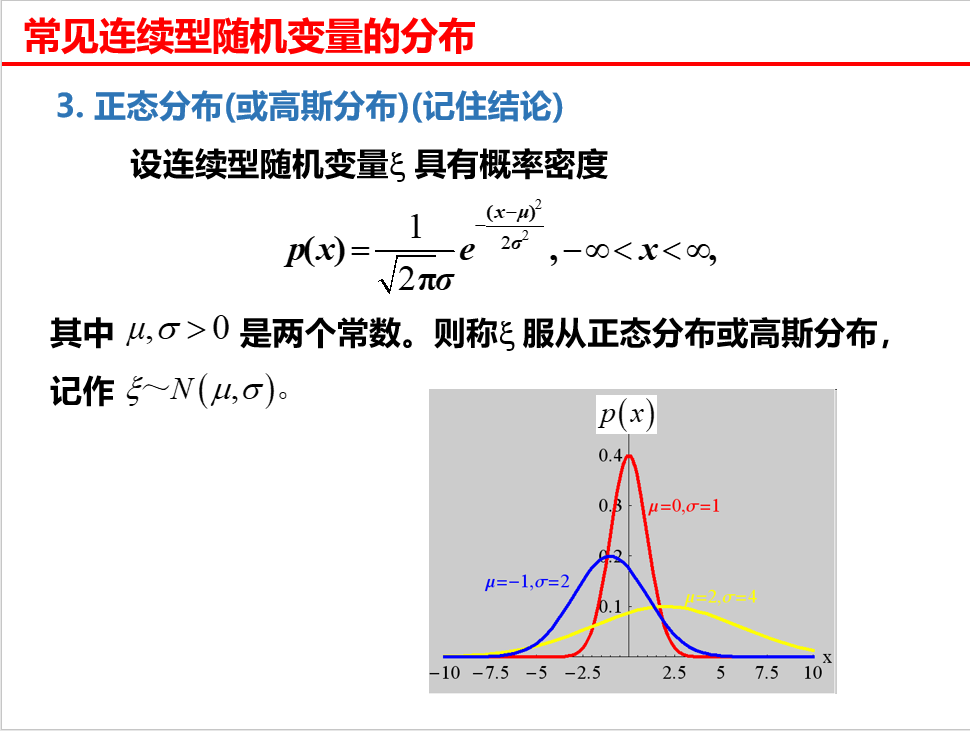
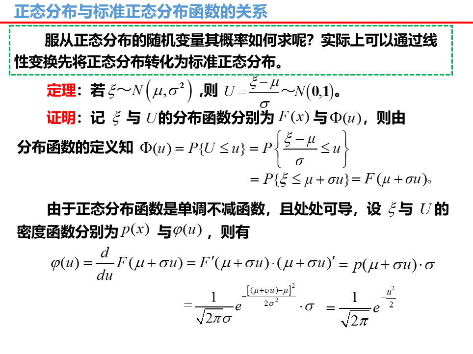
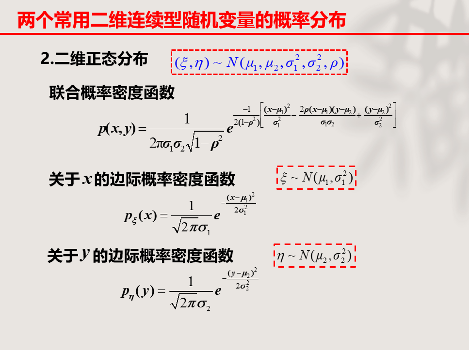
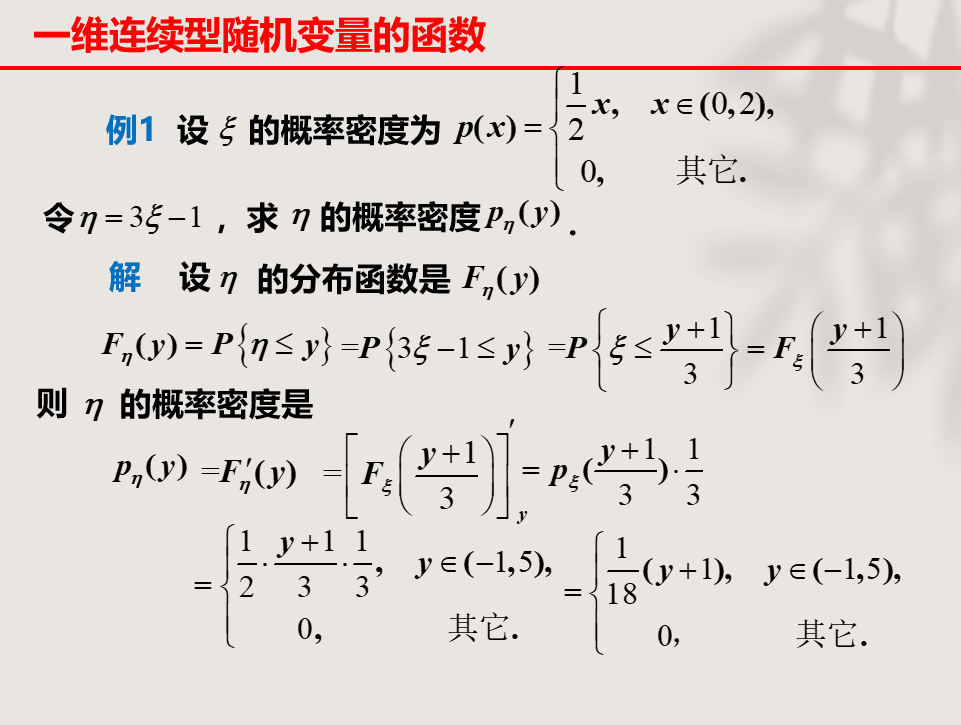
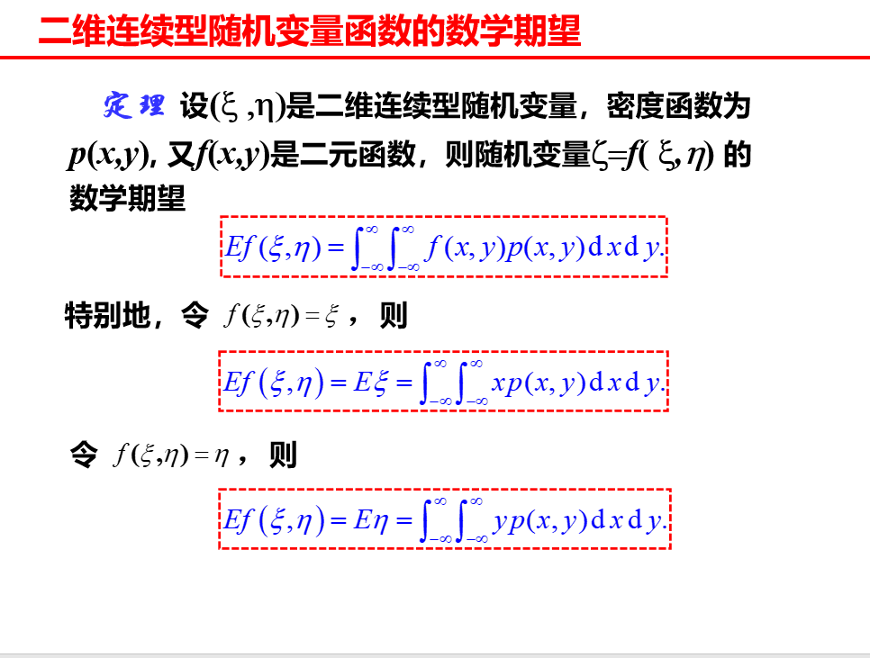

> 二维随机变量的分布、概率密度、数学期望以及方差
>
> 二维随机变量的协方差、相关系数以及切比雪夫不等式

## 连续型随机变量概述

### 连续型随机变量定义

设有随机变量`f`，这是一个一维的实值随机变量函数，也可以是一个随机变量，定义这个随机变量的分布函数为：`F(x) = P(f < x), x∈R`

- 分布函数是一个普通的函数（不携带概率），`x`是自变量，定义域为`R`
- `F(x)`是随机变量`f`取值不大于`x`的概率，值域为`[0,1]`
- 就像一根绳子随机砍断的几何分布

通常来讲，随机变量的分布函数是分段函数，在小的区间内概率始终为0，经过一段概率逐渐上升的区间后，概率稳定为1

### 分布函数

对于离散型随机变量，其分布函数`F(x0)`的取值就是各个小于`x0`的概率相加，当`x和x0`取等时概率突变

于是分布函数被`x`的取值分为不同的函数段，在图像上是一个右升的阶梯型曲线，在取等时垂直跳跃，在其他阶段是平行于`x`的直线

- 离散型随机变量的概率密度始终为0

分布函数性质：

- 单调不减性：`F(x+a) >= F(x), a>0`
- `x -> -∞`时取值为0，`x -> +∞`时取值为1
- 右连续：`F(x+0) = F(x)`

注意，在取等时，分布函数的值有可能发生突变，所以在进行概率求解时，只有`x`明确的小于`a`，才可以用`F(a)`，或者是明确的`x>=a`，可以用`1-F(a)`

### 分布函数和事件概率

| 事件        | 对应分布函数                   |
| ----------- | ------------------------------ |
| `P(f<=a)`   | `F(a)`                         |
| `P(f=a)`    | `P(f<=a)-P(f<a) = F(a)-F(a-0)` |
| `P(f<a)`    | `F(a-0)`                       |
| `P(f>=a)`   | `1-F(a-0)`                     |
| `P(f>a)`    | `1-P(f<=a) = 1-F(a)`           |
| `P(a<f<=b)` | `P(f<=b)-P(f<=a) = F(b)-F(a)`  |

## 一维连续性随机变量

### 概率密度

对于随机变量`X`，其分布函数为`F`

概率密度：分布函数`F`的导数`p`

- 若能够求导，即原分布函数有导数，则称`X`为连续性随机变量，`F`的导数`p`称为`X`的概率密度函数，简称概率密度

性质：

- `p(x) >= 0`，因为`F`单调不减

- 概率密度对整个实数区间积分，其结果必为1

- 对`p(x)`的连续点，必有`F'(x) = p(x)`

  也就是说，概率密度不完全等于分布函数的导数，因为什么，分布函数不一定在整个实数区间都可导（连续）

同样可以用概率密度表示事件的概率：
$$
P(a<X<b)=\int_a^bp(x)dx
$$
同理可以把边界换成正负`∞`求得`P(X>a)或P(X<=a)`

对于连续型随机变量，因为连续，所以有：`F(x0) = F(x0-0) = F(x0+0)`

所以必有：`P(X=x0) = 0`

- 也可以通过概率密度积分得到这一结论
- 于是有连续性随机变量的概率与区间的开闭无关

注意？？？

- 若`X=a`是不可能事件，必有`P(X=a)=0`
- 若`P(X=a)=0`，`X=a`不一定是不可能事件

### 均匀分布

概率密度是一条横线（一个常数），积分回去得到的分布函数为一个单调递增的一次函数，记作：`X ~ U(a,b)`

其中`a,b`为横线的左右边界，易得横线的值为`1/b-a`，`p(x) = 1/b-a`
$$
p(x)=\frac{1}{b-a}
$$

- 这里的均匀分布和离散型随机变量的几何分布没有半毛钱关系

### 指数分布

唯一参数`λ`

指数分布的概率密度：`p(x) = λe^(-λx), x>=0`，当`x<0`概率密度为0
$$
p(x)=\lambda e^{-\lambda x}
$$
指数分布的分布函数：`F(x) = 1-e^(-λx), x>=0`，当`x<0`分布函数为0
$$
F(x) = 1-e^{\lambda x}
$$

- 指数分布的重要性质：无记忆性

电路元件、动物的寿命等都服从指数分布

### 正态分布

又叫高斯分布，记作：`X ~ N(u,v), u,v∈R`

其概率密度满足：
$$
p(x)=\frac{1}{\sqrt{2\pi}v}e^{\frac{(x-u)^2}{2v^2}}
$$

正态分布的几何特征：

- 曲线关于`x=u`对称

- 在`x=u`时，`p(x)`取最大值`1/(2Π)½v`

- 曲线在`x=u+v和x=u-v`处有拐点

- 曲线以`x`轴为渐近线

- 当固定`u`时，改变`v`的大小，`p(x)`图形的形状不变，置沿着`x`轴作平行移动，即左右移动

- 当固定`v`时，改变`u`的大小，图形的对称轴不变，但形状改变

- `3v`原则，对于正态分布`X ~ N(0,v^2)`，有

  `P(|X| < v) = 0.668`

  `P(|X| < 2v) = 0.955`

  `P(|X| < 3v) = 0.997`

  上式说明`X`的取值大部分集中在`3v`内，而分布其外的很小，几乎不可能发生

### 标准正态分布

当正态分布`X ~ N(u,v)`的`u=0,v=1`时，我们称这个正态分布为标准正态分布

其概率密度为偶函数
$$
p(x) = \frac{1}{\sqrt{2\pi}}e^{-\frac{x^2}{2}}
$$
其分布函数`F(x)`的值可以查表查到，并且这个分布函数同样是一个偶函数，有以下性质

- `F(-x) = 1-F(x)`
- `F(0) = 0.5`
- `P(a<x0<=b) = F(b)-F(a)`

标准正态分布和正态分布的关系：

若有正态分布`x ~ N(u,v^2)`，则`(x-u)/v`满足标准正态分布

根据这一特性能够得到以下公式，设`x ~ N(u,v^2)`

`P(x<=c) = P(x-u/v <= c-u/v) = F(c-u/v)`

- 不等式同步加减乘除不影响未知数取值
- 由于`(x-u)/v`满足标准正态分布，所以说等价于一个标准正态分布的`P(u < (c-u)/v)`，自然等于其分布函数的`F((c-u)/v)`

同理有

`P(a<x<=b) = F((b-u)/v) - F((a-u)/v)`

## 二维连续型随机变量

### 分布函数

对于二维随机变量`(u,v)`，其分布函数：`F(x,y) = P(u<=x,v<=y)`

- 也称为`u,v`的联合分布函数

性质

- 单调不减
- `F(-∞,y) = 0, F(x,-∞) = 0, F(+∞,+∞) = 1`
- `F(x,y)`对`x,y`均右连续
- `P(x1<u<x2, y1<v<y2) = F(x2,y2)+F(x1,y1)-F(x2,y1)-F(x1,y2)`，其中`x1<x2, y1,Y2`并且始终成立

### 概率密度

概率密度

若二维随机变量`(u,v)`的分布函数`F(x,y)`能够求一次全导，那么我们称他是连续型二维随机变量，他的一次全导`p(x,y)`为他的概率密度，也称联合概率密度

联合概率密度性质：

- `p(x,y) >= 0`
- `p(x,y)`从`-∞`到`+∞`对`x,y`的积分结果为1
- 对任意二维区域`G`，点`(u,v)`落在`G`中的概率`P{(u,v)∈G} = ∬p(x,y)dxdy`
- 若`p(x,y)`在点`(x,y)`连续，则`p(x,y)`等于`F(x,y)`的全导

平行或垂直二重积分

垂直积分：给出`x`的取值范围`(a,b)`，给出`y`关于`x`的函数`y = g(x)`，`p(x,y)`先对`y`进行积分，上下限为`(g(a), g(b))`，再对`x`进行积分，上下限为`(a,b)`

- 从图像来看，是先从下到上积分（垂直），再从左往右积分，点-线-面的积分过程

平行积分：给出`y`的取值范围`(c,d)`，给出`x`关于`y`的函数`x = h(y)`，`p(x,y)`先对`x`进行积分，上下限为`(h(c), h(d))`，再对`y`进行积分，上下限`(c,d)`

- 先从左往右积分，再从下往上积分

举个栗子：

### 边际分布函数

若二维随机变量`(u,v)`联合分布函数`F(x,y)`已知，则

- 关于`x`的边际分布函数为：`Fu(x) = F(x,+∞)`
- 关于`y`的边际分布函数为：`Fv(y) = F(+∞,y)`

若已知联合密度函数`p(x,y)`，则
$$
F_u(x) = ∫_{-∞}^x (∫_{-∞}^{+∞}p(u,y)dy)du
$$

$$
F_v(y) = ∫_{-∞}^y (∫_{-∞}^{+∞}p(x,v)dx)dv
$$

### 边际概率密度

举个栗子：

总结下来就是：

| 原函数       | 动作                       | 目的函数     |
| ------------ | -------------------------- | ------------ |
| 联合分布函数 | 求全导                     | 联合密度函数 |
| 联合密度函数 | 对`(-∞,x),(-∞,y)`积分      | 联合分布函数 |
| 联合分布函数 | 固定某一变量为`+∞`         | 边际分布函数 |
| 联合密度函数 | 对某一变量从`(-∞，+∞)`积分 | 边际密度函数 |
| 边际密度函数 | 对自变量`z`从`(-∞,z)`积分  | 边际分布函数 |
| 边际分布函数 | 求导                       | 边际密度函数 |

- 没有边际到联合的转换，联合到边际的过程是不可逆的，只能从联合到边际，联合到联合，边际到边际

### 二维均匀分布

二维随机变量`(u,v)`的联合概率密度函数`p(x,y)`为一个常数

很明显这里的`x,y`取值必须有限，在一个有限的平面`G`中，设`G`的面积为`A`，这个常数即为`1/A`

### 二维正态分布

二维正态分布的边际分布均为一维的正态分布，这里边际分布同样推不出对应的联合分布，因为存在参数`p`

### 二维连续随机变量的独立

现有二维随机变量`(u,v)`若其联合分布函数处处等于其边际分布函数的乘积

- `F(x,y) = Fu(x)Fv(y)`

那么我们称随机变量`u,v`是相互独立的（充要）

若其联合密度函数`p(x,y)`处处连续，若其联合密度函数处处等于其边际密度函数的乘积

- `p(x,y) = pu(x)pv(x)`

那么我们称随机变量`u,v`是相互独立的（充要）

## 连续型随机变量函数的分布

> 好难捏

### 一维连续型随机变量的函数

若`Z`为连续型随机变量，`g = f(Z)`是连续函数，则`f(Z)`也是连续型随机变量

已知`Z`的概率密度`p1(x)`，求`f(X)`得概率密度`p2(y)`

#### 方法一：分布函数法

`Fg(y) = P(f(Z) < y) = P(Z <= h(y)) = Fz(h(y))`

- 其中`x = h(y)`是`y = f(x)`的反函数
- 举例：`f(x)=y=x+1`的反函数为`g(y)=x=y-1`

再对`Fg(y)`求导可得函数`g=f(Z)`的概率密度

- 从分布函数的定义入手，`F(x)`即为变量取值小于`x`的概率
- 求得连续型随机变量函数的分布函数，再由分布函数求导得其概率密度
- 概率密度为：`pg(y) = pz(h(y)) * [h(y)]'`

举个例子：

需要注意的是，用反函数对原自变量进行替换时，其取值范围也要相应变换

#### 方法二：公式法

当函数`f(x) = y`严格单调且具有连续可导的反函数`h(y) = x`，那么这个函数可以作用于任意连续型随机变量并**生成一个连续型随机变量**

若已知原随机变量的概率密度函数，那么我们就可以直接使用公式法求得函数的概率密度

- `p(y) = p(h(y)) * h'(y)`
- 这个公式和上面那个是一模一样的

举个栗子：

这个例题也得到一个关于正态分布的结论：

- 当一维正态分布随机变量`X~N(u,v^2)`经由一次函数`y=f(x)=ax+b`作用后，将得到一个二维正态分布随机变量`Y~N(a,u+b,a^2,v^2)`

### 二维连续型随机变量的函数

#### 方法一：和的分布、卷积公式

这里讨论连续型随机变量函数：`Z = X+Y`

这一方法只针对**相互独立**的一组连续型随机变量`(X,Y)`且**已知各随机变量的概率密度函数**

卷积公式：`pZ(z) = ∫(-∞,+∞) pX(x)*pY(z-x)dx`

- 即将其中一个概率密度函数的自变量由`y`换成`z-x`，消除`y`，再对`p(x,y)=p(x)p(y)`对`x`在`(-∞,+∞)`上积分一次，消除`x`，只保留变量`z`

推导过程如下：

举个栗子：

上述栗子也证明了正态分布的可加性：即正态分布相加，仍为一个正态分布，新的正态分布的参数为原正态分布参数之和

- `u = u1+u2, v^2 = v1^2+v2^2`
- 并且这种可加是一直持续的，即可以无限加

#### 方法二：变量变换定理

难死爹了

求解两个二维函数（其自变量为同一组二维连续型随机变量）的联合密度函数

雅可比行列式：偏导数`11+22-12-21`

回来做题！`P3.4`

## 数字特征及切比雪夫不等式

### 随机变量的数学期望及性质

回忆以下离散型随机变量的数学期望：概率和值的乘积的和

连续型随机变量的数学期望：`∫(-∞,+∞) xp(x)dx`

- 即对`x*p(x)`在实数范围内积分，这很合理，就是`值*概率`的和
- 若该积分不为正无穷，则称离散型随机变量数学期望存在，为这个积分结果

常见连续型随机变量的数学期望：

- 均匀分布`X~U(a,b)`的数学期望为`(a+b)/2`（区间中间）

- 指数分布
  $$
  p(x)=\lambda e^{-\lambda x}, x>0
  $$
  其数学期望为`1/λ`

- 正态分布`X~N(u,v^2)`
  $$
  p(x)=\frac{1}{\sqrt{2\pi}v}e^{-\frac{(x-u)^2}{2v^2}}
  $$
  其数学期望为`u`

连续型随机变量函数的数学期望：

对于普通函数`f(x)`，将其自变量换为一个连续型随机变量`Z`，那么`f(Z)`的数学期望为：`∫(-∞,+∞) f(x)p(x)dx`

- 只改变值，概率不变，所以只将积分项中`x`换为`f(x)`

二维连续型随机变量函数的数学期望：

性质：基本与离散型随机变量期望性质一致

- 当随机变量取值有限，必有期望，且期望大于下限小于上线
- 常数的期望为常数自身
- `E(k1X+k2Y) = k1*E(X)+k2*E(Y)`，其中`k1,k1`为实数，`X,Y`为连续型随机变量
- 若连续型随机变量`X,Y`相互独立，则`E(XY) = E(X)E(Y)`

### 随机变量的方差及其性质

 计算：`D(X)=E((X-EX)^2)`

在这里构造一个函数：`f(x)=(x-e)^2`

- 将自变量`x`用连续型随机变量替代，将常数`e`用`X`的期望替代
- 用求连续型随机变量函数的方法求方差

**即：**`D(x) = ∫(-∞,+∞) (x-E(X))^2*p(x)dx`

**化简可得：**`D(x) = E(X^2)-E(X)^2 = ∫(-∞,+∞) x^2*p(x)dx - (∫(-∞,+∞) x*p(x)dx)^2`

常见连续型随机变量的方差：

- **均匀分布：**`D(X) = E(X^2)-E(x)^2 = (b-a)^2/12`
- **指数分布：**`D(X) = 1/λ`
- **正态分布：**`D(X) = v^2`

| 分布     | 参数         | 期望      | 方差         |
| -------- | ------------ | --------- | ------------ |
| 两点分布 | `0<p<1`      | `p`       | `p(1-p)`     |
| 二项分布 | `n>=1,0<p<1` | `np`      | `np(1-p)`    |
| 泊松分布 | `λ>0`        | `λ`       | `λ`          |
| 几何分布 | `0<p<1`      | `1/p`     | `(1-p)/p^2`  |
| 均匀分布 | `a<b`        | `(a+b)/2` | `(b-a)^2/12` |
| 指数分布 | `λ>0`        | `1/λ`     | `1/λ^2`      |
| 正态分布 | `u,v>0`      | `u`       | `v^2`        |

性质：

- 常数的方差为0
- `D(cX) = c^2 D(X)`
- 对于相互独立的随机变量`X,Y`，`D(X+Y) = D(X)+D(Y)`

### 切比雪夫不等式

之前也提到过，方差越大，一般来说数据离期望会较远，方差越小则反之

切比雪夫不等式使用严格的数学公式规范这种直觉，设随机变量`X`期望为`E(X)=u`，方差`D(X)`存在，则
$$
P(|X-u|\geq ε)\leq \frac{D(X)}{ε^2}\quad\quad P(|X-u|<ε)\geq 1-\frac{D(X)}{ε^2}
$$

- 其中`ε`为任意正数

### 协方差与相关系数

对于二维随机变量`(u,v)`，协方差反应`u,v`之间的联系

定义协方差为：`E|(u-Eu)(v-Ev)|`

记作：`Cov(u,v) = E((u-Eu)(v-Ev))`

展开计算可得：`Cov(u,v) = E(uv)-E(u)E(v)`

性质：

- `Cov(u,v) = Cov(v,u)`

- `Cov(au,bv) = abCov(u,v)`

- `Cov(u1+u2,v) = Cov(u1,v)+Cov(u2,v)`

- `D(u+v) = D(u)+2Cov(u,v)+D(v)`

  当`u,v`独立时，`Cov(u,v)=0`，自然`D(u+v)=D(u)+D(v)`

相关系数`p = Cov(u,v) / 根号(Du)*根号(Dv)`

- 相关系数时随机变量间线性关系强弱的一个量度，当`|p|`越大，两随机变量**线性关系**较密切，`|p|`越小，线性相关程度较差，当`p=0`，二者线性无关
- 值域为`[-1,1]`
- 当`p=1`，两个随机变量正线性相关，当`p=-1`，二者负线性相关

协方差也可以表示为：`Cov(u,v) = p (Du)½ (Dv)½`

变量和的方差可以表示为：`D(u+v) = Du + 2p (Du)½ (Dv)½ + Dv`

当线性无关，即`p=0`，有`Cov(u,v)=0, D(u+v)=Du+Dv`

- 注意：独立一定线性无关，但线性无关不一定相互独立，二者时两个不同的概念

