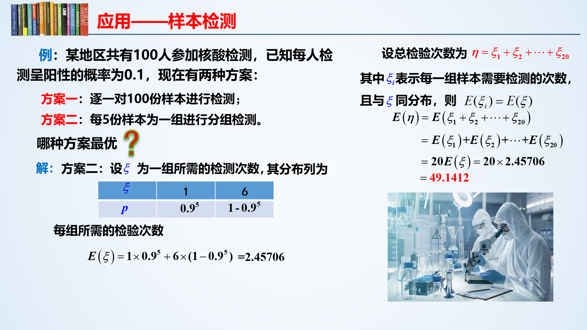

> 一维随机变量的分布、概率密度、数学期望以及方差
>

## 概述

### 二维随机变量

维数即概率影响因素数量，参与概率组成的因素也叫做变量，自然，二维随机变量即为变量数为2的概率分布

若二维随机变量的所有可能取值只有有限对或可列对（即情况有限且不连续），则称其为二维离散型随机变量

- 就是一个二维表，但变量的取值不限

| X\Y      | `y1`  | `y2`  | ...  | `yn`  | ...  |
| -------- | ----- | ----- | ---- | ----- | ---- |
| **`x1`** | `p11` | `p12` |      | `p1n` |      |
| **`x2`** | `p21` | `p22` |      | `p2n` |      |
| **...**  |       |       |      |       |      |
| **`xn`** | `pn1` | `pn2` |      | `pnn` |      |
| **...**  |       |       |      |       |      |

性质：

- `0 <= p <= 1`
- 整张表的概率和为1

### 联合分布列和边际分布列

联合分布列，就是联合概率分布表

边际分布列，就是单个变量的概率分布表，塌陷二维分布中其中一个变量便可以得到另一变量的边际分布

| X    | `x1`  | `x2`  | ...  | `xn`  | ...  |
| ---- | ----- | ----- | ---- | ----- | ---- |
| P    | `P1*` | `P2*` |      | `Pn*` |      |

| Y    | `y1`  | `y2`  | ...  | `yn` | ...  |
| ---- | ----- | ----- | ---- | ---- | ---- |
| P    | `P*1` | `P*2` |      | P*n  |      |

### 离散随机变量的独立

事件独立：有事件`a,b`，若`P(a,b) = P(a)xP(b)`，则事件`a,b`相互独立

二维随机变量的独立：对于二维随机变量的联合分布表，每个概率`Pij`都为两个变量相应的边际分布概率相乘，如`P12 = P1* x P*2`，那么我们说这两个随机变量是相互独立的

## 随机变量函数的分布

### 随机变量的函数

随机变量函数：一个二元函数，自变量、因变量均为随机变量，函数映射的是他们的值，而不是概率

- 概率由自变量传递给因变量
- 相同值的概率是可以合并的

举个栗子：

实际上就是一个正常的二元函数，只不过每个取值有一个附加概率

### 二维离离散随机变量函数

对于二维随机变量分布

| X\Y   | 0    | 1    |
| ----- | ---- | ---- |
| **1** | 0.2  | 0.3  |
| **2** | 0.4  | 0.1  |

现在有这样一个函数：`f = X+Y`

那么这个函数`f`有相对应的概率分布表（一维）

| f     | 1    | 2    | 3    |
| ----- | ---- | ---- | ---- |
| **P** | 0.2  | 0.7  | 0.1  |

解释如下：

- 当`f = X+Y = 1+0 = 1`时，概率为0.2
- 当`f = X+Y = 2`时，有两种可能，一为`Y=1,X=1`，二为`Y=0,X=2`，所以`P(f=2)`为二者概率相加，即`0.3+0.4=0.7`
- 当`f = X+Y = 2+1 = 3`时，概率为0.1

## 数学期望

### 期望

数学期望：
$$
E=\sum_{i=0}^n P(i)Value(i)
$$

- `P(i)`为概率
- `V(i)`为值
- 数学期望即所有值乘以其发生概率之和

统计意义：反映了随机变量所有取值的中心位置

性质：

- 对于常数`c`，`E(c) = c`，因为默认常数概率为1

  | X     | c    |
  | ----- | ---- |
  | **P** | 1    |

- 对于随机变量`X`，`E(cX) = cE(X)`，其中`c`又为常数

- 对于随机变量函数`f`，在得到概率分布表后按照同一步骤（即值、概率相乘求和）求出数学期望

例题：

- 抓住代价：在这里是检测数量，方案一固定为100次，方案二不固定，五人一检，阳性则每人依次检测，阴性则略过
- 明确取值：在方案二中，每组检测次数取值可能为1或6，根据题目已给条件求出各自概率，再按比例扩大范围
- 这里有一个分组的问题，一开始没想到

### 二项分布和0-1分布

在n次独立重复的伯努利试验中，设每次试验中事件A发生的概率为p。用X表示n重伯努利试验中事件A发生的次数，则X的可能取值为`0，1，…，n`，且对每一个k（`0≤k≤n`）,事件`{X=k}`即为`n次试验中事件A恰好发生k次`，随机变量X的离散概率分布即为二项分布（Binomial Distribution）

- 实际上就是说抛硬币`n`次，花面次数`X`的概率分布（花面概率`p`始终为0.5）

用符号`b`表示二项分布

`X ~ b(n,p)`表示进行次数为`n`，每次独立事件发生概率均为`p`的二项分布`X`，其数学期望为`np`

当`n=1`时，即只进行一次实验，发生次数要么1次要么0次，即为**0-1分布**，其数学期望为`p(n=1)`

### 泊松分布

 泊松分布的概率函数：
$$
P(x=k)=\frac{\lambda ^k}{k!}e^{-\lambda}
$$

- `λ`为单位时间(或单位面积)内随机事件的平均发生次数，是泊松分布的唯一参数
- 泊松分布适合于描述单位时间内随机事件发生的次数
- 泊松分布的数学期望和方差均为`λ`

`X = P(λ)`表示参数为`λ`的泊松分布`X`，其数学期望：`E(X) = λ`

### 几何分布

几何分布（Geometric distribution）是离散型概率分布。其中一种定义为：在`n`次伯努利试验中，试验`k`次才得到第一次成功的机率。详细地说，是：前`k-1`次皆失败，第k次成功的概率

- 简单来说，就是抛硬币第`i`次首次抛到花面的概率分布

几何分布表示为：`X ~ Ge(p)`

- 其中`p`为每次独立实验事件发生的概率

其数学期望为`E(X) = 1/p`

### 随机变量函数的数学期望

#### 一维

如已知

| X     | -2   | 0    | 1    | 3    |
| ----- | ---- | ---- | ---- | ---- |
| **P** | 1/3  | 1/2  | 1/12 | 1/12 |

$$
\begin{aligned}
E(2X^2+5)&=((-2)^2\times2+5)\times\frac{1}{3}+(0+5)\times\frac{1}{2}+(1\times2+5)\times\frac{1}{12}+(3^2\times2+5)\times\frac{1}{12}\\\\
&=\frac{13}{3}+\frac{5}{2}+\frac{7}{12}+\frac{23}{12}=\frac{28}{3}
\end{aligned}
$$

#### 二维

已知

| X\Y   | 0       | 1      |
| ----- | ------- | ------ |
| **0** | (1-p)^2 | p(1-p) |
| **1** | p(1-p)  | p^2    |

求`E(X+Y)`

将`f(X+Y)`的概率分布表列出，用一维的办法解即可

| f     | 0       | 1       | 2    |
| ----- | ------- | ------- | ---- |
| **P** | (1-p)^2 | 2p(1-p) | p^2  |

## 方差

### 方差和标准差

方差：差距的平方的期望

- 方差开根即为标准差

- 先求出一维概率分布的数学期望，用`(xi-期望)的平方`作为新的值，`xi`的概率作为这个值的概率，组成一个新的一维概率分布

  这个新概率分布的数学期望即为原概率的方差，记为`D(X)`

方差体现了随机变量围绕期望的偏离程度，方差越小，说明分布越集中，越大说明分布越分散

- 常用于判断产品优劣

性质：

- 常数的方差为0，即`D(c) = 0`，毫不偏差（常数拥有概率为1，偏差为0的特点）
- `D(cX) = c²D(X)`，常数开出来要平方
- `D(X+Y) = D(X)+D(Y)`，和变量的方差等于变量的方差和，前提是变量`X,Y`相互独立

### 常见概率分布的方差

| 分布     | 参数          | 数学期望 | 方差       |
| -------- | ------------- | -------- | ---------- |
| 两点分布 | `0<p<1`       | `p`      | `p(1-p)`   |
| 二项分布 | `n>=1, 0<p<1` | `np`     | `np(1-p)`  |
| 泊松分布 | `λ>0`         | `λ`      | `λ`        |
| 几何分布 | `0<p<1`       | `1/p`    | `(1-p)/p²` |

