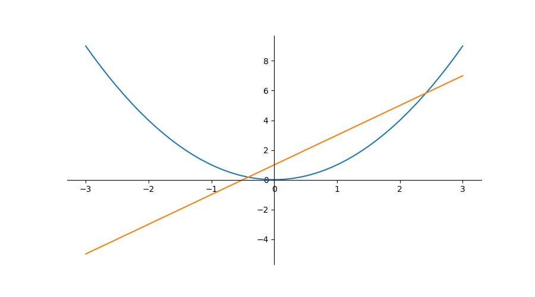
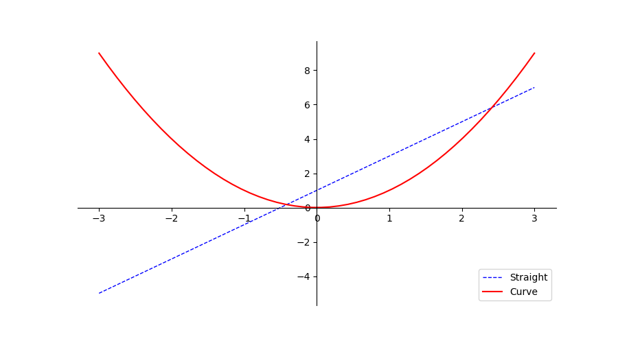
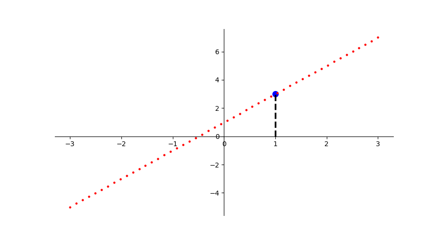

> 数据可视化

## Matplotlib

### Figure 画布

~~~python
import matplotlib.pyplot as plt
import numpy as np

x = np.linspace(-3,3,50)
y1 = 2*x+1
y2 = x**2
# 设置图片名称figure3，大小为(8,5)
# 要先设置画布，才能plot(布局)
plt.figure(num=4, figsize=(8, 5))
# 设置曲线颜色、宽度、线段类型（虚线，默认实线）
plt.plot(x, y1, color='red', linewidth=1.0, linestyle='--')
plt.plot(x, y2)
# 展示图片
plt.show()
~~~

- `np.linspace`从`start`和`end`之间均分为`n`个元素组成一个向量
- 先设置画布`figure`，再布局`plot`，最后展示`show`

### Spines 坐标轴

~~~python
plt.figure(num=6, figsize=(8,5))
plt.plot(x, y2)
plt.plot(x, y1, color='blue', linewidth=1.5, linestyle='--')

plt.xlim(-1,2)
plt.ylim(-2,3)

plt.xlabel('price')
plt.ylabel('earn')

x_ticks = np.linspace(-1,2,5)
print(x_ticks)
plt.yticks(np.linspace(-2,3,5),
           ['very bad','bad','so so','good','very good'])
plt.xticks(x_ticks)
plt.show()
~~~

- `xlim/ylim`限制坐标范围
- `xlabel/ylabel`定义坐标意义
- `xticks/yticks`定义坐标轴刻度，两种重载，可以给某个坐标定义特殊含义，传入两个向量，第一个向量为坐标，第二个为其含义，一一对应

如上图，整个图的框架是四条线段，若想呈现以下效果，则只保留`x/y`轴，并设置原点

首先去掉`右,上`两条框架，即设置其颜色为`none`

~~~python
plt.figure(num=7, figsize=(9,5))
plt.plot(x, y2)
plt.plot(x, y1)

ax = plt.gca()
ax.spines['top'].set_color('none')
ax.spines['right'].set_color('none')
~~~

- `gca`即`get current axis`，获取当前轴
- 改变轴信息修改`ax`属性即可
- `spines`即为包含四条骨架的数组

设置`x/y`轴

~~~python
ax.xaxis.set_ticks_position('bottom')
ax.yaxis.set_ticks_position('left')
~~~

- 即将`下`骨架作为`x`轴，`左`骨架作为`y`轴

设置原点并展示

~~~python
ax.spines['bottom'].set_position(('data',0))
ax.spines['left'].set_position(('data',0))
plt.show()
~~~

- 这里的`data`是固定的，即表示数据值为`0`的点作为`bottom(x轴)`零点

### Legend 图例

通过`legend`函数给曲线添加图例，用`l1 ,= plt.plot()`的方式获取曲线编号

~~~python
plt.figure(num=7, figsize=(9,5))
ax = plt.gca()
ax.spines['top'].set_color('none')
ax.spines['right'].set_color('none')
ax.xaxis.set_ticks_position('bottom')
ax.yaxis.set_ticks_position('left')
ax.spines['bottom'].set_position(('data',0))
ax.spines['left'].set_position(('data',0))

# ,=表示取出可迭代对象中的唯一元素（即作用于只含有一个元素的迭代器）
l1 ,= plt.plot(x, y1, color='blue', linestyle='--', linewidth=1.0)
l2 ,= plt.plot(x, y2, color='red')
plt.legend(handles=[l1, l2], loc='lower right', labels=['Straight', 'Curve'])

plt.show()
~~~

- `handles=[]`用以绑定曲线编号，编号由`plt.plot()`函数返回，用`,=`的形式进行取值（取出迭代器中的唯一元素）

- `loc=''`设置图例位置，有以下位置选择

  ~~~bash
  best
  upper right
  upper left
  lower left
  lower right
  right
  center left
  center right
  lower center
  upper center
  center
  ~~~

- `labels=[]`用以绑定`handles`向量中的值，按顺序赋值

- 右下角即为图例

### Annoloctation 标注

~~~python
# 设置画布和坐标轴
plt.figure(num=8, figsize=(9,5))
ax = plt.gca()
ax.spines['top'].set_color('none')
ax.spines['right'].set_color('none')
ax.xaxis.set_ticks_position('bottom')
ax.yaxis.set_ticks_position('left')
ax.spines['bottom'].set_position(('data',0))
ax.spines['left'].set_position(('data',0))

# 直线
x = np.linspace(-3,3,50)
y1 = 2*x+1
y2 = x**2
# 点
x0 = 1
y0 = 2*x0+1
# 绘制散点图，若为单个点，即为描点
plt.scatter(x0,y0,s=40,color='b')
plt.scatter(x, y1, s=5, color='r')
# 绘制虚线，连接两点(x0,0)和(x0,y0)，一条垂直于x轴的线段
plt.plot([x0,x0],[0,y0], ls='--',lw=2.5, c='r')
plt.show()
~~~

- `s`设置点的大小
- `lw`即为`linewidth`
- `c`即为`color`，`b`为`blue`简写，`r`为`red`简写

添加注释和文字

~~~python
x = np.linspace(-3,3,50)
y1 = 2*x+1
x0 = 1
y0 = 2*x0+1
# 描点
plt.scatter(x0,y0, s=70, color='b')
# 画线
plt.plot(x, y1)
# 画虚线，标注点
plt.plot([x0,x0],[0,y0], ls='--',lw=2.5, c='black')
# 对点(x0,y0)添加注释
plt.annotate(r'$2x+1=%s$'%y0,xy=(x0,y0),xycoords='data',xytext=(+30,-30),textcoords='offset points',fontsize=16,arrowprops=dict(arrowstyle='->',connectionstyle='arc3,rad=.2'))
# 在`data`值为(-3,3)处添加文字
plt.text(-3,3,'wdnmd',fontdict={'size':'16', 'color':'black'})
plt.show()
~~~

- `annotate`第一个参数为注释内容（字符串）；`xy=()`为标注点的坐标；`xycoords`设置坐标的含义，如此处为数据值`data`的坐标；`fontsize`设置字体大小，接收浮点型数据 ；`arrowprops`接收一个字典，设置箭头的样式，连接方式
- `text`函数添加文字，第一、二个参数为文字坐标（左下角坐标）；第三个参数为文字内容（字符串）；`fontdict`接收一个字典，用于设置字的样式、大小等

### Tick 能见度

调整被曲线遮挡的坐标`lebal`的可见度和颜色

~~~python
x = np.linspace(-3,3,50)
y = 0.1*x

# 设置画布、坐标、绘图
plt.figure()
# 设置y轴上下限
plt.ylim(-2,2)
ax = plt.gca() # 获取骨架
# 删去上、右骨架
ax.spines['right'].set_color('none')
ax.spines['top'].set_color('none')
# 设置坐标轴
ax.xaxis.set_ticks_position('bottom')
ax.yaxis.set_ticks_position('left')
# 设置原点
ax.spines['bottom'].set_position(('data',0))
ax.spines['left'].set_position(('data',0))

plt.plot(x, y, lw=10, zorder=1)

# 对被遮挡的图像调节相关透明度，本例中设置 x轴 和 y轴 的刻度数字进行透明度设置
for label in ax.get_xticklabels()+ax.get_yticklabels():
    label.set_fontsize(12)
    '''
    其中label.set_fontsize(12)重新调节字体大小，bbox设置目的内容的透明度相关参，
    facecolor调节 box 前景色，edgecolor 设置边框， 本处设置边框为无，alpha设置透明度.
    '''
    # 其中label.set_fontsize(12)重新调节字体大小，bbox设置目的内容的透明度相关参，
#     facecolor调节 box 前景色，edgecolor 设置边框， 本处设置边框为无，alpha设置透明度.
    label.set_bbox(dict(facecolor='white',edgecolor='none',alpha=0.7))

plt.show()
~~~

调整前

调整后

## Seaborn

