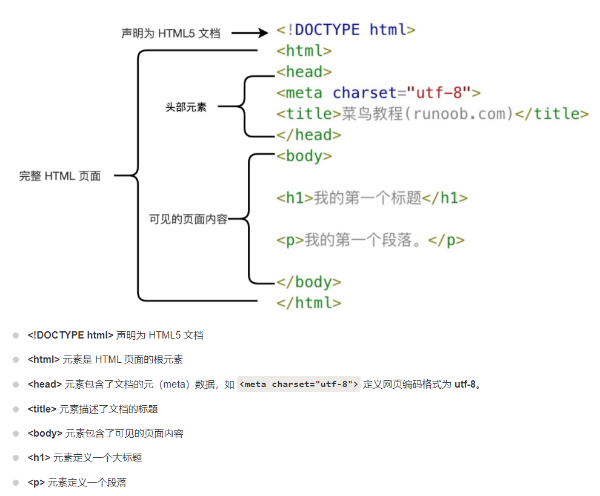
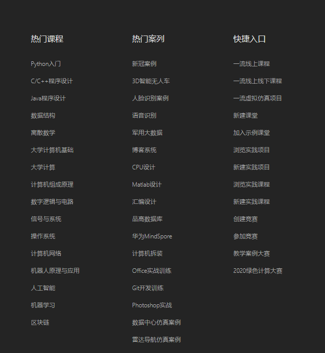
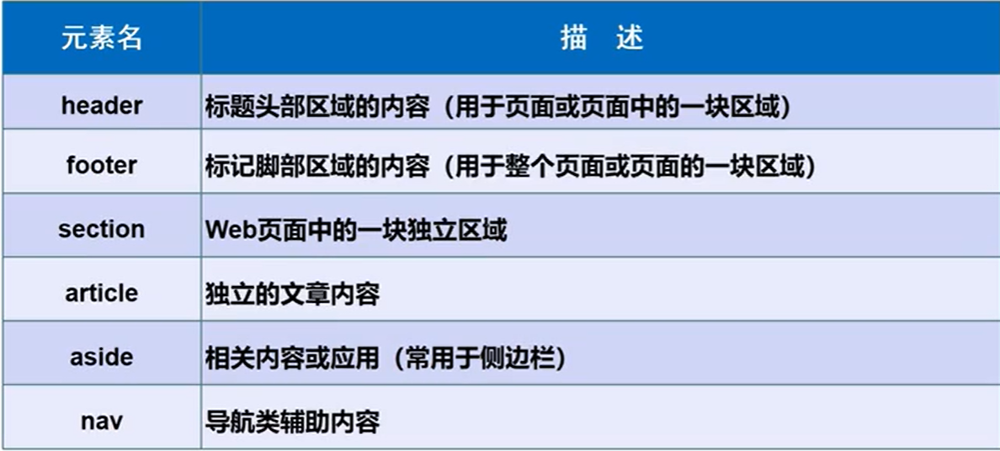

> Hyper Text Markup Language（超文本标记语言）
>
> 所见即所得

## 概述

### 初识HTML

#### 发展历史

HTML2.0（1995）——> HTML5（2013）

优势：主流浏览器厂商都支持HTML5，逐渐成为标准

W3C标准（World Wide Web Consortium：万维网联盟）：

1、结构化标准语言（HTML、XML）

2、表现标准语言（CSS）

3、行为标准（DOM、ECMAScript）

#### IDEA集成开发

设置浏览器：File——> Setting: 搜索web ——> tools——> web browsers

#### HTML概述

**HTML网页结构**：非编程语言，而是标记语言（markdown）



只有body部分才会在浏览器中显示

**HTML标签（HTML tag）**：

1、由尖括号包围的关键词

2、成对出现

3、分为开始标签和结束标签，分别被称为开放标签和闭合标签


**HTML元素**：

一个HTML元素包含了开始标签和结束标签，如

~~~html
<p>这是一个段落</p>
~~~

这便是一个元素


**声明**：

有助于浏览器正确显示网页，即声明HTML的版本

常见声明

HTML5：

~~~html
<!DOCTYPE html>
~~~

HTML 4.01

~~~html
<!DOCTYPE HTML PUBLIC "-//W3C//DTD HTML 4.01 Transitional//EN"
"http://www.w3.org/TR/html4/loose.dtd">
~~~

XHTML 1.0

~~~html
<!DOCTYPE html PUBLIC "-//W3C//DTD XHTML 1.0 Transitional//EN"
"http://www.w3.org/TR/xhtml1/DTD/xhtml1-transitional.dtd">
~~~


**中文编码**：

避免中文乱码，需要在头部将字符声明为UTF-8格式

~~~html
<!DOCTYPE html>
<html>
<head>
<meta charset="UTF-8">
<title>
页面标题</title>
</head>
<body>
 
<h1>我的第一个标题</h1>
 
<p>我的第一个段落。</p>
 
</body>
</html>
~~~

## 标签

### 基础标签

~~~html
<!DOCTYPE html>
<html lang="en">
<head>
    <meta charset="UTF-8">
    <title>基本标签</title>
</head>
<body>

<!--标题标签<h>-</h>-->
<h1>标题标签</h1>
<h2>二级标题</h2>
<h3>三级标题</h3>
<h4>四级标题</h4>
<h5>五级标题</h5>
<h6>六级标题</h6>

<!--段落标签<p>-</p>-->
<h1>段落标签</h1>
<p>两只老虎，两只老虎</p>
<p>跑得快，跑得快</p>
<!--换行标签<br/>-->
一直没有耳朵，一直没有眼睛 <br/>
真奇怪，真奇怪 <br/>

<!--水平线标签<hr/>-->
<h1>水平线标签</h1>
<hr/>

<!--字体样式标签：粗体<strong>-</strong>、斜体<em>-</em>-->
<h1>字体样式标签</h1>
粗体：<strong>I Love U</strong>
斜体：<em>I Love U</em> <br/>


<!--特殊符号标签-->
空&nbsp;&nbsp;&nbsp;&nbsp;&nbsp;&nbsp;&nbsp;&nbsp;格
<br/>
大于号：&gt;
<br/>
小于号：&lt;
<br/><br/>
&copy;版权所有NorthBoat

</body>
</html>
~~~

### 图像标签

~~~html
<!DOCTYPE html>
<html lang="en">
<head>
    <meta charset="UTF-8">
    <title>图像标签</title>
</head>
<body>
<!--
img标签
sec：图标地址——>相对地址，绝对地址
     ../    --上一级目录


-->
<br/>
<a href="超链接标签.html#top">通过锚链接跳转超链接标签.html的顶部</a><br/>
<a href="超链接标签.html#down">通过锚链接跳转超链接标签.html的底部</a>


</body>
</html>
~~~

### 超链接标签

简单链接

~~~html
<a href="https://www.baidu.com">这是一个链接</a>
~~~

```
<a>-</a>标签：超链接
href：必填，表示要跳转到哪个页面
target：表示窗口在哪里打开
        target="_blank"表示在新标签页中打开链接网页
        target="_self"表示在当前网页打开

注意：链接名称处可嵌套图片标签、段落标签、标题标签
```

锚链接和邮件链接

~~~html
<!DOCTYPE html>
<html lang="en">
<head>
    <meta charset="UTF-8">
    <title>超链接标签</title>
</head>
<body>

<!--
<a>-</a>标签：超链接
href：必填，表示要跳转到哪个页面
注意：链接名称处可嵌套图片标签
target：表示窗口在哪里打开
        target="_blank"表示在新标签页中打开链接网页
        target="_self"表示在当前网页打开
-->
<p>
    <a name="top"></a>
    <a href="https://www.baidu.com"><h4>点击跳转至百度</h4></a><br/>
    <a href="http://localhost:7777/Blog" target="_blank"></a><br/>
</p>

<p>
    <a href="https://www.baidu.com"><h4>点击跳转至百度</h4></a><br/>
    <a href="http://localhost:7777/Blog" target="_blank"></a><br/>
    <a name="down"></a>
</p>

<!--锚链接
1、需要一个锚
2、跳转到标记

甚至可以在其他html文件中跳到该锚处
-->
<a href="#top"><h2>回到顶部</h2></a>


<!--功能性链接
1、邮件链接：mailto
-->

<a href="mailto:1543625674@qq.com"><h2>加我，给你发小电影</h2></a>

</body>
</html>
~~~

### 块元素和行内元素

块元素：如段落标签、标题标签，独占一块

行内元素：如上述的粗体斜体，只要未添加换行标签，则始终存在于同一行，我们称之为行内元素（一行以内的元素）

### 列表标签

一种信息资源的展示形式

~~~html
<!DOCTYPE html>
<html lang="en">
<head>
    <meta charset="UTF-8">
    <title>列表标签</title>
</head>
<body>

<!--有序列表（order list）
    应用范围：试卷、问答...
-->
<ol>
    <li>java</li>
    <li>python</li>
    <li>运维</li>
    <li>前端</li>
    <li>c/c++</li>
</ol>

<!--无序列表（un order list）
    应用范围：导航、侧边栏...
-->
<ul>
    <li>java</li>
    <li>python</li>
    <li>运维</li>
    <li>前端</li>
    <li>c/c++</li>
</ul>


<!--定义列表
    dl：标签
    dt：列表名称
    dd：列表内容
-->
<dl>
    <dt>学科</dt>

    <dd>java</dd>
    <dd>python</dd>
    <dd>linux</dd>
    <dd>C</dd>

    <dt>位置</dt>
    <dd>湖南</dd>
    <dd>东北</dd>
    <dd>广东</dd>
</dl>


</body>
</html>
~~~

自定义列表常用于：



### 表格标签

why table：简单同意，结构稳定

基本结构：单元格、行、列、跨行、跨列


~~~html
<!DOCTYPE html>
<html lang="en">
<head>
    <meta charset="UTF-8">
    <title>表格标签</title>
</head>
<body>

<!--表格table
行   tr
列   td
border：规定分隔线宽度
-->
<table border="1px">
    <tr>
        <!--colspan：跨列-->
        <td colspan="3">&nbsp;NorthBoat</td>
    </tr>
    <tr>
        <!--colspan：跨行-->
        <td rowspan="2">java<br/>docker</td>
        <td>linux</td>
        <td>spring</td>
    </tr>
    <tr>
        <td>vue</td>
        <td>sql</td>
    </tr>
</table>
</body>
</html>
~~~

### 媒体元素

视频元素（video）和音频元素（audio）

~~~html
<!DOCTYPE html>
<html lang="en">
<head>
    <meta charset="UTF-8">
    <title>媒体元素</title>
</head>
<body>

<!--音频和视频
src：资源路径
controls：控制器（进度条、播放暂停）
autoplay：打开网页自动开始播放
-->
<audio src="../../resources/audio/K歌之王.mp3" controls></audio>

<video src="../../resources/video/球球.mp4" controls></video>

</body>
</html>
~~~

## 页面结构&内联标签&表单

### 页面结构分析

与vuepress博客类似



样例：

~~~html
<!DOCTYPE html>
<html lang="en">
<head>
    <meta charset="UTF-8">
    <title>页面结构分析</title>
</head>
<body>
<header><h2>网页头部</h2></header>

<section><h2>网页主体</h2></section>

<article><h2>文章章</h2></article>

<footer><h2>网页脚部</h2></footer>
</body>
</html>
~~~

### iframe内联标签

在网页嵌套另一个网页

~~~html
<!DOCTYPE html>
<html lang="en">
<head>
    <meta charset="UTF-8">
    <title>iframe内联框架</title>
</head>
<body>
<!--iframe：inner frame
    在网页中嵌套另一个网页
    src：地址
    w/h：宽度和高度
    name：
-->
<iframe src="http://www.baidu.com" frameborder="0" width="1000" height="800">nmsl</iframe>

<a href="基本标签.html">点击跳转</a>

</body>
</html>
~~~

### 表单

#### 基本元素

~~~html
<!DOCTYPE html>
<html lang="en">
<head>
    <meta charset="UTF-8">
    <title>初识表单</title>
</head>
<body>


<h1>注册</h1>

<!--表单：form
    action：表单提交的位置，可以是网站，也可以是一个请求处理地址
    method：post，get 提交方式
        get方式提交：我们可以在目标网页的url中看到我们提交的信息——>不安全，但高效
        post方式提交：比较安全，可以传输大文件，在网页网络中可以查看
-->
<form action="基本标签.html" method="get">
    <!--文本输入框-->
    <p>名字：<input type="text" name="username"></p>
    <!--密码框-->
    <p>密码：<input type="password" name="pwd"></p>

    <p>
        <input type="submit">
        <input type="reset">
    </p>
    
</form>

</body>
</html>
~~~

post传输方式：


get传输方式：


#### 文本框和单选框

表单单元格（input）元素：


文本框和单选框：

~~~html
<form action="基本标签.html" method="post">
    <!--文本输入框input type="text"
        value：默认初始值
        maxlength：最长能写几个字符
        size：文本框的长度
    -->
    <p>名字：<input type="text" name="username" value="啊哈" maxlength="8" size="70"/></p>

    <!--单选框
        用name限定组，实现单选
        value：单选框的值
        name：表示组
    -->
    <p>
        <input type="radio" value="boy" name="gender"/>男
        <input type="radio" value="girl" name="gender"/>女
    </p>
    
    
    <p>
        <input type="submit"/>
        <input type="reset"/>
    </p>
    
</form>
~~~

#### 按钮和多选框

~~~html
<form>   
	<!--多选框：checkbox
        类似于单选框，规定值和组，以及解释
    -->
    <p>爱好：
        <input type="checkbox" value="sleep" name="hobby"/>睡觉
        <input type="checkbox" value="coding" name="hobby"/>敲代码
        <input type="checkbox" value="game" name="hobby"/>游戏
        <input type="checkbox" value="girl" name="hobby"/>女孩
    </p>

    <!--普通按钮：button
        图片按钮：image
        特殊按钮：submit/reset
    -->
    <p>按钮：
        <input type="button" name="btn1" value="点击变长"/><br>
        <input type="image" src="../../resources/img/新疆粉粉云.jpg" height="300" width="700"/>
    </p>

    <p>
        <input type="submit"/>
        <input type="reset" value="清空表单"/>
    </p>
</form>
~~~

#### 列表框、文本框、文件域

列表框：

~~~html
<!--下拉框、列表框
	select：创建列表
	option：列表选项
	select
-->
<p>国家：
        <select name="国家">
            <option value="CHINA" selected>中国</option>
            <option value="US">美国</option>
            <option value="UK">英国</option>
        </select>
    </p>
~~~

文本域：

```html
<!--文本域（多行文本）
    textarea
    name：提交属性名字
    cols：列数
    rows：行数
-->
<p>反馈：
    <textarea name="textarea" cols="30" rows="10"></textarea>
</p>
```

文件域：

~~~html
	<!--文件域-->
    <p>上传文件
        <input type="file" name="file"/>
        <input type="button" name="btn2" value="upload"/>
    </p>
~~~

#### 搜索框、滑块、简单验证

~~~html
<form>
	<!--邮件验证
        只是验证输入文本中@后有无内容
    -->
    <p>邮箱：
        <input type="email" name="NorthBoat"/>
    </p>

    <!--url-->
    <p>UTL：
        <input type="url" name="url"/>
    </p>

    <!--数字-->
    <p>
        <input type="number" name="num" min="0" max="95" step="7"/>
    </p>

    <!--滑块-->
    <p>
        <input type="range" name="voice" min="0" max="100"/>
    </p>

    <!--搜索框-->
    <p>
        <input type="search" name="search/>
    </p>
	
                                   
</form>
                                   

~~~

#### 表单的应用

直接加在开始标签中

~~~html
<!--只读标签：readonly-->
<p>密码：<input type="password" name="pwd" readonly value="123456"/></p>

<!--禁用标签：disable-->
<p>
        <input type="submit" disabled/>
        <input type="reset" value="清空表单"/>
</p>

<!--隐藏：hidden（但属性仍然存在，可以提交 ）-->
<p>按钮：
        <input type="button" name="btn1" value="点击变长" hidden/><br/>
        <input type="image" src="../../resources/img/新疆粉粉云.jpg" height="300" width="700"/>
</p>
~~~

#### 表单初级验证

减少服务器压力，在前端进行一层验证

1、placeholder
2、required
3、pattern

~~~html
<!--文本输入框input type="text"
      placeholder：提示用户输入
      required：非空判断（为空不能提交）
      pattern：基础判断，如pattern="[A-z]{3}"表示输入值只能为字母并且长度为3，非法输入将无法提交
  -->
    <p>名字：<input type="text" name="username" maxlength="8" size="70" placeholder="请输入用户名" required pattern="[A-z]{3}"/></p>
~~~

## CSS和JS

### CSS

CSS 可以通过以下方式添加到HTML中:

- 内联样式：在HTML元素中使用"style" **属性**

  ~~~html
  <head>
  	<style>
  	
  	</style>
  </head>
  ~~~

  

- 内部样式表：在HTML文档头部 ’head‘ 区域使用 'style' **元素** 来包含CSS

- 外部引用：使用外部 CSS **文件**

  ~~~html
  <link rel="stylesheet" href="路径">
  ~~~


最好的方式是通过外部引用CSS文件.

内联CSS样式：

```html
<!--用<style>进行引用：定义文本样式-->
<p style="color:blue;margin-left:20px;">这是一个段落。</p>
<!--link：定义资源引用地址-->
<p style="background-color:black" link="https://localhost:7777/">这是另一个段落</p>	
```

背景颜色：

~~~html
<body style="background-color:yellow;"> <h2 style="background-color:red;">这是一个标题</h2> <p style="background-color:green;">这是一个段落。</p> </body>
~~~

字体样式、颜色、大小：

~~~html
<h1 style="font-family:verdana;">一个标题</h1>
<p style="font-family:arial;color:red;font-size:20px;">一个段落。</p>
~~~

文本对齐方式：

~~~html
<h1 style="text-align:center;">居中对齐的标题</h1>
<p>这是一个段落。</p>
~~~

### JavaScript

用 ‘script’ 标签定义客户端脚本

