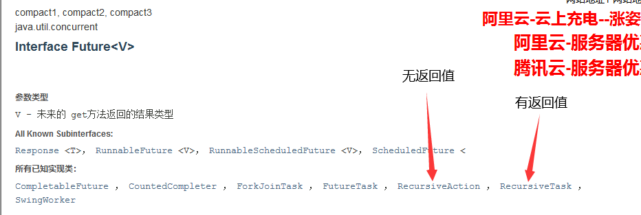

## 函数式接口和流式计算

### 四大函数式接口

新时代的程序员：lambda表达式、链式编程、函数式接口、Stream流式计算

> 函数式接口：只有一个方法的接口 ——> Runnable / Callable

~~~java
@FunctionalInterface
public interface Runnable {
    public abstract void run();
}

//新版java中有很多很多FunctionalInterface
//简化编程模型，再新版本的框架底层大量应用
//forEach(消费者类的函数式接口)
~~~

#### Function函数型接口

~~~java
@FunctionalInterface
public interface Function<T, R> {

    /**
     * Applies this function to the given argument.
     *
     * @param t the function argument
     * @return the function result
     */
    R apply(T t);
}
~~~

有一个传入参数，有一个返回值（均为泛型，默认Object），仅含一个方法：apply (Object o, Object b)

~~~java
import java.util.function.Function;

public class FunctionTest {
    public static void main(String[] args) {
        /**用匿名内部类重写apply函数
         * Function<String, String> f = new Function<String, String>() {
         *         @Override
         *         public String apply(String str) {
         *             return str;
         *         }
         *     };
        */
        //用lambda表达式简化
        Function<String, String> function = (str)->{return str;};
        System.out.println(function.apply("daslkfj"));
    }
}
~~~

#### Predicate断定型接口

~~~java
@FunctionalInterface
public interface Predicate<T> {

    /**
     * Evaluates this predicate on the given argument.
     *
     * @param t the input argument
     * @return {@code true} if the input argument matches the predicate,
     * otherwise {@code false}
     */
    boolean test(T t);
}
~~~

传入一个参数（默认Object），返回一个布尔值，所含方法为 test

~~~java
import java.util.function.Predicate;

public class PredicateTest {
    public static void main(String[] args) {
        /**
         * Predicate p = new Predicate() {
         *     @Override
         *     public boolean test(Object o) {
         *         return o.toString().isEmpty();
         *     }
         * };
         */
        
        Predicate<String> predicate = (str)->{return str.isEmpty();};
        System.out.println(predicate.test("alksd"));
    }
}
~~~

#### Consumer消费型接口

~~~java
@FunctionalInterface
public interface Consumer<T> {

    /**
     * Performs this operation on the given argument.
     *
     * @param t the input argument
     */
    void accept(T t);
}
~~~

消费者只有输入，没有返回值（消费）

~~~java
import java.util.function.Consumer;

public class ConsumerTest {
    public static void main(String[] args) {
        Consumer<String> consumer = (str) -> {System.out.println(str);};
        consumer.accept("daskfj");
    }
}
~~~

#### Supplier供给型接口

~~~java
@FunctionalInterface
public interface Supplier<T> {

    /**
     * Gets a result.
     *
     * @return a result
     */
    T get();
}
~~~

供给者没有输入，只有返回值（供给）

~~~java
import java.util.concurrent.*;
import java.util.function.Supplier;

public class SupplierTest {
    public static void main(String[] args) {
        Supplier<String> supplier = ()->{return Thread.currentThread().getName();};
        ExecutorService executorService = new ThreadPoolExecutor(
                3,
                12,
                5,
                TimeUnit.SECONDS,
                new ArrayBlockingQueue(9),
                Executors.defaultThreadFactory(),
                new ThreadPoolExecutor.AbortPolicy()
        );
        for (int i = 0; i < 12; i++) {
            executorService.execute(()->{
                System.out.println(supplier.get());
            });
        }
        executorService.shutdown();
    }
}
~~~

### Stream流式计算

> 什么是Stream流式计算

> 大数据：存储+计算
>
> 存储：集合框架、MySQL（本质就是存储东西的）
>
> 计算：流（计算都交给流来操作）

- 已知有Person类，用一行代码完成下列筛选操作
  * 1、ID为偶数
  * 2、年龄大于等于23
  * 3、名字转换为大写字母
  * 4、倒序输出
  * 5、只输出一个用户

Person类：

~~~java
public class Person {
    private int id;
    private String name;
    private int age;

    public Person(int id, String name, int age) {
        this.id = id;
        this.name = name;
        this.age = age;
    }

    public int getId() {
        return id;
    }

    public String getName() {
        return name;
    }

    public int getAge() {
        return age;
    }
}
~~~

lambda表达式+链式编程+函数式接口+stream计算：

~~~java
public class StreamTest {
    public static void main(String[] args) {
        Person p1 = new Person(1, "a", 23);
        Person p2 = new Person(2, "b", 27);
        Person p3 = new Person(3, "c", 17);
        Person p4 = new Person(4, "d", 41);
        Person p5 = new Person(5, "e", 25);

        List<Person> list = Arrays.asList(p1, p2, p3, p4, p5);
        list.stream()
                .filter((u)-> {return u.getAge()>=23;})
                .filter((u)-> {return u.getId()%2==0;})
                .map((u)-> {return u.getName().toUpperCase();})
                .sorted((u1, u2)->{return u2.compareTo(u1);})
                .limit(1)
                .forEach((u)->{System.out.println(u);});
    }
}
~~~

## 异步回调

### ForkJoin

> 什么是ForkJoin？分支 合并

再jdk1.7中出现，并发执行任务，在大数据量时提高效率

大数据：Map Reduce（把大任务拆分为小任务，再把小任务结果合并 ——> 递归）

ForkJoin特点：工作窃取

维护的都是双端队列，当 B 线程结束后而 A 线程未结束，B 将窃取 A 的工作，从后向前执行

具体实现：

1、将运算类继承 RecursiveAction 或 RecursiveTask，重写 computer 方法（注意泛型：此处泛型类型规定了 compute 方法的返回值）

~~~java
import java.util.concurrent.RecursiveTask;

public class ForkJoinTest extends RecursiveTask<Long> {

    private long start;
    private long end;

    private long temp = 10000L;

    public ForkJoinTest(long start, long end) {
        this.start = start;
        this.end = end;
    }
	
    //重写computer
    @Override
    protected Long compute() {
        if(end-start<temp){
            long sum = 0L;
            for (long i = start; i <= end; i++) {
                sum += i;
            }
            return sum;
        }else{
            long middle = (start+end)/2;
            ForkJoinTest task1 = new ForkJoinTest(start, middle);
            task1.fork();
            ForkJoinTest task2 = new ForkJoinTest(middle+1, end);
            task2.fork();
            return task1.join()+task2.join();
        }
    }
}
~~~

2、开辟一个 ForkJoinPool，用池中的 submit 方法或 execute 方法执行 Task

~~~java
public void test2() throws ExecutionException, InterruptedException {
        long start = System.currentTimeMillis();
    
    	//创建ForkJoin池
        ForkJoinPool pool = new ForkJoinPool();
    
    	//创建任务
        ForkJoinTask<Long> task = new ForkJoinTest(0, 10_0000_0000);
    
    	//此处 submit.get() 和 execute(task) 后的 task.get() 所得其实是一样的
    	//执行任务
        ForkJoinTask<Long> submit = pool.submit(task);
        pool.execute(task);
        submit.get();
        long end = System.currentTimeMillis();
    
    	//关闭池
        pool.shutdown();
    
    	//获取结果
        System.out.println("和:" + task.get() + " 时间:" + (end-start));
}
~~~

如此大大提高了运算效率，比用普通的 for 循环逐个加约快 130 倍

阅读源码还可知 ForkJoinPool.execute() 还可以执行 Runnable task，即实现了 Runnable 接口的任务，重写 run 方法，同理还可以扩展至 Callable 接口，通过 FutureTask 将 Callable 和 Runnable 连接，放在 execute 中执行

~~~java
public void execute(Runnable task) {
        if (task == null)
            throw new NullPointerException();
        ForkJoinTask<?> job;
        if (task instanceof ForkJoinTask<?>) // avoid re-wrap
            job = (ForkJoinTask<?>) task;
        else
            job = new ForkJoinTask.RunnableExecuteAction(task);
        externalPush(job);
}
~~~

流式求和：

~~~java
public void test3(){
        long start = System.currentTimeMillis();
        long sum = LongStream.rangeClosed(0, 10_0000_0000).parallel().reduce(0, Long::sum);
        long end = System.currentTimeMillis();
        System.out.println("和:" + sum + " 时间:" + (end-start));
}
~~~

### 异步回调

> Future设计的初衷：对将来的某个事件的结果进行建模

异步和同步的区别，类似普通方法和同步方法的区别

继承关系：Future ——> **CompletableFuture**

~~~java
import java.util.concurrent.CompletableFuture;
import java.util.concurrent.ExecutionException;
import java.util.concurrent.Future;

public class Demo01 {
    public static void main(String[] args) throws ExecutionException, InterruptedException {

        //无返回值的异步回调：runAsync
        /*CompletableFuture<Void> completableFuture = CompletableFuture.runAsync(()->{
            System.out.println("异步回调");
        });
        System.out.println("111111111");
        completableFuture.get();*/

        //有返回值的异步回调：supplyAsync
        CompletableFuture<String> completableFuture = CompletableFuture.supplyAsync(()->{
            System.out.println("哈哈哈");
            //int i = 9/0;
            return "异步回调";
        });

        // t:当正确执行时返回返回值，报错时返回null
        // u:当错误时返回错误信息，正确时返回null
        //exceptionally(e):e为异常，注意需要在该函数接口中重新返回一个值代替错误执行的返回值
        System.out.println(completableFuture.whenComplete((t, u) -> {
            System.out.println("t:" + t);
            System.out.println("u:" + u);
        }).exceptionally((e) -> {
            System.out.println("Message:" + e.getMessage());
            return "错误了啊";
        }).get());
    }
}
~~~

为什么代码这么奇怪？supplyAsync 和 runAsync 是 CompletableFuture 的静态方法，返回一个 CompletableFuture 对象

常用方法：

| 方法          | supplyAsync                          | runAsync                           |
| ------------- | ------------------------------------ | ---------------------------------- |
| get           | 执行supplier并获取返回值             | 执行runnable                       |
| exceptionally | 捕捉异常并返回错误回调               | 捕捉异常并作出反应                 |
| whenComplete  | 返回（T, U），T为返回值，U为错误信息 | 返回（T, U），T为null，U为错误信息 |

- 注意 get / exceptionally / whenComplete 方法阻塞但异步，不影响其他线程

异步回调：

1、成功回调 

当 CompletableFuture 正常跑 runAsync 或 supplyAsync 后，成功返回结果，称作成功回调

2、错误回调

当跑 runAsync 或 supplyAsync 时发生错误，我们用 exceptionally 捕捉异常并作出反应，在 supplyAsync 中可返回错误回调

