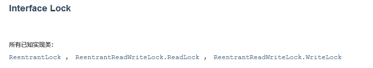

## 线程与进程

### 什么是JUC

jdk中三个包

- java.uti.concurrent
- java.util.concurrent.atomic（原子性）
- java.util.concurrent.locks（锁）
- java.util.funtion（函数）

Runnable：没有返回值，效率低于Callable（）

Lock：Reentrantlock、ReentrantReadWriteLock...

### 线程和进程

#### 线程和进程

- 进程：一个程序，程序的集合；一个进程往往包含多个线程，至少一个，Java默认有两个线程（main、gc）
- 线程：如一个进程typora.exe，同时包含写字和自动保存的两个功能（线程）

问：Java真的能开启线程吗？

答：并不能，java无法直接操作硬件，而是用本地方法调用底层的c++实现线程开启

~~~java
public synchronized void start() {
        /**
         * This method is not invoked for the main method thread or "system"
         * group threads created/set up by the VM. Any new functionality added
         * to this method in the future may have to also be added to the VM.
         *
         * A zero status value corresponds to state "NEW".
         */
        if (threadStatus != 0)
            throw new IllegalThreadStateException();

        /* Notify the group that this thread is about to be started
         * so that it can be added to the group's list of threads
         * and the group's unstarted count can be decremented. */
        group.add(this);

        boolean started = false;
        try {
            start0();
            started = true;
        } finally {
            try {
                if (!started) {
                    group.threadStartFailed(this);
                }
            } catch (Throwable ignore) {
                /* do nothing. If start0 threw a Throwable then
                  it will be passed up the call stack */
            }
        }
    }
//native本地方法，调用的底层的C++，java无法直接操作硬件
private native void start0();
~~~

#### 并发和并行

并发编程：并发、并行

1. 并发（多线程操作同一个资源）
   - CPU一核，模拟出来多条线程，快速交替
2. 并行（真正的同时运行）
   - CPU多核，多个线程同时执行
   - 提高效率：线程池

~~~java
public class Test {
    public static void main(String[] args) {
        //获取CPU的核数
        //CPU密集型、IO密集型
        System.out.println(Runtime.getRuntime().availableProcessors());
    }
}
~~~

并发编程的本质：充分利用CPU的资源

#### 线程的六个状态

~~~java
public enum State {
        /**
         * new:线程新生
         * Thread state for a thread which has not yet started.
         */
        NEW,

        /**
         * runnable:运行
         * Thread state for a runnable thread.  A thread in the runnable
         * state is executing in the Java virtual machine but it may
         * be waiting for other resources from the operating system
         * such as processor.
         */
        RUNNABLE,

        /**
         * blocked:阻塞
         * Thread state for a thread blocked waiting for a monitor lock.
         * A thread in the blocked state is waiting for a monitor lock
         * to enter a synchronized block/method or
         * reenter a synchronized block/method after calling
         * {@link Object#wait() Object.wait}.
         */
        BLOCKED,

        /**
         * waiting:等待（一种阻塞），一直等待
         * Thread state for a waiting thread.
         * A thread is in the waiting state due to calling one of the
         * following methods:
         * <ul>
         *   <li>{@link Object#wait() Object.wait} with no timeout</li>
         *   <li>{@link #join() Thread.join} with no timeout</li>
         *   <li>{@link LockSupport#park() LockSupport.park}</li>
         * </ul>
         *
         * 
A thread in the waiting state is waiting for another thread to
         * perform a particular action.
         *
         * For example, a thread that has called <tt>Object.wait()</tt>
         * on an object is waiting for another thread to call
         * <tt>Object.notify()</tt> or <tt>Object.notifyAll()</tt> on
         * that object. A thread that has called <tt>Thread.join()</tt>
         * is waiting for a specified thread to terminate.
         */
        WAITING,

        /**
         * timed_waiting:超时等待，在一个时间内等待，超时就不等了
         * Thread state for a waiting thread with a specified waiting time.
         * A thread is in the timed waiting state due to calling one of
         * the following methods with a specified positive waiting time:
         * <ul>
         *   <li>{@link #sleep Thread.sleep}</li>
         *   <li>{@link Object#wait(long) Object.wait} with timeout</li>
         *   <li>{@link #join(long) Thread.join} with timeout</li>
         *   <li>{@link LockSupport#parkNanos LockSupport.parkNanos}</li>
         *   <li>{@link LockSupport#parkUntil LockSupport.parkUntil}</li>
         * </ul>
         */
        TIMED_WAITING,

        /**
         * terminated:终止
         * Thread state for a terminated thread.
         * The thread has completed execution.
         */
        TERMINATED;
}
~~~

#### wait和sleep的区别

1. 来自不同的类

   - wait ——> Object

   - sleep ——> Thread

     ~~~java
     import java.util.concurrent.TimeUnit;//JUC包
     
     public class Test {
         public static void main(String[] args) throws InterruptedException {
             TimeUnit.DAYS.sleep(1);
             TimeUnit.SECONDS.sleep(2);
         }
     }
     ~~~

     

2. 关于锁的释放

   - wait会释放锁
   - sleep睡着了，不会释放锁

3. 使用的范围不同

   - wait 必须在同步代码块中
   - sleep 可以在任何地方睡

4. 是否需要捕获异常（线程都会存在中断异常）

   - wait 不需要捕获异常
   - sleep 必须要捕获异常，会发生超时等待的情况

## 锁

### Lock锁

#### Synchronized锁

> OOP：Object Oriented Programming（面向对象程序设计，一种编程架构）
>
> 耦合性：降低耦合性，解耦

**java函数式编程（lambda(λ)表达式）**

用于接口的函数重写实现，等同于实现一个匿名内部类

~~~java
public class SaleTickets1 {
    public static void main(String[] args) {
        Tickets1 t = new Tickets1();
        new Thread(()->{
            for (int i = 0; i < 30; i++) {
                t.sale();
            }
        }, "A").start();

        new Thread(()->{
            for (int i = 0; i < 30; i++) {
                t.sale();
            }
        }, "B").start();

        new Thread(()->{
            for (int i = 0; i < 30; i++) {
                t.sale();
            }
        }, "C").start();
    }
}

class Tickets1{
    private int num = 25;

    public synchronized void sale(){
        if(num>0){
            System.out.println(Thread.currentThread().getName()+"售出第"+num--+"张票，剩余："+num);
        }
    }
}
~~~

#### Lock接口

三个实现类

- ReentrantLock
- ReentrantReadWriteLock.ReadLock
- ReentrantReadWriteLock.WriteLock

公平锁和非公平锁

- 公平锁：十分公平，必须先到先得
- 非公平锁：可以插队（默认构造）

~~~java
import java.util.concurrent.locks.Lock;
import java.util.concurrent.locks.ReentrantLock;

public class SaleTickets2 {
    public static void main(String[] args) {
        Tickets2 t = new Tickets2();
        //并发，多线程操作同一个资源类，把资源类丢入线程
        //lambda表达式
        new Thread(()->{for(int i = 0; i < 20; i++) t.sale();}, "A").start();
        new Thread(()->{for(int i = 0; i < 20; i++) t.sale();}, "B").start();
        new Thread(()->{for(int i = 0; i < 20; i++) t.sale();}, "C").start();
    }
}

class Tickets2 {
    private int num = 30;

    private Lock l = new ReentrantLock(true);

    // lock三部曲
    // new ReentrantLock
    // lock.lock() 加锁
    // finally => lock.unlock() 解锁
    public void sale(){
        l.lock();
        try{
            if(num>0){
                System.out.println(Thread.currentThread().getName()+"售出第"+num--+"票，剩余"+num);
            }
        }catch (Exception e){
            e.printStackTrace();
        }finally {
            l.unlock();
        }
    }
}
~~~

Synchronized和Lock的区别（自动挡和手动挡）

- Synchronized 是一个内置的java关键字，Lock 是一个java类
- Synchronized 无法判断获取锁的状态，Lock 可以判断是否获取到了锁
- Synchronized 会自动释放锁，Lock 必须要手动释放锁。否则会**死锁**
- Synchronized 线程1（获得锁、阻塞）、线程2（会一直等待），而Lock 不一定会一直等
- Synchronized 为可重入锁，不可以中断，非公平；Lock 为可重入锁，可以判断锁，默认非公平但可设置
- Synchronized 适合锁少量的代码同步问题，Lock 锁适合锁大量的同步代码（Lock锁的灵活度特别高）

> 可重入锁：可以多次获取同一个锁而不发生死锁的锁，如一个lock锁可以多次调用lock()函数而正常运行

锁是什么，如何判断锁的是谁？

### 生产者和消费者问题

#### 传统的生产消费关系

> 只要是并发编程必须要加锁

> 线程通信：判断等待 ——> 业务 ——> 通知
>
> 虚假唤醒：判断等待使用if判断，唤醒后线程会从wait之后的代码开始运行，但是不会重新判断if条件，直接继续运行if代码块之后的代码，而如果使用while的话，也会从wait之后的代码运行，但是唤醒后会重新判断循环条件，如果不成立再执行while代码块之后的代码块，成立的话继续wait
>
> wait()和notify()方法要放在synchronized同步方法后者同步代码块中。

虚假唤醒

~~~java
import java.util.concurrent.locks.Lock;
import java.util.concurrent.locks.ReentrantLock;

public class SaleTickets3 {
    public static void main(String[] args) {
        Tickets3 t = new Tickets3();

        new Thread(()->{
            try {
                for (int i = 0; i < 5; i++) {
                    t.increase();
                }
            }catch (Exception e){
                e.printStackTrace();
            }
        }, "A").start();
        
        new Thread(()->{
            try{
                for (int i = 0; i < 5; i++) {
                    t.decrease();
                }
            }catch (Exception e){
                e.printStackTrace();
            }
        }, "B").start();
        
        new Thread(()->{
            try{
                for (int i = 0; i < 5; i++) {
                    t.increase();
                }
            }catch (Exception e){
                e.printStackTrace();
            }
        }, "C").start();
        
        new Thread(()->{
            try{
                for (int i = 0; i < 5; i++) {
                    t.decrease();
                }
            }catch (Exception e){
                e.printStackTrace();
            }
        }, "D").start();
    }
}

class Tickets3{

    private int num = 0;

    private Lock l = new ReentrantLock();

    public synchronized void increase() throws InterruptedException{
        if(num!=0){
            this.wait();
        }
        System.out.println(Thread.currentThread().getName()+"=>"+(++num));
        this.notifyAll();
    }

    public synchronized void decrease() throws InterruptedException {
        if(num==0){
            this.wait();
        }
        System.out.println(Thread.currentThread().getName()+"=>"+--num);
        this.notifyAll();
    }
}
~~~

结果

~~~bash
A=>1
B=>0
A=>1
B=>0
A=>1
B=>0
A=>1
B=>0
C=>1
A=>2
C=>3
B=>2
C=>3
D=>2
D=>1
D=>0
C=>1
D=>0
C=>1
D=>0

Process finished with exit code 0
~~~

我们会发现不是预想中的0/1交替，出现了2甚至3，这是因为在 decrease() 后的瞬间，notifyAll() 将所有线程唤醒，解锁，执行 increase() 中 wait() 之后的语句，if仅做一次判断，这次唤醒后不会对当前 num 进行判断，将直接执行后续语句，造成虚假唤醒。可以想象 num 变为 3 是因为连续两次 decrease() 中的 notifyAll() 都唤醒了两个 increase() 共进行四次加法操作，夹杂一次减法操作，故得 3

若将 if 换成 while 将很容易解决这个问题，在 increase() 被唤醒后，while 循环将重新对 num 的值进行判断，成功防止虚假唤醒

#### Lock锁的生产消费关系

> Lock.newCondition

Condition 为 Lock 的监听器，包含 await()、signal()、signalAll() 方法，功能分别对应 wait()、notify()、notifyAll()

具体实现：

~~~java
class Shoes{

    int num = 5;
    //用状态码去判断是否让线程等待
    int status = 1;
    Lock l = new ReentrantLock();
    Condition c1 = l.newCondition();
    Condition c2 = l.newCondition();
    Condition c3 = l.newCondition();
    Condition c4 = l.newCondition();

    public void sale(){
        l.lock();
        try{
            while(num<=0 || status!=1){
                c1.await();
            }
            System.out.println(Thread.currentThread().getName()+":当前库存" + num + "，售出一件，剩余" + (--num));
            status = 2;
            c2.signal();
        }catch (Exception e){
            e.printStackTrace();
        }finally {
            l.unlock();
        }
    }

    public void transfer(){
        l.lock();
        try{
            while(status!=2){
                c2.await();
            }
            System.out.print(Thread.currentThread().getName()+":开始运送鞋子 ——> ");
            TimeUnit.SECONDS.sleep(2);
            System.out.println("运送到家");
            status = 3;
            c3.signal();
        }catch (Exception e){
            e.printStackTrace();
        }finally {
            l.unlock();
        }
    }

    public void sign(){
        l.lock();
        try{
            while(status!=3){
                c3.await();
            }
            System.out.println(Thread.currentThread().getName() + ":用户已签收\n");
            status = 1;
            c1.signal();
        }catch (Exception e){
            e.printStackTrace();
        }finally {
            l.unlock();
        }
    }
}
~~~

实现了对线程（方法）的精确唤醒

### 八锁现象

> 锁是什么，如何判断锁的是谁？
>
> 关于锁的八个问题

#### 同步方法

1、两个同步方法 p.sendMs() 和 p.call() 谁先执行？

2、若在 sendMs() 中令其睡眠 2 秒，谁先执行？

- 操作同一对象时，一个对象只对应一把锁，对于同步方法，哪个先拿到锁哪个先执行，另一个得等锁解开后才能执行，而谁先拿到与代码的顺序有关，在此处 sendMs() 先拿到锁，必然先执行sendMs()，同时 call() 被锁上不能执行

~~~java
public class Test1 {
    public static void main(String[] args) throws InterruptedException {
        Phone1 p = new Phone1();
        new Thread(()->{p.sendMs();}, "A").start();

        TimeUnit.SECONDS.sleep(2);

        new Thread(()->{p.call();}, "B").start();
    }
}

class Phone1{
    public synchronized void sendMs(){
        TimeUnit.SECONDS.sleep(2);
        System.out.println(Thread.currentThread().getName() + " 发送信息");
    }

    public synchronized void call(){
        System.out.println(Thread.currentThread().getName() + " 拨打电话");
    }
}
~~~

#### 同步方法和普通方法

3、当同步方法碰上普通方法 p.sendMs() 和 p.sayHello() 谁先执行？

-  sayHello() 并不是同步方法，不受锁的影响，由于 sendMs() 睡眠了2s，sayHello() 自然将在其之前被执行

~~~java
import java.util.concurrent.TimeUnit;

public class Test2 {
    public static void main(String[] args){
        Phone2 p = new Phone2();
        new Thread(()->{
            try {
                p.sendMs();
            } catch (InterruptedException e) {
                e.printStackTrace();
            }
        }, "B").start();
        new Thread(()->{p.sayHello();}, "A").start();

    }

}

class Phone2{
    public synchronized void sendMs() throws InterruptedException {
        TimeUnit.SECONDS.sleep(2);
        System.out.println(Thread.currentThread().getName() + " 发送信息");
    }

    public void sayHello(){
        System.out.println(Thread.currentThread().getName() + " Hello");
    }
}
~~~

4、对于两个不同对象p1、p2，问普通同步方法 p1.sendMs() 和 p2.call() 谁先执行？

- 当存在两个对象时，一个对象一把锁，各自的同步方法互不影响，自然低延迟的 call() 方法先执行

~~~java
import java.util.concurrent.TimeUnit;

public class Test3 {
    public static void main(String[] args){
        Phone3 p1 = new Phone3();
        Phone3 p2 = new Phone3();

        new Thread(()->{
            try {
                p1.sendMs();
            } catch (InterruptedException e) {
                e.printStackTrace();
            }
        }).start();

        new Thread(()->{p2.call();}).start();
    }
}

class Phone3{
    public synchronized void sendMs() throws InterruptedException {
        TimeUnit.SECONDS.sleep(2);
        System.out.println(Thread.currentThread().getName() + " 发送信息");
    }

    public synchronized void call() {
        System.out.println(Thread.currentThread().getName() + " 拨打电话");
    }
}
~~~

#### 静态同步方法

5、对普通同步方法加上 static 进行修饰（静态同步方法）， p.sendMs() 和 p.call() 谁先执行？

- static synchronized 方法，对整个类进行同步，此时 sendMs() 和 call() 用的是同一把锁，自然后者会被锁住，sendMs() 先执行

~~~java
import java.util.concurrent.TimeUnit;

public class Test4 {
    public static void main(String[] args){
        Phone4 p = new Phone4();

        new Thread(()->{
            try {
                p.sendMs();
            } catch (InterruptedException e) {
                e.printStackTrace();
            }
        }).start();

        new Thread(()->{p.call();}).start();
    }
}

class Phone4{
    public static synchronized void sendMs() throws InterruptedException {
        TimeUnit.SECONDS.sleep(2);
        System.out.println(Thread.currentThread().getName() + " 发送信息");
    }

    public static synchronized void call() {
        System.out.println(Thread.currentThread().getName() + " 拨打电话");
    }
}
~~~

6、[5] 的深化理解，对于类的不同的两个对象p1、p2，当 synchronized 有static修饰，p1.sendMs() 和 p2.call() 谁先执行？

- 当有 static 修饰 synchronized 方法时，同步锁锁的是当前这个类（Class对象、类模板），此时 p1.sendMs() 和 p2.call() 用的是同一把锁，call() 被 sendMs() 锁住，自然 sendMs() 先执行

~~~java
import java.util.concurrent.TimeUnit;

public class Test4 {
    public static void main(String[] args){
        Phone4 p1 = new Phone4();
        Phone4 p2 = new Phone4();

        new Thread(()->{
            try {
                p1.sendMs();
            } catch (InterruptedException e) {
                e.printStackTrace();
            }
        }).start();

        new Thread(()->{p2.call();}).start();
    }
}

class Phone4{
    public static synchronized void sendMs() throws InterruptedException {
        TimeUnit.SECONDS.sleep(2);
        System.out.println(Thread.currentThread().getName() + " 发送信息");
    }

    public static synchronized void call() {
        System.out.println(Thread.currentThread().getName() + " 拨打电话");
    }
}
~~~

#### 静态同步方法和同步方法

7、当静态同步方法碰到普通同步方法，用同一对象调用，sendMs 和 call 谁先执行？

- 很明显此时 p.sendMs() 和 p.call() 用的不是同一把锁，前者用的是类模板的锁，后者用的是当前对象的锁，前者并不对后者产生约束，加上睡眠了2s，自然 call() 先执行

~~~java
import java.util.concurrent.TimeUnit;

public class Test5 {
    public static void main(String[] args) {
        Phone5 p = new Phone5();
        Phone5 p1 = new Phone5();
        Phone5 p2 = new Phone5();

        new Thread(()->{
            try {
                p.sendMs();
            } catch (InterruptedException e) {
                e.printStackTrace();
            }
        }, "p.sendMs").start();

        new Thread(()->{p.call();}, "p.call").start();
    }
}

class Phone5{
    public static synchronized void sendMs() throws InterruptedException {
        TimeUnit.SECONDS.sleep(2);
        System.out.println(Thread.currentThread().getName() + " 发送信息");
    }

    public synchronized void call() {
        System.out.println(Thread.currentThread().getName() + " 拨打电话");
    }
}
~~~

8、当 [7] 中例子换为两个对象 p1 和 p2，问 p1.sendMs() 和 p2.call() 谁先执行？

- 与 [7] 同理，二者用的并不是同一把锁，之间互不影响，低延迟的 call 先执行

> static synchronized：锁的是 Class，唯一的一个模板
>
> synchronized：锁的是 new this，具体的一个对象

### 各种锁的理解

#### 公平锁和非公平锁

1、公平锁：很公平的锁，不可以插队，必须先来后到

2、非公平锁：不公平的锁，可以插队（默认都是非公平）

~~~java
Lock lock = new ReentrantLock();

public ReentrantLock() {
    sync = new NonfairSync();
}
~~~

~~~java
Lock lock = new ReentrantLock(true);

public ReentrantLock(boolean fair) {
    sync = fair ? new FairSync() : new NonfairSync();
}
~~~

#### 可重入锁（递归锁）

所有的锁都是可重入锁

只要拿到了外面的锁，就自动拿到了内部的锁，如一个同步方法中调用了另一个同步方法，在单个线程拿到外部方法的锁时，也自动同时拿到了内部同步方法的锁

> synchronized

~~~java
public class Demo01 {
    public static void main(String[] args) {
        Phone01 phone = new Phone01();

        new Thread(()->{
            phone.sendMs();
        }, "A").start();

        new Thread(()->{
            phone.call();
        }, "B").start();
    }
}

class Phone01{
    public synchronized void sendMs(){
        call();
        System.out.println(Thread.currentThread().getName() + " 发短信");
    }

    public synchronized void call(){
        System.out.println(Thread.currentThread().getName() + " 打电话");
    }
}
~~~

> Lock

~~~java
import java.util.concurrent.locks.Lock;
import java.util.concurrent.locks.ReentrantLock;

public class Demo02 {
    public static void main(String[] args) {
        Phone02 phone02 = new Phone02();

        new Thread(()->{
            phone02.sendMs();
        }, "A").start();

        new Thread(()->{
            phone02.sendMs();
        }, "B").start();
    }
}

class Phone02{
    private Lock lock = new ReentrantLock();

    public void sendMs(){
        lock.lock();
        try{
            call();
            System.out.println(Thread.currentThread().getName() + " 发短信");
        }catch (Exception e){
            System.out.println(e.getMessage());
        }finally {
            lock.unlock();
        }
    }

    public void call(){
        lock.lock();
        try{
            System.out.println(Thread.currentThread().getName() + " 打电话");
        }catch (Exception e){
            System.out.println(e.getMessage());
        }finally {
            lock.unlock();
        }
    }
}
~~~

注意：Lock 锁的 lock 和 unlock 必须配对，否则就会死锁

#### 自旋锁

Spin Lock

AtomicInteger 的 getAndAddInt 方法正是用的自旋锁

- do{} while() 循环

#### 死锁

