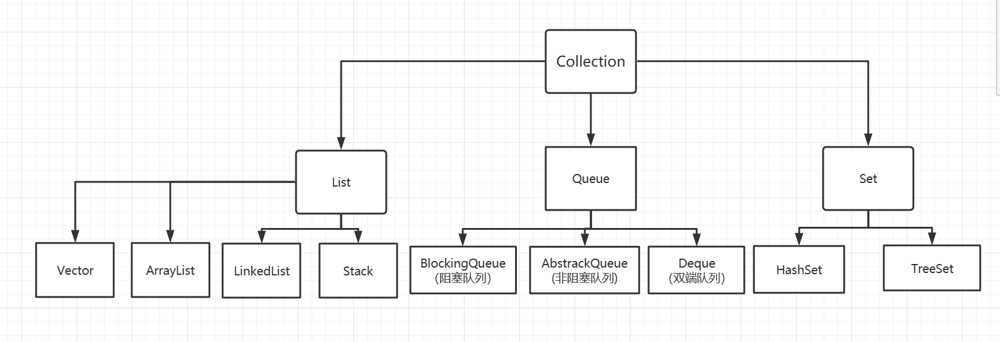
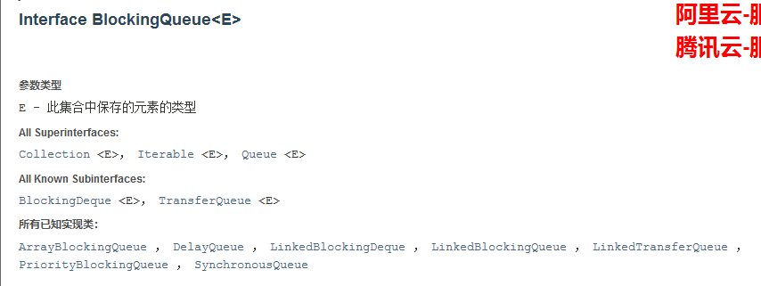

## 线程安全的集合类



### 集合类不安全

> 初识函数式接口

~~~java
public class ListTest {
    public static void main(String[] args) {
        List<String> list = Arrays.asList("1", "2", "3");
        list.forEach(s->{System.out.print(s + " ");});
    }
}
~~~

#### List不安全

数据结构：顺序表或链表

> 写入时复制	COW	计算机程序设计领域的一种优化策略

> 以下代码将报错 java.util.ConcurrentModificationException：并发修改异常

~~~java
import java.util.ArrayList;
import java.util.Arrays;
import java.util.List;
import java.util.UUID;

public class ListTest {
    public static void main(String[] args) {
        List<String> l = new ArrayList<>();
        for (int i = 0; i < 10; i++) {
            new Thread(()->{
                l.add(UUID.randomUUID().toString().substring(0, 5));
                System.out.println(l);
            }, String.valueOf(i)).start();
        }
    }
}
~~~

解决方案：

> Vector

~~~java
List<String> list = new Vector<>();
~~~

> Collections.synchronizedList

~~~java
List<String> l = Collections.synchronizedList(new ArrayList());
~~~

> CopyOnWriteArrayList

~~~java
List<String> l = new CopyOnWriteArrayList<>();
~~~

与 ArrayList 相同，在 CopyOnWriteArrayList 内部同样维护了一个数组，不同的是该数组有 transient volatile 修饰

~~~java
private transient volatile Object[] array;
~~~

其 add 方法采取写入时复制的方式，即将原数组复制一份（长度+1），再插入新元素，线程安全性由 **lock** 锁保证

与 Vector 不同，CopyOnWriteArrayList 中并无 synchronized 修饰，故其效率较高

> ~~~java
> public boolean add(E e) {
>     final ReentrantLock lock = this.lock;
>     lock.lock();
>     try {
>         Object[] elements = getArray();
>         int len = elements.length;
>         Object[] newElements = Arrays.copyOf(elements, len + 1);
>         newElements[len] = e;
>         setArray(newElements);
>         return true;
>     } finally {
>         lock.unlock();
>     }
> }
> ~~~

COW：计算机程序设计领域的一种优化策略

在写入时避免覆盖造成数据问题 ——> 读写分离

#### Set不安全

Iterable ——> Collection ——> List + Set + BlockingQueue（阻塞队列）

与 List 同理可得 Set 同样线程不安全，报错 java.util.ConcurrentModificationException

~~~java
import java.util.HashSet;
import java.util.Set;
import java.util.UUID;

public class SetTest {
    public static void main(String[] args) {
        Set<String> set = new HashSet<>();
        for(int i = 0; i < 10; i++){
            new Thread(()->{
                set.add(UUID.randomUUID().toString().substring(0, 5));
                System.out.println(Thread.currentThread().getName() + set);
            }, String.valueOf(i)).start();
        }
    }
}
~~~

解决方案：

> Collections.synchronizedSet

~~~java
Set<String> set = Collections.synchronizedSet(new HashSet<>());
~~~

> CopyOnWriteArraySet

~~~java
Set<String> set = new CopyOnWriteArraySet<>();
~~~

HashSet 的底层：HashMap

~~~java
public HashSet() {
    map = new HashMap<>();
}

//CopyOnWriteArraySet维护的map由transient修饰
private transient HashMap<E,Object> map;

public boolean add(E e) {
    return map.put(e, PRESENT)==null;
}

//PRESENT是一个不变的值
private static final Object PRESENT = new Object();
~~~

#### Map不安全

数据结构：哈希表（散列表）

默认初始容量：16

默认加载因子：0.75

解决方案：

> Collections.synchronizedMap

~~~java
Map<String, String> map = Collections.synchronizedMap(new HashMap<>());
~~~

> ConcurrentHashMap

~~~java
Map<String, String> map = new ConcurrentHashMap<>();
~~~

其底层数据多由 transient volatile 修饰，方法关键步骤由 synchronized 修饰，在下无法理解

### Callable

Callable 和 Runnable 的区别

- Callable 有返回值
- Callable 可以抛出异常
- 方法不同，run() ——> call()

Thread 只能 start 继承了 Runnable（重写了run方法） 的类，怎么用 Thread 去跑继承了 Callable 的类呢？

阅读jdk文档可以发现 Runnable 有一个实现类：FutureTask


它既是 Runnable 的实现类，又可以由 Callable 进行构造，如此便实现了 Callable 和 Thread 的连接

~~~java
import java.util.concurrent.Callable;
import java.util.concurrent.FutureTask;

public class CallableTest {
    public static void main(String[] args) {
        new Thread(new FutureTask<>(new MyThread())).start();
        System.out.println();
    }
}

class MyThread implements Callable<String>{
    @Override
    public String call() throws Exception {
        System.out.println("wdnmd");
        return "Hello Callable";
    }
}
~~~

如何获取 Callable 的返回值？

~~~java
MyThread mythread = new MyThread();
FutureTask<String> futuretask = new FutureTask<>(t);
new Thread(futuretask).start();
String res = futuretask.get();
~~~

注意

- FutureTask 的 get 方法是阻塞的，也就是说，只有 call() 方法跑完之后，才会 get 到值，若 get 在 start 前，则程序死锁
- call() 方法是有缓存的，开两条线程跑同一个 call 函数，只会有一个结果，如上述代码若开两条线程只会输出一句 wdnmd

### 常用辅助类

#### CountDwonLatch

latch：门栓

> 用于倒计时，count 为倒计的数量

- 构造方法

~~~java
CountDownLatch(int count);
~~~

- 倒数，令 count 减一

~~~java
countDown()
~~~

- 等待方法，阻塞，当 count 为0时唤醒

~~~java
await();
~~~

测试代码：

需要注意的是，我开启了一条线程输出 “All Out”，它将在 count = 0 时才会被执行，即等待计数结束

~~~java
import java.util.concurrent.CountDownLatch;

public class CountDownLatchTest {
    public static void main(String[] args) {
        CountDownLatch c = new CountDownLatch(10);

        new Thread(()->{
            try {
                c.await();
            } catch (InterruptedException e) {
                e.printStackTrace();
            }finally {
                System.out.println("All Out");
            }
        }).start();

        for (int i = 0; i < 10; i++) {
            new Thread(()->{
                System.out.println(Thread.currentThread().getName() + " Go Out");
                c.countDown();
            }, String.valueOf(i+1)).start();
        }
    }
}
~~~

结果：

~~~java
1 Go Out
3 Go Out
2 Go Out
6 Go Out
8 Go Out
9 Go Out
7 Go Out
5 Go Out
4 Go Out
10 Go Out
All Out

Process finished with exit code 0
~~~

#### CycilcBarrier

- 构造方法
  1. parties 为所经历的线程最大数
  2. lambda 表达式中为当经历线程数达到 parties 时执行的语句

~~~java
CyclicBarrier(int parties, Lambda表达式)
~~~

- 计数、等待方法
  - 在线程中执行 await 时，parties+1，同时判断是否达到初始化时的最大值，达到则执行构造方法中的 λ 表达式

~~~java
await();
~~~

测试代码：

~~~java
import java.util.concurrent.BrokenBarrierException;
import java.util.concurrent.CyclicBarrier;

public class CyclicBarrierTest {
    public static void main(String[] args) {
        CyclicBarrier c = new CyclicBarrier(7, ()->{
            System.out.println("集齐七颗龙珠，召唤神龙");
        });

        for (int i = 0; i < 7; i++) {
            final int temp = i+1;
            new Thread(()->{
                System.out.println("收集到第" + temp + "颗龙珠");
                try {
                    c.await();
                } catch (InterruptedException e) {
                    e.printStackTrace();
                } catch (BrokenBarrierException e) {
                    e.printStackTrace();
                }
            }, String.valueOf(i+1)).start();
        }
    }
}
~~~

结果：

~~~java
收集到第1颗龙珠
收集到第7颗龙珠
收集到第4颗龙珠
收集到第3颗龙珠
收集到第5颗龙珠
收集到第2颗龙珠
收集到第6颗龙珠
集齐七颗龙珠，召唤神龙

Process finished with exit code 0
~~~

#### Semaphore

信号量

```java
import java.util.concurrent.Semaphore;
import java.util.concurrent.TimeUnit;

public class SemaphoreTest {
    public static void main(String[] args) {
        //初始化线程数量（停车位）
        Semaphore semaphore = new Semaphore(4);

        for (int i = 0; i < 7; i++) {
            new Thread(()->{
                try {
                    //acquire()：获得许可，阻塞，判断当前是否有闲置的许可
                    semaphore.acquire();
                    System.out.println(Thread.currentThread().getName() + " 停车");
                    TimeUnit.SECONDS.sleep(2);
                } catch (InterruptedException e) {
                    e.printStackTrace();
                } finally {
                    System.out.println(Thread.currentThread().getName() + " 离开车位");
                    //释放许可
                    semaphore.release();
                }
            }, String.valueOf(i+1)).start();
        }
    }
}
```

- acquire()：获得，如果信号量满了，等待，直到被释放为止
- release()：释放，会将信号量释放+1，然后唤醒等待的线程

作用：

1. 多个共享资源互斥的使用（如停车位）
2. 并发限流，控制最大的线程数

### 读写锁

- 读可以被多个线程读，写只能由单线程写
- 写的时候不能读，读的时候不能写

**ReadWriteLock**

与 Lock 锁的用法类似，进入方法时加锁，将业务代码放在 try / catch 语句中，在 finally 中解锁

注意读写锁并没有 Condition，它自身在加锁解锁的过程中完成了 Condition 的精确控制，提高了锁细粒度

~~~java
import java.util.HashMap;
import java.util.Map;
import java.util.UUID;
import java.util.concurrent.ConcurrentHashMap;
import java.util.concurrent.locks.*;

public class ReadWriteLockTest {
    public static void main(String[] args) {
        MyCacheLock myCache = new MyCacheLock();

        for (int i = 0; i < 10; i++) {
            final int temp = i;
            new Thread(()->{
                myCache.put(temp, UUID.randomUUID().toString().substring(0, 3));
            }, String.valueOf(i)).start();
        }

        for (int i = 0; i < 10; i++) {
            final int temp = i;
            new Thread(()->{
                myCache.get(temp);
            }, String.valueOf(i)).start();
        }
    }
}

class MyCacheLock{

    private volatile Map<Integer, String> map = new HashMap<>();

    //读写锁，更加细粒度的控制
    private ReadWriteLock readWriteLock = new ReentrantReadWriteLock();

    //写
    public void put(Integer key, String val){
        readWriteLock.writeLock().lock();
        try{
            System.out.println(Thread.currentThread().getName() + "正在写入");
            map.put(key, val);
            System.out.println(Thread.currentThread().getName() + "写入完毕");
        }catch (Exception e){
            e.printStackTrace();
        }finally {
            readWriteLock.writeLock().unlock();
        }
    }
    //读
    public void get(Integer key){
        readWriteLock.readLock().lock();
        try{
            System.out.println(Thread.currentThread().getName() + "正在读取");
            map.get(key);
            System.out.println(Thread.currentThread().getName() + "读取完毕");
        }catch (Exception e){
            e.printStackTrace();
        }finally {
            readWriteLock.readLock().unlock();
        }
    }
}


class MyCache{
    private Map<String, String> map = new HashMap<>();

    public void put(String key, String val){
        System.out.println(Thread.currentThread().getName() + "正在写入");
        map.put(key, val);
        System.out.println(Thread.currentThread().getName() + "写入完毕");
    }

    public void get(String key){
        System.out.println(Thread.currentThread().getName() + "正在读取");
        map.get(key);
        System.out.println(Thread.currentThread().getName() + "读取完毕");
    }
}
~~~

用 MyCache 跑多线程时，会出现多个线程同时 “正在写入” 的情况，这样很明显很不安全，加锁后解决这一问题，即同时只会有单条线程进行 “写” 的操作

我的代码和kuangshen一模吊样，但就是先读后写，我很烦

## Java线程池

### 阻塞队列

> 阻塞：写入队列已满、读取队列为空时，不得不阻塞等待
>
> 队列：FIFO（I => 写入，O => 读取），先进先出

什么情况我们会用阻塞队列？ 多线程，线程池



#### ArrayBlockingQueue

**队列的使用**

添加、移除

**四组API**

| 方式         | 抛出异常  | 有返回值，不抛出异常 | 阻塞等待（一直阻塞） | 等待超时   |
| ------------ | --------- | -------------------- | -------------------- | ---------- |
| 添加         | add()     | offer()              | put()                | offer(...) |
| 移除         | remove()  | poll()               | take()               | poll(..)   |
| 返回队首元素 | element() | peek()               | -                    | -          |

**在编写代码时，一定要将泛型写上，这是编程的一个规范，减少检查时间**

异常：

~~~java
/**
* 抛出异常
*/
public void test1(){
    BlockingQueue<String> blockingQueue = new ArrayBlockingQueue<>(3);

    //返回 boolean，添加成功则返回 true
    System.out.println(blockingQueue.add("a")
    System.out.println(blockingQueue.add("b"));
    System.out.println(blockingQueue.add("c"));

    //当队列已满，继续 add()，将报错 java.lang.IllegalStateException: Queue full
    //System.out.println(blockingQueue.add("d"));

    for (int i = 0; i < 3; i++) { 
        //element 仅返回队首元素
        System.out.println(blockingQueue.element());
        //remove 同样返回队首元素，同时移除
        blockingQueue.remove();
    }
	//当队列已空，继续 remove，将报错 java.util.NoSuchElementException
    //System.out.println(blockingQueue.remove());
}
/**
* 不抛出异常，有返回值
*/
public void test2(){
    BlockingQueue<String> blockingQueue = new ArrayBlockingQueue<>(3);
    System.out.println(blockingQueue.offer("a"));
    System.out.println(blockingQueue.offer("b"));
    System.out.println(blockingQueue.offer("c"));

    //当队列已满，继续 offer，将不成功，并且返回 false，不抛出异常
    System.out.println(blockingQueue.offer("d"));

    for (int i = 0; i < 3; i++) {
        System.out.println(blockingQueue.peek());
        blockingQueue.poll();
    }
    //当队列已空，继续 poll，将得到 null，不抛出异常
    System.out.println(blockingQueue.poll());
}
                       
/**
* 等待，阻塞
*/
public void test3() throws InterruptedException {
    BlockingQueue<String> blockingQueue = new ArrayBlockingQueue<>(3);
    blockingQueue.put("a");
    blockingQueue.put("b");
    blockingQueue.put("c");

    //此时队列已满，若继续向里put，将一直阻塞，直到队列中有空余位置
    //blockingQueue.put("d");

    for (int i = 0; i < 3; i++) {
        System.out.println(blockingQueue.take());
    }
    //此时队列已空，若继续take，同样会一直阻塞，直到队列中由元素了被唤醒执行
    //System.out.println(blockingQueue.take());
}                     
                       
/**
* 超时等待
* long timeLimit：超时等待时间 
* TimeUnit timeunit：时间单位
*/
public void test4() throws InterruptedException {
    BlockingQueue<String> blockingQueue = new ArrayBlockingQueue<>(3);
    System.out.println(blockingQueue.offer("a"));
    System.out.println(blockingQueue.offer("b"));
    System.out.println(blockingQueue.offer("c"));

    //超时等待 2 秒，超出 2 秒返回false，不继续等待
    System.out.println(blockingQueue.offer("d", 2, TimeUnit.SECONDS));

    for (int i = 0; i < 3; i++) {
        System.out.println(blockingQueue.poll());
    }
    //同理等待 2 秒，超出 2 秒则返回null
    System.out.println(blockingQueue.poll(2, TimeUnit.SECONDS));
}
~~~

#### SynchronousQueue

**同步队列**

没有容量：进去一个元素，必须等待取出来以后，才可以继续往里放一个元素（有点像信号量）

方法：put()、take()

~~~java
/**
 * 同步队列
 */
public class SynchronizedQueueTest {
    public static void main(String[] args) {
        BlockingQueue<String> blockingQueue = new SynchronousQueue<>();
        new Thread(()->{
            try {
                System.out.println(Thread.currentThread().getName()+" put 1");
                blockingQueue.put("1");
                System.out.println(Thread.currentThread().getName()+" put 2");
                blockingQueue.put("2");
                System.out.println(Thread.currentThread().getName()+" put 3");
                blockingQueue.put("3");
            } catch (InterruptedException e) {
                e.printStackTrace();
            }
        }, "T1").start();

        new Thread(()->{
            try{
                TimeUnit.SECONDS.sleep(1);
                System.out.println(Thread.currentThread().getName()+" take "+blockingQueue.take());
                TimeUnit.SECONDS.sleep(1);
                System.out.println(Thread.currentThread().getName()+" take "+blockingQueue.take());
                TimeUnit.SECONDS.sleep(1);
                System.out.println(Thread.currentThread().getName()+" take "+blockingQueue.take());
            }catch (InterruptedException e){
                e.printStackTrace();
            }
        }, "T2").start();
    }
}
~~~

结果：

~~~java
T1 put 1
T2 take 1
T1 put 2
T2 take 2
T1 put 3
T2 take 3

Process finished with exit code 0
~~~

### 线程池

> 池化技术
>
> 三大方法七大参数

程序的运行，本质：占用系统的资源 ——> 优化资源的使用 ——> 池化技术

线程池、连接池、内存池、对象池......

池化技术：事先准备好一些资源，需要使用则从池中取，用完后还回


线程池的优点：

1、降低资源的消耗

2、提高响应的速度

3、方便管理

4、线程复用、可以控制最大并发


#### 三大方法

单例线程池

~~~java
ExecutorService threadPool = Executors.newSingleThreadExecutor();
~~~

自定义最大线程池

~~~java
ExecutorService threadPool = Executors.newFixedThreadPool(5);
~~~

自适应线程池

~~~java
ExecutorService threadPool = Executors.newCachedThreadPool();
~~~

测试代码

- 在业务跑完后关闭线程池：shutdown()，否则会一直阻塞

~~~java
import java.util.concurrent.ExecutorService;
import java.util.concurrent.Executors;

public class Test1 {
    public static void main(String[] args) {
        //ExecutorService threadPool = Executors.newSingleThreadExecutor();
        //ExecutorService threadPool = Executors.newFixedThreadPool(5);
        ExecutorService threadPool = Executors.newCachedThreadPool();

        try{
            for (int i = 0; i < 100; i++) {
                threadPool.execute(()->{
                    System.out.println(Thread.currentThread().getName() + " ok");
                });
            }
        }catch (Exception e){
            e.printStackTrace();
        }finally {
            threadPool.shutdown();
        }
    }
}
~~~


#### 七大参数

通过源码可以发现，三大方法中底层返回的都与一个 ThreadPoolExecutor 有关

~~~java
public static ExecutorService newSingleThreadExecutor() {
        return new FinalizableDelegatedExecutorService
            (new ThreadPoolExecutor(1, 1,
                                    0L, TimeUnit.MILLISECONDS,
                                    new LinkedBlockingQueue<Runnable>()));
}

public static ExecutorService newFixedThreadPool(int nThreads) {
        return new ThreadPoolExecutor(nThreads, nThreads,
                                      0L, TimeUnit.MILLISECONDS,
                                      new LinkedBlockingQueue<Runnable>());
}

public static ExecutorService newCachedThreadPool() {
        return new ThreadPoolExecutor(0, Integer.MAX_VALUE,	//约为21亿 ——> oom(out of memory)
                                      60L, TimeUnit.SECONDS,
                                      new SynchronousQueue<Runnable>());
}
~~~

**ThreadPoolExcutor**

~~~java
public ThreadPoolExecutor(int corePoolSize,	//核心线程数
                              int maximumPoolSize,	//最大线程数
                              long keepAliveTime,	//超时时间，超时未调用则还回线程
                              TimeUnit unit,	//超时时间单位
                              BlockingQueue<Runnable> workQueue,	//阻塞队列
                              ThreadFactory threadFactory,	//线程工厂，创建线程的，一般不动
                              RejectedExecutionHandler handler	//拒绝策略) {
        if (corePoolSize < 0 ||
            maximumPoolSize <= 0 ||
            maximumPoolSize < corePoolSize ||
            keepAliveTime < 0)
            throw new IllegalArgumentException();
        if (workQueue == null || threadFactory == null || handler == null)
            throw new NullPointerException();
        this.acc = System.getSecurityManager() == null ?
                null :
                AccessController.getContext();
        this.corePoolSize = corePoolSize;
        this.maximumPoolSize = maximumPoolSize;
        this.workQueue = workQueue;
        this.keepAliveTime = unit.toNanos(keepAliveTime);
        this.threadFactory = threadFactory;
        this.handler = handler;
}
~~~

#### 自定义线程池

~~~java
//自定义线程池
ExecutorService threadPool = new ThreadPoolExecutor(
        2,	//核心线程数
        5,	//最大线程数
        2,	//超时等待时间
        TimeUnit.SECONDS,	//时间单位
        new ArrayBlockingQueue<>(3),	//阻塞队列（等候区）
        Executors.defaultThreadFactory(),	//默认线程工厂
        new ThreadPoolExecutor.DiscardOldestPolicy()	//拒绝策略
);
~~~

#### 四种拒绝策略

 * 1、new ThreadPoolExecutor.AbortPolicy()：当线程已满、队列已满，再进任务时，不执行该任务并且抛出移除
 * 2、new ThreadPoolExecutor.CallerRunsPolicy()：当满员时再进任务，将该任务打发回其发起的地方，如此处将多余的线程返回 main 线程执行
 * 3、new ThreadPoolExecutor.DiscardPolicy()：当满员时再进任务，不执行该任务且不抛出异常
 * 4、new ThreadPoolExecutor.DiscardOldestPolicy()：与(3)相似，但多出的任务将和线程池中最早的任务竞争一个线程，若竞争成功则执行，失败则不执行，

~~~java
import java.util.concurrent.*;
public class Test2 {
    public static void main(String[] args) {
        //自定义线程池
        ExecutorService threadPool = new ThreadPoolExecutor(
                2,
                5,
                2,
                TimeUnit.SECONDS,
                new ArrayBlockingQueue<>(3),
                Executors.defaultThreadFactory(),
                new ThreadPoolExecutor.DiscardOldestPolicy()
        );

        try{
            for (int i = 0; i < 9; i++) {
                threadPool.execute(()->{
                    System.out.println(Thread.currentThread().getName() + " ok");
                });
            }
        }catch (Exception e){
            e.printStackTrace();
        }finally {
            //关闭线程池
            threadPool.shutdown();
        }
    }
}
~~~

#### 最大线程

最大线程如何定义

1、CPU密集型

~~~java
ExecutorService threadPool = new ThreadPoolExecutor(
        2,
    	//获取CPU核数，最大利用CPU效率
        Runtime.getRuntime().availableProcessors(),
        2,
        TimeUnit.SECONDS,
        new ArrayBlockingQueue<>(3),
        Executors.defaultThreadFactory(),
        new ThreadPoolExecutor.DiscardOldestPolicy()
);
~~~

2、IO密集型

判断程序中十分耗 IO 资源的线程数量，将最大线程数一般设置为两倍于此

