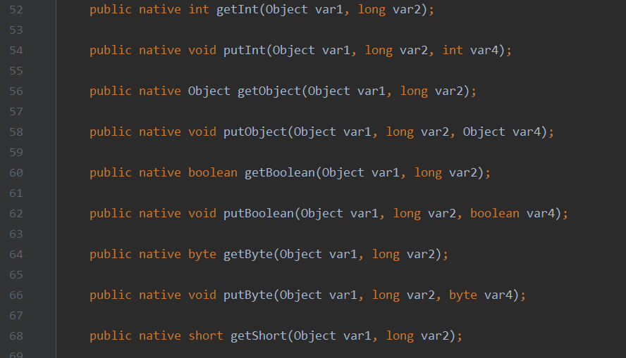
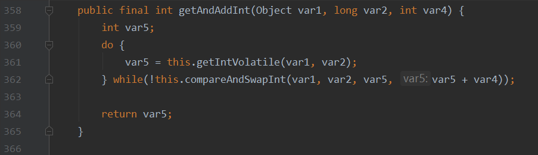

## 原子性

### JMM

> 请你谈谈对 Volatile 的理解

Volatile 时 java 虚拟机提供的轻量级的同步机制

1、保证可见性

2、不保证原子性

3、禁止指令重排

> 什么是JMM？可见性与其有什么关系

JMM ——> Java 内存模型（Java Memory Model），不存在的东西，概念、约定

**关于JMM的一些同步的约定：**

1、线程解锁前，必须把共享变量**立刻**刷回主存

- 在线程工作时，实际上是将主存中的变量拷贝一份到线程的工作内存中（值传递），对那份拷贝的变量进行操作，线程解锁前，必须将这份变量刷新回主存，使数据更新

2、线程加锁前，必须读取主存中的最新值到工作内存中

3、加锁和解锁是同一把锁

> 关于线程、主内存、工作内存的八个操作

- lock（锁定）：作用域主内存的变量，把一个变量表示为线程独占状态
- unlock（解锁）：作用于主内存的变量，它把一个处于锁定状态的的变量释放出来，释放后的变量可以被其他线程锁定
- read（读取）：作用于主内存变量，它把一个变量的值从主内存传输到线程的工作内粗那种
- load（载入）：作用于工作内存的变量，它把read操作从主存中变量放入工作内存中
- use（使用）：线程的执行引擎使用工作内存中的变量
- assign（赋值）：它把执行引擎接受到的值重新赋给那个变量
- store（存储）：它把工作内存中的一个变量传送到主存中
- write（写入）：它把store操作从工作内存中得到的变量的值放入主存的变量中

**JMM对这八种指令的使用，制定了如下规则：**

- 不允许read和load、store和write操作之一单独出行先，即read了必须load，store了必须write
- 不允许线程丢弃它最近的assign操作，即工作变量的数据改变了后必须告知主存
- 不允许一个线程将没有assign的数据从工作内存同步回主存
- 一个新变量必须从主存中诞生，不允许工作内存直接使用一个未被初始化的便改良，也就是说对变量实施use、store操作之前必须经过load和assign操作
- 一个变量同一时间只有一个线程能对其进行lock，多次lock（重入锁）后，必须执行相同次数的unlcok才能解锁
- 如果对同一变量进行lock操作，回清空所有工作内存中此变量的值，在执行引擎使用这个变量前，必须重新load或assign操作初始化变量的值
- 如果一个变量没有被lock，就不同对其进行unlock，也不能unlock一个被其他线程锁住的变量
- 对一个变量进行unlock操作之前，必须把此变量同步回主存

问题：当主存中变量更改后，线程的工作内存不可见这种改变，依旧在原来的基础上执行，这样可能会造成如下问题

~~~java
import java.util.concurrent.TimeUnit;

public class JMMTest {
    private static volatile int num = 0;

    public static void main(String[] args) {
        //main线程
        new Thread(()->{while(num==0){}}).start();

        try {
            TimeUnit.SECONDS.sleep(2);
            num = 1;
            System.out.println(num);
        } catch (InterruptedException e) {
            e.printStackTrace();
        }
    }
}
~~~

由于主线程睡眠 2 s，线程 T 读入 num 时，num == 0，即使在 main 线程中改变了 num 的值，线程 T 的工作内存中 num 仍为 0

线程 T 对主存的变化是 **不可见的**

### Volatile

> 保证可见性

在上述代码中把 num 用 volatile 修饰后可解决线程对主存的**不可见性**问题

> 不保证原子性

什么是原子性？不可分割（ACID原则）

线程A在执行任务的时候，是不能被打扰的，也不能被分割。要么同时成功，要么同时失败

~~~java
public class VDemo01 {

    private static int num = 0;

    public static void add(){
        num++;
    }

    public static void main(String[] args) {
        for (int i = 0; i < 20; i++) {
            new Thread(()->{
                for (int j = 0; j < 1000; j++) {
                    add();
                }
            }).start();
        }

        while(Thread.activeCount()>2){
            Thread.yield();
        }

        System.out.println(num);
    }
}
~~~

预期结果为 20000，但实际结果总达不到 20000，由于有多个线程同时同步工作内存和主存同步的数据，造成两次 num++ 只有一次的效果，不满足原子性。

对 num 加上 volatile 修饰，仍无济于事

解决方案：

- 对 add 方法用 synchronized 修饰

  ~~~java
  public static synchronized void add(){num++;)
  ~~~

- 用 lock 锁把 add 方法锁住

  ~~~java
  private static Lock lock = new ReentrantLock();
  
  public static void add(){
      lock.lock();
      try{
          num++;
      }catch (Exception e){
          System.out.println(e.getMessage());
      }finally {
          lock.unlock();
      }
  }
  ~~~

- 使用原子类解决原子性问题

  ~~~java
  import java.util.concurrent.atomic.AtomicInteger;
  
  public class VDemo01 {
  
      private static volatile AtomicInteger num = new AtomicInteger(0);
  
      public static void add(){
          //调用了本地底层的CAS方法，保证原子性（在汇编中也仅有一步，保证原子性）
          num.getAndIncrement();
      }
  
      public static void main(String[] args) {
          for (int i = 0; i < 20; i++) {
              new Thread(()->{
                  for (int j = 0; j < 1000; j++) {
                      add();
                  }
              }).start();
          }
  
          while(Thread.activeCount()>2){
              Thread.yield();
          }
  
          System.out.println(num);
      }
  }
  ~~~

原子类：atomic

~~~java
public final int getAndIncrement() {
    return unsafe.getAndAddInt(this, valueOffset, 1);
}
~~~

原子类的底层都直接和操作系统挂钩，在内存中修改值！Unsafe类是一个很特殊的存在

> 禁止指令重排

什么是指令重排？我们写的程序，计算机并不是按照我们写的那样去执行的

源代码 ——> 编译器优化的重排 ——> 指令并行也可能会重排 ——> 内存系统也会重排 ——> 执行

~~~java
int x = 1; 	// 1
int y = 2;	// 2
x = x + 5;	// 3
y = x * x;	// 4

我们所期望的：1234
也可能是：2134、1324
不可能是：4123
~~~

我们假设 a、b、x、y 这四个值默认都是0

| 线程A | 线程B |
| ----- | ----- |
| x=a   | y=b   |
| b=1   | a=2   |

经过线程A、B，正常的结果：x=0，y=0

对于单个线程A或者B，这两条语句的先后顺序似乎并不影响，于是编译器做了这样的指令重排：

| 线程A | 线程B |
| ----- | ----- |
| b=1   | a=2   |
| x=a   | y=b   |

指令重排导致的诡异结果：x=2，y=1

**volatile 利用底层的内存屏障可以避免指令重排**

1、保证特定的操作的执行顺序

2、可以保证某些变量的内存可见性（利用这些特性volatile实现了可见性）

## 单例模式

### 什么是单例模式

单例模式（Singleton Pattern）是 Java 中最简单的设计模式之一。这种类型的设计模式属于创建型模式，它提供了一种创建对象的最佳方式。

这种模式涉及到一个单一的类，该类负责创建自己的对象，同时确保只有单个对象被创建。这个类提供了一种访问其唯一的对象的方式，可以直接访问，不需要实例化该类的对象。

**注意：**

- 1、单例类只能有一个实例
- 2、单例类必须自己创建自己的唯一实例
- 3、单例类必须给所有其他对象提供这一实例

**意图：**保证一个类仅有一个实例，并提供一个访问它的全局访问点。

**主要解决：**一个全局使用的类频繁地创建与销毁。

**何时使用：**当您想控制实例数目，节省系统资源的时候。

**如何解决：**判断系统是否已经有这个单例，如果有则返回，如果没有则创建。

**关键代码：**构造函数是私有的。

**应用实例：**

- 1、一个班级只有一个班主任
- 2、Windows 是多进程多线程的，在操作一个文件的时候，就不可避免地出现多个进程或线程同时操作一个文件的现象，所以所有文件的处理必须通过唯一的实例来进行
- 3、一些设备管理器常常设计为单例模式，比如一个电脑有两台打印机，在输出的时候就要处理不能两台打印机打印同一个文件

**优点：**

- 1、在内存里只有一个实例，减少了内存的开销，尤其是频繁的创建和销毁实例（比如管理学院首页页面缓存）
- 2、避免对资源的多重占用（比如写文件操作）

**缺点：**没有接口，不能继承，与单一职责原则冲突，一个类应该只关心内部逻辑，而不关心外面怎么样来实例化

**使用场景：**

- 1、要求生产唯一序列号
- 2、WEB 中的计数器，不用每次刷新都在数据库里加一次，用单例先缓存起来
- 3、创建的一个对象需要消耗的资源过多，比如 I/O 与数据库的连接等

**注意事项：**getInstance() 方法中需要使用同步锁 synchronized (Singleton.class) 防止多线程同时进入造成 instance 被多次实例化

### enum

> enum 是什么？其本身也是一个Class类

### 饿汉式

线程安全，但会造成资源浪费

~~~java
//饿汉式单例模式
public class Hungry {
    private Hungry() {}

    private static Hungry HUNGRY = new Hungry();

    private byte[] data1 = new byte[1024*1024];
    private byte[] data2 = new byte[1024*1024];
    private byte[] data3 = new byte[1024*1024];
    private byte[] data4 = new byte[1024*1024];

    public static Hungry getInstance(){
        return HUNGRY;
    }

    public static void main(String[] args) {
        Hungry hungry = Hungry.getInstance();
        Hungry hungry1 = Hungry.getInstance();
        System.out.println(hungry.hashCode());
        System.out.println(hungry1.hashCode());
    }
}
~~~

### 懒汉式

线程不安全，多线程跑时将发生多个线程同时跑一个 LazyMan() 方法，即使返回同一个 LazyMan 对象。对 getInstance() 方法用 synchronized 修饰可以解决此问题，但会大大降低效率

~~~java
public class LazyMan {
    private LazyMan(){
        System.out.println(Thread.currentThread().getName() + " ok");
    }

    private static LazyMan LazyMan;

    public static LazyMan getInstance(){
        if(LazyMan==null){
            LazyMan = new LazyMan();
        }
        return LazyMan;
    }

    public static void main(String[] args) {
        for (int i = 0; i < 10; i++) {
            new Thread(()->{
                LazyMan.getInstance();
            }).start();
        }
    }
}
~~~

### DCL懒汉式

推荐使用

Double Check Lock，一般情况下线程安全，但不绝对安全

~~~java
DCLLAZYMAN = new DCLLayzMan();
~~~

这行代码并不是一个原子性操作

1. 分配内存空间
2. 执行构造方法，初始化对象
3. 把这个对象指向这块空间

**需要注意一定要令 DCLLAZYMAN 避免指令重排**

我们希望的顺序为123，但经过指令重排可能为132，如此在进行判断时，有可能 A 线程经过（3）把DACLLAZYMAN 指向了一块空间，B 线程此时判定 DCLLAZYMAN 不为 null 往下执行，直接返回 DCLLAZYMAN，而此时对象未被初始化，造成错误（即使这种概率非常非常小）

~~~java
public class DCLLazyMan {
    private DCLLazyMan(){
        System.out.println(Thread.currentThread().getName() + " ok");
    }

    private static DCLLazyMan DCLLAZYMAN;

    public static DCLLazyMan getInstance(){
        if(DCLLAZYMAN == null){
            synchronized (DCLLazyMan.class){
                if(DCLLAZYMAN == null){
                    DCLLAZYMAN = new DCLLazyMan();
                }
            }
        }
        return DCLLAZYMAN;
    }

    public static void main(String[] args) {
        for (int i = 0; i < 10; i++) {
            new Thread(()->{
                DCLLazyMan.getInstance();
            }).start();
        }
    }
}
~~~

为了防止有人用反射破解该单例，即 setAccessable(true)，可在构造方法中加一把锁，同时抛出异常

~~~java
private DCLLazyMan(){
    synchronzed(DCLLazyMan.class){
        if(LAZYMAN != null){
            Throw new RuntimeException("不要试图用反射破坏单例");
        }
    }
    System.out.println(Thread.currentThread().getName() + " ok");
}
~~~

### 静态内部类

秀操作

~~~java
public class Holder {

    private Holder(){
        System.out.println(Thread.currentThread().getName() + " ok");
    }

    public static Holder getInstance(){
        return Inner.HOLDER;
    }

    private static class Inner{
        private static Holder HOLDER = new Holder();
    }

    public static void main(String[] args) {
        for (int i = 0; i < 100; i++) {
            new Thread(()->{
                Holder.getInstance();
            }).start();
        }
    }
}
~~~

### Enum

简单，较安全

~~~java
public enum EnumSingle {

    INSTANCE;

    public EnumSingle getInstance(){
        return INSTANCE;
    }

    public static void main(String[] args) {
        for (int i = 0; i < 1000; i++) {
            new Thread(()->{
                //或用 EnucSingle.getInstance()，一样的
                System.out.println(EnumSingle.INSTANCE.hashCode());
            }).start();
        }
    }
}
~~~

## CAS

> compare and swap

### 深入理解CAS

> 什么是CAS？

CAS：compare and swap（比较交换）

cas是一种基于锁的操作，而且是乐观锁。在java中锁分为乐观锁和悲观锁。悲观锁是将资源锁住，等一个之前获得锁的线程释放锁之后，下一个线程才可以访问。而乐观锁采取了一种宽泛的态度，通过某种方式不加锁来处理资源，比如通过给记录加version来获取数据，**性能较悲观锁有很大的提高**

而像 synchronized、Lock、ReadWriteLock 均为悲观锁

原子类就利用了 CAS 操作实现其原子性，但需要注意的是 java 不能直接操作内存，但能直接操作 c++（navtive 方法），通过 c++ 来操作内存

- c++ 是 java 的后门

> Unsafe 类 ——> 一扇后门

点开 Unsafe 类可以发现其方法都是些 native 方法

**compareAndSet**

~~~java
public class CASDemo {
    public static void main(String[] args) {
        //初始化 AtomicInteger
        AtomicInteger atomicInteger = new AtomicInteger(2021);
        //达到 expect 后 update 数值，即当atomicInteger为2021时更新其为2017，否则更新失败返回false
        System.out.println(atomicInteger.compareAndSet(2021, 2017));
        System.out.println(atomicInteger);
    }
}
~~~

~~~java
public final boolean compareAndSet(int expect, int update) {
    return unsafe.compareAndSwapInt(this, valueOffset, expect, update);
}
~~~

~~~java
public final native boolean compareAndSwapInt(Object var1, long var2, int var4, int var5);
~~~

**getAndIncrement**

~~~java
import java.util.concurrent.atomic.AtomicInteger;

public class CASDemo {
    public static void main(String[] args) {
        //初始化 AtomicInteger
        AtomicInteger atomicInteger = new AtomicInteger(2017);
        //加一
        atomicInteger.getAndIncrement();
        System.out.println(atomicInteger);
    }
}
~~~

~~~java
public final int getAndIncrement() {
    return unsafe.getAndAddInt(this, valueOffset, 1);
}
~~~

~~~java
// 在 AtomicInteger 的 getAndIncrement 方法中 ——> var1=AtomicInteger.class（地址），var2=AtomicInteger.get()（当前值），var4=1
public final int getAndAddInt(Object var1, long var2, int var4) {
    int var5;
    //自旋锁
    do {
        //获取当前值：从地址上读取
        var5 = this.getIntVolatile(var1, var2);
    }
    //与上类似，执行一个CAS(比较交换)函数：var1和var2确定当前值(地址+长度)，var5为其先记录的当前值，当二者相同时，将自身替换为var5+var4(1)
    while(!this.compareAndSwapInt(var1, var2, var5, var5 + var4));

    return var5;
}
~~~

缺点：

1、循环会耗时

2、一次性只能保证一个共享变量的原子性

3、会引起ABA问题

> CAS ——> ABA问题

在以下情形，线程1并不会知道变量A已经被线程2动过了，只会继续执行它的CAS操作，这样是不对的（狸猫换太子）

### 原子引用

在 java 中，为了解决上述问题，引入原子引用类：

~~~java
AtomicStampedReference<V>
~~~

该类用版本号的方式防止ABA问题，即每次cas操作后手动令版本号（stamp）加一，若线程中事先获得的版本号与当前类版本号不符，则无法实现cas操作

不符是指此处在线程 A 中事先记录的 stamp 与 atomicReference.getStamp() 不符，即版本号不符，无法进行 cas 操作

~~~java
import java.util.concurrent.TimeUnit;
import java.util.concurrent.atomic.AtomicStampedReference;

public class CASDemo02 {
    public static void main(String[] args) throws InterruptedException {
        AtomicStampedReference<Integer> atomicReference = new AtomicStampedReference<>(121, 0);

        new Thread(()->{
            int stamp = atomicReference.getStamp();
            try {
                TimeUnit.SECONDS.sleep(2);
            } catch (InterruptedException e) {
                e.printStackTrace();
            }
            System.out.println(atomicReference.compareAndSet(121, 1, stamp, atomicReference.getStamp() + 1));
        }, "A").start();

        new Thread(()->{
            System.out.println(atomicReference.compareAndSet(121, 95, atomicReference.getStamp(), atomicReference.getStamp() + 1));
            System.out.println(atomicReference.compareAndSet(95, 121, atomicReference.getStamp(), atomicReference.getStamp() + 1));
        }, "B").start();

        TimeUnit.SECONDS.sleep(3);
        System.out.println(atomicReference.getReference());
    }
}
~~~

