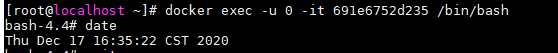
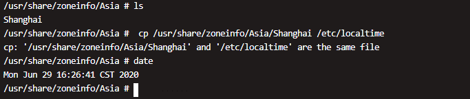

## 源码

### DBUtils

#### DBCP

~~~java
package DBUtils;

import com.mchange.v2.c3p0.ComboPooledDataSource;

public class DBCP {

    static public ComboPooledDataSource users = new ComboPooledDataSource("users");

    static public ComboPooledDataSource searchers = new ComboPooledDataSource("ques&ans");
}
~~~

#### DBUtilsForAdmin

~~~java
package DBUtils;

import Controller.Info;

import java.sql.Connection;
import java.sql.ResultSet;
import java.sql.SQLException;
import java.sql.Statement;
import java.util.ArrayList;
import java.util.HashMap;
import java.util.Iterator;
import java.util.List;

public class DBUtilsForAdmin {

    private Connection con = null;

    /**管理员登录
    * 判断用户名是否存在
    * 判断用户名与密码是否匹配
    * 返回用户名信息
     */
    public ResultSet verify(String name, String password) throws SQLException {
        con = DBCP.users.getConnection();
        Statement sql = con.createStatement();
        String SQL = "select * from admin where name = '" + name + "'";
        ResultSet set = sql.executeQuery(SQL);
        if(!set.next()){
            System.out.println("用户名错误");
            con.close();
            return null;
        }
        String p = set.getString("password");
        if(!password.equals(p)){
            System.out.println("密码错误");
            con.close();
            return null;
        }
        return set;
    }

    /** 获取student表中信息
    * 不返回名字是因为在重置密码时，要求管理员填写用户名字，限制管理员权限
    * 即仅获得账号、专业、性别
     */
    public Iterator<Info> showStudentInfo() throws SQLException{
        con = DBCP.users.getConnection();
        List<Info> list = new ArrayList<>();
        Statement sql = con.createStatement();
        String SQL = "select * from student";
        ResultSet set = sql.executeQuery(SQL);
        while(set.next()){
            Info info = new Info(set.getString("nums"), set.getString("major"), set.getString("gender"));
            list.add(info);
        }
        con.close();
        Iterator<Info> res = list.iterator();
        return res;
    }
    //获取teacher表中信息
    public Iterator<Info> showTeacherInfo() throws SQLException{
        con = DBCP.users.getConnection();
        List<Info> list = new ArrayList<>();
        Statement sql = con.createStatement();
        String SQL = "select * from teacher";
        ResultSet set = sql.executeQuery(SQL);
        while(set.next()){
            Info info = new Info(set.getString("nums"), set.getString("major"), set.getString("gender"));
            list.add(info);
        }
        con.close();
        Iterator<Info> res = list.iterator();
        return res;
    }

    /**详细查找并获取用户信息
    * Stu：账号、专业、性别、年级
    * Tea：账号、专业、性别、职称
     */
    public HashMap<String, String> searchUser(String table, String nums) throws SQLException{
        con = DBCP.users.getConnection();
        HashMap<String, String> res = new HashMap<>();
        Statement sql = con.createStatement();
        String SQL = "select * from " + table + " where nums = " + nums;
        ResultSet set = sql.executeQuery(SQL);
        if(!set.next()){
            con.close();
            return null;
        }
        if(table.equals("student"))
            res.put("身份", "学生");
        else
            res.put("身份", "老师");
        res.put("账号", set.getString("nums"));
        res.put("专业", set.getString("major"));
        res.put("性别", set.getString("gender"));
        if(table.equals("student"))
            res.put("年纪", set.getString("grade"));
        else
            res.put("职称", set.getString("position"));
        con.close();
        return res;
    }

    /**重置用户密码
    * 管理员需要匹配用户姓名
     */
    public boolean resetAccount(String table, String nums, String name) throws SQLException{
        con = DBCP.users.getConnection();
        Statement sql = con.createStatement();
        String SQL = "select * from " + table + " where nums = '" + nums + "'";
        ResultSet set = sql.executeQuery(SQL);
        if(!set.next()){
            System.out.println("查无此人");
            con.close();
            return false;
        }
        if(!name.equals(set.getString("name"))){
            System.out.println("名字错误");
            con.close();
            return false;
        }
        SQL = "update " + table + " set password = '123456' where nums = " + nums;
        int ok = sql.executeUpdate(SQL);
        if(ok == 0){
            System.out.println("重置失败，请重试");
            con.close();
            return false;
        }
        con.close();
        System.out.println("重置密码成功");
        return true;
    }

    /**
    * 在account表中新建账号
     */
    public boolean setAccount(String nums, String name) throws SQLException{
        con = DBCP.users.getConnection();
        Statement sql = con.createStatement();
        String record = "('" + nums + "', '" + name + "')";
        System.out.println(record);
        String SQL = "insert into account values " + record;
        int ok = sql.executeUpdate(SQL);
        if(ok == 0){
            con.close();
            return false;
        }
        con.close();
        return true;
    }

    public void exit(){
        try{
            con.close();
        }catch (SQLException e){
            e.printStackTrace();
        }
    }
}
~~~

#### DBUtilsForQuesAndRes

~~~java
package DBUtils;

import java.sql.*;
import java.util.*;

public class DBUtilsForQuesAndRes {

    private Connection con = null;

    public HashMap<String, List<String>> getAns(String ques) throws SQLException {
        //获取一个连接
        con = DBCP.searchers.getConnection();
        HashMap<String, List<String>> res = new HashMap<>();
        //一个连接对应一条语句！如果中途执行第二条语句，第一条语句的set将被销毁
        Statement sql1 = con.createStatement();
        Statement sql2 = con.createStatement();
        String SQL = "select * from questions where question like '%" + ques + "%'";
        ResultSet question = sql1.executeQuery(SQL);
        while(question.next()){
            String num = question.getString("num");
            String q = question.getString("question");
            res.put(num+". "+q, new ArrayList<String>());
            SQL = "select * from answers where num = " + num;
            ResultSet ans = sql2.executeQuery(SQL);
            while(ans.next()){
                res.get(num+". "+q).add((ans.getString("answer")));
            }
        }
        if(res.keySet().size() == 0){
            con.close();
            return null;
        }
        con.close();
        return res;
    }

    public List<String> getPointedAns(String num) throws SQLException{
        //获取一个连接
        con = DBCP.searchers.getConnection();
        Statement sql = con.createStatement();
        String SQL = "select * from answers where num = '" + num + "'";
        ResultSet ans = sql.executeQuery(SQL);
        List<String> res = new ArrayList<>();
        while(ans.next()){
            res.add(ans.getString("answer"));
        }
        con.close();
        return res;
    }

    public boolean releaseQues(String ques, String type) throws SQLException{
        //获取一个连接
        con = DBCP.searchers.getConnection();
        //获取问题序号
        //设置连接属性：可滚动，可修改数据库
        Statement sql = con.createStatement(ResultSet.TYPE_SCROLL_INSENSITIVE, ResultSet.CONCUR_UPDATABLE);
        String SQL = "select * from questions";
        ResultSet question = sql.executeQuery(SQL);
        question.last();
        int num = Integer.parseInt(question.getString("num")) + 1;
        //向后插入数据
        String record = "('" + num + "', '" + ques + "', " + "'" + "', '" + type + "')";
        SQL = "insert into questions values " + record;
        int ok = sql.executeUpdate(SQL);
        if(ok == 0){
            con.close();
            return false;
        }
        con.close();
        return true;
    }

    public boolean releaseAns(String num, String ans) throws SQLException{
        con = DBCP.searchers.getConnection();
        Statement sql = con.createStatement();
        String record = "('" + num + "', '" + ans + "', '', '', '')";
        String SQL = "insert into answers values" + record;
        int ok = sql.executeUpdate(SQL);
        if(ok == 0){
            con.close();
            return false;
        }
        con.close();
        return true;
    }

    public List<String> getQues(String type) throws SQLException{
        con = DBCP.searchers.getConnection();
        List<String> questions = new ArrayList<>();
        Statement sql = con.createStatement();
        String SQL = "select * from questions where type = '" + type +"'";
        ResultSet set = sql.executeQuery(SQL);
        while(set.next()){
            questions.add(set.getString("num") + ". " + set.getString("question"));
        }
        con.close();
        return questions;
    }
}
~~~

#### DBUtilsForUser

~~~java
package DBUtils;

import Controller.Account;
import Controller.Student;
import Controller.Teacher;

import java.sql.Connection;
import java.sql.ResultSet;
import java.sql.SQLException;
import java.sql.Statement;

/**
 * 要注意注册、登录、修改密码的顺序，连接在各个函数中均有关闭命令（遇挫则关闭）
 */
public class DBUtilsForUser {

    private Connection con = null;

    //判断账号（account）是否存在，存在则返回数据库连接，不存在则返回null
    protected Connection isExist(String nums) throws SQLException {
        con = DBCP.users.getConnection();
        Statement sql = con.createStatement();
        String SQL = "select * from account where num = '" + nums + "'";
        ResultSet set = sql.executeQuery(SQL);
        if(!set.next()){
            con.close();
            return null;
        }
        return con;
    }

    /**登录验证
    * 若账号不存在，返回null，输出账号不存在
    * 若账号存在但未注册，返回null，输出尚未注册
    * 若账号已注册但密码错误，返回null，输出密码错误
    * 登录成功，返回账户信息
     */
    public ResultSet verify(Account a) throws SQLException{
        Connection con = isExist(a.getNums());
        if(con == null){
            System.out.println("账户不存在");
            return null;
        }
        Statement sql = con.createStatement();
        String SQL = "select * from " + a.getTable() + " where nums = '" + a.getNums() + "'";
        ResultSet set = sql.executeQuery(SQL);
        if(!set.next()){
            System.out.println("该账户未注册，请先注册");
            con.close();
            return null;
        }
        String p = set.getString("password");
        //比较字符串用equals()方法
        if(!a.getPassword().equals(p))
        {
            con.close();
            System.out.println("密码错误");
            return null;
        }
        return set;
    }

    /**学生用户注册
    * 账号不存在，返回false，输出账号不存在
    * 账号存在但已注册，返回false，输出账号已注册
    * 账号存在且未注册，录入学生信息，未报错，返回true
    * 账号、密码、名字为必填项
     */
    public boolean registerForStudent(Student stu) throws SQLException{
        Connection con = isExist(stu.getAccount().getNums());
        if(con == null){
            System.out.println("账号不存在");
            return false;
        }
        Statement sql = con.createStatement();
        String SQL = "select * from student where nums = " + stu.getAccount().getNums();
        ResultSet set = sql.executeQuery(SQL);
        if(set.next()){
            System.out.println("账号已被注册");
            con.close();
            return false;
        }

        //获取用户名字
        SQL = "select * from account where num = " + stu.getAccount().getNums();
        ResultSet getName = sql.executeQuery(SQL);
        getName.next();
        String name = getName.getString("name");

        //在数据库中注册信息
        String record = "('" + stu.getAccount().getNums() + "', '" + stu.getAccount().getPassword() + "', '"
                + name + "', '" + stu.getMajor() + "', '" + stu.getGrade() + "', '" +  stu.getGender() + "')";
        SQL = "insert into student values " + record;
        int ok = sql.executeUpdate(SQL);
        if(ok == 0){
            System.out.println("注册失败，请重试");
            con.close();
            return false;
        }
        System.out.println("注册成功,请登录");
        con.close();
        return true;
    }

    /**老师用户注册
    * 账号不存在，返回false，输出账号不存在
    * 账号存在但已注册，返回false，输出账号已注册
    * 账号存在且未注册，录入学生信息，未报错，返回true
    * 账号、密码、名字为必填项
     */
    public boolean registerForTeacher(Teacher tea) throws SQLException{
        Connection con = isExist(tea.getAccount().getNums());
        if(con == null){
            System.out.println("账号不存在");
            return false;
        }
        Statement sql = con.createStatement();
        String SQL = "select * from student where nums = " + tea.getAccount().getNums();
        ResultSet set = sql.executeQuery(SQL);
        if(set.next()){
            System.out.println("账号已被注册");
            con.close();
            return false;
        }

        //获取用户名字
        SQL = "select * from account where num = " + tea.getAccount().getNums();
        ResultSet getName = sql.executeQuery(SQL);
        getName.next();

        String name = getName.getString("name");
        String record = "('" + tea.getAccount().getNums() + "', '" + tea.getAccount().getPassword() + "', '"
                + name + "', '" + tea.getMajor() + "', '" + tea.getGender() + "', '" +  tea.getPosition() + "')";
        SQL = "insert into teacher values " + record;
        int ok = sql.executeUpdate(SQL);
        if(ok == 0){
            System.out.println("注册失败，请重试");
            con.close();
            return false;
        }
        System.out.println("注册成功,请登录");
        con.close();
        return true;
    }

    /**修改密码
     * 从表中拿到账号对应密码，与输入旧密码对比
     * 若匹配，修改旧密码为新密码，返回true；反之返回false
     */
    public boolean modifyPassword(String table, String nums, String oldPassword, String newPassword) throws  SQLException{
        Connection con = isExist(nums);
        if(con==null){
            System.out.println("账号错误");
            return false;
        }
        Statement sql = con.createStatement();
        String SQL = "select * from " + table + " where nums = " + nums;
        ResultSet set = sql.executeQuery(SQL);
        set.next();
        String realPassword = set.getString("password");
        if(!oldPassword.equals(realPassword)){
            System.out.println("旧密码错误");
            con.close();
            return false;
        }
        SQL = "update " + table + " set password = '" + newPassword + "'where nums = '" + nums + "'";
        int ok = sql.executeUpdate(SQL);
        if(ok == 0){
            System.out.println("更新数据失败，请重试");
            con.close();
            return false;
        }
        System.out.println("修改密码成功");
        con.close();
        return true;
    }

    public void exit(){
        try{
            con.close();
        }catch (SQLException e){
            e.printStackTrace();
        }
    }
}
~~~

### Controller

#### Account

~~~java
package Controller;

public class Account{
    private String table;
    private String nums;
    private String password;

    public Account(String table, String nums, String password) {
        this.table = table;
        this.nums = nums;
        this.password = password;
    }

    public Account(String table) {
        this.table = table;
    }

    public String getTable() {
        return table;
    }

    public String getNums() {
        return nums;
    }

    public void setNums(String nums) {
        this.nums = nums;
    }

    public String getPassword() {
        return password;
    }

    public void setPassword(String password) {
        this.password = password;
    }
}
~~~

#### Admin

~~~java
package Controller;

import DBUtils.DBUtilsForAdmin;

import java.sql.ResultSet;
import java.sql.SQLException;
import java.util.HashMap;
import java.util.Iterator;

public class Admin {
    private String name;
    private String password;
    private DBUtilsForAdmin jdbc = new DBUtilsForAdmin();

    public Admin(String name, String password) {
        this.name = name;
        this.password = password;
    }

    public String getName() {
        return name;
    }

    public String getPassword() {
        return password;
    }

    public ResultSet login() throws SQLException{
        return jdbc.verify(getName(), getPassword());
    }

    public HashMap<String, String> searchUser(String table, String nums) throws SQLException{
        return jdbc.searchUser(table, nums);
    }

    public boolean resetAccount(String table, String nums, String name) throws SQLException{
        return jdbc.resetAccount(table, nums, name);
    }

    public boolean setAccount(String nums, String name) throws SQLException{
        return jdbc.setAccount(nums, name);
    }

    public Iterator<Info> showStuInfo() throws SQLException{
        return jdbc.showStudentInfo();
    }

    public Iterator<Info> showTeaInfo() throws SQLException{
        return jdbc.showTeacherInfo();
    }

    public void exit(){
        jdbc.exit();
    }
}
~~~

#### Info

~~~java
package Controller;

public class Info {
    private String nums;
    private String gender;
    private String major;

    public Info(String nums, String major, String gender) {
        this.nums = nums;
        this.gender = gender;
        this.major = major;
    }

    public String getNums() {
        return nums;
    }

    public String getMajor() {
        return major;
    }

    public String getGender() {
        return gender;
    }

    @Override
    public String toString() {
        return getNums()+"\t"+getMajor()+"\t"+getGender();
    }
}
~~~

#### Releaser

~~~java
package Controller;

import DBUtils.DBUtilsForQuesAndRes;

import java.sql.SQLException;

public class Releaser {

    private DBUtilsForQuesAndRes jdbc;

    public Releaser(){
        jdbc = new DBUtilsForQuesAndRes();
    }

    public boolean releaseQues(String ques, String type) throws SQLException{
        return jdbc.releaseQues(ques, type);
    }

    public boolean releaseAns(String num, String ans) throws SQLException{
        return jdbc.releaseAns(num, ans);
    }
}
~~~

#### Searcher

~~~java
package Controller;

import DBUtils.DBUtilsForQuesAndRes;

import java.sql.SQLException;
import java.util.HashMap;
import java.util.List;

public class Searcher {

    private DBUtilsForQuesAndRes jdbc;

    public Searcher() throws SQLException{
        jdbc = new DBUtilsForQuesAndRes();
    }

    public HashMap<String, List<String>> getAns(String question) throws SQLException {
        return jdbc.getAns(question);
    }

    public List<String> getQues(String type) throws SQLException{
        return jdbc.getQues(type);
    }

    public List<String> getPointedAns(String num) throws SQLException{
        return jdbc.getPointedAns(num);
    }
}
~~~

#### Student

~~~java
package Controller;

import DBUtils.DBUtilsForUser;

import java.sql.ResultSet;
import java.sql.SQLException;

public class Student{
    private Account account;
    private String name;
    private String major;
    private String grade;
    private String gender;
    private DBUtilsForUser jdbc = new DBUtilsForUser();

    public Student(Account a){
        account = a;
    }

    public Student(Account account, String name, String major, String grade, String gender) {
        this.account = account;
        this.name = name;
        this.major = major;
        this.grade = grade;
        this.gender = gender;
    }

    public Account getAccount() { return account; };

    public String getName() {
        return name;
    }

    public String getMajor() {
        return major;
    }

    public String getGrade() {
        return grade;
    }

    public String getGender() {
        return gender;
    }

    public void setName(String name) {
        this.name = name;
    }

    public void setMajor(String major) {
        this.major = major;
    }

    public void setGrade(String grade) {
        this.grade = grade;
    }

    public void setGender(String gender) {
        this.gender = gender;
    }

    public ResultSet login() throws SQLException{
        return jdbc.verify(this.account);
    }

    public boolean register() throws SQLException{
        return jdbc.registerForStudent(this);
    }

    public boolean change(String newPassword) throws SQLException{
        return jdbc.modifyPassword("student", this.account.getNums(), this.account.getPassword(), newPassword);
    }

    public void exit(){
        jdbc.exit();
    }
}
~~~

#### Teacher

~~~java
package Controller;

import DBUtils.DBUtilsForUser;

import java.sql.ResultSet;
import java.sql.SQLException;

public class Teacher{
    private Account account;
    private String name;
    private String major;
    private String gender;
    private String position;

    private DBUtilsForUser jdbc = new DBUtilsForUser();

    public Teacher(Account a){
        account = a;
    }

    public Teacher(Account account, String name, String major, String gender, String position) {
        this.account = account;
        this.name = name;
        this.major = major;
        this.gender = gender;
        this.position = position;
    }

    public Account getAccount(){ return account; };

    public String getName() {
        return name;
    }

    public String getMajor() {
        return major;
    }

    public String getGender() {
        return gender;
    }

    public String getPosition() {
        return position;
    }

    public void setName(String name) {
        this.name = name;
    }

    public void setMajor(String major) {
        this.major = major;
    }

    public void setGender(String gender) {
        this.gender = gender;
    }

    public void setPosition(String position) {
        this.position = position;
    }

    public ResultSet login() throws SQLException{
        return jdbc.verify(this.account);
    }

    public boolean register() throws SQLException{
        return jdbc.registerForTeacher(this);
    }

    public boolean change(String newPassword) throws SQLException{
        return jdbc.modifyPassword("teacher", this.account.getNums(), this.account.getPassword(), newPassword);
    }

    public void exit(){
        jdbc.exit();
    }
}
~~~

### Servlet

#### ChangePassword

~~~java
package Servlet;

import Controller.Account;
import Controller.Student;
import Controller.Teacher;

import javax.servlet.ServletException;
import javax.servlet.http.HttpServlet;
import javax.servlet.http.HttpServletRequest;
import javax.servlet.http.HttpServletResponse;
import java.io.IOException;
import java.sql.SQLException;

public class ChangePassword extends HttpServlet {
    @Override
    protected void doGet(HttpServletRequest req, HttpServletResponse resp) throws ServletException, IOException {
        req.setCharacterEncoding("utf-8");
        String table = req.getParameter("table");
        String nums = req.getParameter("username");
        String password = req.getParameter("password");
        String newPassword = req.getParameter("newPassword");
        boolean resetSuccessfully = false;
        Account acc = new Account(table, nums, password);
        if(table.equals("student")){
            try{
                Student stu = new Student(acc);
                resetSuccessfully = stu.change(newPassword);
            }catch (SQLException e){
                e.printStackTrace();
            }
        }
        else if(table.equals("teacher")){
            try{
                Teacher tea = new Teacher(acc);
                resetSuccessfully = tea.change(newPassword);
            }catch (SQLException e){
                e.printStackTrace();
            }
        }
        if(resetSuccessfully){
            resp.sendRedirect("/NEUQHelper/hello/Login.jsp");
        }else{
            resp.sendRedirect("/NEUQHelper/hello/ChangePassword.jsp");
        }
    }

    @Override
    protected void doPost(HttpServletRequest req, HttpServletResponse resp) throws ServletException, IOException {
        doGet(req, resp);
    }
}
~~~

#### Distribute

~~~java
package Servlet;

import javax.servlet.ServletException;
import javax.servlet.http.Cookie;
import javax.servlet.http.HttpServlet;
import javax.servlet.http.HttpServletRequest;
import javax.servlet.http.HttpServletResponse;
import java.io.IOException;

public class Distribute extends HttpServlet {
    @Override
    protected void doGet(HttpServletRequest req, HttpServletResponse resp) throws ServletException, IOException {
        req.setCharacterEncoding("utf-8");
        String modular = req.getParameter("option");
        //用cookie判断用户是否登录，若未登录，返回登录界面
        String isLogin = null;
        Cookie[] cookies = req.getCookies();
        for(Cookie c: cookies){
            if(c.getName().equals("isLogin")){
                isLogin = c.getValue();
            }
        }
        //判断是否登录，排除直接通过url进入的用户
        if(modular == null || isLogin.equals("no") || isLogin == null){
            System.out.println("请先登录");
            resp.sendRedirect("/NEUQHelper/hello/Login.jsp");
        }
        else{
            if(modular.equals("<h2>校内外美食推荐</h2>")){
                req.getSession().setAttribute("type", "Eating");
            }
            else if(modular.equals("<h2>对缺德地图说NO</h2>")){
                req.getSession().setAttribute("type", "Outing");
            }
            else if(modular.equals("<h2>就是玩儿</h2>")){
                req.getSession().setAttribute("type", "Entertainment");
            }
            else if(modular.equals("<h2>住寝、修电脑...</h2>")){
                req.getSession().setAttribute("type", "DailyLife");
            }
            else if(modular.equals("<h2>图书馆、实验室...</h2>")){
                req.getSession().setAttribute("type", "Study");
            }
            else if(modular.equals("<h2>社团活动、体育赛事...</h2>")){
                req.getSession().setAttribute("type", "Sports");
            }
            resp.sendRedirect("/NEUQHelper/hello/ShowQuesInfo.jsp");
        }
    }

    @Override
    protected void doPost(HttpServletRequest req, HttpServletResponse resp) throws ServletException, IOException {
        doGet(req, resp);
    }
}
~~~

#### Error

~~~java
package Servlet;

import javax.servlet.ServletException;
import javax.servlet.http.HttpServlet;
import javax.servlet.http.HttpServletRequest;
import javax.servlet.http.HttpServletResponse;
import java.io.IOException;
import java.io.PrintWriter;

public class Error extends HttpServlet {

    @Override
    protected void doGet(HttpServletRequest req, HttpServletResponse resp) throws ServletException, IOException {
        resp.setContentType("text/html");
        resp.setCharacterEncoding("utf-8");

        PrintWriter printWriter = resp.getWriter();
        printWriter.println("<h1>404</h1>");
    }

    @Override
    protected void doPost(HttpServletRequest req, HttpServletResponse resp) throws ServletException, IOException {
        doGet(req, resp);
    }
}
~~~

#### Hello

~~~java
package Servlet;

import javax.servlet.ServletException;
import javax.servlet.http.HttpServlet;
import javax.servlet.http.HttpServletRequest;
import javax.servlet.http.HttpServletResponse;
import java.io.IOException;

public class Hello extends HttpServlet{
    @Override
    protected void doGet(HttpServletRequest req, HttpServletResponse resp) throws ServletException, IOException {

        resp.setContentType("text/html");
        resp.setCharacterEncoding("utf-8");
        resp.getWriter().write("<body style=\"text-align:center\" marginheight=\"300px\">");
        resp.getWriter().write("<h1>你好啊</h1>");
        resp.getWriter().write("<h1>欢迎来到我的页面</h1>");
        resp.getWriter().write("<h5>created by NorthBoat</h5></body>");
    }

    @Override
    protected void doPost(HttpServletRequest req, HttpServletResponse resp) throws ServletException, IOException {
        doGet(req, resp);
    }
}
~~~

#### Login

~~~java
package Servlet;

import Controller.Account;
import Controller.Admin;
import Controller.Student;
import Controller.Teacher;

import javax.servlet.ServletException;
import javax.servlet.http.*;
import java.io.IOException;
import java.sql.ResultSet;
import java.sql.SQLException;
import java.util.Date;

public class Login extends HttpServlet {
    @Override
    protected void doGet(HttpServletRequest req, HttpServletResponse resp) throws ServletException, IOException {
        //用页面信息构建登录账户信息
        String table = req.getParameter("table");
        String username = req.getParameter("username");
        String password = req.getParameter("password");
        Account account = new Account(table, username, password);

        //进行登录判断
        if(table=="" || table==null || username=="" || username==null || password==null || password==""){
            System.out.println("请完善登录信息");
            resp.sendRedirect("/NEUQHelper/hello/Login.jsp");
        }
        else if(table.equals("student")) {
            try{
                Student stu = new Student(account);
                ResultSet set = stu.login();
                if(set == null){
                    System.out.println("该账号未注册或不存在，请先注册或检查账号");
                    resp.sendRedirect("/NEUQHelper");
                }
                else{
                    //将用户信息存到session中
                    stu.setName(set.getString("name"));
                    stu.setMajor(set.getString("major"));
                    stu.setGender(set.getString("gender"));
                    stu.setGrade(set.getString("grade"));
                    HttpSession session = req.getSession();
                    session.setAttribute("usr", stu);
                    //session.setAttribute("name", stu.getName());
                    //获取时间，说上午下午好
                    long time = System.currentTimeMillis();
                    java.util.Date date = new Date(time);
                    int hours = date.getHours()+8;
                    if(hours>=5 && hours<11)
                        session.setAttribute("hello", "上午好，");
                    if(hours>=11 && hours<14)
                        session.setAttribute("hello", "中午好，");
                    if(hours>=14 && hours<18)
                        session.setAttribute("hello", "下午好，");
                    if(hours>=18 && hours<23)
                        session.setAttribute("hello", "晚上好，");
                    if(hours>=23 || hours<3)
                        session.setAttribute("hello", "夜深了快睡吧，");
                    if(hours>=3 && hours<5)
                        session.setAttribute("hello", "Are U OK?");
                    //将登录信息存到cookie中
                    Cookie c = new Cookie("isLogin", "yes");
                    resp.addCookie(c);
                    stu.exit();
                    resp.sendRedirect("/NEUQHelper/hello/MainPage.jsp");
                }
            }catch(SQLException e){
                System.out.println("SQL错误，请重试");
                e.printStackTrace();
                resp.sendRedirect("/NEUQHelper/hello/Login.jsp");
            }
        }
        else if(table.equals("teacher")){
            try{
                Teacher tea = new Teacher(account);
                ResultSet set = tea.login();
                if(set == null) {
                    System.out.println("该账号未注册或不存在，请先注册或检查账号");
                    resp.sendRedirect("/NEUQHelper");
                }
                else{
                    //将老师信息存到session中
                    HttpSession session = req.getSession();
                    tea.setName(set.getString("name"));
                    tea.setMajor(set.getString("major"));
                    tea.setGender(set.getString("gender"));
                    tea.setPosition(set.getString("position"));
                    session.setAttribute("usr", tea);
                    //session.setAttribute("name", tea.getName());
                    //获取时间，说上午下午好
                    long time = System.currentTimeMillis();
                    java.util.Date date = new Date(time);
                    int hours = date.getHours()+8;
                    if(hours>=5 && hours<11)
                        session.setAttribute("hello", "上午好，");
                    if(hours>=11 && hours<14)
                        session.setAttribute("hello", "中午好，");
                    if(hours>=14 && hours<18)
                        session.setAttribute("hello", "下午好，");
                    if(hours>=18 && hours<23)
                        session.setAttribute("hello", "晚上好，");
                    if(hours>=23 || hours<3)
                        session.setAttribute("hello", "夜深了快睡吧，");
                    if(hours>=3 && hours<5)
                        session.setAttribute("hello", "Are U OK?");

                    //将登录信息存到cookie中
                    Cookie c = new Cookie("isLogin", "yes");
                    resp.addCookie(c);
                    tea.exit();
                    resp.sendRedirect("/NEUQHelper/hello/MainPage.jsp");
                }
            }catch(SQLException e) {
                System.out.println("SQL错误，请重试");
                e.printStackTrace();
                resp.sendRedirect("/NEUQHelper/hello/Login.jsp");
            }
        }
        else if(table.equals("admin")){
            try{
                Admin admin = new Admin(username, password);
                ResultSet set = admin.login();
                if(set == null){
                    System.out.println("该账号未注册或不存在，请先注册或检查账号");
                    resp.sendRedirect("/NEUQHelper");
                }
                else{
                    req.getSession().setAttribute("admin", admin);
                    Cookie c = new Cookie("isLogin", "yes");
                    resp.addCookie(c);
                    admin.exit();
                    resp.sendRedirect("/NEUQHelper/hello/AdminPage.jsp");
                }
            }catch (SQLException e){
                System.out.println("SQL错误，请重试");
                e.printStackTrace();
                resp.sendRedirect("/NEUQHelper/hello/Login.jsp");
            }
        }
        //resp.sendRedirect("/NEUQHelper/hello");
    }

    @Override
    protected void doPost(HttpServletRequest req, HttpServletResponse resp) throws ServletException, IOException {
        doGet(req, resp);
    }
}
~~~

#### Logout

~~~java
package Servlet;

import javax.servlet.ServletException;
import javax.servlet.http.*;
import java.io.IOException;

public class Logout extends HttpServlet {
    @Override
    protected void doGet(HttpServletRequest req, HttpServletResponse resp) throws ServletException, IOException {
        Cookie c = new Cookie("isLogin", "no");
        resp.addCookie(c);
        //注销session，服务器将自动new一个全新的session（信息全无）
        req.getSession().invalidate();
        req.getSession();
        resp.sendRedirect("/NEUQHelper");
    }

    @Override
    protected void doPost(HttpServletRequest req, HttpServletResponse resp) throws ServletException, IOException {
        doGet(req, resp);
    }
}
~~~

#### Register

~~~java
package Servlet;

import Controller.Account;
import Controller.Student;
import Controller.Teacher;

import javax.servlet.ServletException;
import javax.servlet.http.HttpServlet;
import javax.servlet.http.HttpServletRequest;
import javax.servlet.http.HttpServletResponse;
import java.io.IOException;
import java.sql.SQLException;

public class Register extends HttpServlet {
    @Override
    protected void doGet(HttpServletRequest req, HttpServletResponse resp) throws ServletException, IOException {
        req.setCharacterEncoding("utf-8");
        String table = req.getParameter("table");
        String nums = req.getParameter("username");
        String password = req.getParameter("password");
        String verify = req.getParameter("verify");
        resp.setContentType("text/html");
        resp.setCharacterEncoding("utf-8");
        if(table=="" || table==null || nums=="" || nums==null || password=="" || password==null || verify == "" || verify==null){
            System.out.println("请完善注册信息");
            resp.sendRedirect("/NEUQHelper/hello/Register.jsp");
        }
        else if(!password.equals(verify)){
            System.out.println("两次密码输入不一致");
            resp.sendRedirect("/NEUQHelper/hello/Register.jsp");
        }
        else if(table.equals("student")){
            Account a = new Account(table, nums, password);
            Student stu = new Student(a, " ", " ", " ", " ");
            try{
                if(stu.register()){
                    resp.sendRedirect("/NEUQHelper/hello/Login.jsp");
                }
                else{
                    System.out.println("注册失败，账号已被注册或不存在");
                    resp.sendRedirect("/NEUQHelper/hello/Register.jsp");
                }
            }catch (SQLException e){
                e.printStackTrace();
                resp.sendRedirect("/NEUQHelper/hello/Register.jsp");
            }
        }
        else if(table.equals("teacher")){
            Account a = new Account(table, nums, password);
            Teacher tea = new Teacher(a, " ", " ", " ", " ");
            try{
                if(tea.register()){
                    resp.sendRedirect("/NEUQHelper/hello/Login.jsp");
                }
                else{
                    System.out.println("注册失败，账号已被注册或不存在");
                    resp.sendRedirect("/NEUQHelper/hello/Register.jsp");
                }
            }catch (SQLException e){
                e.printStackTrace();
                resp.sendRedirect("/NEUQHelper/hello/Register.jsp");
            }
        }
    }

    @Override
    protected void doPost(HttpServletRequest req, HttpServletResponse resp) throws ServletException, IOException {
        doGet(req, resp);
    }
}
~~~

#### ReleaseAns

~~~java
package Servlet;

import Controller.Releaser;

import javax.servlet.ServletException;
import javax.servlet.http.HttpServlet;
import javax.servlet.http.HttpServletRequest;
import javax.servlet.http.HttpServletResponse;
import java.io.IOException;
import java.sql.SQLException;

public class ReleaseAns extends HttpServlet {
    @Override
    protected void doGet(HttpServletRequest req, HttpServletResponse resp) throws ServletException, IOException {
        req.setCharacterEncoding("utf-8");
        resp.setCharacterEncoding("utf-8");
        resp.setContentType("text/html");
        String ans = req.getParameter("ans");
        boolean releaseSuccessfully = false;

        if(!ans.equals("") || ans!=null){
            String num = (String)req.getSession().getAttribute("n");
            System.out.println(ans + " " + num);
            try{
                Releaser r = new Releaser();
                releaseSuccessfully = r.releaseAns(num, ans);
            }catch (SQLException e){
                e.printStackTrace();
            }
        }
        if(releaseSuccessfully){
            resp.sendRedirect("ReleaseSuccessfully.jsp");
        }else{
            resp.sendRedirect("ReleaseFailed.jsp");
        }
    }

    @Override
    protected void doPost(HttpServletRequest req, HttpServletResponse resp) throws ServletException, IOException {
        doGet(req, resp);
    }
}
~~~

#### ReleaseQues

~~~java
package Servlet;

import Controller.Releaser;

import javax.servlet.ServletException;
import javax.servlet.http.HttpServlet;
import javax.servlet.http.HttpServletRequest;
import javax.servlet.http.HttpServletResponse;
import java.io.IOException;
import java.sql.SQLException;

public class ReleaseQues extends HttpServlet {
    @Override
    protected void doGet(HttpServletRequest req, HttpServletResponse resp) throws ServletException, IOException {
        req.setCharacterEncoding("utf-8");
        String ques = req.getParameter("ques");
        String type = req.getParameter("quesType");
        boolean releaseSuccessfully = false;
        try{
            Releaser r = new Releaser();
            releaseSuccessfully = r.releaseQues(ques, type);
        }catch (SQLException e){
            e.printStackTrace();
        }
        if(releaseSuccessfully){
            resp.sendRedirect("ReleaseSuccessfully.jsp");
        }
        else{
            resp.sendRedirect("ReleaseFailed.jsp");
        }
    }

    @Override
    protected void doPost(HttpServletRequest req, HttpServletResponse resp) throws ServletException, IOException {
        doGet(req, resp);
    }
}
~~~

#### ResetAcc

~~~java
package Servlet;

import Controller.Admin;

import javax.servlet.ServletException;
import javax.servlet.http.HttpServlet;
import javax.servlet.http.HttpServletRequest;
import javax.servlet.http.HttpServletResponse;
import java.io.IOException;
import java.sql.SQLException;

public class ResetAcc extends HttpServlet {
    @Override
    protected void doGet(HttpServletRequest req, HttpServletResponse resp) throws ServletException, IOException {
        req.setCharacterEncoding("utf-8");
        resp.setCharacterEncoding("utf-8");
        String CTable = req.getParameter("tableInfo").substring(2, 4);
        String table = "student";
        if(CTable.equals("老师")){
            table = "teacher";
        }
        String resetInfo = req.getParameter("resetInfo");
        boolean resetSuccessfully = false;
        if(resetInfo != null && !resetInfo.equals("") && resetInfo.contains("/")){
            String nums = resetInfo.substring(0, resetInfo.indexOf('/'));
            String name = resetInfo.substring(nums.length()+1);
            Admin admin = (Admin) req.getSession().getAttribute("admin");
            try{
                resetSuccessfully = admin.resetAccount(table, nums, name);
            }catch (SQLException e){
                System.out.println("数据库错误");
            }
        }
        if(resetSuccessfully){
            resp.sendRedirect("/NEUQHelper/hello/ResetSuccessfully.jsp");
        }else{
            resp.sendRedirect("/NEUQHelper/hello/ResetFailed.jsp");
        }
    }

    @Override
    protected void doPost(HttpServletRequest req, HttpServletResponse resp) throws ServletException, IOException {
        doGet(req, resp);
    }
}
~~~

#### ResetAccAfterSearch

~~~java
package Servlet;

import Controller.Admin;

import javax.servlet.ServletException;
import javax.servlet.http.HttpServlet;
import javax.servlet.http.HttpServletRequest;
import javax.servlet.http.HttpServletResponse;
import java.io.IOException;
import java.sql.SQLException;
import java.util.HashMap;

public class ResetAccAfterSearch extends HttpServlet {
    @Override
    protected void doGet(HttpServletRequest req, HttpServletResponse resp) throws ServletException, IOException {
        req.setCharacterEncoding("utf-8");
        resp.setCharacterEncoding("utf-8");
        Admin admin = (Admin)req.getSession().getAttribute("admin");
        HashMap<String, String> usr = (HashMap<String, String>)req.getSession().getAttribute("usr");
        String name = req.getParameter("resetInfo");
        String table = usr.get("身份");
        if(table.equals("学生"))
            table = "student";
        else
            table = "teacher";
        String nums = usr.get("账号");
        boolean resetSuccessfully = false;
        try{
            resetSuccessfully = admin.resetAccount(table, nums, name);
        }catch (SQLException e) {
            System.out.println("数据库错误");
        }
        if(resetSuccessfully){
            resp.sendRedirect("/NEUQHelper/hello/ResetSuccessfully.jsp");
        }else{
            resp.sendRedirect("/NEUQHelper/hello/ResetFailed.jsp");
        }
    }

    @Override
    protected void doPost(HttpServletRequest req, HttpServletResponse resp) throws ServletException, IOException {
        doGet(req, resp);
    }
}
~~~

#### SearchAns

~~~java
package Servlet;

import Controller.Searcher;

import javax.servlet.ServletException;
import javax.servlet.http.*;
import java.io.IOException;
import java.sql.SQLException;
import java.util.ArrayList;
import java.util.HashMap;
import java.util.List;

public class SearchAns extends HttpServlet {
    @Override
    protected void doGet(HttpServletRequest req, HttpServletResponse resp) throws ServletException, IOException{
        req.setCharacterEncoding("utf-8");
        resp.setCharacterEncoding("utf-8");
        //判断是否登录
        String isLogin = null;
        Cookie[] cookies = req.getCookies();
        for(Cookie c: cookies){
            if(c.getName().equals("isLogin")){
                isLogin = c.getValue();
            }
        }
        if(isLogin.equals("no")){
            resp.sendRedirect("/NEUQHelper/hello/Login.jsp");
        }
        else{
            try{
                Searcher searcher = new Searcher();
                String question = req.getParameter("question");
                HashMap<String, List<String>> map = searcher.getAns(question);
                //如果没有在库中搜到答案，跳转到指定界面
                if(map == null){
                    resp.sendRedirect("/NEUQHelper/hello/NoAns.jsp");
                }
                else{
                    List<String> keys = new ArrayList<>();
                    HttpSession session = req.getSession();
                    for(String key: map.keySet()){
                        List<String> ans = map.get(key);
                        //用session存问题及答案，在Search.jsp上打印输出
                        //context.setAttribute("question"+ques.substring(0,':'), ques);
                        session.setAttribute(key, ans);
                        keys.add(key);
                    }
                    session.setAttribute("keys", keys);
                    resp.sendRedirect("/NEUQHelper/hello/SearchAns.jsp");
                }
            }catch(SQLException e){
                e.printStackTrace();
            }
        }
    }

    @Override
    protected void doPost(HttpServletRequest req, HttpServletResponse resp) throws ServletException, IOException {
        doGet(req, resp);
    }
}
~~~

#### SearchUsr

~~~java
package Servlet;

import Controller.Admin;

import javax.servlet.ServletException;
import javax.servlet.http.HttpServlet;
import javax.servlet.http.HttpServletRequest;
import javax.servlet.http.HttpServletResponse;
import java.io.IOException;
import java.sql.SQLException;
import java.util.HashMap;

public class SearchUsr extends HttpServlet {
    @Override
    protected void doGet(HttpServletRequest req, HttpServletResponse resp) throws ServletException, IOException {
        Admin admin = (Admin)req.getSession().getAttribute("admin");
        String usrInfo = req.getParameter("usrInfo");
        HashMap<String, String> usr = null;
        try{
            String table = usrInfo.substring(0, usrInfo.indexOf(':'));
            String nums = usrInfo.substring(table.length()+1);
            usr = admin.searchUser(table, nums);
        }catch (SQLException e){
            System.out.println("数据库错误");
        }catch (StringIndexOutOfBoundsException se){
            System.out.println("管理员输入格式错误");
        }
        if(usr == null){
            resp.sendRedirect("/NEUQHelper/hello/NoUsr.jsp");
        }else{
            req.getSession().setAttribute("usr", usr);
            resp.sendRedirect("/NEUQHelper/hello/ShowUsrInfo.jsp");
        }

    }

    @Override
    protected void doPost(HttpServletRequest req, HttpServletResponse resp) throws ServletException, IOException {
        doGet(req, resp);
    }
}
~~~

#### SetAcc

~~~java
package Servlet;

import Controller.Admin;

import javax.servlet.ServletException;
import javax.servlet.http.Cookie;
import javax.servlet.http.HttpServlet;
import javax.servlet.http.HttpServletRequest;
import javax.servlet.http.HttpServletResponse;
import java.io.IOException;
import java.sql.SQLException;

public class SetAcc extends HttpServlet {
    @Override
    protected void doGet(HttpServletRequest req, HttpServletResponse resp) throws ServletException, IOException {
        //用cookie判断用户是否登录，若未登录，返回登录界面
        String isLogin = null;
        Cookie[] cookies = req.getCookies();
        for(Cookie c: cookies){
            if(c.getName().equals("isLogin")){
                isLogin = c.getValue();
            }
        }
        if(isLogin.equals("no") || isLogin==null){
            resp.sendRedirect("/NEUQHelper/hello/Login.jsp");
        }
        else{
            boolean setSuccessfully = false;
            try{
                req.setCharacterEncoding("utf-8");
                resp.setCharacterEncoding("utf-8");
                String setInfo = req.getParameter("setInfo");
                if(!setInfo.equals("") && setInfo!=null && setInfo.contains(":")){
                    String nums = setInfo.substring(0, setInfo.indexOf(':'));
                    String name = setInfo.substring(nums.length()+1);
                    Admin admin = (Admin)req.getSession().getAttribute("admin");
                    setSuccessfully = admin.setAccount(nums, name);
                }
            }catch (SQLException e){
                e.printStackTrace();
                System.out.println("数据库错误");;
            }
            if(setSuccessfully){
                resp.sendRedirect("/NEUQHelper/hello/SetSuccessfully.jsp");
            }else{
                resp.sendRedirect("/NEUQHelper/hello/SetFailed.jsp");
            }
        }
    }

    @Override
    protected void doPost(HttpServletRequest req, HttpServletResponse resp) throws ServletException, IOException {
        doGet(req, resp);
    }
}
~~~

### JSP

#### index.jsp

~~~html
<!DOCTYPE html>
<html>

<body style="text-align:center" marginheight="300px">
<meta charset="UTF-8">
<title>Hello NEUQer</title>
<h1>Hello NEUQer</h1> 
<a href="hello/Login.jsp" target="_self"><h2>Login</h2></a>
<a href="hello/Register.jsp" target="_self"><h2>Register</h2></a>
</body>

</html>
~~~

#### AdminPage

~~~html
<%@ page import="Controller.Admin" %>
<%@ page import="java.util.Iterator" %>
<%@ page import="Controller.Info" %>
<%@ page import="Controller.Student" %><%--
  Created by IntelliJ IDEA.
  User: NorthBoat
  Date: 2021/6/9
  Time: 20:10
  To change this template use File | Settings | File Templates.
--%>
<%@ page contentType="text/html;charset=UTF-8" language="java" %>
<html>
<head>
    <title>AdminPage</title>

    
</head>
<body marginheight="100px">

    <h1>欢迎进入管理员界面</h1>

    <%--搜索账号--%>
    <form action="${pageContext.request.contextPath}/hello/SearchUsr">
        <input type="text" name="usrInfo" placeholder="usrType:usrNums"><input type="submit" value="搜索用户" name="tab"> 
    </form>

    <%--注销账号，跳转到Logout（servlet）清空session--%>
    <form action="${pageContext.request.contextPath}/hello/Logout">
        <input type="submit" value="注销管理员">
    </form>

 

    <h3>新建账号</h3>
    <form action="${pageContext.request.contextPath}/hello/SetAcc" method="post">
        <input type="text" placeholder="nums:name" name="setInfo"><input type="submit" value="新建">
    </form>

    <h3><h2>学生信息</h2> 
        <%
            Admin admin = (Admin) session.getAttribute("admin");
            request.setCharacterEncoding("utf-8");
            response.setContentType("text/html");
            response.setCharacterEncoding("utf-8");
            if(admin != null){
                Iterator<Info> stu = admin.showStuInfo();
                while(stu.hasNext()){
                    out.write(stu.next().toString());

        %>
        <%--重置按钮--%>
        <form action="${pageContext.request.contextPath}/hello/ResetAcc" method="post">
            <input type="submit" value="重置学生密码" name="tableInfo"><input type="text" name="resetInfo" placeholder="usrNums/usrName">
        </form>
         

        <% }} %>
    </h3>

    <h3><h2>老师信息</h2> 
        <%
            if(admin != null){
                Iterator<Info> tea = admin.showTeaInfo();
                while(tea.hasNext()){
                    out.write(tea.next().toString());
        %>
        <%--重置按钮--%>
        <form action="${pageContext.request.contextPath}/hello/ResetAcc" method="post">
            <input type="text" name="resetInfo" placeholder="usrNums/usrName"><input type="submit" value="重置老师密码" name="tableInfo">
        </form>
         

        <%  }} %>
    </h3>

</body>
</html>
~~~

#### ChangePassword

~~~html
<%--
  Created by IntelliJ IDEA.
  User: NorthBoat
  Date: 2021/6/21
  Time: 12:38
  To change this template use File | Settings | File Templates.
--%>
<%@ page contentType="text/html;charset=UTF-8" language="java" %>
<html>
<head>
    <title>ChangePassword</title>
</head>
<body style="text-align:center" marginheight="150px">
<form action="${pageContext.request.contextPath}/hello/ChangePassword" method="post">
    <h1>修改密码</h1> 
    <%--单选注册身份--%>
     <input type="radio" name="table" value="student"> Student
    <input type="radio" name="table" value="teacher"> Teacher   

    <%--用户名--%>
    <h4>Username:</h4><input type="text" name="username">   

    <%--密码--%>
    <h4>Password:</h4><input type="password" name="password">   
    <%--确认密码--%>
    <h4>New password:</h4><input type="password" name="newPassword">   

    <%--提交按钮--%>
      <input type="submit" value="Change">  
    <a href="${pageContext.request.contextPath}/">go back</a>
</form>

</body>
</html>
~~~

#### Details

~~~html
<%@ page import="java.util.List" %>
<%@ page import="java.util.HashMap" %><%--
  Created by IntelliJ IDEA.
  User: NorthBoat
  Date: 2021/6/20
  Time: 11:42
  To change this template use File | Settings | File Templates.
--%>
<%@ page contentType="text/html;charset=UTF-8" language="java" %>
<html>
<head>
    <title>Details</title>
    
</head>
<body marginheight="150px">

    <a href="${pageContext.request.contextPath}/hello/SearchAns.jsp"><h2>Go Back</h2></a>

   

 

    <h2>
        <%
            request.setCharacterEncoding("utf-8");
            String ques = request.getParameter("q");
            if(ques!=null){
                session.setAttribute("n", ques.substring(0, ques.indexOf(".")));
                List<String> ans = (List<String>) session.getAttribute(ques);
                out.write("问题: " + ques + "   ");
                for(int i = 0; i < ans.size(); i++){
                    out.write("回答" + (i+1) + ": " + ans.get(i) + "  ");
                }
            }
        %>
    </h2>

     
    <form action="${pageContext.request.contextPath}/hello/ReleaseAns">
        <textarea name="ans"  cols="50" rows="10"></textarea>  
        <input type="submit" value="发布回答">
    </form>

</body>
</html>
~~~

#### ForgetPassword

~~~html
<%--
  Created by IntelliJ IDEA.
  User: NorthBoat
  Date: 2021/6/21
  Time: 12:03
  To change this template use File | Settings | File Templates.
--%>
<%@ page contentType="text/html;charset=UTF-8" language="java" %>
<html>
<head>
    <title>ForgetPassword</title>
</head>
<body marginheight="320px">

    <h1>
        请联系管理员邮箱1543625674@qq.com
    </h1>  
    <a href="/NEUQHelper"><h2>Go Back</h2></a>

</body>
</html>
~~~

#### Login

~~~html
<!DOCTYPE html>

<%@ page contentType="text/html;charset=UTF-8" language="java" %>
<html>
<head>
    <meta charset="UTF-8">
    <title>Login</title>
</head>
<body style="text-align:center" marginheight="195px">

<form action="${pageContext.request.contextPath}/hello/Login" method="post">

    <h1>Login</h1>  
    <%--单选登录身份--%>
     <input type="radio" name="table" value="student"> Student
        <input type="radio" name="table" value="teacher"> Teacher
        <input type="radio" name="table" value="admin"> Admin  

    <%--用户名--%>
    Username <input type="text" name="username">  

    <%--密码--%>
    Password   <input type="password" name="password"> 

    <%--提交按钮--%>
      <input type="submit" value="Login">  

    <%--修改密码、忘记密码、返回--%>
    <a href="ChangePassword.jsp">  <h5>change password</h5></a>
    <a href="ForgetPassword.jsp" s>  <h5>forget password?</h5></a>
    <a href="${pageContext.request.contextPath}/"><h4>Go Back</h4></a>

</form>

</body>
</html>
~~~

#### MainPage

~~~html
<%@ page import="Controller.Student" %><%--
  Created by IntelliJ IDEA.
  User: NorthBoat
  Date: 2021/6/9
  Time: 16:53
  To change this template use File | Settings | File Templates.
--%>
<%@ page contentType="text/html;charset=UTF-8" language="java" %>
<html>
<head>
    <title>Main</title>
    <%--设置盒子位置--%>
    

    
</head>

<body marginheight="125px">

    <h1 style="text-align: center">${hello}${sessionScope.get("usr").getName()}</h1>   
    <form action="${pageContext.request.contextPath}/hello/Search" method="post" style="text-align: center">
        <input type="text" name="question"><input type="submit" value="Search">
    </form>

    <form action="${pageContext.request.contextPath}/hello/ReleaseQues.jsp" method="post">
            <input type="submit" value="发布问题">
    </form>

    <form action="${pageContext.request.contextPath}/hello/Logout">
        <input type="submit" value="注销账号">
    </form>

 

    <form action="${pageContext.request.contextPath}/hello/Distribute" style="text-align: right" method="post">
        <h2>恰饭</h2><input type="submit" value="<h2>校内外美食推荐</h2>" name="option">  
        <h2>出行</h2><input type="submit" value="<h2>对缺德地图说NO</h2>" name="option">  
        <h2>文娱</h2><input type="submit" value="<h2>就是玩儿</h2>" name="option">
    </form>

    <form action="${pageContext.request.contextPath}/hello/Distribute" style="text-align: left" method="post">
        <h2>生活</h2><input type="submit" value="<h2>住寝、修电脑...</h2>" name="option">  
        <h2>学习</h2><input type="submit" value="<h2>图书馆、实验室...</h2>" name="option">  
        <h2>体育</h2><input type="submit" value="<h2>社团活动、体育赛事...</h2>" name="option">
    </form>

</body>
</html>
~~~

#### NoAns

~~~html
<%--
  Created by IntelliJ IDEA.
  User: NorthBoat
  Date: 2021/6/16
  Time: 17:55
  To change this template use File | Settings | File Templates.
--%>
<%@ page contentType="text/html;charset=UTF-8" language="java" %>
<html>
<head>
    <title>noAns</title>
</head>
<body marginheight="150px">

    <h1>对不起，没有找到您想要的答案</h1>
    <h1>是否发布问题？</h1>

 

    <form action="/NEUQHelper/hello/ReleaseQues" method="post">
        <textarea name="ques"  cols="50" rows="10"></textarea>  
        <%--单选问题类型--%>
         <input type="radio" name="quesType" value="DailyLife"> 生活
        <input type="radio" name="quesType" value="Study"> 学习
        <input type="radio" name="quesType" value="Eating"> 饮食
        <input type="radio" name="quesType" value="Outing"> 出行
        <input type="radio" name="quesType" value="Sports"> 体育
        <input type="radio" name="quesType" value="Entertainment"> 文娱  
        <input type="submit" value="发布">
    </form>
    <a href="/NEUQHelper/hello/MainPage.jsp"><h3>Go Back</h3></a>

</body>
</html>
~~~

#### NoUsr

~~~html
<%--
  Created by IntelliJ IDEA.
  User: NorthBoat
  Date: 2021/6/17
  Time: 0:37
  To change this template use File | Settings | File Templates.
--%>
<%@ page contentType="text/html;charset=UTF-8" language="java" %>
<html>
<head>
    <title>noUsr</title>
</head>
<body marginheight="300px">

    <h1>no user be found, check your account</h1>   
    <a href="/NEUQHelper/hello/AdminPage.jsp"><h3>go back</h3></a>

</body>
</html>
~~~

#### PointedDetails

~~~html
<%@ page import="java.util.List" %><%--
  Created by IntelliJ IDEA.
  User: NorthBoat
  Date: 2021/6/20
  Time: 16:25
  To change this template use File | Settings | File Templates.
--%>
<%@ page contentType="text/html;charset=UTF-8" language="java" %>
<html>
<head>
    <title>PointedDetails</title>
</head>
<head>
    <title>Details</title>
    
</head>
<body marginheight="150px">

    <a href="${pageContext.request.contextPath}/hello/ShowQuesInfo.jsp"><h2>Go Back</h2></a>

   

 

    <h2>
        <%
            request.setCharacterEncoding("utf-8");
            String ques = request.getParameter("qInfo");
            String n = ques.substring(0, ques.indexOf("."));
            session.setAttribute("n", n);
            if(ques!=null){
                List<String> ans = (List<String>) session.getAttribute(ques);
                out.write("问题: " + ques + "   ");
                for(int i = 0; i < ans.size(); i++){
                    out.write("回答" + (i+1) + ": " + ans.get(i) + "  ");
                }
            }
        %>
    </h2>

     
    <form action="${pageContext.request.contextPath}/hello/ReleaseAns">
        <textarea name="ans"  cols="50" rows="10"></textarea>  
        <input type="submit" value="发布回答">
    </form>

</body>
</html>
~~~

#### Register

~~~html
<%--
  Created by IntelliJ IDEA.
  User: NorthBoat
  Date: 2021/6/9
  Time: 1:11
  To change this template use File | Settings | File Templates.
--%>
<%@ page contentType="text/html;charset=UTF-8" language="java" %>
<html>
<head>
    <title>Register</title>
</head>
<body style="text-align:center" marginheight="150px">
<form action="${pageContext.request.contextPath}/hello/Register" method="post">
    <h1>Register</h1> 
    <%--单选注册身份--%>
     <input type="radio" name="table" value="student"> Student
    <input type="radio" name="table" value="teacher"> Teacher   

    <%--用户名--%>
    <h4>Username:</h4><input type="text" name="username">   

    <%--密码--%>
    <h4>Password:</h4><input type="password" name="password">   
    <%--确认密码--%>
    <h4>verify your password:</h4><input type="password" name="verify">   

    <%--提交按钮--%>
      <input type="submit" value="Register">  
    <a href="${pageContext.request.contextPath}/">go back</a>
</form>

</body>
</html>
~~~

#### ReleaseFiled

~~~html
<%--
  Created by IntelliJ IDEA.
  User: NorthBoat
  Date: 2021/6/19
  Time: 17:52
  To change this template use File | Settings | File Templates.
--%>
<%@ page contentType="text/html;charset=UTF-8" language="java" %>
<html>
<head>
    <title>releaseFailed</title>
</head>
<body marginheight="300px">

    <h2>Release Failed, Something wrong happened</h2> 
    <a href="${pageContext.request.contextPath}/hello/MainPage.jsp">go back</a>

</body>
</html>
~~~

#### ReleaseQues

~~~html
<%--
  Created by IntelliJ IDEA.
  User: NorthBoat
  Date: 2021/6/20
  Time: 16:47
  To change this template use File | Settings | File Templates.
--%>
<%@ page contentType="text/html;charset=UTF-8" language="java" %>
<html>
<head>
    <title>ReleaseAns</title>
</head>
<body marginheight="150px">

    <h1>发布问题</h1>

 

    <form action="/NEUQHelper/hello/ReleaseQues" method="post">
        <textarea name="ques"  cols="50" rows="10"></textarea>  
        <%--单选问题类型--%>
         <input type="radio" name="quesType" value="DailyLife"> 生活
        <input type="radio" name="quesType" value="Study"> 学习
        <input type="radio" name="quesType" value="Eating"> 饮食
        <input type="radio" name="quesType" value="Outing"> 出行
        <input type="radio" name="quesType" value="Sports"> 体育
        <input type="radio" name="quesType" value="Entertainment"> 文娱  
        <input type="submit" value="发布">
    </form>
    <a href="/NEUQHelper/hello/MainPage.jsp"><h3>Go Back</h3></a>

</body>
</html>
~~~

#### ReleaseSuccessfully

~~~html
<%--
  Created by IntelliJ IDEA.
  User: NorthBoat
  Date: 2021/6/19
  Time: 17:50
  To change this template use File | Settings | File Templates.
--%>
<%@ page contentType="text/html;charset=UTF-8" language="java" %>
<html>
<head>
    <title>releaseSuccessfully</title>
</head>
<body marginheight="350px">

    <h2>Release successfully, please wait for echo</h2> 
    <a href="${pageContext.request.contextPath}/hello/MainPage.jsp">go back</a>

</body>
</html>
~~~

#### ResetFailed

~~~html
<%--
  Created by IntelliJ IDEA.
  User: NorthBoat
  Date: 2021/6/17
  Time: 11:15
  To change this template use File | Settings | File Templates.
--%>
<%@ page contentType="text/html;charset=UTF-8" language="java" %>
<html>
<head>
    <title>resetFailed</title>
</head>
<body marginheight="350px">

    <h2>Reset Failed, Something wrong happened</h2> 
    <a href="${pageContext.request.contextPath}/hello/AdminPage.jsp">go back</a>

</body>
</html>
~~~

#### ResetSuccessfully

~~~html
<%--
  Created by IntelliJ IDEA.
  User: NorthBoat
  Date: 2021/6/17
  Time: 10:55
  To change this template use File | Settings | File Templates.
--%>
<%@ page contentType="text/html;charset=UTF-8" language="java" %>
<html>
<head>
    <title>resetSuccessfully</title>
</head>
<body marginheight="350px">

    <h2>Reset Successfully, The New Password is "123456"</h2> 
    <a href="${pageContext.request.contextPath}/hello/AdminPage.jsp">go back</a>

</body>
</html>
~~~

#### SearchAns

~~~html
<%@ page import="java.util.List" %>
<%@ page import="java.util.HashMap" %><%--
  Created by IntelliJ IDEA.
  User: NorthBoat
  Date: 2021/6/14
  Time: 16:06
  To change this template use File | Settings | File Templates.
--%>
<%@ page contentType="text/html;charset=UTF-8" language="java" %>
<html>
<head>
    <title>SearchAns</title>
    
</head>
<body marginheight="125px">

    <a href="${pageContext.request.contextPath}/hello/MainPage.jsp"><h1>Go Back Home</h1></a>

  

    <h2>
        <%
            List<String> keys = (List<String>) session.getAttribute("keys");
            for(int i = keys.size()-1; i >= 0; i--){
                String key = keys.get(i);
                request.setAttribute("q", key);
        %>
        <form action="${pageContext.request.contextPath}/hello/Details.jsp" method="post">
            <input type="submit" value="${q}" name="q" style="height: 70px;width: 350px">

        <%
                List<String> ans = (List<String>)session.getAttribute(key);
                out.write("回答共计: " + ans.size() + "条");
        %>
        </form>
        <%  }%>
    </h2>

</body>
</html>
~~~

#### SetFailed

~~~html
<%--
  Created by IntelliJ IDEA.
  User: NorthBoat
  Date: 2021/6/17
  Time: 12:03
  To change this template use File | Settings | File Templates.
--%>
<%@ page contentType="text/html;charset=UTF-8" language="java" %>
<html>
<head>
    <title>SetFailed</title>
</head>
<body marginheight="300px">

    <h2>Set Failed, Something wrong happened</h2> 
    <a href="${pageContext.request.contextPath}/hello/AdminPage.jsp">go back</a>

</body>
</html>
~~~

#### SetSuccessfully

~~~html
<%--
  Created by IntelliJ IDEA.
  User: NorthBoat
  Date: 2021/6/17
  Time: 12:06
  To change this template use File | Settings | File Templates.
--%>
<%@ page contentType="text/html;charset=UTF-8" language="java" %>
<html>
<head>
    <title>SetSuccessfully</title>
</head>
<body marginheight="350px">

    <h2>Set Successfully</h2> 
    <a href="${pageContext.request.contextPath}/hello/AdminPage.jsp">go back</a>

</body>
</html>
~~~

#### ShowQuesInfo

~~~html
<%@ page import="DBUtils.DBUtilsForQuesAndRes" %>
<%@ page import="java.util.List" %>
<%@ page import="Controller.Searcher" %>
<%@ page import="java.util.HashMap" %><%--
  Created by IntelliJ IDEA.
  User: NorthBoat
  Date: 2021/6/20
  Time: 1:16
  To change this template use File | Settings | File Templates.
--%>
<%@ page contentType="text/html;charset=UTF-8" language="java" %>
<html>
<head>
    <title>ShowQuesInfo</title>
    
</head>
<body marginheight="125px">

    <a href="${pageContext.request.contextPath}/hello/MainPage.jsp"><h1>Go Back Home</h1></a>

  

    <h2>
        <%
            String type = (String)session.getAttribute("type");
            Searcher s = new Searcher();
            List<String> questions = s.getQues(type);
            for(int i = questions.size()-1; i >= 0; i--){
                String q = questions.get(i);
                request.setAttribute("qInfo", q);
        %>
        <form action="${pageContext.request.contextPath}/hello/PointedDetails.jsp" method="post">
            <input type="submit" value="${qInfo}" name="qInfo" style="height: 70px;width: 350px">

        <%
                List<String> ans = s.getPointedAns(q.substring(0, q.indexOf(".")));
                session.setAttribute(q, ans);
                out.write("回答共计: " + ans.size() + "条");
        %>

        </form>
        <%
            }
        %>
    </h2>

</body>
</html>
~~~

#### ShowUsrInfo

~~~html
<%@ page import="java.util.HashMap" %><%--
  Created by IntelliJ IDEA.
  User: NorthBoat
  Date: 2021/6/17
  Time: 0:36
  To change this template use File | Settings | File Templates.
--%>
<%@ page contentType="text/html;charset=UTF-8" language="java" %>
<html>
<head>
    <title>ShowInfo</title>
</head>
<body marginheight="225px">

    <h2>
        <%
            HashMap<String, String> usrInfo = (HashMap<String, String>) session.getAttribute("usr");
            if(usrInfo != null) {
                for (String key : usrInfo.keySet()) {
                    out.write(key + ":" + usrInfo.get(key) + "  ");
                }
            }
        %>
    </h2>
    <%--重置按钮--%>
    <form action="${pageContext.request.contextPath}/hello/ResetAccAfterSearch" method="post">
        <input type="text" name="resetInfo" placeholder="usrName"><input type="submit" value="重置密码"> 
    </form>
    <a href="${pageContext.request.contextPath}/hello/AdminPage.jsp">go back</a>

</body>
</html>
~~~

## 一些问题

### Java

#### 获取时间

~~~java
long time = System.currentTimeMills();
java.util.Date date = new Date(time);
int hours = date.getHours();
~~~

### HTML

#### html设置居中

style="text-align:center"：放置在行的中央

marginherght="300px"：设置页边宽度，单位像素，放置在列的中央

~~~html
<body style="text-align:center" marginheight="300px"></body>
~~~

#### JSP获取项目路径

~~~html
<form action="${pageContext.request.contextPath}/hello/Login" method="post"></form>
~~~

#### 重定向问题

不能在一个servlet中存在两个可能都可以执行到的重定向，将报错500，即使指向同一个页面

#### 在jsp中获取ServletContextAttribute

~~~html
<%
    ServletContext sc = this.getServletConfig().getServletContext();
    String name = (String)sc.getAttribute("name");
%>

<h1 style="text-align: center">你好啊  ${name}</h1>  
~~~

#### 将div设置在同一行

用css将div设置为漂浮元素

~~~css
<head>
    <title>Main</title>
    
</head>
<body marginheight="125px">
    

        <a href="Eating.jsp"><h1 style="text-align: right">食</h1></a>  
        <a href="Outing.jsp"><h1 style="text-align: right">出行</h1></a>  
        <a href="Entertainment.jsp"><h1 style="text-align: right">文娱</h1></a>
    

    

        <a href="Dormitory.jsp"><h1>住</h1></a>  
        <a href="Study.jsp"><h1>学习</h1></a>  
        <a href="Sports.jsp"><h1>体育</h1></a>
    

</body>
~~~

### 数据库和容器

#### 找不到c3p0类

将c3p0的jar包打包成lib文件夹添加到webapp/WEB-INF下，并且在project structure->Module->dependencies下，将lib选中。

#### Operation not allowed after ResultSet closed

一个Connection对应一个ResultSet，也就是说，你的这一个Connection创建的Statement只能同时做一个SQL操作，在进行另一次查询时，将覆盖上一次的查询（上一次查询得到的ResultSet也将关闭）

#### 编码问题

全局设置编码

~~~java
resp.setCharacterEncoding("utf-8");
resp.setContentType("text/html");
req.setCharacterEncoding("utf-8");
~~~

设置单个字符串编码

~~~java
//将str转化为指定编码，返回一个String
URLEncoder.encode(String str, String encodeType);
~~~

#### writer换行

~~~java
out.write(" ");
~~~

#### c3p0的xml的分号问题

~~~html
&amp;
~~~

#### 数据库中文识别为???

在连接的url后加上

~~~xml
?characterEncoding=utf8
~~~

即为

~~~xml
jdbc:mysql://39.106.160.174:3306/users?characterEncoding=utf8
~~~

#### too much connections

修改mysql最大连接数（初始默认为151）

~~~SQL
//查看最大连接数
mysql> show variables like '%max_connection%'; 
| Variable_name   | Value | 
max_connections | 151   |  
mysql> set global max_connections=1;Query OK, 0 rows affected (0.00 sec) 

//尝试连接时报错:1040:too many connections
[root@node4 ~]# mysql -uzs -p123456 -h 192.168.56.132 
ERROR 1040 (00000): Too many connections 
~~~

修改最大连接数

~~~SQL
set global max_connections=10000;
~~~

但这样调整会有很大隐患，因为我们无法确认数据库是否可以承担这么大的连接压力，就好比原来一个人只能吃一个馒头，但现在却非要让他吃 10 个，他肯定接受不了。反应到服务器上面，就有可能会出现宕(dang)机的可能。

#### 修改容器时间

**以root身份进入容器**

docker exec -it -u root 24795ac94ae7 /bin/sh

可以使用date -R 查看时间

**在容器中创建文件**

mkdir -p /usr/share/zoneinfo/Asia

**回到宿主机，复制宿主机里的文件到容器中**

docker cp /usr/share/zoneinfo/Asia/Shanghai 容器ID或容器名:/usr/share/zoneinfo/Asia

**进入容器docker exec -it -u root 容器Id或容器名 bash**

执行命令 cp /usr/share/zoneinfo/Asia/Shanghai /etc/localtime

**执行date -R 查看时区显示时间是否正确**

搞定

