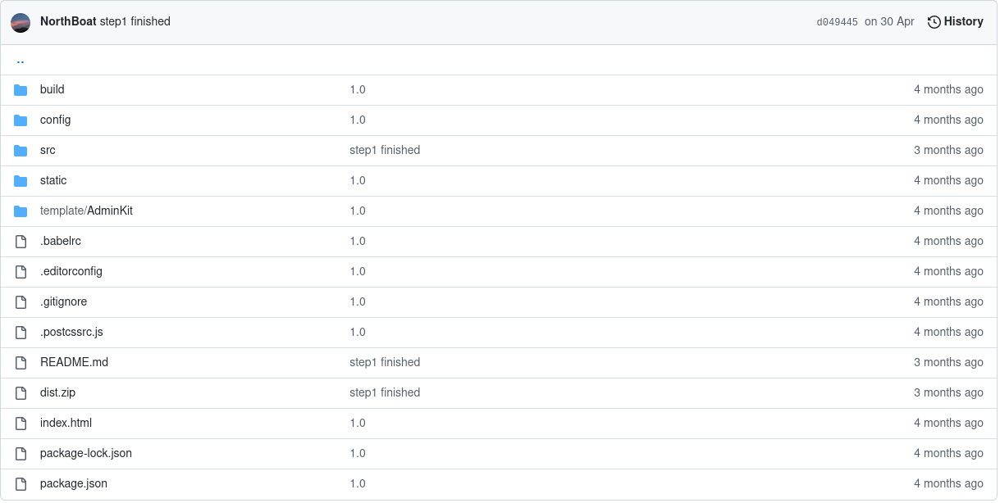

## 前期工作

### Talking with Alan

~~~
操作系统

计算机网络：http/tcp协议

juc编程

json

rest api

云计算

一个容器就是一个进程

docker-java：操作容器资源

gcp tcp ip

65535个端口

Unix sockets support：本地端口相通

计算机网络 ——> tcp/http详解 ——> ！！

corePoolSize：核心线程数

maximumPoolSize

keepAliveTime

TimeUnit unit

BlockingQueue<Runnable> workQueue

控制在内存的75%以下

尽量保证阻塞队列大小大于5

四种拒绝策略

JUC编程，线程池的构造方法

容器池仿造线程池做（业界标杆）

netty

java -jar xxx.jar nohup &

安全问题：内存限制，时间限制（防止恶意代码）

思维导图：processon.com

提交次数：防止恶意提交

Submission ID

三种类型的容器池

Nacos

java函数式编程

implements Serializable：序列化
~~~

### Running Code in JDK

用bash命令编译执行java程序

编译

~~~java
package com;
public class HelloWorld{
    public static void main(String[] args){
        System.out.println("HelloWorld");
    }
}
~~~

javac -d . HelloWorld.java：在当前目录下生成一个 com 的文件夹，将.class 文件统一编译到 com 文件夹下

运行

java com/HelloWorld：运行 HelloWorld 中的主程序，该主程序将自动链接包（com）中的其他类，完成多个类的统一运行

这种执行将自动导入程序中导入的java自带类包（如ArrayList）

### Docker Runer

> 实现覃辉学长给的接口Runner
>
> 参考了他的调用代码

~~~java
package com.docker;

import com.spotify.docker.client.*;
import com.spotify.docker.client.messages.*;

import java.io.BufferedReader;
import java.io.InputStreamReader;
import java.net.URI;
import java.nio.file.Paths;
import java.util.HashMap;
import java.util.Map;

public class DockerRunner implements Runner {

    private final String DOCKER_CONTAINER_WORK_DIR = "/usr/codeRun";
    private final String getMemory = "sh -c docker stats --no-stream --format \"memory:{{.MemUsage}}\"";;
    private Map<Integer, String> imageMap = new HashMap<>();
    private DockerClient docker;
    private String id;
    //private List<Image> Images = new ArrayList<>();
    private ContainerConfig containerConfig;

    //初始化
    public long init(int type) {

        long startTime = System.currentTimeMillis();
        System.out.println("开始初始化docker");

        imageMap.put(25695, "hello-world:latest");
        imageMap.put(10730, "gcc:7.3");
        imageMap.put(20800, "openjdk:8");
        imageMap.put(21100, "openjdk:11");
        imageMap.put(30114, "golang:1.14");

        System.out.println("开始初始化");
        try{
            //初始化docker代理
            docker = DefaultDockerClient.builder()
                    .uri(URI.create("https://39.106.160.174:2375"))
                    .dockerCertificates(new DockerCertificates(Paths.get("src/main/resources/certs")))
                    .build();
            System.out.println("docker_client初始化成功");

            //记录已有镜像信息
            /*
            System.out.println("开始记录docker_client_images");
            Images = docker.listImages();
            Iterator<Image> i = Images.listIterator();
            while(i.hasNext()){
                System.out.println(i.next());
            }
            System.out.println("images记录完毕");
            */

            //开始创建容器
            System.out.println("开始创建docker容器");
            containerConfig = ContainerConfig.builder()
                    //让容器持续开启
                    .openStdin(true)
                    //添加卷
                    .addVolume(DOCKER_CONTAINER_WORK_DIR)
                    //设置docker工作卷
                    .workingDir(DOCKER_CONTAINER_WORK_DIR)
                    .image(imageMap.get(type))
                    .build();
            ContainerCreation creation = docker.createContainer(containerConfig);

            // 记录容器id，用于之后连接
            id = creation.id();

            // 打印容器信息
            final ContainerInfo info = docker.inspectContainer(id);
            System.out.println(info.toString());

            System.out.println("容器创建完毕");
        }catch (Exception e) {
            e.printStackTrace();
        }finally {
            long endTime = System.currentTimeMillis();
            return endTime - startTime;
        }
    }

    //停止容器：记录停止时间
    public long kill(){
        long startTime = System.currentTimeMillis();
        try{
            //停止容器
            docker.stopContainer(id, 0);
            System.out.println("停止容器成功");
            //移除容器
            docker.removeContainer(id);
            System.out.println("已移除容器");
            //关闭docker代理
            docker.close();
            System.out.println("docker代理已关闭");
        }catch(Exception e) {
            e.printStackTrace();
        }finally{
            System.out.println("本次判题结束，正在返回结果...");
            long endTime = System.currentTimeMillis();
            return endTime - startTime;
        }
    }

    //测试运行
    public HashMap<String, Object> test(int imageType){
        init(imageType);
        HashMap<String, Object> res = new HashMap<String, Object>();
        try{
            //启动container
            docker.startContainer(id);

            //开始在容器内部执行命令执行
            System.out.println("正在执行命令...");

            //将文件拷贝至容器内部
            docker.copyToContainer(new java.io.File("src/main/resources/myCode").toPath(), id, "/usr/codeRun/");

            //开始执行
            final String[] command1 = {"javac", "Solution.java"};
            ExecCreation execCreation1 = docker.execCreate(
                    id, command1, DockerClient.ExecCreateParam.attachStdout(),
                    DockerClient.ExecCreateParam.attachStderr());

            final String[] command2 = {"java", "Solution"};
            ExecCreation execCreation2 = docker.execCreate(
                    id, command2, DockerClient.ExecCreateParam.attachStdout(),
                    DockerClient.ExecCreateParam.attachStderr());

            //获取命令的运行结果
            final LogStream output1 = docker.execStart(execCreation1.id());
            final String execOutput1 = output1.readFully();
            final LogStream output2 = docker.execStart(execCreation2.id());
            final String execOutput2 = output2.readFully();

            //获取运行状态
            final ExecState state1 = docker.execInspect(execCreation1.id());
            final ExecState state2 = docker.execInspect(execCreation2.id());

            //等待运行完成
            System.out.println("正在运行...");
            while(state1.running()){};
            while(state2.running()){};

            String ans = execOutput2.substring(0, execOutput2.indexOf('_'));
            String time = execOutput2.substring(ans.length()+1);

            //将运行结果存于res（map）中返回
            res.put("第一条命令的运行结果", execOutput1);
            res.put("第一条命令的返回值", state1.exitCode());
            res.put("第二条命令的运行结果", ans);
            res.put("第二条命令的返回值", state2.exitCode());
            res.put("程序运行时间", time);

            System.out.println("执行结束");

        }catch(Exception e) {
            e.printStackTrace();
        }finally {
            kill();
        }
        return res;
    }

    //去除了时间的单位ms（为了累计计算总时间）
    public HashMap<String, Object> run(String[][] commandLine, int imageType, long timeLimit, long memoryLimit){
        HashMap<String, Object> res = new HashMap<>();
        res.put("创建容器时间", init(imageType) + "ms");
        try{
            //连接container
            System.out.println("连接容器");
            docker.startContainer(id);

            //将本地文件夹共享至容器内部
            docker.copyToContainer(new java.io.File
                    ("src/main/resources/myCode").toPath(), id, "/usr/codeRun/");

            //开始在容器内部执行命令执行
            //编译java文件
            //commandLine[0]是编译命令，commandLine[1]是执行命令
            System.out.println("开始编译...");
            final ExecCreation execCompile = docker.execCreate(
                    id, commandLine[0], DockerClient.ExecCreateParam.attachStdout(),
                    DockerClient.ExecCreateParam.attachStderr());
            ExecState compileState = docker.execInspect(execCompile.id());
            //执行编译命令
            docker.execStart(execCompile.id());
            while(compileState.running()){};
            System.out.println("编译成功");

            //编译完成，执行class文件
            final ExecCreation execCreation = docker.execCreate(
                    id, commandLine[1], DockerClient.ExecCreateParam.attachStdout(),
                    DockerClient.ExecCreateParam.attachStderr());

            //获取命令的运行结果
            LogStream output = docker.execStart(execCreation.id());
            String execOutput = output.readFully();

            //获取运行状态
            ExecState state = docker.execInspect(execCreation.id());

            //等待运行完成
            System.out.println("正在运行程序..");

            while(state.running()){};
            System.out.println("运行结束");

            //获取运行结果
            //String ans = execOutput;
            String ans = execOutput.substring(0, execOutput.indexOf('_'));

            //获取运行时间
            //String time = execOutput;
            String time = execOutput.substring(ans.length()+1);

            // Inspect container
            /*
            final ContainerInfo info = docker.inspectContainer(id);
            String getMemory = "bash\t-c\tdocker\tstats\t--no-stream";
            ExecState state1 =  docker.execInspect("getMemory");
            String memory = state1.toString();

            //获得容器内存占用
            ContainerStats containerstats = docker.stats(id);
            MemoryStats memorystats = containerstats.memoryStats();
            long memory = memorystats.usage()/1024;
            */
            //获得内存使用
            /*
            TopResults set = docker.topContainer(id);
            set.processes();
            long memory = docker.stats(id).memoryStats().usage()/1024;
            */

            //在容器外，即服务器主机上执行shell命令 docker stats --no-stream --format "memory:{{.MemUsage}}" + 容器id，获取容器内存占用
            Process pro = Runtime.getRuntime().exec(getMemory + id);
            BufferedReader buf = new BufferedReader(new InputStreamReader(pro.getInputStream()));
            StringBuffer mem = new StringBuffer();
            String str;
            while ((str = buf.readLine()) != null) {
                mem.append(str);
            }
            String memory = "0MiB";
            if(mem.length()!=0){
                memory = mem.substring(mem.indexOf(":"), mem.indexOf("/"));
            }

            res.put("运行结果", ans);
            res.put("运行时间", time + "ms");
            res.put("内存使用", memory);

            //记录是否超时
            if(Integer.parseInt(time) > timeLimit) {
                res.put("超时", true);
            } else{
                res.put("超时", false);
            }

            if(Integer.parseInt(memory.substring(0, memory.indexOf("M"))) > memoryLimit){
                res.put("超出内存限制", true);
            }else{
                res.put("超出内存限制", false);
            }

        }catch(Exception e) {
            e.printStackTrace();
        }finally {
            res.put("停止容器时间", kill() + "ms");
        }
        return res;
    }

    //终极版本
    //让代码运行于docker并返回结果
    public Map<String, Object> Run(String workPath, String inputFilePath, String[] commandLine,
                                   int imageType, int[] timeLimit, int[] memoryLimit) {

        Map<String, Object> res = new HashMap<String, Object>();
        init(imageType);

        return res;
    }
    
    // 10730 gcc:7.3 |  20800 openjdk:8 | 21100 openjdk:11 | 30114 golang:1.14
    public static void main(String[] args) {

        DockerRunner docker = new DockerRunner();
        String[][] command1 = {{"javac", "HelloWorld.java"}, {"java", "HelloWorld"}};
        String[][] command2 = {{"gcc", "main.c", "-o", "main", "main"}};
        String[][] command3 = {{"javac", "-d", ".", "Solution.java"}, {"java", "test/Solution"}};

        HashMap<String, Object> res = docker.run(command3,20800, 2, 50);

        System.out.println();
        for(String str: res.keySet()){
            if(str == "运行结果"){
                System.out.println("\n运行结果：" + res.get(str));
            }else{
                System.out.print(str + ":" + res.get(str) + "    ");
            }
        }
        System.out.println("\nfinished!");

    }

}
~~~

comandLine1 返回结果

~~~shell
开始初始化docker
开始初始化
01:15:21.302 [main] DEBUG com.spotify.docker.client.DockerCertificates - Generated private key from spec using the 'RSA' algorithm
01:15:22.596 [main] DEBUG com.spotify.docker.client.DockerConfigReader - Using configfile: C:\Users\NorthBoat\.docker\config.json
docker_client初始化成功
开始创建docker容器
容器创建完毕
连接容器
01:15:25.805 [main] INFO com.spotify.docker.client.DefaultDockerClient - Starting container with Id: 4a2bebba027acbebc81faf7451afb481dceeeecfdf8dfe1f2fb0d6af8f86bdc1
开始编译...
编译成功
正在运行程序..
运行结束
停止容器成功
已移除容器
docker代理已关闭
本次判题结束，正在返回结果...

超时:false    超出内存限制:false    创建容器时间:5174ms    内存使用:0MiB    运行时间:1ms    停止容器时间:704ms    
运行结果：
Hello Docker!

finished!

Process finished with exit code 0
~~~

comandLine3 返回结果

~~~shell
开始初始化docker
开始初始化
01:12:48.956 [main] DEBUG com.spotify.docker.client.DockerCertificates - Generated private key from spec using the 'RSA' algorithm
01:12:50.368 [main] DEBUG com.spotify.docker.client.DockerConfigReader - Using configfile: C:\Users\NorthBoat\.docker\config.json
docker_client初始化成功
开始创建docker容器
容器创建完毕
连接容器
01:12:53.205 [main] INFO com.spotify.docker.client.DefaultDockerClient - Starting container with Id: 36a71148a6c65c825f21c1ee27bf32b587ddc078dbe92196b011f90e2c5b11bb
开始编译...
编译成功
正在运行程序..
运行结束
停止容器成功
已移除容器
docker代理已关闭
本次判题结束，正在返回结果...

超时:false    超出内存限制:false    创建容器时间:5108ms    内存使用:0MiB    运行时间:1ms    停止容器时间:625ms    
运行结果：
hello,i am part 1
hello,i am part 2
ohhhhhhhhhhh!
finised

finished!

Process finished with exit code 0
~~~

## 前端

> Vue、ElementUI

热部署

~~~bash
npm run dev
~~~

构建

~~~bash
npm run build
~~~

目录结构

[github-link](https://github.com/NorthBoat/MyOJ/tree/master/My-OJ-Client)

### main.js

main.js

- 引入 element-ui
- 引入 Axios，添加请求前缀 /api，这里在 config/index.js 中重写 /api 为后端请求路径，如 localhost，实现跨域请求

~~~js
// The Vue build version to load with the `import` command
// (runtime-only or standalone) has been set in webpack.base.conf with an alias.
import Vue from 'vue'
import App from './App'

import ElementUI from 'element-ui'
import 'element-ui/lib/theme-chalk/index.css';
Vue.use(ElementUI);

import router from './router'
import Axios from 'axios'
import VueAxios from 'vue-axios'

Vue.use(VueAxios, Axios);
Vue.prototype.$axios = Axios;
Axios.defaults.baseURL = '/api';
Axios.defaults.headers.post['Content-Type'] = 'application/json';

Vue.config.productionTip = false

/* eslint-disable no-new */
new Vue({
  el: '#app',
  router,
  render: h => h(App) //ElementUI
})
~~~

### config

index.js

- 主要是重写请求路径实现跨域请求
- 这里后端 SpringBoot 也要作出相应配合，使用 @CrossOrigin 注解

~~~js
'use strict'
// Template version: 1.3.1
// see http://vuejs-templates.github.io/webpack for documentation.

const path = require('path')

module.exports = {
  dev: {
    // Paths
    assetsSubDirectory: 'static',
    assetsPublicPath: '/',
    proxyTable: {
      '/api':{
        target: 'http://39.106.160.174:8089/',
        changeOrigin: true,
        pathRewrite:{
            '^/api':''
        } 
      }
    },

    // Various Dev Server settings
    host: 'localhost', // can be overwritten by process.env.HOST
    port: 8087, // can be overwritten by process.env.PORT, if port is in use, a free one will be determined
    autoOpenBrowser: false,
    errorOverlay: true,
    notifyOnErrors: true,
    poll: false, // https://webpack.js.org/configuration/dev-server/#devserver-watchoptions-

    
    /**
     * Source Maps
     */

    // https://webpack.js.org/configuration/devtool/#development
    devtool: 'cheap-module-eval-source-map',

    // If you have problems debugging vue-files in devtools,
    // set this to false - it *may* help
    // https://vue-loader.vuejs.org/en/options.html#cachebusting
    cacheBusting: true,

    cssSourceMap: true
  },

  build: {
    // Template for index.html
    index: path.resolve(__dirname, '../dist/index.html'),

    // Paths
    assetsRoot: path.resolve(__dirname, '../dist'),
    assetsSubDirectory: 'static',
    assetsPublicPath: './',

    /**
     * Source Maps
     */

    productionSourceMap: true,
    // https://webpack.js.org/configuration/devtool/#production
    devtool: '#source-map',

    // Gzip off by default as many popular static hosts such as
    // Surge or Netlify already gzip all static assets for you.
    // Before setting to `true`, make sure to:
    // npm install --save-dev compression-webpack-plugin
    productionGzip: false,
    productionGzipExtensions: ['js', 'css'],

    // Run the build command with an extra argument to
    // View the bundle analyzer report after build finishes:
    // `npm run build --report`
    // Set to `true` or `false` to always turn it on or off
    bundleAnalyzerReport: process.env.npm_config_report
  }
}
~~~

### router

使用 vue-router 作页面的重定向与跳转

- 这里必须要注意各页面的层级关系，不然会导致渲染失败

index.js

~~~js
import Vue from 'vue'
import Router from 'vue-router'

import Main from '../views/Main'
import Lost from '../views/Lost'
import Dispatch from '../views/Dispatch'

import Login from '../views/login/Login'
import Register from '../views/login/Register'
import Improve from '../views/login/Improve'

import Hello from '../views/content/Hello'
import Profile from '../views/content/Profile'

import Repository from '../views/content/work/Repository'
import Detail from '../views/content/work/Detail'
import Introduce from '../views/content/work/Introduce'
import Result from '../views/content/work/Result'
import Comment from '../views/content/work/Comment'
import Board from '../views/content/work/Board'

import Discuss from '../views/content/discuss/Discuss'
import Topic from '../views/content/discuss/Topic'
import List from '../views/content/discuss/List'
import Write from '../views/content/discuss/Write'

Vue.use(Router)

export default new Router({
  //mode: 'history',
  routes: [
    {
      path: '/login',
      component: Login,
      name: 'login'
    },

    {
      path: '/register',
      component: Register,
      name: 'register'
    },

    {
      path: '/improve',
      component: Improve,
      name: 'improve'
    },

    {
      path: '/main',
      component: Main,
      name: 'main',
      redirect: '/main/hello',
      children:[
        {path: '/main/hello', component: Hello, name: 'hello'},
        {path: '/main/dispathch', component: Dispatch, name: 'dispatch'},
        {path: '/main/profile', component: Profile, name: 'profile'},

        {path: '/main/repository/:tag', component: Repository, name: 'repository'},
        {
          path: '/main/detail',
          redirect: '/main/repository/all',
          component: Detail,
          name: 'detail',
          props: true,
          children: [
            {path: '/main/detail/introduce/:num', component: Introduce, name: 'introduce'},
            {path: '/main/detail/result/:num', component: Result, name: 'result'},
            {path: '/main/detail/comment/:num', component: Comment, name: 'comment'}
          ]
        },

        {path: '/main/discuss/:tag', component: Discuss, name: 'discuss'},
        {
          path: '/main/topic',
          component: Topic, 
          name: 'topic',
          redirect: '/main/discuss/All',
          children: [
            {path: '/main/topic/detail/:num', component: Topic, name: 'topic'}
          ]
        },
        {path: '/main/write', component: Write, name: 'write'},
        {path: '/main/board', component: Board, name: 'board'},
        {path: '/main/list', component: List, name: 'list'}
      ]
    },

    {
      path: '/',
      redirect: '/main',
    },
    
    {
      path: '/*',
      component: Lost,
      name: 'lost'
    }
  ]
})
~~~

Main.vue

- 主页：侧边栏、导航栏、页眉、页脚
- 具体内容使用 router-view 展示

~~~vue
<template>

    

        <link rel="stylesheet" href="./static/css/app.css">
		<link rel="stylesheet" href="./static/fonts">
        <!--侧边栏  -->
		<nav id="sidebar" class="sidebar">
			

				
				<router-link style="margin-top: 12px" class="sidebar-brand" to="/main/hello">
                    NEUQ OJ&nbsp;&nbsp;&nbsp;&nbsp;
                </router-link>
				

				<ul style="margin-top: -7px" class="sidebar-nav">
					<li class="sidebar-header">
						Online Judge
					</li>

					<li class="sidebar-item">
						<router-link class="sidebar-link" to="/main/hello">
                            <i class="el-icon-s-home"></i> 主页
                        </router-link>
					</li>

					<li class="sidebar-item">
						<router-link class="sidebar-link" :to="{name: 'dispatch', params: {repoTag: 'All'}}">
                            <i class="el-icon-suitcase-1"></i> 题库
                        </router-link>
					</li>

					<li class="sidebar-item">
						<router-link class="sidebar-link" :to="{name: 'dispatch', params: {discTag: 'All'}}">
                            <i class="el-icon-toilet-paper"></i> 茶余
                        </router-link>
					</li>

					

					<li class="sidebar-header">
						Study & Play
					</li>
					<li class="sidebar-item">
						<a data-target="#ui" data-toggle="collapse" class="sidebar-link collapsed">
                            <i class="el-icon-suitcase"></i> 数据结构
                        </a>
						<ul id="ui" class="sidebar-dropdown list-unstyled collapse " data-parent="#sidebar">
							<li class="sidebar-item"><router-link class="sidebar-link" :to="{name: 'dispatch', params:{repoTag: 'List'}}">链表</router-link></li>
							<li class="sidebar-item"><router-link class="sidebar-link" :to="{name: 'dispatch', params:{repoTag: 'Stack&Queue'}}">栈和队列</router-link></li>
							<li class="sidebar-item"><router-link class="sidebar-link" :to="{name: 'dispatch', params:{repoTag: 'String&Arr'}}">串和数组</router-link></li>
							<li class="sidebar-item"><router-link class="sidebar-link" :to="{name: 'dispatch', params:{repoTag: 'Tree'}}">二叉树</router-link></li>
							<li class="sidebar-item"><router-link class="sidebar-link" :to="{name: 'dispatch', params:{repoTag: 'Map'}}">图</router-link></li>
							<li class="sidebar-item"><router-link class="sidebar-link" :to="{name: 'dispatch', params:{repoTag: 'Sort&Search'}}">排序与查找</router-link></li>
						</ul>
					</li>

					<li class="sidebar-item">
						<router-link class="sidebar-link" :to="{name: 'board'}">
                            <i class="el-icon-magic-stick"></i> 前端画板
                        </router-link>
					</li>

					

					<li class="sidebar-item">
						<router-link class="sidebar-link" :to="{name: 'dispatch', params:{discTag: 'Books'}}">
                            <i class="el-icon-notebook-2"></i> 书目推荐
                        </router-link>
					</li>

					<li class="sidebar-item">
						<router-link class="sidebar-link" :to="{name: 'dispatch', params:{discTag: 'Teams'}}">
                            <i class="el-icon-phone-outline"></i> 组队资讯
                        </router-link>
					</li>

					<li class="sidebar-item">
						<router-link class="sidebar-link" :to="{name: 'dispatch', params:{discTag: 'Push'}}">
                            <i class="el-icon-key"></i> 内推人脉
                        </router-link>
					</li>

					<!-- li:data-toggle="collapse" class="sidebar-link collapsed"  a:data-target="#forms" -->
					<li class="sidebar-item">
						<router-link class="sidebar-link" :to="{name: 'list'}">
                            <i class="el-icon-star-off"></i> 力扣题单
                        </router-link>
						<!-- <ul id="forms" class="sidebar-dropdown list-unstyled collapse " data-parent="#sidebar">
							<li class="sidebar-item"><a class="sidebar-link" href="#">数组</a></li>
							<li class="sidebar-item"><a class="sidebar-link" href="#">字符串</a></li>
							<li class="sidebar-item"><a class="sidebar-link" href="#">数与位</a></li>
							<li class="sidebar-item"><a class="sidebar-link" href="#">栈与递归</a></li>
							<li class="sidebar-item"><a class="sidebar-link" href="#">链表</a></li>
							<li class="sidebar-item"><a class="sidebar-link" href="#">哈希表</a></li>
							<li class="sidebar-item"><a class="sidebar-link" href="#">贪心算法</a></li>
							<li class="sidebar-item"><a class="sidebar-link" href="#">双指针法</a></li>
							<li class="sidebar-item"><a class="sidebar-link" href="#">树</a></li>
							<li class="sidebar-item"><a class="sidebar-link" href="#">图与搜索</a></li>
							<li class="sidebar-item"><a class="sidebar-link" href="#">二分查找</a></li>
							<li class="sidebar-item"><a class="sidebar-link" href="#">二进制运算的应用</a></li>
							<li class="sidebar-item"><a class="sidebar-link" href="#">动态规划</a></li>
							<li class="sidebar-item"><a class="sidebar-link" href="#">采样</a></li>
							<li class="sidebar-item"><a class="sidebar-link" href="#">计算几何</a></li>
							<li class="sidebar-item"><a class="sidebar-link" href="#">常用技巧与算法</a></li>
						</ul> -->
					</li>

					<li class="sidebar-header">
						Profile & Settings
					</li>

					<li class="sidebar-item">
						<router-link class="sidebar-link" :to="{name: 'profile'}">
                            <i class="el-icon-s-custom"></i> 个人
                        </router-link>
					</li>

				</ul>
			

		</nav>

		

            <!-- 导航栏 -->
			<nav class="navbar navbar-expand navbar-light navbar-bg">

				<!-- 展开/收缩按钮 -->
				<a class="sidebar-toggle d-flex">
                    <i class="hamburger align-self-center"></i>
                </a>

				<!-- 搜索框 -->
				<form class="d-none d-sm-inline-block">
					

						<input type="text" class="form-control" placeholder="Search…" aria-label="Search">
						<button class="btn" type="button">
                            <i class="align-middle" data-feather="search"></i>
                        </button>
					

				</form>

				

					<ul class="navbar-nav navbar-align" v-if="logined">
						
						<!-- 个人中心下拉框 -->
						<li class="nav-item dropdown">

							<a class="nav-link dropdown-toggle d-none d-sm-inline-block" href="#" data-toggle="dropdown">	
                            	<i class="el-icon-user"></i>                 
                                <!--  Charles Hall -->
                            </a>
							

								<!-- 这里要改 -->

								<a class="dropdown-item" href="pages-profile.html"><i class="align-middle mr-1" data-feather="user"></i> Profile</a>
								<a class="dropdown-item" href="#"><i class="align-middle mr-1" data-feather="pie-chart"></i> Analytics</a>
								

								<a class="dropdown-item" href="pages-settings.html"><i class="align-middle mr-1" data-feather="settings"></i> Settings & Privacy</a>
								<a class="dropdown-item" href="#"><i class="align-middle mr-1" data-feather="help-circle"></i> Help Center</a>
								

								<el-button class="dropdown-item" @click="logout()">Log out</el-button>
							

						</li>
					</ul>
					<ul class="navbar-nav navbar-align" v-else>
						<li><router-link to="/login"><el-button type="primary" plain>登录</el-button></router-link></li>
					</ul>
				

			</nav>
			
			<!-- 内容页 -->
			<main class="content">
				<router-view></router-view>
			</main>

            <!-- 页脚 -->
			<footer class="footer">
				

					

						

							

								<a href="https://github.com/NorthBoat" class="text-muted"><strong>NorthBoat.github</strong></a> &copy;
							

						

						

							<ul class="list-inline">
								<li class="list-inline-item">
									<a class="text-muted" href="https://github.com/Juminiy">Support</a>
								</li>
								<li class="list-inline-item">
									<a class="text-muted" href="https://northboat.github.io/Blog/">Study Blog</a>
								</li>
								<li class="list-inline-item">
									<a class="text-muted" href="https://northboat.github.io/">EKeeper</a>
								</li>
							</ul>
						

					

				

			</footer>
		

	

        

</template>

~~~

Lost.vue

- 404 页面

~~~vue
<template>
    

        
    

</template>

~~~

DIspatch.vue

- 用于页面转发
- 重新渲染页面

~~~vue
<template>
    

        
    

</template>

~~~

### content

Main.vue

- 整个页面的框架
- 具体内容通过 router-view 进行展示

~~~vue
<template>

    

        <link rel="stylesheet" href="./static/css/app.css">
		<link rel="stylesheet" href="./static/fonts">
        <!--侧边栏  -->
		<nav id="sidebar" class="sidebar">
			

				
				<router-link style="margin-top: 12px" class="sidebar-brand" to="/main/hello">
                    NEUQ OJ&nbsp;&nbsp;&nbsp;&nbsp;
                </router-link>
				

				<ul style="margin-top: -7px" class="sidebar-nav">
					<li class="sidebar-header">
						Online Judge
					</li>

					<li class="sidebar-item">
						<router-link class="sidebar-link" to="/main/hello">
                            <i class="el-icon-s-home"></i> 主页
                        </router-link>
					</li>

					<li class="sidebar-item">
						<router-link class="sidebar-link" :to="{name: 'dispatch', params: {repoTag: 'All'}}">
                            <i class="el-icon-suitcase-1"></i> 题库
                        </router-link>
					</li>

					<li class="sidebar-item">
						<router-link class="sidebar-link" :to="{name: 'dispatch', params: {discTag: 'All'}}">
                            <i class="el-icon-toilet-paper"></i> 茶余
                        </router-link>
					</li>

					

					<li class="sidebar-header">
						Study & Play
					</li>
					<li class="sidebar-item">
						<a data-target="#ui" data-toggle="collapse" class="sidebar-link collapsed">
                            <i class="el-icon-suitcase"></i> 数据结构
                        </a>
						<ul id="ui" class="sidebar-dropdown list-unstyled collapse " data-parent="#sidebar">
							<li class="sidebar-item"><router-link class="sidebar-link" :to="{name: 'dispatch', params:{repoTag: 'List'}}">链表</router-link></li>
							<li class="sidebar-item"><router-link class="sidebar-link" :to="{name: 'dispatch', params:{repoTag: 'Stack&Queue'}}">栈和队列</router-link></li>
							<li class="sidebar-item"><router-link class="sidebar-link" :to="{name: 'dispatch', params:{repoTag: 'String&Arr'}}">串和数组</router-link></li>
							<li class="sidebar-item"><router-link class="sidebar-link" :to="{name: 'dispatch', params:{repoTag: 'Tree'}}">二叉树</router-link></li>
							<li class="sidebar-item"><router-link class="sidebar-link" :to="{name: 'dispatch', params:{repoTag: 'Map'}}">图</router-link></li>
							<li class="sidebar-item"><router-link class="sidebar-link" :to="{name: 'dispatch', params:{repoTag: 'Sort&Search'}}">排序与查找</router-link></li>
						</ul>
					</li>

					<li class="sidebar-item">
						<router-link class="sidebar-link" :to="{name: 'board'}">
                            <i class="el-icon-magic-stick"></i> 前端画板
                        </router-link>
					</li>

					

					<li class="sidebar-item">
						<router-link class="sidebar-link" :to="{name: 'dispatch', params:{discTag: 'Books'}}">
                            <i class="el-icon-notebook-2"></i> 书目推荐
                        </router-link>
					</li>

					<li class="sidebar-item">
						<router-link class="sidebar-link" :to="{name: 'dispatch', params:{discTag: 'Teams'}}">
                            <i class="el-icon-phone-outline"></i> 组队资讯
                        </router-link>
					</li>

					<li class="sidebar-item">
						<router-link class="sidebar-link" :to="{name: 'dispatch', params:{discTag: 'Push'}}">
                            <i class="el-icon-key"></i> 内推人脉
                        </router-link>
					</li>

					<!-- li:data-toggle="collapse" class="sidebar-link collapsed"  a:data-target="#forms" -->
					<li class="sidebar-item">
						<router-link class="sidebar-link" :to="{name: 'list'}">
                            <i class="el-icon-star-off"></i> 力扣题单
                        </router-link>
						<!-- <ul id="forms" class="sidebar-dropdown list-unstyled collapse " data-parent="#sidebar">
							<li class="sidebar-item"><a class="sidebar-link" href="#">数组</a></li>
							<li class="sidebar-item"><a class="sidebar-link" href="#">字符串</a></li>
							<li class="sidebar-item"><a class="sidebar-link" href="#">数与位</a></li>
							<li class="sidebar-item"><a class="sidebar-link" href="#">栈与递归</a></li>
							<li class="sidebar-item"><a class="sidebar-link" href="#">链表</a></li>
							<li class="sidebar-item"><a class="sidebar-link" href="#">哈希表</a></li>
							<li class="sidebar-item"><a class="sidebar-link" href="#">贪心算法</a></li>
							<li class="sidebar-item"><a class="sidebar-link" href="#">双指针法</a></li>
							<li class="sidebar-item"><a class="sidebar-link" href="#">树</a></li>
							<li class="sidebar-item"><a class="sidebar-link" href="#">图与搜索</a></li>
							<li class="sidebar-item"><a class="sidebar-link" href="#">二分查找</a></li>
							<li class="sidebar-item"><a class="sidebar-link" href="#">二进制运算的应用</a></li>
							<li class="sidebar-item"><a class="sidebar-link" href="#">动态规划</a></li>
							<li class="sidebar-item"><a class="sidebar-link" href="#">采样</a></li>
							<li class="sidebar-item"><a class="sidebar-link" href="#">计算几何</a></li>
							<li class="sidebar-item"><a class="sidebar-link" href="#">常用技巧与算法</a></li>
						</ul> -->
					</li>

					<li class="sidebar-header">
						Profile & Settings
					</li>

					<li class="sidebar-item">
						<router-link class="sidebar-link" :to="{name: 'profile'}">
                            <i class="el-icon-s-custom"></i> 个人
                        </router-link>
					</li>

				</ul>
			

		</nav>

		

            <!-- 导航栏 -->
			<nav class="navbar navbar-expand navbar-light navbar-bg">

				<!-- 展开/收缩按钮 -->
				<a class="sidebar-toggle d-flex">
                    <i class="hamburger align-self-center"></i>
                </a>

				<!-- 搜索框 -->
				<form class="d-none d-sm-inline-block">
					

						<input type="text" class="form-control" placeholder="Search…" aria-label="Search">
						<button class="btn" type="button">
                            <i class="align-middle" data-feather="search"></i>
                        </button>
					

				</form>

				

					<ul class="navbar-nav navbar-align" v-if="logined">
						
						<!-- 个人中心下拉框 -->
						<li class="nav-item dropdown">

							<a class="nav-link dropdown-toggle d-none d-sm-inline-block" href="#" data-toggle="dropdown">	
                            	<i class="el-icon-user"></i>                 
                                <!--  Charles Hall -->
                            </a>
							

								<!-- 这里要改 -->

								<a class="dropdown-item" href="pages-profile.html"><i class="align-middle mr-1" data-feather="user"></i> Profile</a>
								<a class="dropdown-item" href="#"><i class="align-middle mr-1" data-feather="pie-chart"></i> Analytics</a>
								

								<a class="dropdown-item" href="pages-settings.html"><i class="align-middle mr-1" data-feather="settings"></i> Settings & Privacy</a>
								<a class="dropdown-item" href="#"><i class="align-middle mr-1" data-feather="help-circle"></i> Help Center</a>
								

								<el-button class="dropdown-item" @click="logout()">Log out</el-button>
							

						</li>
					</ul>
					<ul class="navbar-nav navbar-align" v-else>
						<li><router-link to="/login"><el-button type="primary" plain>登录</el-button></router-link></li>
					</ul>
				

			</nav>
			
			<!-- 内容页 -->
			<main class="content">
				<router-view></router-view>
			</main>

            <!-- 页脚 -->
			<footer class="footer">
				

					

						

							

								<a href="https://github.com/NorthBoat" class="text-muted"><strong>NorthBoat.github</strong></a> &copy;
							

						

						

							<ul class="list-inline">
								<li class="list-inline-item">
									<a class="text-muted" href="https://github.com/Juminiy">Support</a>
								</li>
								<li class="list-inline-item">
									<a class="text-muted" href="https://northboat.github.io/Blog/">Study Blog</a>
								</li>
								<li class="list-inline-item">
									<a class="text-muted" href="https://northboat.github.io/">EKeeper</a>
								</li>
							</ul>
						

					

				

			</footer>
		

	

        

</template>

~~~

Hello.vue

- 主页一进去的内容，进行数据展示
- 其余内容页都差不多，只不过请求不同

~~~vue
<template>
    

        

            

                <h3>Hello!&nbsp;{{this.username}}</h3>
            

            

                <nav aria-label="breadcrumb">
                    <ol class="breadcrumb bg-transparent p-0 mt-1 mb-0">
                        <li class="breadcrumb-item"><a href="/main/repository">practice</a></li>
                        <li class="breadcrumb-item"><a href="#">profile</a></li>
                        <li class="breadcrumb-item active" aria-current="page">当前版本: {{this.news.version}}</li>
                    </ol>
                </nav>
            

        

        

            

                

                    

                        

                            

                                

                                    <h5 class="card-title mb-4">总用户量</h5>
                                    <h1 class="mt-1 mb-3">{{this.news.user_num}}</h1>
                                    
                                       
                                        Since 
                                         <i class="mdi mdi-arrow-bottom-right"></i> 2022/2/17 
                                    

                                

                            

                            

                                

                                    <h5 class="card-title mb-4">总访问量</h5>
                                    <h1 class="mt-1 mb-3">{{this.news.visit_num}}</h1>
                                    

                                        Since
                                         <i class="mdi mdi-arrow-bottom-right"></i> 2022/2/17 
                                    

                                

                            

                        

                        

                            

                                

                                    <h5 class="card-title mb-4">题目总量</h5>
                                    <h1 class="mt-1 mb-3">{{this.quesInfo.ques_num}}</h1>
                                    

                                        Since begin
                                    

                                

                            

                            

                                

                                    <h5 class="card-title mb-4">新增题目</h5>
                                    <h1 class="mt-1 mb-3">{{this.quesInfo.new_ques.title}}</h1>
                                    

                                        题号&nbsp;
                                         <i class="mdi mdi-arrow-bottom-right"></i>{{this.quesInfo.new_ques.num}}
                                    

                                

                            

                        

                    

                

            

            

                

                    

                        <h5 class="card-title mb-0">校内资讯</h5>
                    

                    

                        

                            <el-carousel trigger="click" height="252px">
                                <el-carousel-item v-for="item in carousel" :key="item">
                                    <h3 class="small">{{item}}</h3>
                                </el-carousel-item>
                            </el-carousel>
                        

                    

                

            

        

        

            

                

                    

                        <h5 class="card-title mb-0">语言使用率</h5>
                    

                    

                        

                            <el-progress :text-inside="true" :stroke-width="25" :percentage="this.percent.java"></el-progress> 
                            <el-progress :text-inside="true" :stroke-width="25" :percentage="this.percent.c" status="success"></el-progress> 
                            <el-progress :text-inside="true" :stroke-width="25" :percentage="this.percent.python" color="pink"></el-progress>  
                            

                            <table class="table mb-0">
                                <tbody>
                                    <tr>
                                        <td>Java</td>
                                        <td class="text-right">{{this.news.java_using}}</td>
                                    </tr>
                                    <tr>
                                        <td>C++/C</td>
                                        <td class="text-right">{{this.news.c_using}}</td>
                                    </tr>
                                    <tr>
                                        <td>Python</td>
                                        <td class="text-right">{{this.news.python_using}}</td>
                                    </tr>
                                </tbody>
                            </table>
                        

                    

                

            

            

            

                

                    

                        <h5 class="card-title mb-0">小花卷er~</h5>
                    

                    <table class="table table-hover my-0">
                        <thead>
                            <tr>
                                <th>昵称</th>
                                <th>联系方式</th>
                                <th>入站时间</th>
                                <th>通过题目数</th>
                                <th>年级</th>
                                <th class="d-none d-md-table-cell">擅长语言</th>
                            </tr>
                        </thead>
                        <tbody>
                            <!-- 7个 -->
                            <tr v-for="user in this.topUsers" :key="user.name">
                                <td>{{user.name}}</td>
                                <td>{{user.account}}</td>
                                <td class="d-none d-xl-table-cell">{{user.register_time}}</td>
                                <td class="d-none d-xl-table-cell">{{user.finished}}</td>
                                <!-- badge bg-danger bg-warning-->
                                <td>{{user.grade}}</td>
                                <td class="d-none d-md-table-cell">{{user.skillful_lang}}</td>
                            </tr>
                           
                            
                        </tbody>
                    </table>
                

            

        

    

</template>

~~~

Profile.vue

- 个人信息页

~~~vue
<template>

    

        <h2>尚未登陆</h2>
    

    

    <!-- 个人信息 -->
    <h4>&nbsp;&nbsp;个人信息</h4>
    <el-descriptions class="margin-top" :column="4" border>
        <template slot="extra">
            <router-link :to="{name: 'change'}">
                <i class="el-icon-edit"></i> 修改密码
            </router-link>
        </template>

        <el-descriptions-item>
        <template slot="label">
            <i class="el-icon-user"></i>
            用户名
        </template>
            {{this.info.name}}
        </el-descriptions-item>

        <el-descriptions-item>
            <template slot="label">
            <i class="el-icon-mobile-phone"></i>
            邮箱
            </template>
            {{this.info.account}}
        </el-descriptions-item>

        <el-descriptions-item>
            <template slot="label">
            <i class="el-icon-tickets"></i>
            年级
            </template>
            <el-tag size="small">{{this.info.grade}}</el-tag>
        </el-descriptions-item>

         <el-descriptions-item>
            <template slot="label">
            <i class="el-icon-office-building"></i>
            注册时间
            </template>
            {{this.info.register_time}}
        </el-descriptions-item>

        <el-descriptions-item>
            <template slot="label">
            <i class="el-icon-location-outline"></i>
            通过题目
            </template>
            {{this.info.finished}}
        </el-descriptions-item>

        <el-descriptions-item>
            <template slot="label">
            <i class="el-icon-location-outline"></i>
            通过容易题目数
            </template>
            {{this.info.simple_finished}}
        </el-descriptions-item>

        <el-descriptions-item>
            <template slot="label">
            <i class="el-icon-location-outline"></i>
            通过中等题目数
            </template>
            {{this.info.middle_finished}}
        </el-descriptions-item>

        <el-descriptions-item>
            <template slot="label">
            <i class="el-icon-location-outline"></i>
            通过困难题目数
            </template>
            {{this.info.hard_finished}}
        </el-descriptions-item>

        <el-descriptions-item>
            <template slot="label">
            <i class="el-icon-location-outline"></i>
            Java通过题目数
            </template>
            {{this.info.java_finished}}
        </el-descriptions-item>

        <el-descriptions-item>
            <template slot="label">
            <i class="el-icon-location-outline"></i>
            C/C++通过题目数
            </template>
            {{this.info.c_finished}}
        </el-descriptions-item>

        <el-descriptions-item>
            <template slot="label">
            <i class="el-icon-location-outline"></i>
            Python通过题目数
            </template>
            {{this.info.python_finished}}
        </el-descriptions-item>

    </el-descriptions>

    <el-divider></el-divider>

    <!-- 个人话题 -->
    <el-row :gutter="12">
        <h4>&nbsp;&nbsp;发布话题</h4> 
        <el-col :span="8" v-for="item in this.topics" :key="item.num">

            <el-card shadow="hover" class="box-card">
                

                    {{item.title}}
                    <router-link style="float: right;" :to="{name: 'topic', params:{num: item.num}}">
                        查看详情
                    </router-link>
                

                

                    {{item.desc}}
                
 
                

                    <time class="time">{{item.tag}}</time>
                    <time class="time" style="float: right; margin-top: -7px">
                        <el-button size="small" @click="deleteTopic(item.num)">删除</el-button>
                    </time>                   
                

            </el-card>  

        </el-col>            
    </el-row>

    <el-divider></el-divider>
    <h4>&nbsp;&nbsp;发布画作</h4> 
    <el-row :gutter="12">
        <el-col :span="6" v-for="item in this.paintings" :key="item.num">

            <el-card shadow="hover" class="box-card">
                

                    {{item.title}}
                

                

                    {{item.desc}}
                
 
                

                        <time class="time">
                            <el-button icon="el-icon-thumb" size="small">点赞 {{item.thumb}}</el-button>
                        </time>
                        <time class="time" style="float: right">
                            <el-button size="small" @click="deletePainting(item.num)">删除</el-button>
                        </time>                    
                    

            </el-card> 

        </el-col>            
    </el-row>

    <el-divider></el-divider>

    

</template>

~~~

### login

> 参考了 github 的登录页面

Login.vue

~~~vue
<template>
  

    

    <el-form ref="loginForm" :model="form" :rules="rules" label-width="80px" class="login-box">

      <h3 class="login-title">Login</h3>

      <el-form-item label="username" prop="username">
        <el-input type="text" placeholder="用户名或邮箱地址" clearable v-model="form.username"/>
      </el-form-item>

      <el-form-item label="password" prop="password">
        <el-input type="password" placeholder="请输入密码" show-password v-model="form.password"/>
      </el-form-item>

      <el-form-item id="login-button">
        <el-button type="primary"  round @click="login()">登录</el-button>
      </el-form-item>

    </el-form>

    

      
New to OJ? <router-link type="primary" to="/register">Create an account</router-link>

      
<router-link type="primary" to="/find">Maybe you forget password ?</router-link>

      
    

    
  

</template>

~~~

## 后端

> SpringBoot

提供前端所调用的 api 服务

[github-link](https://github.com/NorthBoat/MyOJ/tree/master/My-OJ-Server)

### 配置文件

#### maven

pom.xml

~~~xml
<?xml version="1.0" encoding="UTF-8"?>
<project xmlns="http://maven.apache.org/POM/4.0.0" xmlns:xsi="http://www.w3.org/2001/XMLSchema-instance"
         xsi:schemaLocation="http://maven.apache.org/POM/4.0.0 https://maven.apache.org/xsd/maven-4.0.0.xsd">
    <modelVersion>4.0.0</modelVersion>
    <groupId>com.oj</groupId>
    <artifactId>neuqoj</artifactId>
    <version>0.0.1-SNAPSHOT</version>
    <name>NEUQOJ</name>
    <description>hahaha</description>

    <properties>
        <java.version>1.8</java.version>
        <project.build.sourceEncoding>UTF-8</project.build.sourceEncoding>
        <project.reporting.outputEncoding>UTF-8</project.reporting.outputEncoding>
        <spring-boot.version>2.3.7.RELEASE</spring-boot.version>
    </properties>

    <dependencies>

        <!--spring-web-->
        <dependency>
            <groupId>org.springframework.boot</groupId>
            <artifactId>spring-boot-starter-web</artifactId>
        </dependency>

        <!--Test-->
        <dependency>
            <groupId>org.springframework.boot</groupId>
            <artifactId>spring-boot-starter-test</artifactId>
            <version>2.6.1</version>
            <scope>test</scope>
        </dependency>

        <!--lombok-->
        <dependency>
            <groupId>org.projectlombok</groupId>
            <artifactId>lombok</artifactId>
        </dependency>

        <!-- https://mvnrepository.com/artifact/org.springframework.boot/spring-boot-starter-thymeleaf -->
        <!--thymeleaf-->
        <dependency>
            <groupId>org.springframework.boot</groupId>
            <artifactId>spring-boot-starter-thymeleaf</artifactId>
            <version>2.5.6</version>
        </dependency>

        <!--mail邮件发送，用于注册-->
        <dependency>
            <groupId>javax.mail</groupId>
            <artifactId>mail</artifactId>
            <version>1.4</version>
        </dependency>

        <!--docker-->
        <!--docker日志-->
<!--        <dependency>-->
<!--            <groupId>ch.qos.logback</groupId>-->
<!--            <artifactId>logback-classic</artifactId>-->
<!--            <version>1.2.3</version>-->
<!--        </dependency>-->
<!--        <dependency>-->
<!--            <groupId>ch.qos.logback</groupId>-->
<!--            <artifactId>logback-core</artifactId>-->
<!--            <version>RELEASE</version>-->
<!--        </dependency>-->
        <!-- docker-client -->
        <dependency>
            <groupId>org.glassfish.jersey.inject</groupId>
            <artifactId>jersey-hk2</artifactId>
            <version>2.27</version>
        </dependency>
        <dependency>
            <groupId>com.spotify</groupId>
            <artifactId>docker-client</artifactId>
            <version>8.16.0</version>
        </dependency>

        <!--SpringDate-->
        <!--jdbc-->
        <dependency>
            <groupId>org.springframework.boot</groupId>
            <artifactId>spring-boot-starter-jdbc</artifactId>
        </dependency>
        <!--MySQL-->
        <dependency>
            <groupId>mysql</groupId>
            <artifactId>mysql-connector-java</artifactId>
            <scope>runtime</scope>
        </dependency>
        <!--mybatis-->
        <dependency>
            <groupId>org.mybatis</groupId>
            <artifactId>mybatis</artifactId>
            <version>3.4.5</version>
        </dependency>
        <!--mybatis-->
        <dependency>
            <groupId>org.mybatis.spring.boot</groupId>
            <artifactId>mybatis-spring-boot-starter</artifactId>
            <version>2.1.1</version>
        </dependency>
        <!--druid德鲁伊数据源-->
        <dependency>
            <groupId>com.alibaba</groupId>
            <artifactId>druid</artifactId>
            <version>1.2.8</version>
        </dependency>
        <!--日志log4j-->
        <dependency>
            <groupId>log4j</groupId>
            <artifactId>log4j</artifactId>
            <version>1.2.17</version>
        </dependency>
        <!--junit测试-->
        <dependency>
            <groupId>junit</groupId>
            <artifactId>junit</artifactId>
        </dependency>
        <!--Redis-->
        <dependency>
            <groupId>org.springframework.boot</groupId>
            <artifactId>spring-boot-starter-data-redis</artifactId>
        </dependency>

    </dependencies>

    <dependencyManagement>
        <dependencies>
            <dependency>
                <groupId>org.springframework.boot</groupId>
                <artifactId>spring-boot-dependencies</artifactId>
                <version>${spring-boot.version}</version>
                <type>pom</type>
                <scope>import</scope>
            </dependency>
        </dependencies>
    </dependencyManagement>

    <build>
        <plugins>
            <plugin>
                <groupId>org.apache.maven.plugins</groupId>
                <artifactId>maven-compiler-plugin</artifactId>
                <version>3.8.1</version>
                <configuration>
                    <source>1.8</source>
                    <target>1.8</target>
                    <encoding>UTF-8</encoding>
                </configuration>
            </plugin>
            <plugin>
                <groupId>org.springframework.boot</groupId>
                <artifactId>spring-boot-maven-plugin</artifactId>
                <version>2.3.7.RELEASE</version>
                <configuration>
                    <mainClass>com.oj.neuqoj.NeuqojApplication</mainClass>
                </configuration>
                <executions>
                    <execution>
                        <id>repackage</id>
                        <goals>
                            <goal>repackage</goal>
                        </goals>
                    </execution>
                </executions>
            </plugin>
        </plugins>
    </build>

</project>
~~~

#### log4j

log4j.properties

~~~properties
log4j.rootLogger=debug, stdout, R

log4j.appender.stdout=org.apache.log4j.ConsoleAppender
log4j.appender.stdout.layout=org.apache.log4j.PatternLayout

# Pattern to output the caller's file name and line number.
log4j.appender.stdout.layout.ConversionPattern=%5p [%t] (%F:%L) - %m%n

log4j.appender.R=org.apache.log4j.RollingFileAppender
log4j.appender.R.File=example.log

log4j.appender.R.MaxFileSize=100KB
# Keep one backup file
log4j.appender.R.MaxBackupIndex=5

log4j.appender.R.layout=org.apache.log4j.PatternLayout
log4j.appender.R.layout.ConversionPattern=%p %t %c - %m%n
~~~

#### springboot

application.yml

~~~yaml
spring:
  application:
    name: neuqoj
  datasource:
    username: root
    password: "011026"
    url: jdbc:mysql://39.106.160.174:3306/neuqoj?serverTimezone=UTC&useUnicode=true&characterEncoding=utf-8
    driver-class-name: com.mysql.cj.jdbc.Driver
    type: com.alibaba.druid.pool.DruidDataSource
    filters: stat,wall,log4j
  thymeleaf:
    cache: false
  redis:
    host: 39.106.160.174
    port: 6379
    password: "011026"

#整合mybatis
mybatis:
  type-aliases-package: com.oj.neuqoj.pojo

server:
  port: 8089
~~~

### 判题实现

Runner.java

~~~java
package com.oj.neuqoj.docker;

import java.util.Map;

public interface Runner {
    /**
     *      * 获取运行结果，如果任何一条命令出错则立即返回 并在exitCode 写入错误代码，不再执行下一条命令
     *      * 运行时间和内存此时可以直接返回负数，不用再计算
     *      * 样例届时也会放置在输入文件夹中。
     *      * 友情提示：一条命令结束后 执行echo $?可以得到它的返回值 其他方案也可以
     *      * 以下命令可以得到当前容器内存大小等信息
     *      * docker stats --no-stream --format "{\"container\":\"{{ .Container }}\",\"memory\":{\"raw\":\"{{ .MemUsage }}\",\"percent\":\"{{ .MemPerc }}\"},\"cpu\":\"{{ .CPUPerc }}\"}"
     *      *
     *      * @param workPath  容器工作目录 目前都会传（/usr/codeRun/) ————> 暂时废弃
     *      * @param inputFilePath - 输入文件路径目录，需要拷贝此目录下所有文件到容器的工作目录（即/var/temp/code/20002/所有都拷贝到/usr/codeRun/) ————> 暂时废弃
     *      * @param commandLine - 待执行程序的命令行数组，多条命令，按顺序串行执行，包含完整目录(如javac /usr/codeRun/Hello.java )
     *      * @param imageType -(0 未定 |10520 python |10730 gcc:7.3 |  20800 openjdk:8 | 21100 openjdk:11| 30114 golang:1.14|用于选择镜像)
     *      * @param timeLimit - 每条命令的时间限制(单位ms, 0表示不限制)
     *      * @param memoryLimit - 每条命令的内存限制(单位KB, 0表示不限制)
     *      * @return 一个包含程序运行结果的Map<String, Object>对象（key有 "result":List<String>每条语句执行后的控制台输出,"exitCode":List<Integer>每条语句的运行后的状态代码
     *      * "usedTime: List<Integer>"，usedMemory: List<Integer>" 每条命令执行耗费的内存  其中result顺序要和命令顺序一致，如果没输出则放入“”)
     *      *
     *      */

    public Map<String, Object> judge(String workPath, String inputFilePath, String[][] commandLine,
                                   int imageType, int[] timeLimit, int[] memoryLimit) throws Exception;

}
~~~

RunnerImpl.java

~~~java
package com.oj.neuqoj.docker.impl;

import com.oj.neuqoj.docker.Runner;
import com.oj.neuqoj.vo.JudgeRequest;
import com.spotify.docker.client.DefaultDockerClient;
import com.spotify.docker.client.DockerCertificates;
import com.spotify.docker.client.DockerClient;
import com.spotify.docker.client.LogStream;
import com.spotify.docker.client.exceptions.DockerException;
import com.spotify.docker.client.messages.*;

import java.io.File;
import java.io.IOException;
import java.net.URI;
import java.nio.file.Paths;
import java.util.*;
import java.util.concurrent.Callable;

// 10730 gcc:7.3 |  20800 openjdk:8 | 21100 openjdk:11 | 30114 golang:1.14
public class DockerRunner implements Runner, Callable<Map<String, Object>> {

    public static final String DOCKER_CONTAINER_WORK_DIR = "/usr/codeRun";
    private static Map<Integer, String> imageMap = new HashMap<>();
    private DockerClient docker;
    // private List<Image> Images;

    private static final int coreContainerSize = 7;
    private static final int maximumContainerSize = 12;
    //请求队列，当容器不够时给爷排队
    private static Deque<JudgeRequest> requestQueue;
    //{服务器1: {镜像类型1: List容器ID, 镜像类型2: List容器ID...}, 服务器2:...}
    private static Map<Integer, Map<String, List<String>>> dockerContainerList;

    static{
        imageMap.put(25695, "hello-world:latest");
        imageMap.put(10730, "gcc:7.3");
        imageMap.put(20800, "openjdk:8");
        imageMap.put(21100, "openjdk:11");
        //imageMap.put(30114, "golang:1.14");
        imageMap.put(10520, "python:3.6.6");

        requestQueue = new LinkedList<>();

        dockerContainerList = new HashMap<>();
        dockerContainerList.put(0, new HashMap<>());
        dockerContainerList.put(1, new HashMap<>());
        dockerContainerList.put(2, new HashMap<>());
    }

    public void offer(String name, String[][] commandLine, int imageType, long memoryLimit){
        requestQueue.offer(new JudgeRequest(name, commandLine, imageType, memoryLimit));
    }

    //只轮询了Docker服务器，返回容器id
    //应该根据容器数量进行动态判断，若有空闲容器直接返回其id
    private static int pollingCount = 0;
    public ContainerCreation dockerPolling(String type) throws DockerException, InterruptedException {
        //设置容器属性
        //让容器持续开启
        //添加卷
        //设置docker工作卷
        ContainerConfig containerConfig = ContainerConfig.builder()
                //让容器持续开启
                .openStdin(true)
                //添加卷
                .addVolume(DOCKER_CONTAINER_WORK_DIR)
                //设置docker工作卷
                .workingDir(DOCKER_CONTAINER_WORK_DIR)
                .image(type)
                .build();
        ContainerCreation creation = null;
        int count = 0;
        while(true){
            if(pollingCount%3 == 0){
                try{
                    docker = DefaultDockerClient.builder()
                            //证书连接
                            .uri(URI.create("https://39.106.160.174:2375"))
                            //服务器路径：/java/certs
                            //windows路径：C:\Files\java\javaee\my-oj\My-OJ-Server\src\main\resources\dockercerts
                            .dockerCertificates(new DockerCertificates(Paths.get("/java/certs")))
                            .build();
                    creation = docker.createContainer(containerConfig);
                    break;
                }catch (Exception e){
                    pollingCount++;
                    if(++count >= 3){ throw new RuntimeException("Docker连接失败"); }
                }
            }
            if(pollingCount%3 == 1){
                try{
                    docker = DefaultDockerClient.builder()
                            //直接连接
                            .uri(URI.create("http://144.24.68.12:2375"))
                            .build();
                    creation = docker.createContainer(containerConfig);
                    break;
                }catch (Exception e){
                    pollingCount++;
                    if(++count >= 3){ throw new RuntimeException("Docker连接失败"); }
                }
            }
            if(pollingCount%3 == 2) {
                try{
                    docker = DefaultDockerClient.builder()
                            //直接连接
                            .uri(URI.create("http://110.42.161.162:2375"))
                            .build();
                    creation = docker.createContainer(containerConfig);
                    break;
                }catch (Exception e){
                    pollingCount++;
                    if(++count >= 3){ throw new RuntimeException("Docker连接失败"); }
                }
            }
        }

        //System.out.println(pollingCount++);
        return creation;
    }

    //是否有空闲容器
    public boolean containerAvailable(int num, String type) throws DockerException, InterruptedException {
        if(dockerContainerList.get(num).get(type).size() < coreContainerSize){
            return false;
        }
        for(String id: dockerContainerList.get(num).get(type)){
            if(!docker.inspectContainer(id).state().running()){
                return true;
            }
        }
        return false;
    }

    //初始化容器
    public long init(int type, JudgeRequest params) {
        //一开始为了测试时间，该函数返回类型为long
        long start = System.currentTimeMillis();
        System.out.println("开始初始化docker");
        String id = null;
        String imageType = imageMap.get(type);
        try{

            //开始创建容器
            System.out.println("开始创建docker_container");
            //初始化docker代理、开启容器，轮询初始化，遇错先向后轮询，若全报错则直接抛出错误
            //通过轮询获取容器
            ContainerCreation creation = dockerPolling(imageType);

            System.out.println(docker.info());

            //记录容器id
            // id = polling(imageType).id();
            id = creation.id();
            params.setContainerId(id);

            //dockerContainerList.get((pollingCount-1)%3).get(imageType).add(id);

            // 获取容器信息
            // final ContainerInfo info = docker.inspectContainer(id);
            // System.out.println(info.toString());

            System.out.println("docker_container创建完毕");
            System.out.println("docker初始化成功");
        }catch (Exception e) {
            e.printStackTrace();
        }
        long end = System.currentTimeMillis();
        return end-start;
    }

    //请求出队，在这个地方完成 容器id设置 一个请求对应一个id，根据容器数量决定新建还是用现成的，在init里面操作
    public JudgeRequest poll(){
        JudgeRequest cur = requestQueue.poll();
        if(cur == null){ throw new RuntimeException("线程混乱，请求队列已空"); }

        cur.setInitTime(init(cur.getImageType(), cur));

        return cur;
    }

    //停止容器：记录停止时间
    public long kill(String id){
        long startTime = System.currentTimeMillis();
        try{
            //停止容器
            docker.stopContainer(id, 0);
            System.out.println("停止容器成功");
            //移除容器
            docker.removeContainer(id);
            System.out.println("已移除容器");
            //关闭docker代理
            docker.close();
            System.out.println("docker代理已关闭");
        }catch(Exception e) {
            e.printStackTrace();
        }
        System.out.println("本次判题结束，正在返回结果...");
        long endTime = System.currentTimeMillis();
        return endTime - startTime;
    }

    @Override
    public Map<String, Object> call() throws Exception {
        return judge();
    }

    public Map<String, Object> judge() throws InterruptedException, IOException, DockerException{
        JudgeRequest request = poll();

        Map<String, Object> res = new HashMap<>();

        res.put("initTime", request.getInitTime());
        String id = request.getContainerId();

        System.out.println(id);
        System.out.println(docker.info());

        //连接container
        System.out.println("连接容器");
        docker.startContainer(id);

        //将本地文件夹共享至容器内部
        docker.copyToContainer(new File
                //服务器路径：/java/oj/
                ("/java/oj/" + request.getName()).toPath(), id, "/usr/codeRun/");

        //开始在容器内部执行命令执行
        //编译java文件
        System.out.println("开始编译...");
        ExecCreation execCompile = docker.execCreate(
                id, request.getCommandLine()[0], DockerClient.ExecCreateParam.attachStdout(),
                DockerClient.ExecCreateParam.attachStderr());

        ExecState compileState = docker.execInspect(execCompile.id());
        //执行编译命令
        LogStream l = docker.execStart(execCompile.id());
        while(compileState.running()){};
        String compileOutput = l.readFully();

        if(compileOutput.equals("")){
            System.out.println("编译成功");
        } else {//编译错误
            System.out.println(compileOutput);
            res.put("status", 2);
            //截取编译信息，去掉头部java文件名
            res.put("compileInfo", compileOutput.substring(compileOutput.indexOf(":")+1));
            res.put("destroyTime", kill(id) + "ms");
            res.put("passNum", 0);
            return res;
        }

        //编译完成，执行class文件
        ExecCreation execCreation = docker.execCreate(
                id, request.getCommandLine()[1], DockerClient.ExecCreateParam.attachStdout(),
                DockerClient.ExecCreateParam.attachStderr());

        //获取命令的运行结果
        LogStream output = null;
        if(!compileState.running()){
            output = docker.execStart(execCreation.id());
        }
        String execOutput = output != null ? output.readFully() : "未知错误";

        //获取运行状态
        ExecState state = docker.execInspect(execCreation.id());

        //等待运行完成
        System.out.println("即将运行程序..");

        while(state.running()){};
        System.out.println("运行结束");

        //从打印信息execOutput种获取结果
        //System.out.println(execOutput);
        String[] info = execOutput.split("\n");
        int status = Integer.parseInt(info[0].trim());
        //System.out.println(status);

        //解答错误
        if(status == 3){
            res.put("status", status);
            res.put("passNum", info[1]);
            res.put("srcData", info[2]);
            res.put("realAns", info[3]);
            res.put("curAns", info[4]);
            res.put("destroyTime", kill(id) + "ms");
            return res;
        } else if(status == 4) {//超时
            res.put("status", status);
            res.put("passNum", info[1]);
            res.put("srcData", info[2]);
            res.put("timeLimit", info[3]);
            res.put("duration", info[4]);
            res.put("destroyTime", kill(id) + "ms");
            return res;
        } else {
            res.put("passNum", info[1]);
            res.put("averageTime", info[2]);
        }

        //在容器外，即服务器主机上执行shell命令 docker stats --no-stream --format "memory:{{.MemUsage}}" + 容器id，获取容器内存占用
        /*Process pro = Runtime.getRuntime().exec("sh -c docker stats --no-stream --format \"memory:{{.MemUsage}}\"" + id);
        BufferedReader buf = new BufferedReader(new InputStreamReader(pro.getInputStream()));
        StringBuilder mem = new StringBuilder();
        String str;
        while ((str = buf.readLine()) != null) {
            mem.append(str);
        }*/
        String memory = "0MiB";
        /*if(mem.length()!=0){
            memory = mem.substring(mem.indexOf(":"), mem.indexOf("/"));
        }*/

        //超出内存限制
        if(Integer.parseInt(memory.substring(0, memory.indexOf("M"))) > request.getMemoryLimit()){
            res.put("status", 5);
            res.put("memoryLimit", request.getMemoryLimit());
            res.put("memoryUsage", memory);
            res.put("destroyTime", kill(id) + "ms");
        }else{//通过
            System.out.println("hahaha");
            res.put("status", 1);
            res.put("memoryUsage", memory);
            res.put("destroyTime", kill(id) + "ms");
        }

        return res;
    }

    public static void main(String[] args) {

        DockerRunner docker = new DockerRunner();

        Map<String, Object> res = docker.test(20800);

        //测试创建容器时间
        //long initTime = Integer.parseInt(res.get("创建容器时间").toString());
        //停止容器时间
        long stopTime = Integer.parseInt(res.get("关闭容器时间").toString());
        //编译命令执行时间
        long compileTime = Integer.parseInt(res.get("编译命令用时").toString());
        //执行命令执行时间
        long execTime = Integer.parseInt(res.get("执行命令用时").toString());
        //程序用时
        long runningTime = Integer.parseInt(res.get("程序用时").toString());
        //函数总用时
        long judgeTime = Integer.parseInt(res.get("本次判题总用时").toString());

        for (int i = 0; i < 0; i++) {
            Map<String, Object> temp = docker.test(20800);
            //initTime += Integer.parseInt(temp.get("创建容器时间").toString());
            stopTime += Integer.parseInt(temp.get("关闭容器时间").toString());
            compileTime += Integer.parseInt(temp.get("编译命令用时").toString());
            execTime += Integer.parseInt(temp.get("执行命令用时").toString());
            runningTime += Integer.parseInt(temp.get("程序用时").toString());
            judgeTime += Integer.parseInt(temp.get("本次判题总用时").toString());
            System.out.println("第" + (i+2) + "测试已完成");
        }

        //打印信息
        System.out.println("首次执行信息:");
        for(String str: res.keySet()){
            System.out.print(str + ": " + res.get(str) + "\t");
        }
//        System.out.println("\n总执行信息:");
//        System.out.println("总创建容器时间: " + initTime + "\t总编译时间: " + compileTime +
//                "\t总执行时间: " + execTime + "\t总程序用时: " + runningTime +
//                "\t总关闭时间: " + stopTime + "\t判题总用时: " + judgeTime);

        System.out.println("finished!");

    }

    //测试Docker运行时间
    public Map<String, Object> test(int imageType){
        long start = System.currentTimeMillis();
        Map<String, Object> res = new HashMap<>();
        String id = init(imageType);
        try{

            //启动container
            //docker.startContainer(id);

            //开始在容器内部执行命令执行
            System.out.println("正在执行命令...");

            //将文件拷贝至容器内部
            docker.copyToContainer(new java.io.File("C:\\Files\\java\\javaee\\my-oj\\Code-Src\\").toPath(), id, "/usr/codeRun/");

            //执行一道动态规划
            final String[] command1 = {"javac", "HelloWorld.java"};
            ExecCreation execCreation1 = docker.execCreate(
                    id, command1, DockerClient.ExecCreateParam.attachStdout(),
                    DockerClient.ExecCreateParam.attachStderr());

            final String[] command2 = {"java", "HelloWorld"};
            ExecCreation execCreation2 = docker.execCreate(
                    id, command2, DockerClient.ExecCreateParam.attachStdout(),
                    DockerClient.ExecCreateParam.attachStderr());

            //获取命令的运行结果
            final LogStream output1 = docker.execStart(execCreation1.id());
            final String execOutput1 = output1.readFully();

            //计算编译时间
            long compile = System.currentTimeMillis();
            res.put("编译命令用时", compile-start);

            final LogStream output2 = docker.execStart(execCreation2.id());
            final String execOutput2 = output2.readFully();
            //计算执行时间
            long exec = System.currentTimeMillis();
            res.put("执行命令用时", exec-compile);

            //获取运行状态
            final ExecState state1 = docker.execInspect(execCreation1.id());
            final ExecState state2 = docker.execInspect(execCreation2.id());

            //等待运行完成
            System.out.println("正在运行...");
            while(state1.running()){};
            while(state2.running()){};

            System.out.println("执行结束");

            System.out.println("运行结果: " + execOutput2);
            res.put("程序用时", execOutput2.substring(execOutput2.indexOf('\n')+1));
            long end = System.currentTimeMillis();
            res.put("本次判题总用时", end-start);

        }catch(Exception e) {
            e.printStackTrace();
        }finally {
            res.put("关闭容器时间", kill(id));
        }
        return res;
    }

    //初始化容器
    public String init(int type) {

        System.out.println("开始初始化docker");
        String id = null;
        try{
            //初始化docker代理
            docker = DefaultDockerClient.builder()
                    .uri(URI.create("https://39.106.160.174:2375"))
                    .dockerCertificates(new DockerCertificates(Paths.get("C:\\Files\\java\\javaee\\my-oj\\My-OJ-Server\\src\\main\\resources\\dockercerts")))
                    .build();
            System.out.println("docker_client初始化成功");

            //记录已有镜像信息
            /*
            System.out.println("开始记录docker_client_images");
            Images = docker.listImages();
            Iterator<Image> i = Images.listIterator();
            while(i.hasNext()){
                System.out.println(i.next());
            }
            System.out.println("images记录完毕");
            */

            //开始创建容器
            System.out.println("开始创建docker_container");
            //让容器持续开启
            //添加卷
            //设置docker工作卷
            ContainerConfig containerConfig = ContainerConfig.builder()
                    //让容器持续开启
                    .openStdin(true)
                    //添加卷
                    .addVolume(DOCKER_CONTAINER_WORK_DIR)
                    //设置docker工作卷
                    .workingDir(DOCKER_CONTAINER_WORK_DIR)
                    .image(imageMap.get(type))
                    .build();
            ContainerCreation creation = docker.createContainer(containerConfig);

            //记录容器id
            id = creation.id();

            // 获取容器信息
            final ContainerInfo info = docker.inspectContainer(id);
            System.out.println(info.toString());

            System.out.println("docker_container创建完毕");
            System.out.println("docker初始化成功");
        }catch (Exception e) {
            e.printStackTrace();
        }
        return id;
    }

    //覃辉版本
    //让代码运行于docker并返回结果
    public Map<String, Object> judge(String workPath, String inputFilePath, String[][] commandLine,
                                     int imageType, int[] timeLimit, int[] memoryLimit) {
        Map<String, Object> res = new HashMap<String, Object>();
        init(imageType);
        return res;
    }
}

//// 10730 gcc:7.3 |  20800 openjdk:8 | 21100 openjdk:11 | 30114 golang:1.14
//public class DockerRunner implements Runner, Callable<Map<String, Object>> {
//
//    public static final String DOCKER_CONTAINER_WORK_DIR = "/usr/codeRun";
//    private static Map<Integer, String> imageMap = new HashMap<>();
//    private DockerClient docker;
//    private String id;
//    //private List<Image> Images = new ArrayList<>();
//
//    //准备判题的具体题目、用户数据
//    private String name;
//    private String[][] commandLine;
//    private int imageType;
//    private long memoryLimit;
//
//    static{
//        imageMap.put(25695, "hello-world:latest");
//        imageMap.put(10730, "gcc:7.3");
//        imageMap.put(20800, "openjdk:8");
//        imageMap.put(21100, "openjdk:11");
//        imageMap.put(30114, "golang:1.14");
//    }
//    //初始化容器
//    public long init(int type) {
//
//        long startTime = System.currentTimeMillis();
//        System.out.println("开始初始化docker");
//
//        try{
//            //初始化docker代理
//            docker = DefaultDockerClient.builder()
//                    .uri(URI.create("https://39.106.160.174:2375"))
//                    .dockerCertificates(new DockerCertificates(Paths.get("C:\\Files\\java\\javaee\\my-oj\\My-OJ-Server\\src\\main\\resources\\dockercerts")))
//                    .build();
//            System.out.println("docker_client初始化成功");
//
//            //记录已有镜像信息
//            /*
//            System.out.println("开始记录docker_client_images");
//            Images = docker.listImages();
//            Iterator<Image> i = Images.listIterator();
//            while(i.hasNext()){
//                System.out.println(i.next());
//            }
//            System.out.println("images记录完毕");
//            */
//
//            //开始创建容器
//            System.out.println("开始创建docker_container");
//            //让容器持续开启
//            //添加卷
//            //设置docker工作卷
//            ContainerConfig containerConfig = ContainerConfig.builder()
//                    //让容器持续开启
//                    .openStdin(true)
//                    //添加卷
//                    .addVolume(DOCKER_CONTAINER_WORK_DIR)
//                    //设置docker工作卷
//                    .workingDir(DOCKER_CONTAINER_WORK_DIR)
//                    .image(imageMap.get(type))
//                    .build();
//            ContainerCreation creation = docker.createContainer(containerConfig);
//
//            //记录容器id
//            id = creation.id();
//
//            // 获取容器信息
//            final ContainerInfo info = docker.inspectContainer(id);
//            System.out.println(info.toString());
//
//
//            System.out.println("docker_container创建完毕");
//            System.out.println("docker初始化成功");
//        }catch (Exception e) {
//            e.printStackTrace();
//        }
//        long endTime = System.currentTimeMillis();
//        return endTime - startTime;
//    }
//
//    //停止容器：记录停止时间
//    public long kill(){
//        long startTime = System.currentTimeMillis();
//        try{
//            //停止容器
//            docker.stopContainer(id, 0);
//            System.out.println("停止容器成功");
//            //移除容器
//            docker.removeContainer(id);
//            System.out.println("已移除容器");
//            //关闭docker代理
//            docker.close();
//            System.out.println("docker代理已关闭");
//        }catch(Exception e) {
//            e.printStackTrace();
//        }
//        System.out.println("本次判题结束，正在返回结果...");
//        long endTime = System.currentTimeMillis();
//        return endTime - startTime;
//    }
//
//    //准备判题数据
//    public void ready(String name, String[][] commandLine, int imageType, long memoryLimit){
//        this.name = name;
//        this.commandLine = commandLine;
//        this.imageType = imageType;
//        this.memoryLimit = memoryLimit;
//    }
//
//    @Override
//    public Map<String, Object> call() throws Exception {
//        return judge();
//    }
//
//    public Map<String, Object> judge() throws InterruptedException, IOException, DockerException{
//        Map<String, Object> res = new HashMap<>();
//        res.put("initTime", init(imageType) + "ms");
//
//        //连接container
//        System.out.println("连接容器");
//        docker.startContainer(id);
//
//        //将本地文件夹共享至容器内部
//        docker.copyToContainer(new File
//                //相对路径：src/resources/myCode
//                //Linux绝对路径：/home/MyOJResources/codeResources/
//                ("C:\\Files\\java\\javaee\\my-oj\\Code-Src\\" + name).toPath(), id, "/usr/codeRun/");
//
//
//        //开始在容器内部执行命令执行
//        //编译java文件
//        System.out.println("开始编译...");
//        ExecCreation execCompile = docker.execCreate(
//                id, commandLine[0], DockerClient.ExecCreateParam.attachStdout(),
//                DockerClient.ExecCreateParam.attachStderr());
//
//        ExecState compileState = docker.execInspect(execCompile.id());
//        //执行编译命令
//        LogStream l = docker.execStart(execCompile.id());
//        while(compileState.running()){};
//        String compileOutput = l.readFully();
//
//        if(compileOutput.equals("")){
//            System.out.println("编译成功");
//        } else {//编译错误
//            System.out.println(compileOutput);
//            res.put("status", 2);
//            //截取编译信息，去掉头部java文件名
//            res.put("compileInfo", compileOutput.substring(compileOutput.indexOf(":")+1));
//            res.put("destroyTime", kill() + "ms");
//            res.put("passNum", 0);
//            return res;
//        }
//
//
//        //编译完成，执行class文件
//        ExecCreation execCreation = docker.execCreate(
//                id, commandLine[1], DockerClient.ExecCreateParam.attachStdout(),
//                DockerClient.ExecCreateParam.attachStderr());
//
//
//        //获取命令的运行结果
//        LogStream output = null;
//        if(!compileState.running()){
//            output = docker.execStart(execCreation.id());
//        }
//        String execOutput = output != null ? output.readFully() : "未知错误";
//
//
//
//        //获取运行状态
//        ExecState state = docker.execInspect(execCreation.id());
//
//
//        //等待运行完成
//        System.out.println("即将运行程序..");
//
//        while(state.running()){};
//        System.out.println("运行结束");
//
//        //从打印信息execOutput种获取结果
//        String[] info = execOutput.split("\n");
//        int status = Integer.parseInt(info[0].trim());
//
//        //解答错误
//        if(status == 3){
//            res.put("status", status);
//            res.put("passNum", info[1]);
//            res.put("srcData", info[2]);
//            res.put("realAns", info[3]);
//            res.put("curAns", info[4]);
//            res.put("destroyTime", kill() + "ms");
//            return res;
//        } else if(status == 4) {//超时
//            res.put("status", status);
//            res.put("passNum", info[1]);
//            res.put("srcData", info[2]);
//            res.put("timeLimit", info[3]);
//            res.put("duration", info[4]);
//            res.put("destroyTime", kill() + "ms");
//            return res;
//        } else {
//            res.put("passNum", info[1]);
//            res.put("averageTime", info[2]);
//        }
//
//
//        //在容器外，即服务器主机上执行shell命令 docker stats --no-stream --format "memory:{{.MemUsage}}" + 容器id，获取容器内存占用
////        Process pro = Runtime.getRuntime().exec("sh -c docker stats --no-stream --format \"memory:{{.MemUsage}}\"" + id);
////        BufferedReader buf = new BufferedReader(new InputStreamReader(pro.getInputStream()));
////        StringBuilder mem = new StringBuilder();
////        String str;
////        while ((str = buf.readLine()) != null) {
////            mem.append(str);
////        }
//        String memory = "0MiB";
////        if(mem.length()!=0){
////            memory = mem.substring(mem.indexOf(":"), mem.indexOf("/"));
////        }
//
//
//        //超出内存限制
//        if(Integer.parseInt(memory.substring(0, memory.indexOf("M"))) > memoryLimit){
//            res.put("status", 5);
//            res.put("memoryLimit", memoryLimit);
//            res.put("memoryUsage", memory);
//            res.put("destroyTime", kill() + "ms");
//        }else{//通过
//            res.put("status", 1);
//            res.put("memoryUsage", memory);
//            res.put("destroyTime", kill() + "ms");
//        }
//
//        return res;
//    }
//
//
//
//    //测试运行
//    public Map<String, Object> runTest(int imageType){
//        init(imageType);
//        Map<String, Object> res = new HashMap<String, Object>();
//        try{
//            //启动container
//            docker.startContainer(id);
//
//
//            //开始在容器内部执行命令执行
//            System.out.println("正在执行命令...");
//
//            //将文件拷贝至容器内部
//            docker.copyToContainer(new java.io.File("C:\\Files\\java\\javaee\\my-oj\\Code-Src\\").toPath(), id, "/usr/codeRun/");
//
//
//            //执行命令
//            final String[] command1 = {"javac", "HelloWorld.java"};
//            ExecCreation execCreation1 = docker.execCreate(
//                    id, command1, DockerClient.ExecCreateParam.attachStdout(),
//                    DockerClient.ExecCreateParam.attachStderr());
//
//            final String[] command2 = {"java", "HelloWorld"};
//            ExecCreation execCreation2 = docker.execCreate(
//                    id, command2, DockerClient.ExecCreateParam.attachStdout(),
//                    DockerClient.ExecCreateParam.attachStderr());
//
//            //获取命令的运行结果
//            final LogStream output1 = docker.execStart(execCreation1.id());
//            final String execOutput1 = output1.readFully();
//            final LogStream output2 = docker.execStart(execCreation2.id());
//            final String execOutput2 = output2.readFully();
//
//            //获取运行状态
//            final ExecState state1 = docker.execInspect(execCreation1.id());
//            final ExecState state2 = docker.execInspect(execCreation2.id());
//
//            //等待运行完成
//            System.out.println("正在运行...");
//            while(state1.running()){};
//            while(state2.running()){};
//
//            String ans = execOutput2.substring(0, execOutput2.indexOf('_'));
//            String time = execOutput2.substring(ans.length()+1);
//
//            //将运行结果存于res（map）中返回
//            res.put("第一条命令的运行结果", execOutput1);
//            res.put("第一条命令的返回值", state1.exitCode());
//            res.put("第二条命令的运行结果", execOutput2);
//            res.put("第二条命令的返回值", state2.exitCode());
//
//            System.out.println("执行结束");
//
//        }catch(Exception e) {
//            e.printStackTrace();
//        }finally {
//            kill();
//        }
//        return res;
//    }
//
//
//
//    public static void main(String[] args) {
//
//        DockerRunner docker = new DockerRunner();
//        String[] command1 = {"java", "HelloWorld"};
//        String[] command2 = {"gcc", "main.c", "-o", "main", "main"};
//        String[] command3 = {"java", "test/Part3"};
//
//        Map<String, Object> res = docker.runTest(20800);
//        //测试创建、运行、停止时间
//        /*
//        long initTime = Integer.parseInt(res.get("创建容器时间").toString());
//        long stopTime = Integer.parseInt(res.get("停止容器时间").toString());
//        long runningTime = Integer.parseInt(res.get("运行时间").toString());
//        for (int i = 0; i < 499; i++) {
//            HashMap<String, Object> temp = docker.run(command1, 20800, 0, 252);
//            initTime += Integer.parseInt(temp.get("创建容器时间").toString());
//            stopTime += Integer.parseInt(temp.get("停止容器时间").toString());
//            runningTime += Integer.parseInt(temp.get("运行时间").toString());
//            System.out.println(i+2);
//        }
//        System.out.println("总创建容器时间：" + initTime + "   总运行时间：" + runningTime + "    总停止容器时间：" + stopTime);
//        System.out.println();
//        */
//        System.out.println();
//        for(String str: res.keySet()){
//            System.out.println(str + ":" + res.get(str));
//        }
//        System.out.println("finished!");
//
//    }
//
//
//    @Override
//    public Map<String, Object> judge(String workPath, String inputFilePath, String[][] commandLine, int imageType, int[] timeLimit, int[] memoryLimit) throws Exception {
//        return null;
//    }
//}
~~~

### API 示例

QuestionApi.java

~~~java
package com.oj.neuqoj.api;

import com.oj.neuqoj.docker.impl.DockerRunner;
import com.oj.neuqoj.mapper.*;
import com.oj.neuqoj.pojo.*;
import com.oj.neuqoj.utils.CommandUtil;
import com.oj.neuqoj.utils.IOUtil;
import com.oj.neuqoj.utils.ResultUtil;
import com.oj.neuqoj.utils.ResultCode;
import org.springframework.beans.factory.annotation.Autowired;
import org.springframework.web.bind.annotation.*;

import java.util.ArrayList;
import java.util.HashMap;
import java.util.List;
import java.util.Map;
import java.util.concurrent.ExecutionException;
import java.util.concurrent.FutureTask;

@RestController
@CrossOrigin
public class QuestionApi {

    private QuestionMapper questionMapper;
    @Autowired
    public void setQuestionMapper(QuestionMapper questionMapper){
        this.questionMapper = questionMapper;
    }

    private DetailMapper detailMapper;
    @Autowired
    public void setDetailMapper(DetailMapper detailMapper){
        this.detailMapper = detailMapper;
    }

    private ResultMapper resultMapper;
    @Autowired
    public void setResultMapper(ResultMapper resultMapper){
        this.resultMapper = resultMapper;
    }

    private NewsMapper newsMapper;
    @Autowired
    public void setNewsMapper(NewsMapper newsMapper){
        this.newsMapper = newsMapper;
    }

    private InfoMapper infoMapper;
    @Autowired
    public void setInfoMapper(InfoMapper infoMapper){
        this.infoMapper = infoMapper;
    }

    private CommentMapper commentMapper;
    @Autowired
    public void setCommentMapper(CommentMapper commentMapper){
        this.commentMapper = commentMapper;
    }

    

    @RequestMapping("/getRepo")
    public ResultUtil list(@RequestBody Map<String, String> params){
        String tag = params.get("tag");
        //System.out.println(tag);
        if(tag.equals("All")){
            return ResultUtil.success(questionMapper.getAllQuestions());
        }
        return ResultUtil.success(questionMapper.getQuestionByTag(tag));
    }

    @RequestMapping("/getQuestion")
    public ResultUtil getQuestion(@RequestBody Map<String, String> params){
        int num;
        try{
            num = Integer.parseInt(params.get("num"));
        }catch (NumberFormatException e){
            System.out.println("访问非法题目序号");
            return ResultUtil.failure(ResultCode.PARAM_IS_INVALID);
        }
        Question question = questionMapper.getQuestion(num);
        if(question == null){
            return ResultUtil.failure(ResultCode.DATA_NOT_FOUND);
        }
        return ResultUtil.success(question);
    }

    @RequestMapping("/getQuesNews")
    public ResultUtil getQuesNews(){
        Map<String, Object> res = new HashMap<>();
        List<Question> list = questionMapper.getAllQuestions();
        res.put("ques_num", list.size());
        res.put("new_ques", list.get(list.size()-1));
        //System.out.println(list.size() + " " + list.get(list.size()-1));
        return ResultUtil.success(res);
    }

    @RequestMapping("/getDetail")
    public ResultUtil getDetail(@RequestBody Map<String, String> params){
        int num;
        try{
            num = Integer.parseInt(params.get("num"));
        }catch (NumberFormatException e){
            System.out.println("访问非法题目序号");
            return ResultUtil.failure(ResultCode.PARAM_IS_INVALID);
        }
        Detail detail = detailMapper.getDetail(num);
        if(detail == null){
            return ResultUtil.failure(ResultCode.DATA_NOT_FOUND);
        }
        return ResultUtil.success(detail);
    }

    @RequestMapping("/judge")
    public ResultUtil judge(@RequestBody Map<String, String> params){
        //获取用户代码
        String answer = params.get("answer");
        //获取用户名，用于创建用户代码文件
        String username = params.get("username");
        //获取语言编号
        int lang = Integer.parseInt(params.get("lang"));
        //获取题目名，用于共享文件夹（每道题一个文件夹）
        String name = params.get("name");

        //写入用户代码，false即为io报错，直接返回错误信息
        if(!new IOUtil().writeAns(answer, name, username, lang)){
            return ResultUtil.failure(ResultCode.JUDGE_IO_ERROR);
        }

        //获取内存限制，0为无限制
        long memoryLimit = Long.parseLong(params.get("memoryLimit"));
        //获取命令
        String[][] commandLine = new CommandUtil().createCommand(lang, username);

        //准备docker容器
        DockerRunner dockerRunner = new DockerRunner();
        //请求入队
        dockerRunner.offer(name, commandLine, lang, memoryLimit);

        //新建线程开启docker容器判题
        FutureTask<Map<String, Object>> task = new FutureTask<>(dockerRunner);
        new Thread(task).start();
        if(!task.isDone()){ System.out.println("The task is running"); }
        //获取结果并返回
        Map<String, Object> res;
        try {
            res = task.get();
        } catch (InterruptedException e) {
            return ResultUtil.failure(ResultCode.JUDGE_SERVER_ERROR, "判题线程中断");
        } catch (ExecutionException e) {
            return ResultUtil.failure(ResultCode.JUDGE_IO_ERROR, "判题执行错误");
        }

        //统计语言使用
//        if(lang == 20800 || lang == 21100){
//            newsMapper.javaUsingUp(NewsApi.version);
//        } else if(lang == 10730){
//            newsMapper.cUsingUp(NewsApi.version);
//        } else if(lang == 10520){
//            newsMapper.pythonUsingUp(NewsApi.version);
//        }

        int num = Integer.parseInt(params.get("num"));
        Info info = infoMapper.getInfo(username);
        //更新用户数据
        if((Integer)res.get("status") == 1 && !info.hasPassed(num)){
            info.pass(num, lang);
            info.goodAt();
        }
        infoMapper.updateInfo(info);

        return ResultUtil.success(res);

    }

    @RequestMapping("/storeRes")
    public ResultUtil storeResult(@RequestBody Map<String, String> params){
        String account = params.get("account");
        int num = Integer.parseInt(params.get("num"));
        String title = params.get("title");
        String key1 = params.get("key1");
        String key2 = params.get("key2");
        String key3 = params.get("key3");
        String key4 = params.get("key4");
        String val1 = params.get("val1");
        String val2 = params.get("val2");
        String val3 = params.get("val3");
        String val4 = params.get("val4");
        String code = params.get("code");
        Result result = new Result(account, num, title, key1, key2, key3, key4, val1, val2, val3, val4, code);

        if(result.getCode().length() > 520){
            result.setCode(result.getCode().substring(0, 520));
        }
        if(result.getVal2().length() > 200){
            result.setCode(result.getVal2().substring(0, 200));
        }

        if(resultMapper.getResult(account, num) != null){
            resultMapper.updateResult(result);
        } else {
            resultMapper.setResult(result);
        }
        return ResultUtil.success();
    }

    @RequestMapping("/getRes")
    public ResultUtil getRes(@RequestBody Map<String, String> params){
        //System.out.println(params.get("account"));
        String account = params.get("account");
        int num = Integer.parseInt(params.get("num"));
        Result res = resultMapper.getResult(account, num);
        if(res == null){
            return ResultUtil.failure(ResultCode.DATA_NOT_FOUND);
        }
        return ResultUtil.success(res);
    }

    @RequestMapping("/getComments")
    public ResultUtil getComments(@RequestBody Map<String, String> params){
        int question = Integer.parseInt(params.get("question"));
        List<Comment> comments = commentMapper.getComments(question);
        for(Comment c: comments){
            c.setComments(comments);
        }
        List<Comment> res = new ArrayList<>();
        for(Comment c: comments){
            if(c.getTo() == 0){
                res.add(c);
            }
        }
        return ResultUtil.success(res);
    }

    @RequestMapping("/comment")
    public ResultUtil comment(@RequestBody Map<String, Object> params){
        int question = Integer.parseInt(params.get("question").toString());
        String from = params.get("from").toString();
        int to = Integer.parseInt(params.get("to").toString());
        String content = params.get("content").toString();

        if(content.length() > 200){
            return ResultUtil.failure(ResultCode.PARAM_IS_INVALID);
        }
        commentMapper.comment(new Comment(question, from, to, content));
        return ResultUtil.success();
    }
}
~~~

### 响应代码

ResultCode.java

~~~java
package com.oj.neuqoj.utils;

public enum ResultCode {

    //http状态码
    SUCCESS(200, "成功"),
    INTERNAL_SERVER_ERROR(500, "服务器错误"),
    REQUEST_TIME_OUT(408, "请求超时"),

    //判题反馈
    //JUDGE_PASS(1, "通过"),
    JUDGE_COMPILE_FAILURE(2, "编译失败"),
    JUDGE_TIMEOUT_FAILURE(3, "执行超时"),
    JUDGE_MEMORY_OUT_FAILURE(4, "内存超出"),
    JUDGE_NOT_MATCH_FAILURE(5, "解答错误"),
    JUDGE_SERVER_ERROR(6, "服务错误"),
    JUDGE_IO_ERROR(7, "写入用户代码错误"),

    //参数问题
    PARAM_IS_INVALID(1001, "参数无效"),
    PARAM_IS_BLANK(1002, "参数为空"),
    PARAM_TYPE_BIND_ERROR(1003, "参数类型错误"),

    //用户问题
    USER_NOT_LOGGED_IN(2001, "用户未登录"),
    USER_PASSWORD_ERROR(2002, "密码错误"),
    USER_ACCOUNT_FORBIDDEN(2003, "账号已被禁用"),
    USER_NOT_EXIST(2004, "用户不存在"),
    USER_HAS_EXISTED(2005, "用户已存在"),

    //邮件问题
    EMAIL_NOT_AVAILABLE(2006, "发送邮件出错"),
    CODE_VERIFY_FAILURE(2007, "验证码错误"),

    //sql问题
    DATA_NOT_FOUND(2008, "请求的数据不存在");

    private Integer code;
    private String message;

    ResultCode(Integer code, String message){
        this.code = code;
        this.message = message;
    }

    public Integer code(){
        return this.code;
    }

    public String message(){
        return this.message;
    }
}
~~~

ResultUtil.java

~~~java
package com.oj.neuqoj.utils;

import lombok.Data;

import java.io.Serializable;

@Data
public class ResultUtil implements Serializable {
    private Integer code;
    private String message;
    private Object data;

    public ResultUtil(){}

    public ResultUtil(ResultCode resultCode, Object data) {
        this.code = resultCode.code();
        this.message = resultCode.message();
        this.data = data;
    }

    public void setResultCode(ResultCode resultCode){
        this.code = resultCode.code();
        this.message = resultCode.message();
    }

    public void setData(Object data){
        this.data = data;
    }

    public static ResultUtil success(){
        ResultUtil resultUtil = new ResultUtil();
        resultUtil.setResultCode(ResultCode.SUCCESS);
        return resultUtil;
    }

    public static ResultUtil success(Object data){
        ResultUtil resultUtil = new ResultUtil();
        resultUtil.setResultCode(ResultCode.SUCCESS);
        resultUtil.setData(data);
        return resultUtil;
    }

    public static ResultUtil failure(ResultCode resultCode){
        ResultUtil resultUtil = new ResultUtil();
        resultUtil.setResultCode(resultCode);
        return resultUtil;
    }

    public static ResultUtil failure(ResultCode resultCode, Object data){
        ResultUtil resultUtil = new ResultUtil();
        resultUtil.setResultCode(resultCode);
        resultUtil.setData(data);
        return resultUtil;
    }
}
~~~

### Mapper 示例

QuestionMapper.java

- 偷懒用注解写了

~~~java
package com.oj.neuqoj.mapper;

import com.oj.neuqoj.pojo.Question;
import org.apache.ibatis.annotations.Mapper;
import org.apache.ibatis.annotations.Select;
import org.springframework.stereotype.Repository;

import java.util.List;

@Mapper
@Repository
public interface QuestionMapper {

    @Select("select * from `question`")
    List<Question> getAllQuestions();

    @Select("select * from `question` where num=#{num}")
    Question getQuestion(int num);

    void addQuestion(Question question);

    @Select("select * from `question` where tag=#{tag}")
    List<Question> getQuestionByTag(String tag);
}
~~~

## 运维

> nginx

通过 nginx 部署前端页面，对 java 程序端口做负载均衡

nginx.conf

~~~
#user  nobody;
worker_processes  1;

#error_log  logs/error.log;
#error_log  logs/error.log  notice;
#error_log  logs/error.log  info;

#pid        logs/nginx.pid;

events {
    worker_connections  1024;
}

http {
    include       mime.types;
    default_type  application/octet-stream;

    #log_format  main  '$remote_addr - $remote_user [$time_local] "$request" '
    #                  '$status $body_bytes_sent "$http_referer" '
    #                  '"$http_user_agent" "$http_x_forwarded_for"';

    #access_log  logs/access.log  main;

    sendfile        on;
    #tcp_nopush     on;

    #keepalive_timeout  0;
    keepalive_timeout  65;
    
    #gzip  on;

    upstream NEUQ-OJ{
	# OJ后台服务负载均衡
	server 39.106.160.174:8089 weight=2;
	server 110.42.161.162:8089 weight=1;
    }
    server {
	listen       8087;
	server_name  localhost;
	location / {
	    root   html;
	    index  index.html index.htm;
        }
	location /api {
	    rewrite   ^.+api/?(.*)$ /$1 break;
	    proxy_pass   http://NEUQ-OJ;
	    proxy_redirect off;
	    proxy_set_header Host $host;
	    proxy_set_header X-Real-IP $remote_addr;
	    proxy_set_header X-Forwarded-For $proxy_add_x_forwarded_for;
	}
	error_page    500 502 503 504    /50x.html;
	location = /50x.html {
	    root    html;
	}
    }

    # another virtual host using mix of IP-, name-, and port-based configuration
    #
    #server {
    #    listen       8000;
    #    listen       somename:8080;
    #    server_name  somename  alias  another.alias;

    #    location / {
    #        root   html;
    #        index  index.html index.htm;
    #    }
    #}

    # HTTPS server
    #
    #server {
    #    listen       443 ssl;
    #    server_name  localhost;

    #    ssl_certificate      cert.pem;
    #    ssl_certificate_key  cert.key;

    #    ssl_session_cache    shared:SSL:1m;
    #    ssl_session_timeout  5m;

    #    ssl_ciphers  HIGH:!aNULL:!MD5;
    #    ssl_prefer_server_ciphers  on;

    #    location / {
    #        root   html;
    #        index  index.html index.htm;
    #    }
    #}
}
~~~

