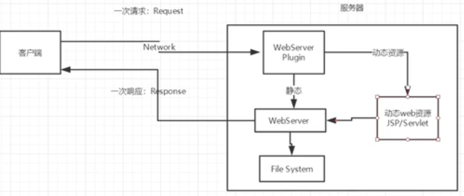

## Web

### Web基本概念

#### 前言

web：网页

- 静态网页：内容不发生变化，如博客
- 动态网页：内容时刻更新：如淘宝

在java中，动态web资源开发的基础统称为javaweb

#### web应用程序

由dos访问的程序：CS结构

web应用程序：可以提供浏览器访问的程序

- a.html、b.html.......多个web资源，这些web资源都可以被外界访问，对外界提供服务
-  我们能访问到的任何一个页面或者资源，都存在于这个世界的某一个角落的计算机上
-  通过URL访问到该计算机资源
-  这个统一的web资源会被放在同一个文件夹下，web应用程序 ——> Tomcat：服务器
- 一个web应用又多部分组成（静态web、动态web）：html，css，js；jsp、servlet；java程序；jar包；配置文件（Properties）

web应用程序编写完毕后，若想提供给外界访问，需要一个服务器来统一管理

#### 静态web

1、htm、html都是这些网页的后缀，如果服务器上一直存在这些东西，我们就可以直接进行读取、通络

一次请求（Request）：

客户端 —— Network ——> 服务器

一次相应（Response）：

服务器 —— Network ——> 客户端

2、静态web的缺点：

- web页面无法动态更新，所有用户看到的都是同一个页面 ——> 轮播图、javaScript、VBScript
- 他无法和数据库交互（数据无法持久化，用户无法交互）

#### 动态web

页面会动态展示：“Web的页面展示的效果因人而异”

在返回相应时经过动态资源：更新资源

缺点：

- 加入服务器的动态web资源出现错误，我们需要重新编写我们的后台程序 ——> 停机维护

优点：

- web页面可以动态更新
- 它可以与数据库交互（JDBC）：通过java程序去连接数据库 ——>数据持久化：注册、商品信息、用户信息......

### Web服务器

#### 技术讲解

ASP

- 微软：国内最早流行的就是ASP

- 在HTML中潜入了VB的脚本，ASP + C

- 在ASP开发中，基本一个页面都要几千行的业务代码

- ~~~html
  <h1>
      <h1>
          <%
          	System.out.println("wdnmd");
          %>
      </h1>
  </h1>
  ~~~

PHP

- PHP开发速度很快，功能很强大，跨平台，代码很简单（现在大部分网站都用php实现）
- 无法承载打访问量的情况（局限性）：限制在中量型网站

B/S：浏览器和服务器

C/S：客户端和服务器

JSP/Servlet

- sun公司（被甲骨文收购了）主推的B/S架构
- 基于java语言（所有的大公司或一些开源的组件都是用java写的）
- 可以承载三高问题带来的影响：高并发、高可用、高性能
- 语法像ASP，ASP ——> JSP，加强市场强度

#### web服务器

服务器时一种被动操作，用来处理用户的一些请求和给用户一些相应信息

**IIS**

微软的：ASP...Windows中自带的

**Tomcat**

~~~
Tomcat是Apache 软件基金会（Apache Software Foundation）的Jakarta 项目中的一个核心项目，由[Apache]、Sun 和其他一些公司及个人共同开发而成。由于有了Sun 的参与和支持，最新的Servlet 和JSP 规范总是能在Tomcat 中得到体现，Tomcat 5支持最新的Servlet 2.4 和JSP 2.0 规范。因为Tomcat 技术先进、性能稳定，而且免费，因而深受Java 爱好者的喜爱并得到了部分软件开发商的认可，成为目前比较流行的Web 应用服务器。

Tomcat 服务器是一个免费的开放源代码的Web 应用服务器，属于轻量级应用[服务器]，在中小型系统和并发访问用户不是很多的场合下被普遍使用，是开发和调试JSP 程序的首选。对于一个初学者来说，可以这样认为，当在一台机器上配置好Apache 服务器，可利用它响应[HTML]（[标准通用标记语言]下的一个应用）页面的访问请求。实际上Tomcat是Apache 服务器的扩展，但运行时它是独立运行的，所以当你运行tomcat 时，它实际上作为一个与Apache 独立的进程单独运行的。

诀窍是，当配置正确时，Apache 为HTML页面服务，而Tomcat 实际上运行JSP 页面和Servlet。另外，Tomcat和[IIS]等Web服务器一样，具有处理HTML页面的功能，另外它还是一个Servlet和JSP容器，独立的Servlet容器是Tomcat的默认模式。不过，Tomcat处理静态[HTML]的能力不如Apache服务器。目前Tomcat最新版本为10.0.5。
~~~

工作3-5年之后，可以尝试手写Tomcat

下载tomcat：

- 安装 / 解压
- 了解配置文件及目录结构
- 这个东西的作用

## Tomcat

> Tomcat 服务器是一个免费的开放源代码的Web 应用服务器，属于轻量级应用服务器，属于中间件
>
> Apache为HTML页面服务，而Tomcat实际上运行JSP 页面和Servlet。另外，Tomcat和IIS等Web服务器一样，具有处理HTML页面的功能，另外它还是一个Servlet和JSP容器，独立的Servlet容器是Tomcat的默认模式。不过，Tomcat处理静态HTML的能力不如Apache服务器

### 环境搭建

#### 安装 tomcat

tomcat官网：download

#### tomcat 启动和配置

bin：存放着运行脚本 ——> start.sh / shutdown.sh

可能遇到的问题：

- java环境遍历没有配置

- 闪退问题：需要配置兼容性

- 乱码问题：配置文件中设置 startup.bat（尽量不要改动）

webapps：存放着web资源 ——> /ROOT/index.jsp即为8080主页，可在其中修改网页内容

~~~html
<!--如下为导航栏设置，修改Home为NorthBoat-->

                <a href="${tomcatUrl}">NorthBoat</a>
                <a href="${tomcatDocUrl}">Documentation</a>
                <a href="${tomcatDocUrl}config/">Configuration</a>
                <a href="${tomcatExamplesUrl}">Examples</a>
                <a href="https://wiki.apache.org/tomcat/FrontPage">Wiki</a>
                <a href="${tomcatUrl}lists.html">Mailing Lists</a>
                <a href="${tomcatUrl}findhelp.html">Find Help</a>
                 
            

~~~

conf（config文件夹）：server.xml（服务器配置）

通过修改 server.xml 文件中 Host name 和 C:/Windows/system32/drivers/etc/hosts 文件修改主页域名

~~~
server.xml:
<Host name="www.NorthBoat.com"  appBase="webapps"
            unpackWARs="true" autoDeploy="true">
hosts:
# localhost name resolution is handled within DNS itself.
#	127.0.0.1       localhost
#	::1             localhost
	127.0.0.1       www.NorthBoat.com
~~~

- tomcat默认端口号：8080
- http默认端口号：80
- https默认端口号：443
- mysql默认端口号：3306

**网站时如何进行访问的**

1、输入一个域名，回车

2、检查本机的 C:\Windows、System32\drivers\etc\hosts

- 有：直接返回对应的ip地址，即这个地址中有我们需要访问的web程序
- 没有：在DNS（管理全世界的域名）上寻找域名，找到的话就返回对应ip地址（即网页），找不到则返回找不到

配置环境变量

### 基本使用

#### 发布一个 web

- 将自己写的网站，放到服务器（Tomcat）中只指定web应用的文件夹（webapps）下，就可以访问了

网站应有的结构

~~~
--webapps：Tomcat服务器的web目录
    -ROOT
    -NorthBoat：网站的目录名
    	-WEB-INF
    		-classes：java程序
    		-lib：web应用所依赖的jar包
    		-web.xml
    	-index.html：默认的首页
    	-static
    		-css
    			-style.css
    		-js
    		-img
    	-...
~~~

## HTTP

### 简介

#### 什么是HTTP

超文本传输协议（Hypertext Transfer Protocol，HTTP）是一个简单的请求-响应协议，它通常运行在 TCP 之上

- 文本：html、字符串......
- 超文本：图片、音乐、视频、定位、地图......
- http默认端口：80
- https（s：安全的）：443

#### 两个时代

1、http1.0

- HTTP/1.0：客户端可以与web服务器连接后，只能获得一个web资源，获得后断开连接

2、http2.0

- HTTP/1.1：客户端与web服务器连接后，可以获得多个web资源

### 请求和相应

#### Http请求

客户端 —— 发请求（request） ——> 服务器

以百度为例

通用

~~~
//刷新百度页面时抓包
//f12 ——> network

Request URL: https://www.baidu.com/	 请求地址
Request Method: GET		请求方法（get / post）
Status Code: 200 OK		状态码：200
Remote Address: 110.242.68.3:443	ip地址
Referrer Policy: strict-origin-when-cross-origin
~~~

##### 请求行

- 请求行中的请求方式：GET
- 请求方式：GET、post、head、delete、put、tract...
  - get：请求能携带的参数较少，大小有限制，会在浏览器URL栏中显示数据，不安全
  - post：参数、大小没有限制，不会在URL中显示，但不高效

##### 消息头

~~~
Accept: text/html：接受文件类型
Accept-Encoding: gzip, deflate, br：编码方式
Accept-Language: zh-CN,zh;q=0.9,en;q=0.8：语言
Cache-Control: max-age=0：缓存控制
Connection: keep-alive：告诉浏览器，请求完成时断开开始保持连接
Refresh：告诉客户端多久刷新一次
~~~

#### Http响应

服务器 —— 响应 ——> 客户端

响应：

~~~
Cache-Control: private		缓存控制
Connection: keep-alive		连接：保持连接
Content-Encoding: gzip		编码方式
Content-Type: text/html;charset=utf-8		文本格式
Date: Sat, 22 May 2021 09:21:43 GMT		响应时间
Strict-Transport-Security: max-age=172800		一个保证安全的脚本
~~~

##### 响应体

~~~
Accept: text/html：接受文件类型
Accept-Encoding: gzip, deflate, br：编码方式
Accept-Language: zh-CN,zh;q=0.9,en;q=0.8：语言
Cache-Control: max-age=0：缓存控制
Connection: keep-alive：告诉浏览器，请求完成时断开开始保持连接
Refresh：告诉客户端多久刷新一次
~~~

##### 响应状态码

200：请求响应成功

3xx：请求重定向

4xx：找不到资源（404）

5xx：服务器代码错误（500、502：网关错误）

**当你的浏览器中地址栏输入地址并回车的一瞬间到页面能够展示回来，经历了什么？**

查询ip/域名，三次握手建立连接，服务端返回一个html页面，浏览器渲染展示

