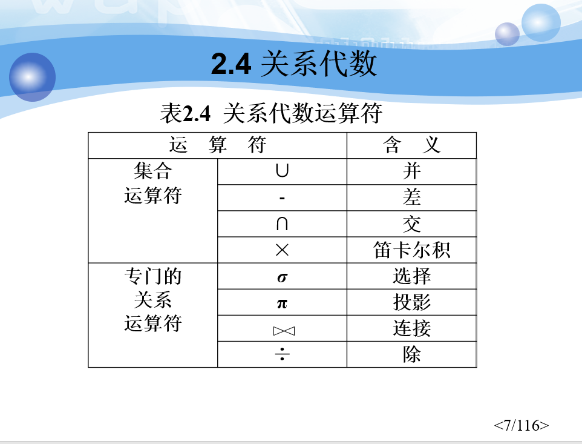

> 数据库原理
>
> - 使用DBMS开发应用软件
> - 开发DBMS的关键技术

## 绪论

### 数据库系统概述

#### 四个基本概念

数据（Data）：存储的基本对象

数据库（Data Base）：数据的集合（本地文件）

数据库管理系统（DBMS）：位于用户和操作系统之间的一层数据管理软件（如MySQL），属于基础软件

- DBMS的结构从外到内分别为

  - 应用层：处理数据库应用，与用户交互
  - 语言翻译处理层：处理SQL语言
  - 数据存取层：处理单个元组，把集合操作转化为单记录操作并执行
  - 数据存储层：处理数据页和系统缓冲区

- DBMS直接与操作系统打交道，由操作系统读写本地文件（数据库）返回给数据库管理系统

  数据库管理系统和数据库并不直接通信，而是通过操作系统连接

DBMS的主要功能：

- 数据定义（DDL）：定义数据对象
- 数据组织、存储和管理：建立数据联系，确定存取方式等
- 数据操纵（DML）：数据的增删改查
- 数据库的事务管理和运行管理：并发、安全性、修复等
- 数据库的建立和维护

数据库系统：和操作系统位于同一架构平台，由以下部分组成

- 数据库
- 数据库管理系统
- 应用系统、用户
- 数据库管理员

#### 数据管理技术的产生和发展

数据管理：对数据进行分类、组织、编码、存储、检索和维护

发展过程：

- 人工管理阶段
- 文件系统阶段
- 数据库系统阶段

#### 数据库系统特点

数据结构化

数据的共享性高，冗余度低，易扩充

数据独立性高

- 物理独立性
- 逻辑独立性

数据由DBMS统一管理和控制

- 安全性保护（security）
- 完整性检查（integrity）
- 并发控制（concurrency）
- 数据库恢复（recovery）

### 数据模型

#### 两大类数据模型

两大数据模型：

- 概念模型

  - 又称信息模型，按需求对信息建模，用于数据库设计

- 逻辑模型和物理模型

  - 逻辑模型主要包括网状、层次、关系模型

  - 物理模型是对数据最底层的抽象，即数据结构，由DBMS实现

数据库设计的两步抽象：

- 将现实逻辑关系抽象为`E-R`图
- 将`E-R`图转化为关系表

#### 概念模型

- 实体：学生
- 属性：年龄等
- 码：学号
- 值域：属性的取值
- 实体型：实体+属性
- 实体集：同类型实体的集合
- 联系：逻辑联系

E-R图中，联系用菱形表示用于连接矩形的实体型，实体型由实体和属性构成，属性由椭圆形表示

有一对一联系、一对多联系、多对多联系

#### 数据模型组成

数据模型由以下三部分组成

- 数据结构
- 数据操作
- 完整性约束条件

数据结构：就是指数据的属性、联系等特征

数据操作：如增删改查，这里强调数据被允许的操作

完整性约束条件：如某一属性非空，如有外键

#### 最常用的逻辑数据模型

- 层次模型
- 网状模型
- 关系模型
- 面向对象数据模型
- 对象关系数据模型
- 半结构化数据模型

#### 层次模型

树形结构

存储方法：

- 邻接法
- 子女-兄弟链接法

优点：

- 数据结构简单清晰
- 查询效率高，优于关系模型，不低于网状模型
- 良好的完整性支持

缺点：

- 多对多不好表示
- 插入删除不方便
- 查询子女必须通过双亲
- 结构严密导致层次命令趋于程序化

#### 网状模型

在树形结构的基础上

- 允许一个以上的节点无双亲
- 一个节点可以有多于一个双亲
- 允许两个节点之间有多种联系（双亲多了）
- 更直接地描述现实世界，多对多更加自然
- 层次模型是网状模型地一个特例

#### 关系模型

现在常用的二维表形式

- 关系：一个关系对应一张表
- 元组：一行
- 属性：一列
- 主码：主键，唯一确定
- 域：属性取值范围
- 分量：元组中一个属性值
- 关系模式：对关系的描述（实体型，关系名+属性）

优点：

- 有严格的数学概念基础
- 概念单一
- 存取路径对用户透明

缺点：

- 存取路径透明导致查询效率降低
- 为了提高效率必须优化用户的查询语句，提高DBMS开发难度

### 数据库系统结构

基本概念：

- 型与值：类和对象的关系
- 模式：类
- 实例：对象

从开发者角度，数据库通常为**三级模式结构**，是数据库系统内部的系统结构，分为

- 模式：逻辑模式，公共数据视图（一个数据库只有一个模式）
- 外模式：用户的数据视图
- 内模式：存储模式，物理结构和存储方式的描述

三种模式这样连接：

- 应用(n) - 外模式(n) - 模式(1) - 内模式(1) - 数据库(1)

二级映像：实现三个模式的联系和转换

- 外模式/模式映像：保证数据逻辑独立性
- 模式/内模式映像：保证数据物理独立性

从用户角度，数据库常分为以下结构

- 单用户结构
- 主从式结构
- 分布式结构
- 客户/服务器
- 浏览器/应用服务器/数据库服务器多层结构等

### 数据库系统组成

- 硬件平台及数据库
- 软件
- 人员

## 关系数据库

### 关系数据结构和形式化定义

#### 关系

概念

- 关系：表示现实世界的实体和实体间的联系
- 二维表：在关系模型中，用二维表表示逻辑结构
- 建立在集合代数基础上
- 域：就是一个集合，值的集合，如`D={1,2}`

笛卡尔积：域之间相乘，如`D1=(1,2),D2=(3,4)`，则`D1xD2=({1,3},{1,4},{2,3},{2,4})`，就是从每个域中取一个值构成一系列值的集合，笛卡尔积为值的集合的集合

- 元组：笛卡尔积中的一组值
- 分量：笛卡尔积一组值中的某个值

笛卡尔积对应二维表：

- 每行对应一个元组（一条记录）
- 每列对应一个域（某个属性）

关系是笛卡尔积的子集（笛卡尔积包含了所有情况，而关系是现实的映射，并不全面）

- 元组：关系中的每个元素
- 属性数为1，称为单元关系，属性数为2，称为二元关系，n目关系对应n个属性
- 关系同样是一个二维表
- 码：唯一标识符，可以是单个属性，可以是属性组（候选码）
- 全码：最极端的情况，全部属性都是候选码

三类关系

- 基本关系：存储的表
- 查询表：结果表
- 视图表：虚表

注意：分量必须是原子值，即不可拆分

#### 关系模式

关系模式是型，建表的时候规定的属性参数，而关系是插入的具体值

#### 关系数据库

在给定的应用领域中，关系的集合构成一个关系数据库

#### 关系模型的存储结构

物理组织

- 有的一个表对应一个操作系统文件，将物理数据组织交给操作系统完成
- 有的从操作系统申请若干大空间，自己划分文件空间、组织表、索引等

### 关系操作

常见关系操作

- 查询：选择、投影、连接、除、并、交、差、笛卡尔积
  - 5种基本操作：选择、投影、并、差、笛卡尔积
- 数据更新：插入、删除、修改

关系操作特点：对象和结果都是集合

数据库语言分类

- 关系代数语言：`ISBL`
- 关系演算语言
  - 元组关系演算语言：`APLHA`
  - 域关系演算语言：`QBE`
- 具有关系代数和关系演算双重特点的语言：`SQL`

### 关系的完整性

实体完整性

- 主属性（候选码属性）不为空

参照完整性

- 外键要么为空，要么为其他关系的主键值

用户定义完整性

- 用户应该自定义一些规则，而不应全由数据库承担筛选的功能

### 关系代数

关系的并：不是连接，针对结构完全相同的两张表，合并成一张不含重复行的大表

关系的差：同样作用于结构相同的两张表，`R-S`表示在`R`中减去与`S`相同的行构成的集合，`S-R`表示在`S`中减去与`R`相同的行构成的集合

关系的交：取两个关系相同的行组成新的集合

笛卡尔积：如图，莽夫连接

引入几个记号：

设有`m`目关系`R`，元组`t∈R`，`R`的关系模式为`R(A1,A2,...,An)`

- `t[Ai]`表示元组`t`在属性`Ai`上的分量

设有另一`n`目关系`S`，`t1∈S`

- `tt1（上弧连接）`称为元组的连接，构成新的`m+n`目元组

象集：在某一关系中固定某一属性，其余属性值构成的集合的集，如对于以下关系

| X    | Z    |
| ---- | ---- |
| `x1` | `z1` |
| `x1` | `z2` |
| `x2` | `z1` |

`x1`的象集为`{z1,z2}`，`x2`的象集为`{z1}`

选择运算：就是带条件查询语句，条件可以是大于等于小于等等

投影运算：从原关系`R`中选出若干属性列构成新的关系，从列的角度进行运算，新的关系中可能会删除某些重复元组

连接运算：从行的角度进行运算

- 一般连接：关系连接时附带某种条件，如`R`中的`E`属性大于`S`中的`F`属性，在连接时不合并相同的属性，如`R.B`和`S.B`要分开

- 等值连接：一般连接的条件为等于，此时为等值连接

- **自然连接**：对公共列的相同值进行融合（`mysql`中的连接）

  这样肯定会摒弃掉一些行，即`S,R`中公共列不匹配的值，这样的行称为**悬浮元组**

  

自然连接根据悬浮元组的处理方式分为以下三种

- 外连接：保留所有悬浮元组，在不存在的属性上用NULL填充
- 左外连接：保留左边关系的悬浮元组，而摒弃右边关系的
- 右外连接：保留右边关系的悬浮元组，同样用NULL填充

什么外连接就保留什么的悬浮元组

关系的除运算：`R➗S`包含所有在`R`但不在`S`中的属性及其值

- 差运算作用于结构相同的关系，在被减关系中去掉相同的行，即保留在被减关系但不在减关系中的行

用象集表示除运算

### 关系演算

略

## 关系数据库标准语言SQL

> Structured Query Language

### 概述

86年美国佬`IBM`公司提出，没有一个数据库能支持SQL标准的所有概念和特性

特点：

- 综合统一
- 高度非过程化
- 面向集合的操作方式
- 以同一种语法结构提供多种使用方式
- 简单易学

支持三级模式结构（外模式、模式、内模式）

- 基本表
- 存储文件
- 视图

### 模式的定义和删除

> 模式（schema）是数据库体系结构中的一个节点，是为用户创建一个架构（命名空间）是用于在一个大项目中的各个小项目。每个小项目的表，放在各自的模式（schema） 下面。这样，遇到小项目里面有相同名字的表的话, 不会发生冲突
>
> 对于 SQL Server 数据库来说。访问具体的一个表，可以由 4个部分组成，分别为 服务器名， 数据库名，模式名，表名

每个基本表都属于某一个模式，一个模式包含多个基本表

~~~sql
#为用户ZHANG创建了一个模式TEST，并在其中定义了一个表TAB1
CREATE SCHEMA TEST AUTHORIZATION ZHANG 
CREATE TABLE TAB1(
    COL1 SMALLINT， 
    COL2 INT，
    COL3 CHAR(20)，
    COL4 NUMERIC(10，3)，
    COL5 DECIMAL(5，2)
);

#CASCADE(级联)删除模式的同时把该模式中所有的数据库对象全部删除
#RESTRICT(限制)如果该模式中定义了下属的数据库对象（如表、视图等），则拒绝该删除语句的执行。当该模式中没有任何下属的对象时 才能执行。
drop schema <模式名> <cascade|restrict>

#在某个模式下创建表
Create table “S-T”.Student(......);   /*模式名为 S-T*/
Create table “S-T”.Cource(......);
Create table “S-T”.SC(......); 
~~~

### 数据类型定义值域

域：即属性的取值范围

| 数据类型           | 含义                                 |
| ------------------ | ------------------------------------ |
| `char(n)`          | 长度为n的定长字符串                  |
| `varchar(n)`       | 最大长度为n的变长字符串              |
| int                | 长整数                               |
| `smallint`         | 短整数                               |
| `numeric(p,d)`     | 定点数，p位整数，d位小数             |
| real               | 浮点数，精度取决于机器精度           |
| `double precision` | 双精度浮点数，精度取决于机器精度     |
| `float(n)`         | 精度位n位数字的浮点数                |
| `date`             | 日期，包含年月日，格式：`YYYY-MM-DD` |
| `time`             | 事件，时分秒，格式：`HH:MM:SS`       |
| `clob`             | 字符串大对象                         |
| `blog`             | 二进制大对象                         |
| `timestamp`        | 时间戳                               |
| `interval`         | 时间间隔                             |

### 索引的建立与删除

索引：字典目录

通常，DBMS会自动在`primary key, unique`修饰的属性上建立索引

索引一般采用B+树或HASH索引来实现

- B+树有动态平衡的特点
- HASH索引查找速度更快
- 建立索引方式由`RDBMS(关系数据库管理系统)`决定

在`Student`表的`sdept`属性上建立名叫`Stusdept`的聚簇索引

~~~sql
CREATE CLUSTER INDEX Stusdept ON Student(Sdept);
~~~

在`Student`表的`score`属性上建立名叫`Stuscore`的唯一索引

~~~sql
CREATE unique INDEX Stuscore ON Student(score);
~~~

注意：

- 一个基本表最多只能建立一个聚簇索引
- 经常更新的列不宜建立聚簇索引
- 在最经常查询的列上建立聚簇索引可以提高查询效率

修改索引：将索引名`SCno`改为`SCSno`

~~~sql
ALTER INDEX SCno RENAME TO SCSno;
~~~

删除索引：删除Student表的Stusdept索引

~~~sql
DROP INDEX Stusdept;
~~~

### 数据查询

#### 关键字

- select：指定要查询的列或表达式
- from：指定查询对象
- where：指定查询条件
- group by：分组
- having：满足条件
- order by：排序
- distinct：去重

空值处理：`is null/is not null`

确定范围：`between ... and .../not between ... and ...`

- 也可以用大于小于和`and`实现

确定集合：`in/not in`，表示在集合中

- ~~~sql
  SELECT Sname，Ssex FROM  Student WHERE Sdept IN ( 'IS'，'MA'，'CS' );
  ~~~

字符匹配：`like '匹配串'`，匹配串中可包含通配符

- %：代表任意长度的字符串，如`'a%b'`表示a开头b结尾的任意长度字符串
- _：表示任意单个字符

多重查询：`and/or`，用于连结条件

- `and`优先级高于`or`

聚集函数

- count：计数
- sum：求和
- avg：求均值
- max：最大
- min：最小

#### 连接查询

等值连接：条件判断为等于

~~~sql
SELECT  Student.*, SC.*
FROM     Student, SC
WHERE  Student.Sno = SC.Sno;
~~~

自然连接：相同属性连接

~~~sql
SELECT  Student.Sno,Sname,Ssex,Sage,Sdept,Cno,Grade
FROM     Student,SC
WHERE  Student.Sno = SC.Sno;
~~~

非等值连接：条件判断不为等于

~~~sql
SELECT Student.Sno, Sname
FROM   Student, SC
WHERE  Student.Sno=SC.Sno  AND                     
       SC.Cno=' 2 ' AND SC.Grade>90;
~~~

自身连接：同一张表连接不同属性

~~~sql
SELECT  FIRST.Cno，SECOND.Cpno
FROM  Course  FIRST，Course  SECOND
WHERE FIRST.Cpno = SECOND.Cno;
~~~

外连接：就是和另一张表连接

~~~sql
SELECT  Student.*, SC.*
FROM    Student, SC
WHERE   Student.Sno = SC.Sno;
~~~

- 左外连接：列出左边表的所有元组
- 右外连接：列出右边
- 全连接：列出左右所有满足的元组

多表连接

~~~sql
SELECT Student.Sno, Sname, Cname, Grade
FROM   Student, SC, Course    /*三个表连接*/
WHERE  Student.Sno = SC.Sno 
AND    SC.Cno = Course.Cno;
~~~

#### 嵌套查询

一个`SELECT-FROM-WHERE`语句称为一个查询块

将一个查询块嵌套在另一个查询块的`WHERE`子句或`HAVING`短语的条件中的查询称为嵌套查询

~~~sql
SELECT Sname	    /*外层查询/父查询*/
FROM Student
WHERE Sno IN
( SELECT Sno        /*内层查询/子查询*/
  FROM SC
  WHERE Cno= ' 2 ');
~~~

- 上层的查询块：外层查询、父查询
- 下层：内层查询、子查询
- 注意：子查询不能使用`ORDER BY`子句，`ORDER BY`子句只能对最终结果排序

带谓词`IN`的子查询

~~~sql
SELECT Sno，Sname            #最后在Student关系中
FROM   Student               #取出Sno和Sname
WHERE Sno  IN
	(SELECT Sno              #然后在SC关系中找出选
     FROM    SC              #修了3号课程的学生学号
     WHERE  Cno IN
     	(SELECT Cno         #首先在Course关系中找出
         FROM Course     	# “信息系统”的课程号，为3号
         WHERE Cname= ‘信息系统’));
~~~

注意：当内层循环只返回一个值时，可以用`=`代替`in`，如

~~~sql
SELECT Sno,Sname,Sdept
FROM    Student
WHERE Sdept =
      (SELECT Sdept
       FROM   Student
       WHERE  Sname= '刘晨'); #名字唯一
~~~

带比较运算符的子查询

~~~sql
SELECT Sno， Cno
FROM  SC  x
WHERE Grade >= (SELECT  AVG(Grade) 
                FROM    SC y
                WHERE   y.Sno=x.Sno);
~~~

- 子查询返回单值时可以直接使用比较运算符
- 当返回多值时必须用`ANY/ALL`修饰

如：

~~~sql
SELECT  Sname，Sage
FROM    Student
WHERE   Sage < ANY (SELECT  Sage
                    FROM    Student
                    WHERE Sdept= ' CS ');
~~~

带`exists/not exists`的子查询：不返回任何数据，只返回真或假，即判断是否存在

- 当为真，放入查询结果集
- `exists`后的内容通常用`select *`因为只返回真假，查什么并不重要

如：查询选了1号课的学生名字

~~~sql
SELECT Sname
FROM Student
WHERE EXISTS
     (SELECT *
      FROM SC
      WHERE Sno=Student.Sno AND Cno= ' 1 ');
      
# 等价的连接查询
SELECT Sname
	FROM Student, SC
	WHERE Student.Sno=SC.Sno AND SC.Cno= '1';

# 等价的IN查询
SELECT Sname
FROM Student
WHERE Student.Sno  IN（
       SELECT Sno
       FROM SC
       WHERE SC.Cno= ‘1’）；;
~~~

#### 集合查询

并操作`union` ——> `or`

交操作`intersect` ——> `and`

差操作`except`

- 集合操作要求参与查询的集合的列属性相匹配，数量和类型必须相同

查询CS系或年龄小于19的学生

~~~sql
SELECT * FROM Student WHERE Sdept= 'CS'
UNION
SELECT * FROM Student WHERE Sage<19;

# 等价于
SELECT * FROM Student
         WHERE Sdept= 'CS'  OR  Sage<=19;
~~~

查询CS系且年龄小于19的学生

~~~sql
SELECT * FROM Student WHERE Sdept='CS' 
INTERSECT
SELECT * FROM Student WHERE Sage<19 ;

# 等价于
SELECT * FROM Student
         WHERE Sdept= 'CS' AND  Sage<=19;
~~~

查询CS系且年龄**不**小于19的学生

~~~sql
SELECT * FROM Student WHERE Sdept='CS'
EXCEPT
SELECT * FROM Student WHERE Sage <=19;

# 等价于
SELECT * FROM Student
         WHERE Sdept= 'CS' AND  Sage>=19;
~~~

#### 基于派生表的查询

即在`from`后接的表中使用派生表

如：查询每个学生超过自己选修课程平均成绩的课程号

~~~sql
SELECT  Sno, Cno
FROM  SC, (SELECT Sno, Avg(Grade) FROM SC GROUP BY  Sno)
           AS Avg_sc(avg_sno, avg_grade)
WHERE SC.Sno=Avg_sc.avg_sno and SC.Grade>=Avg_sc.avg_grade;
~~~

### 数据更新

批量插入数据

~~~sql
INSERT INTO 
student (sno,sname,sage) 
VALUES
(1,'张三',1),
(2,'李四',2),
(3,'王五',3);
~~~

修改：将CS系学生成绩置零

~~~sql
UPDATE SC
SET  Grade=0
WHERE  'CS'=
       (SELECT Sdept
        FROM   Student
        WHERE  Student.Sno = SC.Sno);
~~~

删除：

~~~sql
DELETE FROM Student WHERE Sno= '201215128';
DELETE FROM SC;
DELETE FROM SC WHERE 'CS'=
       (SELETE Sdept
        FROM Student
        WHERE Student.Sno=SC.Sno);
~~~

### 视图

视图的特点：

- 虚表，是从一个或几个基本表（或视图）导出的表
- 只存放视图的定义，不存放视图对应的数据
- 基表中的数据发生变化，从视图中查询出的数据也随之改变

建立视图

~~~sql
CREATE VIEW IS_Student
AS 
SELECT Sno，Sname，Sage
       FROM   Student
       WHERE  Sdept= 'IS';
~~~

`WITH CHECK OPTION`选项：若建立视图时加入该语句，在对视图进行操作时，将自动加上建立时的条件，如上述例子会自动加上`Sdept='IS'`的条件

- 修改操作：自动加上`Sdept= 'IS'`的条件
- 删除操作：自动加上`Sdept= 'IS'`的条件
- 插入操作：自动检查`Sdept`属性值是否为`'IS'` 

删除视图：若视图导出了其他的视图，将不能直接删除，需要联级删除

~~~sql
DROP VIEW IS_Student;
# 联级删除
DROP VIEW IS_S1 CASCADE
~~~

查询视图时，将视图视作基本表查询即可

## 数据库安全性

### 概述 

共享 ——> 安全问题

- 数据库恶意存取和破坏
- 重要敏感数据泄露
- 环境的安全性：硬件、操作系统、网络系统等

安全标准

- `TCSEC/TDI`标准：安全策略、责任、保证、文档
  - A级（`A1`）：验证设计
  - B级（`B3,B2,B1`）：
    - `B3`：安全域
    - `B2`：结构化保护
    - `B1`：标记安全保护
  - C级
    - `C2`：安全产品最低档次
    - `C1`：初级的自主安全保护
  - D级（`D`）：一切不符合上述标准的系统，如DOS是安全标准为D的`OS`
- `CC`标准：目前使用的标准，组成
  - 简介和一般模型
  - 安全功能要求
  - 安全保证要求

### 安全控制

安全措施是一层层的：用户 - DBMS - OS - DB

- 合法用户进入系统
- DBMS规范用户合法操作
- 操作系统自己的防护措施
- 数据以密码的形式存于DB

数据库安全性控制常用方法：

- 用户标识和鉴定
  - 静态口令
  - 动态口令
  - 生物特征
  - 智能卡：不可复制的硬件芯片
- 存取控制
  - 定义用户权限
  - 合法权限检查
- 视图
- 审计
- 密码存储、数据加密

定义用户存取权限：`grant/revoke`

~~~sql
# 赋予用户U1表student的查询权限
GRANT SELECT 
ON    TABLE   Student 
TO    U1;

# 赋予用户U2,U3表student、course的全部权限
GRANT ALL PRIVILIGES 
ON TABLE Student, Course 
TO U2, U3;

# 赋予所有用户SC的查询权限
GRANT SELECT 
ON TABLE SC 
TO PUBLIC;

# 赋予用户U4表student属性Sno的修改权限
GRANT UPDATE(Sno), SELECT 
ON TABLE Student 
TO U4;

# 赋予U5表SC的插入权限，并且允许其将该权限赋予其他人
GRANT INSERT 
ON TABLE SC 
TO U5
WITH GRANT OPTION;
~~~

- `with grant option`即赋予`赋予别人`的权限
- 将`grant`换成`revoke`，将`to`换成`from`，即为收回权限

创建角色并赋予权限

~~~sql
CREATE  ROLE  R1;
GRANT SELECT，UPDATE，INSERT 
      ON TABLE Student 
      TO R1;
~~~

通过角色赋予、收回权限：将一次赋予、收回R1上的所有权限

~~~sql
GRANT R1 TO U1,U2,U3
REVOKE R1 FROM U1;
~~~

### 视图机制

将基本表隐藏起来，只露出基本表的视图并只给予用户视图的权限

- 提供数据独立性

~~~sql
CREATE VIEW CS_Student
AS 
SELECT  *
FROM   Student
WHERE  Sdept='CS';

GRANT SELECT ON  CS_Student TO 王平 ;
~~~

### 审计

审计即审计日志，`C2`以上安全级别的`DBMS`必须具有审计功能

`audit`语句：设置审计功能，如在表SC上设置修改和更改数据的审计

~~~sql
AUDIT ALTER，UPDATE ON  SC；
~~~

`noaudit`语句：取消审计功能

~~~sql
NOAUDIT ALTER，UPDATE ON  SC；
~~~

### 数据加密

明文变换为不可直接识别的密文

- 存储加密
- 传输加密

基于安全套接层协议`SSL`传输方案的实现思路：

1. 确认通信双方端点的可靠性采用基于数字证书的服务器和客户端认证方式

   通信时均首先向对方提供己方证书，然后使用本地的CA 信任列表和证书撤销列表对接收到的对方证书进行验证

2. 协商加密算法和密钥

   确认双方端点的可靠性后，通信双方协商本次会话的加密算法与密钥

3. 可信数据传输

   业务数据在被发送之前将被用某一组特定的密钥进行加密和消息摘要计算，以密文形式在网络上传输

   当业务数据被接收的时候，需用相同一组特定的密钥进行解密和摘要计算

## 数据库完整性

数据库的完整性：

- 数据正确性：符合现实，反映实际情况
- 数据的相容性：如学号唯一，性别只能是男女，课程必须是学校正式开设的

和数据库的安全性是两个不同的概念

- 完整性
  - 防止数据库中存在不符合语义的数据，也就是防止数据库中存在不正确的数据
  - 防范对象：不合语义的、不正确的数据
- 数据的安全性
  - 保护数据库 防止恶意的破坏和非法的存取
  - 防范对象：非法用户和非法操作

### 实体完整性

实体完整性用`primary key`定义

- 单属性的主键同时为列级和表级约束条件
- 多属性的码只为表级的约束条件

实体完整性的检查和处理

- 检查主码值是否唯一**，**如果不唯一则拒绝插入或修改
- 检查主码的各个属性是否为空，只要有一个为空就拒绝插入或修改

### 参照完整性

参照完整性用`foreign key`定义，用`references`标明是哪张表的哪个属性

~~~sql
CREATE TABLE SC
(     
      Sno    CHAR(9)  NOT NULL, 
      Cno     CHAR(4)  NOT NULL,  
      Grade    SMALLINT,
      PRIMARY KEY (Sno, Cno),   /*在表级定义实体完整性*/
      FOREIGN KEY (Sno) REFERENCES Student(Sno),  
      /*在表级定义参照完整性*/
      FOREIGN KEY (Cno) REFERENCES Course(Cno)   
      /*在表级定义参照完整性*/
);
~~~

- SC为参照表，Student和Course为被参照表

参照完整性的检查和处理

| 被参照表           | 参照表             | 处理                   |
| ------------------ | ------------------ | ---------------------- |
| 可能破坏参照完整性 | 插入元组           | 拒绝                   |
| 可能破坏参照完整性 | 修改外码值         | 拒绝                   |
| 删除元组           | 可能破坏参照完整性 | 拒绝/联级删除/设为空值 |
| 修改主码值         | 可能破坏参照完整性 | 拒绝/联级删除/设为空值 |

### 用户定义完整性

针对某一具体应用的数据必须满足的语义要求

#### 属性上的约束条件的定义

创建表时定义

- not null
- unique
- check：检查列值是否满足一个布尔表达式

~~~sql
CREATE TABLE Student
(      Sno  CHAR(9) PRIMARY KEY,
       Sname CHAR(8) unique,
	  /*性别属性Ssex只允许取'男'或'女' */
       Ssex  CHAR(2)  check (Ssex IN ('男'，'女')),
       Sage  SMALLINT not null,
       Grade   SMALLINT CHECK (Grade>=0 AND Grade <=100),
       Sdept  CHAR(20)
);
~~~

#### 元组上的约束条件的定义

定义了元组中`Sname`和`Ssex`两个属性值之间的约束条件，只接受`Ssex`为女或`Sname`以`Ms`开头的元组

~~~sql
CREATE TABLE Student
(      Sno    CHAR(9),
       Sname  CHAR(8) NOT NULL,
       Ssex    CHAR(2) CHECK (Ssex IN ('男'，'女')),
       PRIMARY KEY (Sno),
       CHECK (Ssex='女' OR Sname NOT LIKE 'Ms.%')
)；
~~~

### 完整性约束子句

使用`constraint`定义约束条件

~~~sql
CREATE TABLE Student
(	Sno  NUMERIC(6),
    CONSTRAINT C1 CHECK (Sno BETWEEN 90000 AND 99999),
    Sname  CHAR(20),
    CONSTRAINT C2 NOT NULL,
    Sage  NUMERIC(3),
    CONSTRAINT C3 CHECK (Sage < 30),
    Ssex  CHAR(2),
    CONSTRAINT C4 CHECK (Ssex IN ( '男'，'女')),
    CONSTRAINT C5 PRIMARY KEY(Sno)
);
~~~

- 在`Student`表上建立了5个约束条件C1、C2、C3、C4、C5

~~~sql
CREATE TABLE TEACHER
(      Eno NUMERIC(4)  PRIMARY  KEY
       Ename CHAR(10),
       Job  CHAR(8),
       Sal NUMERIC(7,2),
       Deduct NUMERIC(7,2),
       Deptno NUMERIC(2),
       CONSTRAINT  Eno FOREIGN KEY (Deptno)
       REFERENCES DEPT (Deptno),
       CONSTRAINT C1 CHECK (Sal + Deduct >= 3000)
);
~~~

- 要求每个教师的应发工资不低于3000元：应发工资等于实发工资Sal与扣除项Deduct之和

### 断言

创建断言`assertion`要求一个学期一门课最多150人选修

~~~sql
CREATE ASSERTION assertion1
CHECK(150 >= ALL (SELECT count(*)                             		FROM SC
	  GROUP by cno,TERM)
);
~~~

- 根据课程号和学期分组，确定是**一个学期一门课**

删除断言

~~~sql
DROP ASSERTION assertion1
~~~

### 触发器

触发器分为

- 行级触发器
- 语句级触发器

其区别在于：假设在TEACHER表上创建一个AFTER UPDATE触发器，触发事件是UPDATE语句：UPDATE TEACHER SET Deptno=5;

假设表TEACHER有1000行

- 如果是语句级触发器，那么执行完该语句后，触发动作只发生一次
- 如果是行级触发器，触发动作将执行1000次

定义触发器

~~~sql
create trigger  SC_T		
after update of `Grade` on SC
referencing
	OLD row AS OldTuple, #声明老行的别名
	NEW row AS NewTuple, #声明新行的别名
for each row 	
when (NewTuple.Grade >= 1.1*OldTuple.Grade)
insert into SC_U(Sno,Cno,OldGrade,NewGrade)  
values (OldTuple.Sno,OldTuple.Cno,OldTuple.Grade,NewTuple.Grade);
~~~

- `update`后用`of 列名`来表明绑定修改的列
- `after`申明触发在修改之后
- `REFERENCING NEW|OLD ROW AS`声明新老行的名字

~~~sql
CREATE TRIGGER Student_Count
AFTER INSERT ON Student  /*指明触发器激活的时间是在执行INSERT后*/     
REFERENCING
     NEW TABLE AS DELTA /*声明新表的别名为DELTA*/
FOR EACH STATEMENT /*语句级触发器, 即执行完INSERT语句后下面的触发动作体才执行一次*/
INSERT INTO StudentInsertLog (Numbers)
SELECT COUNT(*) FROM DELTA
~~~

激活触发器，一条语句被执行时，遵循以下顺序

- 执行该表上的BEFORE触发器
- 激活触发器的SQL语句
- 执行该表上的AFTER触发器

删除触发器：DROP TRIGGER <触发器名> ON <表名>
