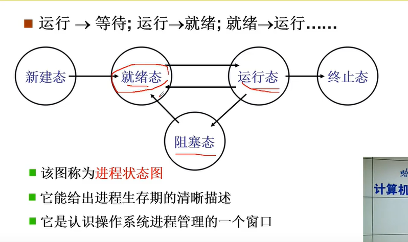

> 哈工大网课

## 引论

### 操作系统简介

#### 沟通软件和硬件的桥梁

第一层：硬件

第二层：操作系统

第三次：应用软件

#### 四个实验

1、扩展线程：实现线程调度

2、实现系统调用：将整个接口剥掉，添加

3、实现虚存管理：扩展实现内存管理

4、扩展文件系统：扩展实现一个文件管理

### 操作系统的启动

图灵机 ——> 通用图灵机：取指执行（逻辑+数据）（取的是PC/IP指针指向的地址）

#### 将操作系统读入内存

取指执行：取内存中地址

打开计算机的第一条指令

Bootsect.s：

~~~
Bootsect.s（读入操作系统）：

1、x86 PC刚开机时cpu处于实模式
2、开机时 （代码段寄存器）CS = 0xFFFF（指令指针寄存器）IP = 0x0000
3、寻址0xFFFF0（ROM BIOS映射区）：basic input output system（基本输入输出系统）
4、检查RAM、键盘、显示器、软硬磁盘
5、将磁盘0磁道0扇区读入0x7c00处（操作系统引导扇区：bootsect.s（汇编代码：对操作系统进行完整的控制））
6、设置 cs = 0x07c0   ip = 0x0000
~~~

地址在因特尔结构下由两部分组成：段寄存器、段内偏移

启动盘：boot扇区—> setup的四个扇区—> system模块（OS代码）

~~~
用 jumpi 0(ip)，SETUPSEG(cs)修改指针指向实现移动执行
~~~

#### 初始化操作系统

针对硬件做出数据结构便于管理

1、setup.s：

~~~
setup.s（完成OS启动前的设置，准备接管硬件）：

1、扩展内存大小：获取物理内存大小，管理内存
2、将system模块移到0地址，之后将一直存放在该处
3、最后一步指令，进入保护模式（启动32位寻址方式）：jmpi 0,8。把0赋给ip，把8赋给cs，在32位的汇编代码下，该语句将ip指向0地址处，即system所在地址，开始指向system模块中代码
4、gdt：t是table（表），通过硬件产生32位的地址，更快!
5、cr0寄存器：转换为32位寻址方式
6、cs成为选择子，对应表的下标
~~~

2、system模块

~~~
1、bootsect.s ->
2、setup.s -> 
3、head.s（32位汇编）（操作系统进行初始化）->
4、main.c

//在head.s中初始化了GDT、IDT表

linux / makefile
~~~

2*、汇编语言

~~~
1、as86汇编
2、GNU as汇编
3、内嵌汇编
~~~

3、main.c：永远不会退出的程序

~~~c
void main(void)
{
    mem_init();
    trap_init();
    blk_dev_init();
    chr_dev_init();
    tty_init();
    time_init();
    sched_init();
    buffer_init();
    hd_init();
    floppy_init();
    sti();
    move_to_user_mode();
    if(!fork())
    {
        init();
    }
}
~~~

mem_init()函数

~~~c
//执行内存的初始化，将内存记录在案
void mem_init(long start_mem, long end_mem)
{
    int i;
    for(i = 0; i < PAGING_PAGES; i++)
    {
        //mem_map数组
        mem_map[i] = USED;
        i = MAP_NR(start_mem);
        end_mem -= start_mem;
        //右移12位，减4k
        end_mem >>= 12;
        //形成一个表格（mem_mep数组），记录哪些内存是使用了的，哪些没使用
        while(end_mem -- > 0)
        {
            mem_map[i++] = 0;
        }
    }
}
~~~

操作系统最大的错误是死机

### 操作系统接口

#### 系统调用

连接应用和硬件、信号转换、屏蔽细节

用户使用计算机的方式：命令行、图形按钮、应用程序

命令、桌面、shell都是一段程序（死程序）

~~~c
int main(int argc, char *argv[])
{
    char cmd[20];
    while(1)
    {
        scanf("%s", cmd);
        if(!fork())
            exec(cmd);
        else
            wait();
    }
}

图形按钮：实现消息机制、绘图功能 —— 一个包括画图功能的c程序

​~~~c
//硬件输入——>消息队列
/* WM_MOUSEDOWN：鼠标点击
   WinMain()
   (GetMessage)
*/
//消息队列
WinProc()
{
    case WM_MOUSEDOWN: OnOK();
}
//写入磁盘的功能
void COutputDlg::OnOK()
{
    GetDlgltemText(IDC_EDIT1,m_outStr);
    FILE *fp = fopen("d:\\out.txt", "w");
    fprintf(fp,m_outStr,m_outStr.GetLength());
    fclose(fp);
}
~~~

操作系统接口通过一些重要的函数（电路）和普通的c程序（插头）来连接操作系统和应用软件，这些重要的函数由操作系统来提供

从外部来看，操作系统接口表现为函数调用，由于由系统提供，所以称为 **系统调用**（system_call）

#### POSIX

( Portable Operatin System Interface of Unix )

操作系统标准，让应用程序在不同的操作系统上跑起来（可移植性）

### 系统调用的实现

用硬件划分内存段，规定内存特权级，信息储存于GDT表中。

特权级分为 00、01、10、11（0、1、2、3），储存在段寄存器pc中cs的最后两位：数字越大，特权级越低

只有当 CPL < DPL 时，硬件才允许你访问目标段内存，各内存段特权级如下：核心态0、OS服务1/2、用户态3

用户态程序通过中断指令（int 0X80指令）跨越特权级，其过程如下：计算机接收到用户程序中包含 int 指令的代码，进入 0x80（特权级为3） 入口，将pc指针中cs改为8（1000），特权级升为0，获取代码内容，找到指定编号，在内核中的函数数组 system_call 调用相应下标 函数，完成指令。程序结束将cs最后两位重新修改回11，退出本次执行

~~~c
fn_ptr sys_call_table[] = 
{
    sys_setup, sys_exit, sys_fork, sys_read, sys_write, ......
}

void whoami()
{
	printf("hello os");
}
//穿过0x80到达内核变为
void sys_whoami()
{
    printk("hello os");
}
~~~

### 操作系统历史

多进程线：IBSYS ——> os/360 ——> MULTICS ——>Unix ——> Linux

文件管理线：QDOS ——> MS-DOS ——> Windos 3 ——> Win95 ————> Win10

## 进程和线程

### 任务

#### 进程 View

1、cpu管理

2、内存管理

#### File View

1、磁盘管理

2、终端设备管理

### 多进程引例

#### 并发

操作系统在管理/使用CPU的时候引出了多进程图像

CPU的工作原理（取指执行）：一个程序存放在内存，设置一个地址（PC指针），CPU根据 PC 地址发出一个取指的命令，将 PC 指向地址放在地址总线上， 内存又将 PC 地址传回 CPU，此时CPU得到指令，开始执行。执行完毕后PC指针自动向磁盘后段移动

管理CPU的最直观方法：设好PC初值为一段程序的开始地址 ——> 这样会引出问题：IO指令特别慢

~~~c
int main(int argc, char* argv[])
{
    int i, to, *fp, sum = 0;
    to = atoi(argv[1]);
    for(i = 1; i <= to; i++)
    {
        sum += i;
        fprintf(fp, "%d", sum);
    }
}
~~~

当10^6个计算指令中间穿插一个IO指令，CPU的利用率约在50％，因为在执行IO命令时CPU没事干，时间被浪费

——> 多道程序同时出发、交替执行

当A碰到打印任务，将CPU执行权交给B，当B碰到打印任务同理；二者同时需要进行计算任务时才根据先后等待：利用率能达到80%

以上过程被称为 **并发** （同时出发）

通过修改寄存器PC指针的位置切换程序，同时记录信息便于切换回来

运行的程序和静态的程序变的不一样了：需要记录运行的程序的运行状态（加上书签），而静态的程序就像未拆封的书

#### 进程

即为上文提到的 “运行中的程序”

我们需要用一个数据结构将进程区别于静态程序的所有不一样储存起来 ——> PCB表（Process Control Block）

OS中最重要的结构：PCB

### 多进程图像

#### 多进程图像是什么

多进程是操作系统的基本图像

在main.c中，其最后一条指令：启动shell（Windows桌面）

~~~c
if(!fork())
{
	init();
}
//在init()中，创建了第一个进程：shell（Windows桌面）
//在shell再启动其他进程
int main(int argc, char * argv[])
{
    while(1)
    {
        scanf("%s", cmd);
        if(!fork())
        {
            exec(cmd);
        }
        wait();
    }
}
~~~

启动shell后：一个命令启动一个进程，返回shell再启动其他进程

#### 多进程如何组织

PCB + 状态 + 队列

1、PCB表：储存队列以及进程状态

2、队列：正在执行进程、就绪队列、磁盘等待队列

3、进程的状态：

#### 多进程如何交替

启动磁盘读写：

~~~c
//将自身状态变为阻塞态
pCur.state = 'W';
//将pCur放到DiskWaitQueue：阻塞队列

//切换函数：完成上下切换
schedule();

schedule()
{
    pNew = getNext(ReadyQueue);
    switch_to(pCur, pNew);
}
~~~

交替的三个部分：队列操作+调度+切换

getNext()：**调度**（进程调度）（一般是调度队列最前的进程）（FIFO、Priority）

CPU和PCB中的信息互相覆盖，扣住，实现进程的交替

#### 多进程如何影响

所有的进程都存放在内存中（CPU的取指执行均发生在内存中），所有的进程特权级均为3，即相互之间的访问不受限制，我们通过映射表实现多进程地址空间的分离，即其地址数值为键，真实地址为值储存于映射表中，当多进程地址重合时，重合的是其键，而非其值，这样实现多进程的共存

#### 进程同步

当多进程进行合作时，由于不停的交替任务，会造成数据有出入，混乱不堪

~~~
int count = 5;
生产者p
p.register = count;
p.register++;
count = p.register
消费者q
q.register = count;
q.register--;
count = q.register;

当q与p进行合作时
p.register = count;
p.register++;	//此时进程切换
q.register = count;
q.register--;	//此时进程再次切换
count = p.register;	   //最初p结束，切换至进程q
count = q.register

一顿操作下来count = 4;
而一回合生产者和消费者的操作按理说count应不变

以上即为进程无限制交替带来的混乱
~~~

解决这个问题，核心在于进程同步

在上述引例，给count上锁：当count = p.register这一语句时被执行后，锁解开

在每次交替时，检查count锁，若锁存在，则不允许切换

### 用户级线程

> User Threads
>

进程=指令执行序列+资源（映射表）

进程的切换：指令的切换+映射表内存的切换（分治）

PC通过映射表切换到不同指令

只切指令，而不切表：

表属于资源，即内存，我们希望在切换进程的时候只切换指令而不切换内存，这样切换速度将大大提升

——> 线程（Thread）：保留了并发的优点，避免了进程切换代价（切换内存导致的速度下降）

一个地址空间包含多个执行序列实例：

| 对于一个网页浏览器：         |
| ---------------------------- |
| 一个线程用来从服务器接收数据 |
| 一个线程用来显示文本         |
| 一个线程从用来处理图片       |
| 一个线程用来显示图片         |

不同进程的运行速度不同，例如在加载大动画时文本已经加载好，提升用户的交互性

若不交替执行，将等待很久，然后猛地一下加载好

缓存区共享 ——> 资源共享，所有数据放在一个地址处

只切换指令，而非内存！

- 注意：很多多线程是模拟出来的，真正的多线程是指有多个CPU，即多核，如服务器。如果是模拟出来的多线程，即在一个CPU的情况下，在同一时间点，CPU只能执行一个代码，因为切换的很快，所有就有同时执行的错觉

接下来开始实现这个浏览器...

~~~c
void WebExplorer()
{
    char URL[] = "http://cms.hit.edu.cn";
    //申请共享缓存区
    char buffer[1000];
    pthread_create(..., GetData, URL, buffer);
    pthread_create(..., Show, buffer);  
}

void GetData(char *URL, char*p){...};
void Show(char *p){...};
~~~

交替实行

