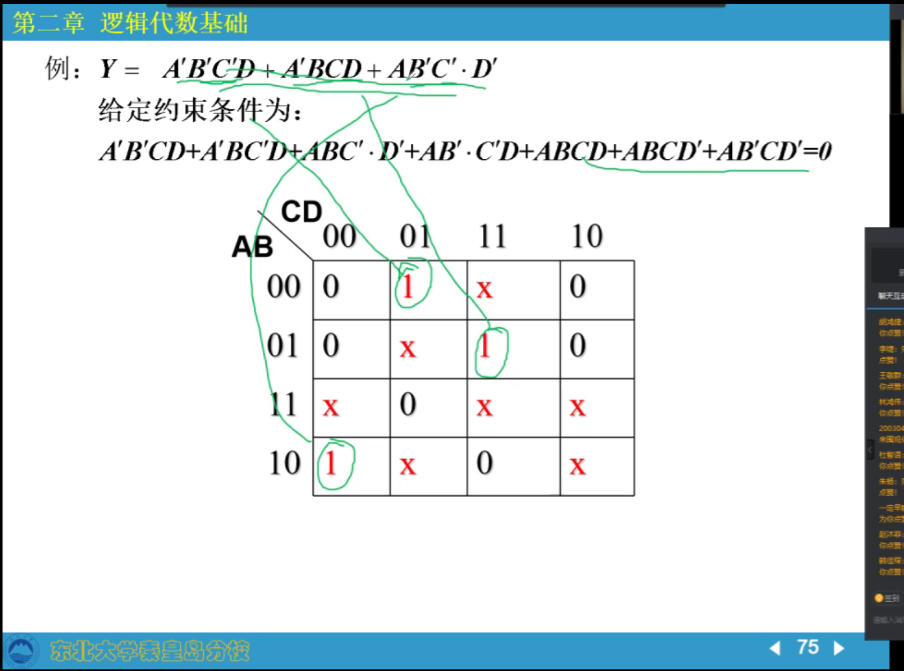

## 数制与码制

二进制、八进制、十进制、十六进制转换及运算

原码、反码、补码运算

## 逻辑代数基础

> 公式和定理：
>
> 常用公式、基本公式；代入定理、反演定理、吸收定理
>
> 表示方法：
>
> 真值表、逻辑式、逻辑图、卡诺图、波形图
>
> 化简方法：
>
> 公式法、卡诺图、QM算法

或、非、异或、并

### 最小项和最大项

最小项：每个变量只出现一次的乘积

- ABC        √
- ABCC'     ×

最小项记法

- ABC ——> 111 ——> 7
- A'BC' ——> 010 ——> 2

最小项和

- ABC+ABC' = Σm(7, 6)
- A'B'C+A'BC' = Σm(1, 2)

逻辑相邻的最小项可以合并

- 逻辑相邻：1101和1111或0101或1001或1100，即只有一个位置不同
- 合并：ABC+ABC'=AB，即合并公因数约掉1

最大项：每个变量只出现一次的和

如A、B的最大项有

- A+B ——> 11 ——> 3
- A+B' ——> 10 ——> 2
- A'+B ——> 01 ——> 1
- A'+B' ——> 00 ——> 0

性质：

- 只有一个最大项为0，其余均为1（若有）
- 任两个最大项之和为1

最小项和和最大项积的对应关系：

- `Σmi = Πm'k(i!=k)`

### 逻辑函数的化简

不能化简 != 最简

#### 公式法

公式不一样结果不一样，可能不是最简

就有点像化简公因式，折磨

#### 卡诺图

必然得到最简，可能不唯一

**表示：**

画卡诺图（二维表）

| 0000 | 0001 | 0011 | 0010 |
| ---- | ---- | ---- | ---- |
| 0100 | 0101 | 0111 | 0110 |
| 1100 | 1101 | 1111 | 1110 |
| 1000 | 1001 | 1011 | 1010 |

| m0   | m1   | m3   | m2   |
| ---- | ---- | ---- | ---- |
| m4   | m5   | m7   | m6   |
| m12  | m13  | m15  | m14  |
| m8   | m9   | m11  | m10  |

将函数表示为最小项和的形式

在卡诺图上标注0/1

- Σm(1, 2)则在卡诺图上m1、m2位置标1，其余标注0

**画圈：**

依据：逻辑相邻的最小项可合并消除公因子

卡诺图的逻辑相邻和几何相邻是统一的

画圈规则：

- 相邻两个1可以合并成一个，消去一个因子
- 相邻四个1可以合并成一个，消去两个因子
- 相邻八个1也可以合并，消去三个因子
- 对边相邻性和四角相邻性，这意味着上下左右互通，四个角也可以组成一个矩形
- 尽量画大圈，圈的个数尽量少
- 所有1都要被圈过
- 每画一个新圈必须要有一个1是没被圈过的，不然这个圈就是多余的

画俩大圈

#### 无关项

##### 约束项

逻辑上不可能出现的项

- 如一共只有三种状态，开车前进、停车、倒挡分别为`01,10,00`，但在数字上还有`11`的情况，此时`11`便是约束项

- 又如：我明天8点去上课，记作y

  ①明天不下雨

  ②明天不生病

  ③明天太阳从西边出来

  y=①+②+③

  这个③你怎么说，他是不可能出现的

##### 任意项

体育分数满分不影响高考结果，前者有可能出现，但不影响逻辑函数

约束项和任意项可以写入函数式，也可以不写入，因此称为无关项，局外人

利用无关项可得到更简单的化简结果 —— 令卡诺图的圈更大

- 约束条件项，各项均为X

X默认当作1，充当用于画圈的工具人

#### 机器化简法

Q-M算法

1. 将逻辑函数表示为最小项和形式

2. 按照1的个数分组，列表

3. 循环对比，消去最小项中的因子项，逻辑相邻则可以消去

   消去的项用`*`号表示，如`ACD'`表示为`1*10`

4. 去掉重复项

#### 多输出逻辑函数化简

如Y有以下三个输出

- Y1=B+AC'+A'C'D
- Y2=A'D+BD'
- Y3=A'CD+AB'C'

在各自的函数表达式中，都是最简的，Y共有7个输出门

我们考虑这样化简

- Y1=B+AB'C+A'C'D
- Y2=A'C'D+A'CD+BD'
- Y3=A'CD+AB'C

Y1和Y3共用AB'C，Y1和Y2共用A'C'D，Y2和Y3共用A'CD，这样只有5个输出门

怎样在使用卡诺图化简时达到整体最简的效果？

- 局部最简：先追求最大，再最求公用
- 整体最简：先追求公用，再追求最大

### 逻辑函数形式的变换

有时电门的类型有限，为节省成本，会使用其他的逻辑形式复杂化函数式

## 门电路

- 高电平/低电平 ——> 逻辑电平：1/0
- 构造出高质量的0/1，如5为高电平，4.9便是高质量
- 如何从半导体构建出基本的逻辑门电路

正逻辑：1表示高电平，0表示低电平

负逻辑：0表示高电平，1表示低电平

单开关控制高低电平：开关打开，输出信号（电平）为电源电压，为高电平；开关闭合，输出信号为开关两端的电压，`U1=r/(R+r)U`，为低电平，当R越大低电平质量越好，但耗能太大（P=i^2*R）

### 二极管门电路

> 二极管只能正向高压、负向低压才能导通，并且压强差至少大于等于0.7V

#### 二极管开关特性

P、N极，截止从低到高的电压

二极管的导通压降：0.7V

负接二极管，D截止，断路，输出电压为电源电压，为高电压，逻辑表示1

当D导通，保证二极管负极为0.那么正极压强约为0.7，视为低电压，逻辑表示0，很显然质量不好，但勉强可接受

- 导通：二极管亮

#### 二极管的与门电路

干路为Y，电流流入，两个并联的二极管电路A、B，`Vcc=5V，Vm=3V，Vn=0V`，当二极管导通时，压降为`0.7V`

| A    | B    | Y    |
| ---- | ---- | ---- |
| 0v   | 0v   | 0.7v |
| 0v   | 3v   | 0.7v |
| 3v   | 0v   | 0.7v |
| 3v   | 3v   | 3.7v |

规定3V以上为1，0.7以下为0

| A    | B    | Y    |
| ---- | ---- | ---- |
| 0    | 0    | 0    |
| 0    | 1    | 0    |
| 1    | 0    | 0    |
| 1    | 1    | 1    |

##### 二极管或门

干路为Y，电流从两个并联的二极管电路流出到Y

| A    | B    | Y    |
| ---- | ---- | ---- |
| 0    | 0    | 0    |
| 3    | 0    | 2.3  |
| 0    | 3    | 2.3  |
| 3    | 3    | 2.3  |

规定2.3v及以上为1，0及以下为0

| A    | B    | Y    |
| ---- | ---- | ---- |
| 0    | 0    | 0    |
| 1    | 0    | 1    |
| 0    | 1    | 1    |
| 1    | 1    | 1    |

可以看到高低电平中间有很大的模糊区间，在实际电路设计时很少用二极管做逻辑门使用

- 在不级联的电路中可使用

##### 二极管的动态电流

电压可以突变，电流不能突变

### MOS门电路

#### MOS管的开关特性

金属半导体氧化物产生的网（P型半导体）

- P型半导体：空穴多，电子少
- N型半导体：空穴少，电子多
- 少子：少数电流子的简称

结构：

- S：极源
- G：栅极
- D：漏极

考量D和S（漏源）之间的关系，二者相当于一个背靠背的N、P、N极，之间一定是一个截止状态（就相当于两个背靠背的二极管串联）

当GB通电，即增加垂直电场，少子上移，局部构成N型半导体，称为反型层

此时N-P-N转变为N-N-N，加上横向电场，SD之间可以导通：导电沟道（N型区域、反型层）

防止S和B电势差影响电路，短接S、B，使之电压一致，那么`v(GS)==v(GB)`

- 当`Vgs > Vgs(th)（固定值）`，才能形成导电沟道，即提供充足的动力使少子上移

此为N沟道增强型MOS管：加垂直电压生成N沟道

#### 输入输出特性

栅极(G)-源极(S)回路为输入回路

栅极和衬底之间被绝缘层隔开，不会有电流参与，但之间有电场，无输入曲线

漏极(D)-源极(S)回路为输出回路

**截止区**

`Vgs<Vgs(th)`，漏源间无导电沟道，`i(D)->0`

**可变电阻区**

`v(GS)`固定，并产生了导电沟道，`i(D)`随`v(DS)`增大而增大，但有上限，该上限由导电沟道的少子数量决定

此时`i(d)/v(DS)`的图像类似于一个可变电阻

**横流区**

`i(D)`达到当前`v(GS)`上限，为常数，`v(DS)`对其影响很小

#### MOS管的基本开关电路

思路即控制`v(GS)`大小控制`i(D)`的有无，控制`v(DS)`大小控制`i(D)`的大小

- 截止区：`v1=v(GS)<Vgs(th)`
- 横流区：`v1>Vgs(th)`且`v(DS)`较高

截止区为0，横流区为1，尽量跳过可变电阻区

电压不够，断开；电压够，以电阻连接，压降约在0.1-0.2v

四种MOS管：

- N沟道增强型
- P沟道增强型
- N沟道耗尽型
- P沟道耗尽型

这里也有一个外置电阻和横流区电阻的问题，要令`R>>r`，效果更好，但也更耗能

### CMOS门电路

> 互补型MOS门电路
>
> 主流门电路

N沟道增强型和P沟道增强型连起来使用

下开关接地，上开关两端连接`Vdd`

- 上连接，下断开，输出电压接近`Vdd`

- 上断开，下连接，接地电压接近0

- 必须保证同时一开一合

- 两开关均使用MOS管控制

  一个为P沟道增强型，一个为N沟道增强型，导通电压分别为+、-

  输入电压为低电压时，P沟道上接`Vdd`，下为0，导通；N沟道上为0，下为接地，断开

  - 此时为高电平

  输入电压为高电压时，P沟道上下均为高电压，断开，N沟道上为高电压，下接地，导通

  - 此时为低电平

两MOS自动一开一合，基本完美解决开关电路

互补：

- 沟道互补：P/N沟道互补
- 互补的状态，上导通下截止，下截止上导通

#### CMOS反相器

就是一个反逻辑实现

- 输入0，输出1
- 输入1，输出0

两个MOS管相接，分别为P\N沟道增强型MOS，解决了二极管门电路的弊端

- 电平定义不统一、电平漂移
- 电阻R的选择，必须不大不小，导致电平也不大不小

**电压传输特性和电流传输特性**

> 深度饱和

输入电压从0增加，先经过一段横流区：`Vdd`保持高电平

- P沟道联通，N沟道截止

继续增加，`Vdd`迅速减少

- P沟道逐渐截止，N沟道逐渐导通
- 在这个期间，电路连通，电阻较大，会造成一定量的消耗，甚至有可能烧坏

`Vdd`为0

- P沟道截止，N沟道导通

如此便实现了输入1输出0和输入0输出1的需求

**输入端噪声容限**

CMOS门在出厂时签订协议：可以提供高质量的0和1，防止信息丢失

高质量

- 可以接收一个质量不太高的1，输出一个高质量的1

  如4.3v入，4.9v出

- 可以接收一个质量不太高的0，输出一个高质量的0

  如0.7v入，0.1v出

无论如何拷贝翻转，始终输出高质量的电平（变化在小数点后两位，不影响4.9和0.1），鲁棒性很高，不会造成信息丢失

- 比如一个985大学，进去是个中等，出来保证是个中上

允许输入端在某一范围波动而不影响输出，这就叫输入端噪声容限

**CMOS反相器的静态输入输出特性**

输入特性

栅极和衬底之间存在SiO2为介质的绝缘层，很薄容易被击穿，常常在MOS管中添加电容作为保护电路，使之可以通过较大的电流

输出特性

输入为0输出高电平时，随电流增加，输出电压会有少量的增加（门电阻上电流增加）

输入为高电平输出低电平时，随电流增加，输出电压些微增加又趋于横线

**CMOS反相器的动态性能**

1、传输延迟时间：电流的聚集和消散造成输出的延迟

2、交流噪声容限

3、动态功耗：中间态会存在功耗

**其他CMOS门电路**

> 我们更在意电路的逻辑功能，即0到1的变化，而不是具体数值

与非门，基于反相器

- 两个输入都为1，输出为0；其余情况输出均为1

两个输入，四个MOS管，两个反相器

或非门

- 两个输入都为0，输出为1；其余情况输出均为0

与门、或门

- 管越少，稳定性越好

#### 带缓冲级的CMOS电路

已有的CMOS解决了电平定义、电平飘逸、R问题

但仍有一些小问题

- A=1，B=1，电路联通串联，开关内阻为2Ron
- A=0，B=0，电路联通并联，开关内阻为Ron/2
- A=0，B=1，电路断开，开关内阻为Ron
- A=1，B=0，电路断开，开关内阻为Ron

在不同情况Ron不一样，必然会带来一些影响，输入端越多，并联时内阻越低，串联时内阻越高，影响更大

缺点：

- 输出电阻受输入端状态影响
- 输出的高低电平受输入端数目影响
- 输入端高低电平对传输有影响

增加缓冲，在输入、输出端各增一级反相器，取非再取非，追求极高稳定性（大于成本）

作用当输入`>=1`改为`1`

#### OD门

漏极开路的门电路，漏极即MOS管中的D/S

线与：将两根实际导线相接

按道理来说，是不可以将高电压导线直接与低电压导线直接相接，要么烧坏电源，要么打穿导线

线与的好处，如将所有低电平的线接在一起，使用公共地（数字地）

OD门进行电平转换，如要从5V升到10V，通过输出的外界电源线与输出接口，提高输出电压

同理，可以直接在输出接口线与其他的输出接口实现更丰富的逻辑运算

#### TG门

CMOS传输门，双向开关

上下两端电压相反，上有外界电压`Vdd`，下负上正，T1、T2同时截止，输入和输出间呈高阻态；下正上负，T1、T2至少一个导通，呈低阻态

就是说得两个配合才能接通，总闸和单闸的关系，这样能更好地控制各个单闸，分开工作

传输门的作用

- 组合成各种复杂的逻辑电路，如数据选择器、寄存器、计数器
- 作模拟开关，用来传输连续变化的模拟电压信号

#### 三态输出的CMOS门电路

三态：

- 高电平
- 低电平
- 高阻态

在反向门的基础上加了一个EN（enable）输入端（低电平输入才有效，高电平将造成高阻态）

当EN门符合要求，正常当非门使用，当不符合要求，输出端高阻态

就是在正常的门上加一个EN输入端，控制正常使用和高阻态

反相器串联TG门的三态门

### TTL门电路

> 三极管-三极管逻辑电路：2000年后渐渐淘汰

集成度高低：`SSI,MSI,LSL,VLSI`

按照工艺：双极型、单极型

N-P-N双极型三极管（背靠背的PN极），P越薄性能越好

- C：集电极，有固定阻值Rc（上）
- B：基极 base（左）
- E：发射极（下）

输入特性：

基地为输入极

BE的压差越大，输入电流越大，当超过开启电压后，i将迅速上涨

开启电压：0.3-0.7V

输出特性：

截止区：当`V(BE)`很小，小于0.7，无输出电流

- 相当于CMOS的`V(GSth)`

放大区：放大器，`ic`（输入电流）和`ib`（输出电流）间有固定的放大系数β

- 发射结正偏
- 集电结反偏
- 水平的、等间隔的

饱和区：放大到了极限，`ic<βib`，深度饱和，`ic`躺平，不变辽

- V(CE)压降随输入电流增大而不断减小
- 深度饱和时V(CE)将接近于0，通常在0.1-0.3V，为固定值

#### 开关电路

当输入电压低于Von，断开，输出高电平

当输入电压高于Von，连接，三极管进入放大区

- 满足如下等式：`V1 = Vcc-Vr = Vcc-Rc*ic = Vcc-Rc*βib`
- 得输出电流：`ib = Vcc-V1/βRc`

当输出电压`ib > Vcc-V(CEsat)/βRc = I(BS)`，达到饱和工作状态，输出低电平

则三极管得c-e之间就相当于一个受V1控制的开关，输入电压小时高电平，大时低电平

**开关等效电路**

导通时，be之间是二极管，ce之间为闭合的开关

截止时，be、ce间均为断开

**开关特性**

ib、ic、io的建立和消散都需要一定时间，将落后于电压V1的变化，Vo的变化也落后于V1的变化

#### 三极管非门

`Vbe`低时，低于开启电压，`Vce`为高电平（断路）

反之`Vbe`高，电路联通，`Vce`为低电平

实现逻辑非

存在电平漂移等问题

#### TTL反相器

四个三极管，四个电阻，两个二极管

输入极-倒向极-输出极

输入低电压0.2V，T1管基极导通，加上输入电压0.2V，共0.9V，中间要打通两个BE极，需要1.4V，于是打不通，断路；`Vcc=5V`，打通两个PN极，输出高电平

- `Vo = Vcc-1.4 = 3.6`
- 测量值一般为3.4-3.5V

输入高电压3.4V，T1管截止，Vcc向下导通T2、T3管，向右导不通T4管，T2、T3管又导通输出极（T3管接地），于是输出极约为0V（0.1-0.2）

**电压传输特性**

截止区(0.1-0.6)-线性区(0.6-1.4)-转折区(1.4-1.5)-饱和区(>1.5)

- 以上括号内均为输入电压值

**输入特性**

当输入电压为负数，反向电流激增

输入电压低于1.5V时，输出电流均为负数，`Vcc`流入输入端口，传递到输出极，逐渐靠向0A

当大于1.5V，存在微弱的反向电流，忽略

**输出特性**

高电平输出特性：

电流值为0，电压为3.4V；电流减少（为负），电压减少

低电平输出特性：

电压随电流增加缓慢增加，因为是饱和导通

**动态特性**

传输延迟时间

导通和截止转换需要一定时间，而且个元器件寄生电容存在

交流噪声容限

动态尖峰电流：线性区T4和T5同时导通，有个尖峰电流，可能烧坏电路，会增加电源平均电流

#### 其他类型TTL门

首先实现了一个非门：反相器

**与非门**

在反相器的基础上增加一个发射极

当输入极AB都为高电平，输出极接地为低电平，其余都是高电平

**或非门**

并接两个反相器

**三态门**

TS门：反相器输入端并一个EN输入，当EN结果为0时，输出极上下端均截止，同时`Vcc`被短路，输出极处于一个隔离状态，是为高阻态

当EN结果为1时，就是一个正常的非门电路

应用：

- 单向总线
- 双向总线

**Summary**

> from hzy

在实际门电路图中，悬空视为1，接地视为0，电阻视为导线

- `VDD/VCC`一般为外接电压
- `Vix`为输入电压：input
- `Vox`为输出电压：output
- `Vxl`为低电压：low
- `Vxh`为高电压：high

