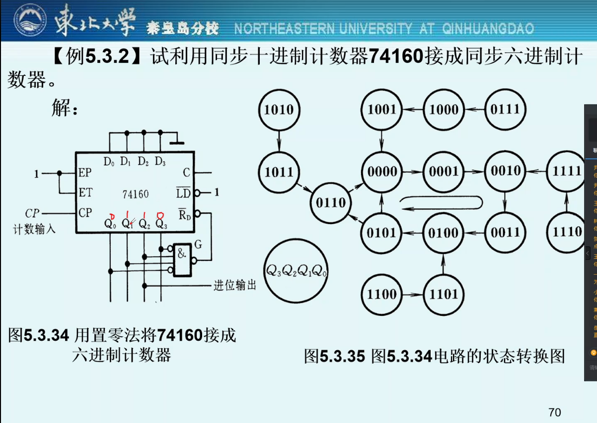
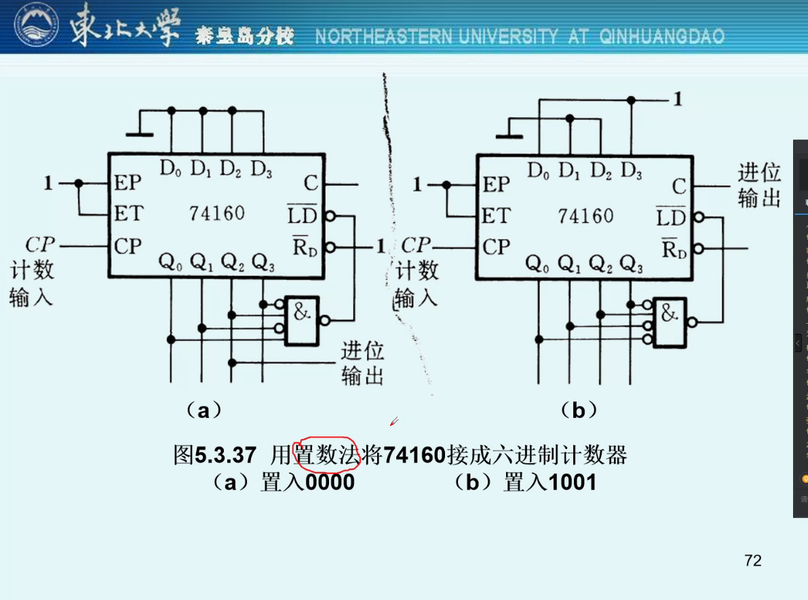
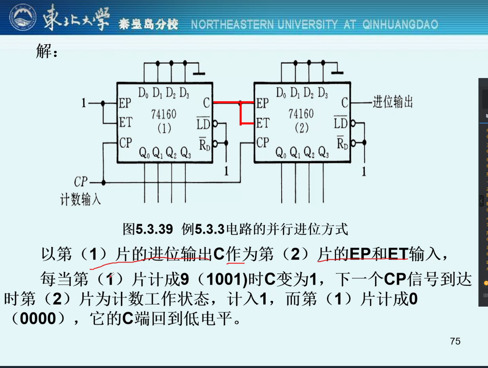
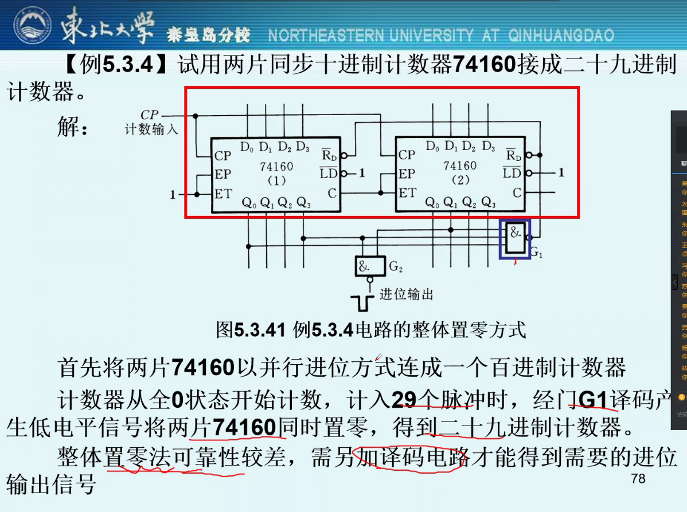
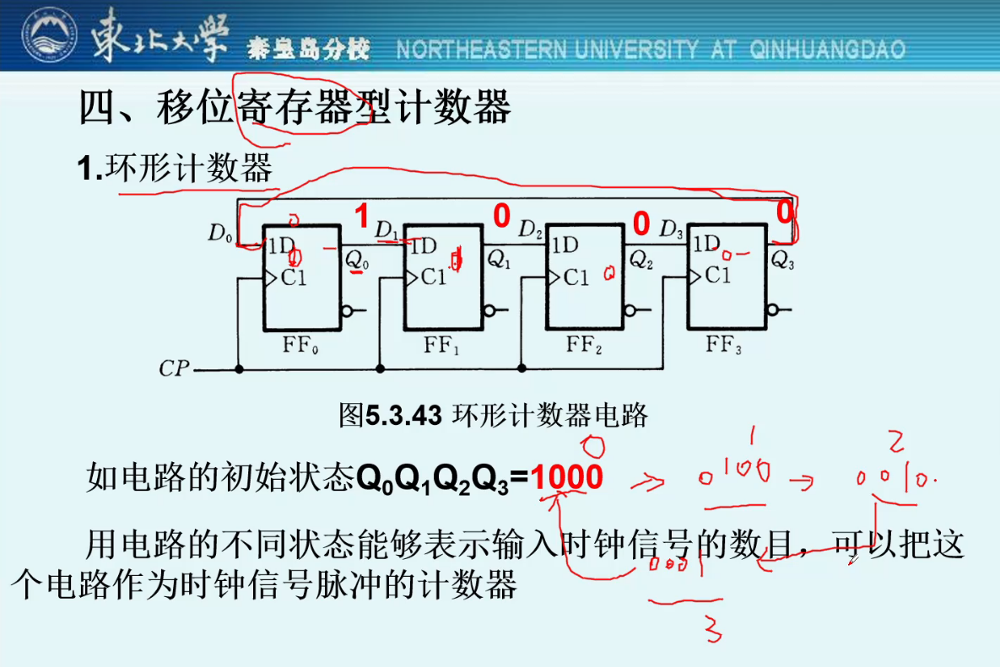
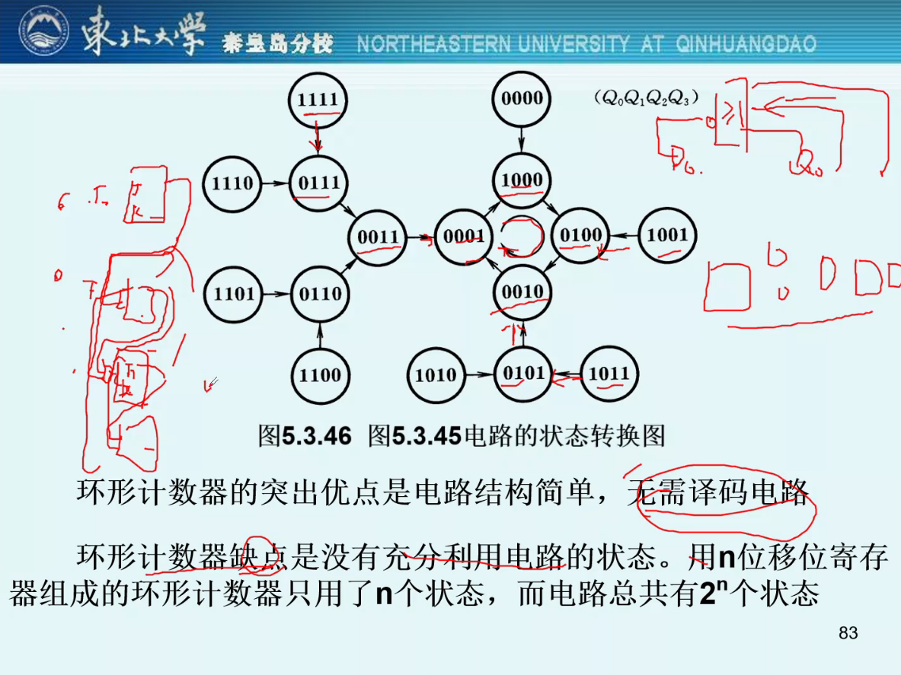
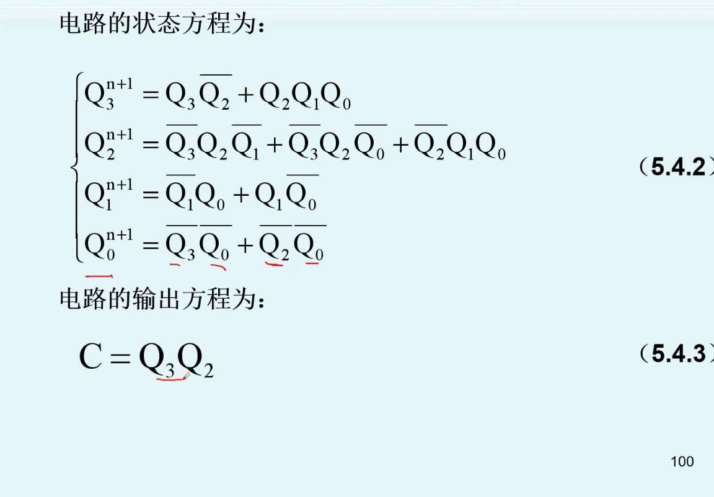
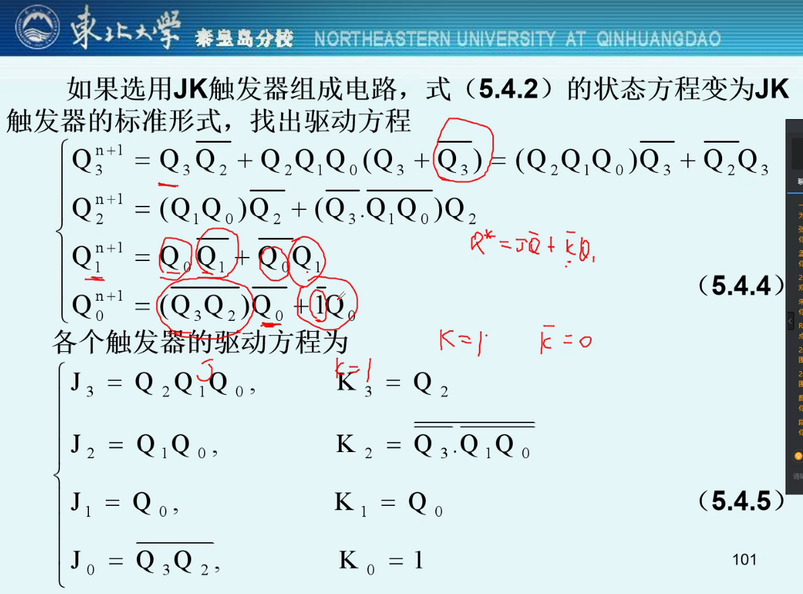

## 时序逻辑电路概述

> 时序逻辑电路在触发器的基础上开展，是数字电路的核心部分
>
> CLK时钟开关

时序逻辑电路：任何一个时刻的输出信号不仅取决于当前的输入信号，还与电路的原状态有关（触发器）

- 串行加法，中间位要同时考虑低位进位和当前位相加，是三者共同的结果，这样的加法器也叫全加器（不考虑进位为半加器）

特点：

- 通常包含组合电路（门器件）和存储电路（触发器）两个部分，存储电路是必不可少的
- 存储电路的输出状态必须反馈到组合电路的输入端，与输入信号一起共同决定组合逻辑电路的输出

输出方程

- 输出方程是时序逻辑电路的输出`y`的方程，是关于输入`x`、存储电路输出`q`的函数

驱动方程

- 驱动方程是触发器的输入`z`的方程，是关于触发器输出`q`和时序逻辑电路输入`x`的函数
- 输出方程、驱动方程均由`x,q决定`

状态方程

- 状态方程是触发器的输出次态`q(n+1)`的方程，是关于触发器输入`z`和触发器现态`q(n)`的函数

时序逻辑电路划分：同步和异步，根据触发器的动作特点不同

- 同步：触发器状态变化（翻转）在同一时钟信号操作下同时发生
- 异步：非同步

根据输入信号特点分为：米利型和穆尔型

- 米利型：输出信号不仅取决于存储电路状态，还取决于输入变量（既有存储电路，也有门电路）
- 穆尔型：输出信号只取决于存储电路状态（只有触发器）

时序机：用输入信号和电路状态的逻辑函数去描述时序逻辑电路功能的方法

## 时序逻辑电路分析方法

### 同步时序逻辑电路分析

一般方法：

1. 从给定的逻辑图中写出每个触发器的驱动方程
   - 根据给定的电路逻辑图，凭肉眼看，手动写出驱动方程（每个输入电平的方程）（注意是直接相连的电平即可，不需要任何推导）
2. 将得到的驱动方程带入相应触发器特性方程，得到每个触发器的状态方程，从而得到由这些状态方程组成的整个时序电路的状态方程组
   - 如`JK`触发器特性方程`Q* = JQ'+K'Q`，获取J/K的驱动方程后直接代入即可
   - 驱动方抽+特性方程=状态方程
3. 根据逻辑图写出电路的输出方程
   - 和第一步一样，凭肉眼看写出输出方程
4. 由输出方程和状态方程，列出状态转换表（真值表）或状态转换图，分析逻辑功能

难点在前三步，第四步为低附加值工作（量大但简单）

### 状态转换表、图和时序图

> 驱动方程、状态方程、参数方程

#### 状态转换表

三种用于描述时序电路状态转换全部过程的方法

将任何一组输入变量和电路初态的取值带入状态方程和输出方程，即可算出电路的次态和现态下的输出值；以得到的次态作为新的出台和这时的输入变量取值一起带入状态方程和输出方程，又会得到一组新的次态和输出

如此迭代就可以获得整张真值表（状态转换表）

形式如下

| 初态 | 次态 | 输出 |
| ---- | ---- | ---- |

或如下形式

| `CP`的顺序 | `Q1*` | `Q2*` | `Q3*` | `Y`  |
| ---------- | ----- | ----- | ----- | ---- |
| 0          | 0     | 0     | 0     | 0    |
| 1          | 0     | 0     | 1     | 0    |
| 2          | 0     | 1     | 0     | 0    |
| 3          | 0     | 1     | 1     | 0    |
| 4          | 1     | 0     | 0     | 0    |
| 5          | 1     | 0     | 1     | 0    |
| 6          | 1     | 1     | 0     | 1    |
| 7          | 0     | 0     | 0     | 0    |
| 0          | 1     | 1     | 1     | 1    |
| 1          | 0     | 0     | 0     | 0    |

#### 状态转换图

上述状态转换表其对应的状态转换图

- 圆圈表示电路的各个状态
- 箭头表示状态的转换方向
- 箭头上的标注为转台转换前的输入变量取值和该动作下的输出值，斜线上位输入变量取值，斜线下为输出值

#### 时序图

依旧对应上述的七进制加法器

为`JK`触发器，在下降沿发生变化

每遇到一个下降沿，`CP`的顺序加一

### 异步时序逻辑电路分析

> 选学

每次电路状态发生变化时，不是所有触发器都有时钟信号，有时钟信号的正常工作，没有的保持不变

`cp0`：无时钟信号到达

`cp1`：时钟信号下降沿到达

`cp2`：时钟信号上升沿到达

## 常用时序逻辑电路

### 寄存器和移位寄存器

#### 寄存器

> 常用的时序逻辑电路，常用于各类数字系统和数字计算机

用于寄存一组二值代码，其存储器由触发器组成，一个触发器能够储存1位二至代码，N个触发器组成的寄存器可以储存一组N位二值代码，共2^N种信号

寄存器的触发器只要求具有置1、置0的功能，因此`D锁存器、D触发器、同步RS触发器、RS主从触发器、主从JK触发器`都可以组成寄存器

#### 移位寄存器

> ？

除了具有存储代码的功能，还有移位功能，移位功能是指寄存器里存储的代码能在移位脉冲的作用下依次左移或右移

- 实现数据的串行并行的转换
- 数值运算及数据处理

双向移位寄存器`74LS194A`？？？

| R(D)' | S1   | S0   | 工作状态 |
| ----- | ---- | ---- | -------- |
| 0     | X    | X    | 置零     |
| 1     | 0    | 0    | 保持     |
| 1     | 0    | 1    | 右移     |
| 1     | 1    | 0    | 左移     |
| 1     | 1    | 1    | 并行输入 |

### 计数器

> 重点

用于统计脉冲`CP`的个数的电路

- 配合时钟周期使用可以当作计时器使用（时钟周期始终不变）

分类：

按是否翻转分为

- 同步计数器
- 异步计数器

按增减趋势分为

- 加法计数器
- 减法计数器
- 可逆计数器

按数字编码方式分为

- 二进制计数器（最常用）
- 二-十进制计数器
- 循环码计数器

按容量分

- 十进制计数器
- 十六进制计数器

#### 同步计数器

> 最简单，最经典

编码方式上基本上分为二进制和十进制两种

能不能不用加法器，而是更简单的电路实现`+1`功能？

~~~
 1011011
+      1
—————————
 1011100
~~~

对于任意二进制数`+1`，被加数第`i`位状态改变的必要条件：第`i-1,i-2,...,1`位必须全是1

- 状态改变指`1->0,0->1`

同步二进制计数器：

T触发器组成的八位二进制计数器

对于一个T触发器，每次`CP`信号达到时，以第`i`位为分界，右边的（包括`i`）接`T1=1`，进行翻转；左边的接`T2=0`，保持原状态

- 这样就实现了`+1`操作，而不是逐位相加进位
- 第一位每次`+1`均会发生翻转，所以第一位总接`T1=1`

T触发器实现的同步计数器

| 计数顺序 | `Q3` | `Q2` | `Q1` | `Q0` | 对应十进制数 | 进位输出 |
| -------- | ---- | ---- | ---- | ---- | ------------ | -------- |
| 0        | 0    | 0    | 0    | 0    | 0            | 0        |
| 1        | 0    | 0    | 0    | 1    | 1            | 0        |
| 2        | 0    | 0    | 1    | 0    | 2            | 0        |
| 3        | 0    | 0    | 1    | 1    | 3            | 0        |
| 4        | 0    | 1    | 0    | 0    | 4            | 0        |
| 5        | 0    | 1    | 0    | 1    | 5            | 0        |
| 6        | 0    | 1    | 1    | 0    | 6            | 0        |
| 7        | 0    | 1    | 1    | 1    | 7            | 0        |
| 8        | 1    | 0    | 0    | 0    | 8            | 0        |
| 9        | 1    | 0    | 0    | 1    | 9            | 0        |
| 10       | 1    | 0    | 1    | 0    | 10           | 0        |
| 11       | 1    | 0    | 1    | 1    | 11           | 0        |
| 12       | 1    | 1    | 0    | 0    | 12           | 0        |
| 13       | 1    | 1    | 0    | 1    | 13           | 0        |
| 14       | 1    | 1    | 1    | 0    | 14           | 0        |
| 15       | 1    | 1    | 1    | 1    | 15           | 1        |
| 16       | 0    | 0    | 0    | 0    | 0            | 0        |

- 利用第十六个计数脉冲（第十六个下降沿）到达C端的下降沿作为向更高位进位的输出信号
- N位二进制计数器的容量位`2^N-1`

对于计数器，其各位翻转的频率以2为倍数递减，因此也被称作分频器

`JK`触发器组成四位二进制计数器`74161`

功能表

| CP     | RD'  | LD'  | EP   | ET   | 工作状态    |
| ------ | ---- | ---- | ---- | ---- | ----------- |
| X      | 0    | X    | X    | X    | 置零        |
| 上升沿 | 1    | 0    | X    | X    | 预置数      |
| X      | 1    | 1    | 0    | 1    | 保持        |
| X      | 1    | 1    | X    | 0    | 保持（C=0） |
| 上升沿 | 1    | 1    | 1    | 1    | 计数        |

`T'`触发器组成同步十六进制加法计数器

减法计数器：可以用加法计数器求反，但更繁琐，直接设计成减法逻辑`CC14526`

- 进位信号 ——> 借位信号

可逆计数器：`74LS191`单时钟加减法计数器

- 通过输入S‘实现加减法切换

功能表

| `CP`   | S'   | LD'  | U'/D | 工作状态 |
| ------ | ---- | ---- | ---- | -------- |
| X      | 1    | 1    | X    | 保持     |
| X      | X    | 0    | X    | 预置数   |
| 上升沿 | 0    | 1    | 0    | 加法计数 |
| 上升沿 | 0    | 1    | 1    | 减法计数 |

同步十进制计数器：

T触发器构成的同步十进制计数器

状态转换图

- 储存情况下不存在但理论上存在的状态（`10,11,12,13,14,15`）也要计算出来

`JK`构成的同步十进制加法计数器`74160`

十进制减法计数器：

十进制减法计数器状态转换图：

异步计数器略，和同步计数器基本一致

#### 任意进制计数器的构成

> 重点

假定已有N进制计数器，要得到M进制计数器，分为`M>N,M<N`两种情况

##### 置零、置数法

需求进制小于现有进制，如`16->12`

- 在N进制计数器得顺序计数过程中，设法使之跳跃N-M个状态，如跳过`12,13,14,15`四个状态，则可以从十六进制转到十二进制

实现跳跃得方法：置零法、置数法

置零法，将要跳过的状态输出接到$\overline{R_D}$端

- 大概就是到`11`了之后，跳过`12,13,14,15`四个状态，直接置零

使用置零法将十进制计数器74160接成6进制计数器

能够自启动：当遇到干扰在无效状态，在有限步能够回到主循环中，则称为能够自启动的电路

置零信号持续时间极短，容易导致电路误动作，如太短没有捕捉到，持续上升为`6`，我们常在G门输出端增加基本RS触发器（锁存器）增加指令信号作用时间

- 只要出现置零信号，就把这个信号存在RS触发器中直到下一个时钟信号到来

置数法，将要跳过的状态输出接到$\overline{LD}$端

- 置入一个数：置入0；置入最大值，如进入11时置入15

- 74160的置数是同步的，更可靠
- 相应速度要慢一点

不需要接锁存器，一般来说推荐用置数法，更节省、更稳定

##### 并行、串行进位

当目的进制位数高于当前计数器的进制

- 通过连接多片低进制位实现进制的提高

并行进位方式

将十进制计数器74160串为十六进制计数器

串行进位方式

##### 整体置零、置数

整体置零法将十进制提升为二十九进制

- 将十进制串成一百进制计数器
- 再通过置零法将一百进制降为二十九进制计数器

整体置数法：与整体置零步骤差不多，只不过在降低进制时用的是置数法

#### 移位寄存器计数器

##### 环形计数器

环形计数器，记录时钟信号脉冲次数：

其对应的状态转换图

能自启动的环形计数器：

状态转换图

##### 扭环形计数器

提高了环形计数器状态利用率

- 同样无法自启动，存在无效循环

能自启动的扭环形计数器

### 顺序脉冲发生器

> 选学略

用于产生一组在时间上有先后顺序的脉冲信号的电路

优点：电路结构简单，不必附加译码电路

缺点：使用较多触发器，并且需要自启动的反馈逻辑电路

### 序列信号发生器

> 选学略

特定的串行数字信号称为序列信号，在电路中有时需要用到序列信号，自然序列信号发生器用于构造并输出序列信号

## 时序逻辑电路设计方法

> 重难点

### 同步时序逻辑电路设计

- 逻辑抽象，得出电路的状态转换图或状态转换表（难点）
- 状态化简，消去多于的状态，得简化状态图
- 状态分配，又叫状态编码，用一组合适的二进制代码分配给各个状态
- 选定触发器类型，求出电路的状态方程、驱动方程和输出方程
- 根据方程式画出逻辑图（电路图）
- 检查电路是否能够自启动

第一步是比较难的，其他步均基于第一步的正确性

举个栗子：

设计一个带有进位输出的十三进制计数器

对应状态转换表

通过卡诺图化简逻辑式

得到化简状态、输出方程

将驱动方程代入触发器的驱动方程

最后画出电路图

检查电路是否能够自启动，通过判断电路的状态转换表，若存在无效的循环，则无法自启动，需要进行改善

- 实际上功能已经完成了，这是为了保证电路的稳定运行

### 时序逻辑电路的自启动

### 异步时序逻辑电路设计

> 选学略
