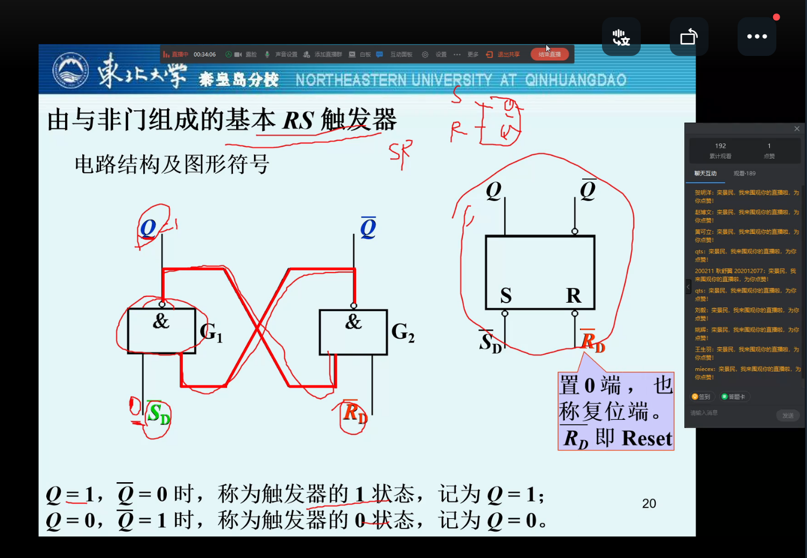
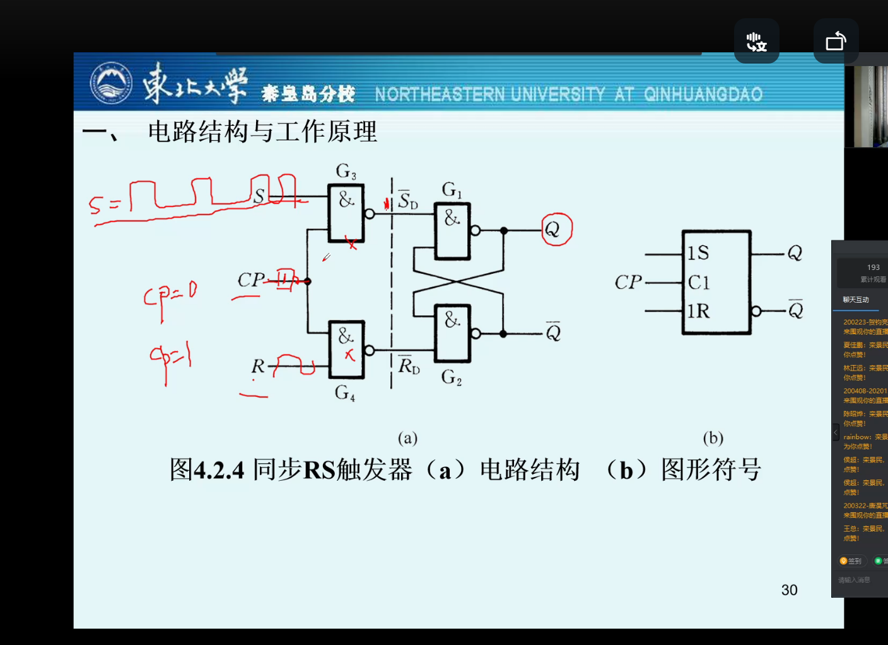
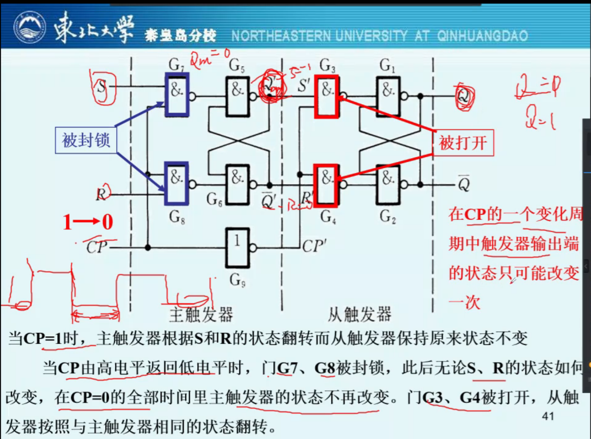
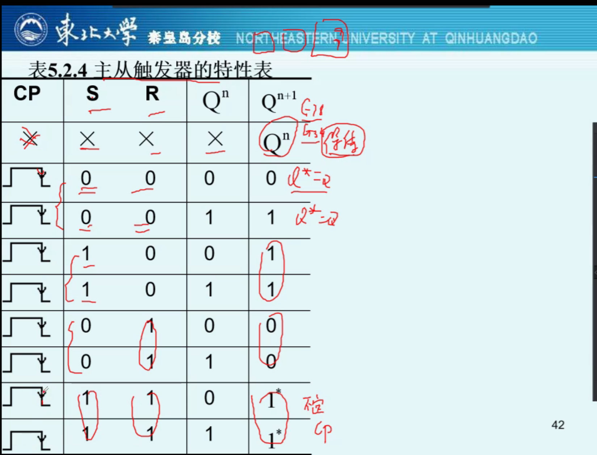
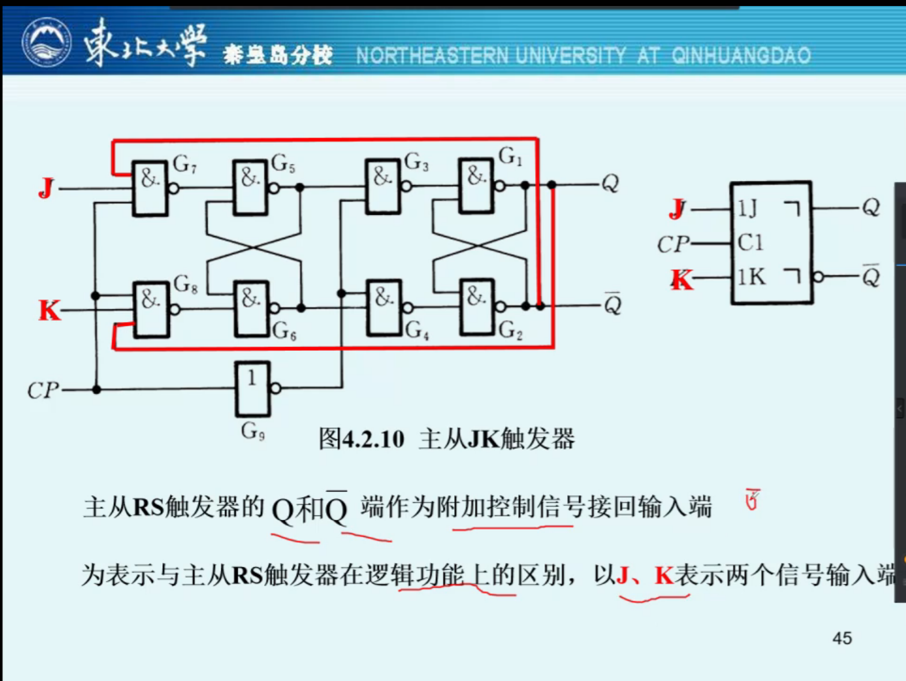
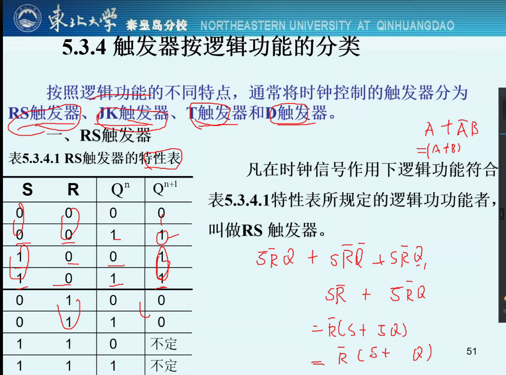
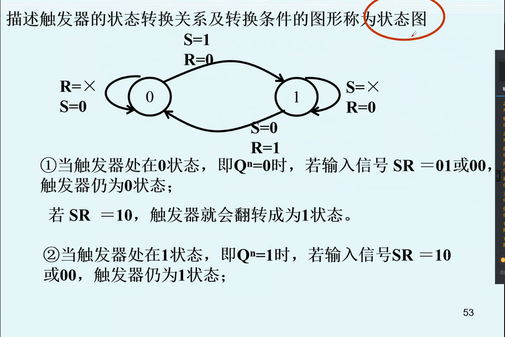
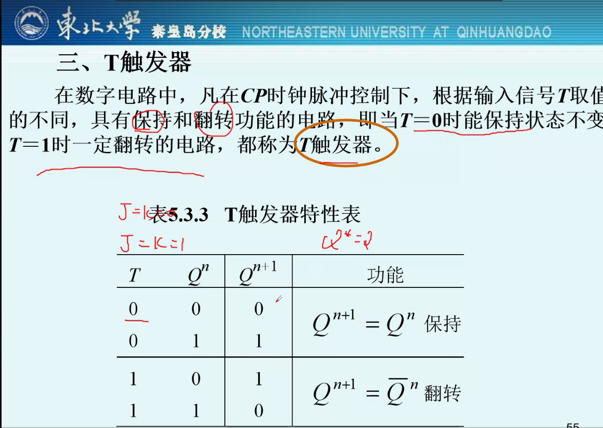
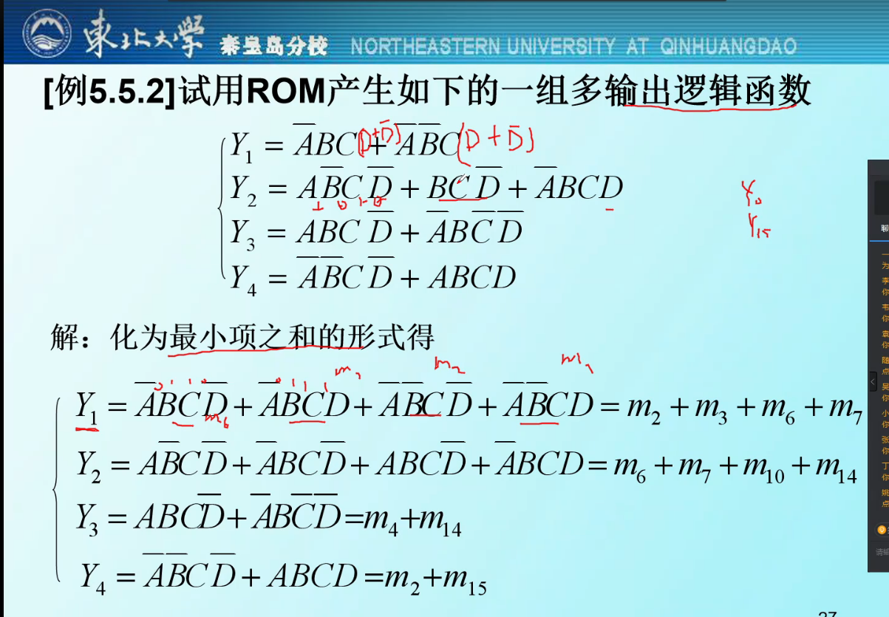

## 触发器

### 概述

> 所有软件算法都是在硬件基础上实现的
>
> 数据是怎么存在内存里的

如何去记忆一个电信号

触发器：能够存储1位值信号的基本单元电路

基本特性

- 具有两个自行保持的稳定状态，表示0/1
- 根据不同的输入信号可以置成1/0

触发器的作用：记录数值信号，如用8个触发器记录一个8位二进制数储存ASCII码代表字符

不仅取决于该时刻的输入，还和电路原来的状态有关

半导体存储器：一种能存储大量二值信息的半导体器件（硬盘、内存条）

性能指标：存储量、存取速度

电路结构特点：存储单元数目多，但器件的引脚数目有限 ——> 给每个存储单元编地址，与总线连接后才可传输

触发器的类型：

根据功能

- RS触发器
- JK触发器
- T触发器，T’触发器
- D触发器

根据原理

- 动态触发器（MOS管栅极输入电容上存储电荷来存储数据）
- 静态触发器（电路状态的自锁存储数据）

### SR锁存器

> 又称基本RS触发器

#### 电路结构和工作原理

对于一个或非门：`Vo1 = (VI1 + A)'`

当A=1时，输入VI1与输出无关，一定输出低电平

当A=1时，输入端变化引起输出端变化（输入位高，输出为低；输入为低，输出为高）

联合两个或非门，单个或非门的输出为另一个或非门的输入之一

VI1一开始为1，使得VO1为0，VO2为1

当VI1变为0，由于VO2为1，之前的状态仍然保持，不会跟随VI1改变而改变，输出不变

只有当VI2输入也改变时，这个状态才会被打破

- 此之谓记忆功能

##### 或非门的RS触发器

两个输入端、两个输出端，在各自的输出端中牵出一根并联线去组成另一个或非门的输入端

Q为第一个或非门的输出端，Q'为第二个或非门的输出端：

当Q=1，Q'=0，称为触发器的1状态，记为Q=1

当Q=0，Q'=1，称为触发器的0状态，即为Q=0

初态（Qn）：触发器在接收触发信号之前的状态，也叫原态

次态：触发器在接收信号之后所建立的新的稳定状态，也叫未态

触发器的特性表（功能表）：含有状态变量的真值表

- 上一个状态的结果Qn可能是下一个状态的输入逻辑
- 即真值表的某一行与电路当前状态有关

| S(D) | R(D) | Q(n) | Q(n+1)     |
| ---- | ---- | ---- | ---------- |
| 0    | 0    | 0    | 0          |
| 0    | 0    | 0    | 1          |
| 1    | 0    | 0    | 1          |
| 1    | 0    | 1    | 1          |
| 0    | 1    | 0    | 0          |
| 0    | 1    | 1    | 0          |
| 1    | 1    | 0    | 0*（不定） |
| 1    | 1    | 1    | 0*（不定） |

保持功能：当输入都为零，下一状态保持上一状态值

置1功能：当S为1，R=0，无论之前什么状态，当前态均为1

- R=0说明置1信号有效

置0功能：当S为0，R=1，无论之前什么状态，当前态均为0

- R=1就说明置零信号有效

当S=1、R=1、Q(n)=0，其结果不定，取决于微观上S/R谁先变成1。为了避免这种不确定结果，我们禁用输入同为1

##### 与非门的RS触发器

由与非门组成的基本RS触发器，更常用

低电平有效，其他与或非门基本无区别

| R(D)' | S(D)' | Q(n+1)       | Q(n+1)' | 功能             |
| ----- | ----- | ------------ | ------- | ---------------- |
| 0     | 0     | 不定         | 不定    | 不允许两个都有效 |
| 0     | 1     | 0            | 1       | 触发器置0        |
| 1     | 0     | 1            | 0       | 触发器置1        |
| 1     | 1     | Q(n)（保持） | Q(n)    | 保持不变         |

| R(D)' | S(D)' | Q(n+1) |
| ----- | ----- | ------ |
| 0     | 0     | 不定   |
| 0     | 1     | 0      |
| 1     | 0     | 1      |
| 1     | 1     | Q(n)   |

注意低电平有效，禁用`R(D)' = S(D)' = 0`

#### 动作特点

在RS触发器中，输入信号直接加在输出门上，输入信号在全部作用时间里都能有效改变Q的状态

- 直接置位触发器
- 直接复位触发器

当两个输入端均有效时，我们将Q置1，将Q'同样置1，其余情况与上述真值表保持一致

- 注意要根据或非门和与非门判断有效的电平

### 触发器

#### 电平触发的触发器

> 靠时间信号的高电平影响输入端功能，进而控制输出端

##### 电路结构和工作原理

触发器和锁存器的区别在于增加了一个触发信号输入端，只有触发信号到来时，启动锁存器的功能

触发信号：时钟信号（CLOCK）

不仅仅需要出发输入信号，还要求按照一定的节拍工作，为此要增加一个时钟控制端CP

- 一串周期和脉宽一定的矩形脉冲
- 最简单的时钟脉冲控制端：同步触发器

同步RS触发器：只有当CP=1时，输入端R/S才起作用，若CP=0，R/S将被封锁成0，对后面的储存器不产生影响（始终保持）

- 有时CP也叫CLK（CLOCK）
- 同步RS触发器

电平触发器特性表

| CP   | S    | R    | Q(n) | Q(n+1) |
| ---- | ---- | ---- | ---- | ------ |
| 0    | x    | x    | 0    | 0      |
| 0    | x    | x    | 1    | 1      |
| 1    | 0    | 0    | 0    | 0      |
| 1    | 0    | 0    | 1    | 1      |
| 1    | 1    | 0    | 0    | 1      |
| 1    | 1    | 0    | 1    | 1      |
| 1    | 0    | 1    | 1    | 0      |
| 1    | 0    | 1    | 0    | 0      |
| 1    | 1    | 1    | 0    | 1*     |
| 1    | 1    | 1    | 1    | 1*     |

就是在RS触发器的基础上加了一个CP控制器，CP为1时RS触发器起效，遵循上上述表，否则R/S都锁在0，输出端保持

在这里不定的情况更容易出现，如本来R/S均为1，但CP为0，二者不起效，突然CP=1，R/S均为1，必然会出现不定

- 必须要对S/R取值加强约束
- 这里的CP就是时钟信号，周期性的置1和复0

##### 动作特点

基本RS触发器，同步RS触发器：

在CP=1的全部时间里S/R的变化都将直接引起触发器输出端状态的变化

当CP=0时，触发器输出端保持原来状态不变

##### D触发器

S/R输入端通过一个D输入，S=D，R=D'

- 如果没有特殊说明，D触发器指的是D型边沿触发器
- 为了区分这里的叫：D型锁存器

这自然消除了不定的情况，R/S相反，不可能同为1，其实就表示了真值表的置0和置1功能，当CP=0时为保持，即锁存功能

#### 边沿触发的触发器

> 我们希望在时钟信号的上升/下降时对触发器进行状态改变，而不是整个高电平时间均生效
>
> 为了提高可靠性，增强抗干扰能力

##### D锁存器的边沿触发器

**用两个D锁存器组成边沿触发器**

共用一个`CLK（CP）`控制器，但二者反向，即第一个D锁存器CLK为1时，第二个必为0

- `CLK1 = CLK'`
- `CLK2 = CLK`

第一个D锁存器的输出G1为第二个锁存器的输入D，第二个锁存器的输出G2为边沿触发器的输出Q

- 当CP为0时，从触发器被封锁，输入S只作用主触发器，总输出保持不变
- 当CP从0转为1时，即上升沿这一时刻，G1的值一定是确定的（由S和R决定）
- 在CP=1了，主触发器被封锁，输入S不起作用，G1始终不变，从触发器正常工作，输出Q由G1的值决定（G1为第一个锁存器的输出，同时作为从触发器的输入）
- 当CP由1转为0时，这一时刻，G2正常输出，之后马上转为CP为1的状态，完成一次轮回

整个轮回中，只有在CP的上升沿，整个边沿触发器的输出Q才会发生变化，此之谓边沿触发器，即在边沿触发

##### CMOS传输门的边沿触发器

**CMOS传输门组成的边沿触发器**

同样用同一个CLK作为控制端，CMOS控制电路`C1=CLK', C2=CLK`

两个CMOS管串连，第一个管的输出为第二个管的输入

- 当C1 = 1即CLK=0，TG1形成导电沟道导通，TG2断开；TG3断开，TG4导通。反馈通路接通，自锁，输出Q保持
- 当CLK上升时，TG1断，TG2通；TG3通，TG4断。此时反馈不通，输出Q=G1（第一个CMOS管的输出）
- 当CLK下降时，TG1通，TG2断；TG3断，TG4通。此时反馈接通，输出Q保持

真值表

| CLK  | D（输入） | Q（第一个输出） | Q*（总输出） |
| ---- | --------- | --------------- | ------------ |
| X    | X         | X               | Q            |
| 上升 | 0         | X               | 0            |
| 上升 | 1         | X               | 1            |

只有上升沿Q*才会发生改变，下降沿不导通

**动作特点**

Q*变化只发生在上升沿/下降沿

Q*仅取决于上升沿到达时输入的状态，与前后D状态无关

- 就像高考前后考多少无关

#### 脉冲触发的触发器

> 主从触发器

##### RS主从触发器

> 基本RS触发器 ——> 同步RS触发器 ——> 主从结构RS触发器

主从结构RS触发器：两个同步RS触发相连

第一个为主触发器，第二个为从触发器（两个触发器结构完全一样），使用同一个时钟信号（主使用`CLK`，从使用`CLK‘`）

- 基本有了边缘触发器的功能

第一个触发器的输出Qm为第二个锁存器的输入，第二个触发器的输出Q为边沿触发器的输出

有`CLK1=CP, CLK2=CP'`，主触发器输入电平`S,R`，从触发器的输入为主触发器的输出`Qm`和`CLK2`

- 当CP为1时，从触发器被封锁，输入S只作用主触发器，输出保持不变
- 当CP从1转为0时，下降沿这一时刻，`Qm`的值一定是确定的（由S和R决定）
- 在CP=0了，主触发器被封锁，输入S不起作用，`Qm`始终不变，从触发器正常工作，输出Q由Qm的值决定（`Qm`为第一个锁存器的输出，同时作为从触发器的输入）
- 当CP由0转为1时，这一时刻，Q正常输出，之后马上转为CP为1的状态，完成一次轮回

整个轮回中，只有在CP的下降沿，整个边沿触发器的输出Q才会发生变化，此之谓边沿触发器，即在边沿触发

真值表

在除下降沿之外，总输出电平在其余时间均保持不变

当处于上升沿，主触发器的输入（`R/S`）输出（`Qm`）和同步触发器保持一致：置零、置一、不变

当处于下降沿，输入（`Qm/Qm'`）输出（`Q`）和同步触发器一致，其中输入`Qm->S, Qm'->R`

- 这里实际上`Qm=1`则`Q`置一，`Qm=0`则`Q`置零

优点：克服了CP=1期间触发器输出状态可能多次翻转

缺点：

- 本身是同步RS触发器，在CP=1期间，`Qm`状态会随S/R的变化而多次改变
- 当S/R同为1，触发器状态不定

##### 主从JK触发器

典型的边沿触发器

输入从R/S变为J/K：

- 输入J比S多了一个输入为从触发器的输出Q
- 输入K比R多了个一个输入为从触发器的输出Q'
- 输入CP不变

特性表：上面的主从触发器基本保持一致

关键之处在于：当输入J/K同时为1时

- 不为不定，而为上个状态的反状态，即`1->0, 0->1`
- 这个操作叫做翻转

具有多输入端的主从`JK`触发器

- J变为`J1 J2`（并的结果）
- K变为`K1 K2`

**动作特点**

在`CP=1`的阶段，接收输入端（`J/K, S/R`）正常工作，接收输入，从触发器不动

在CP下降沿到来时从触发器按照主触发器翻转

对于主从RS触发器，在整个`CP=1`的阶段，输入S/R的变化都可以造成主触发器输出的变化

对于JK触发器，在整个`CP=1`的阶段，主触发器输出的只有可能发生一次变化，一旦翻转了就不会翻回原来的状态，即J/K只会引起一次主触发器输出改变

- 对于JK触发器，一旦`Qm`翻转过后，就已经可以确定这一周期`Q`的输出状态

#### 触发器按逻辑功能的分类

触发器的逻辑功能：指触发器的次态和现态以及输入信号之间在稳定状态下的逻辑关系

逻辑关系可以用特性表、特性方程或状态转换图给出

按逻辑功能的不同特点，通常将时钟控制的触发器分为

- RS触发器
- JK触发器
- T触发器
- D触发器

描述触发器的状态转换关系及转换条件的图形成为状态图，也叫状态（有点像一个有限自动机）

电路结构形式的不同，带来了各不相同的逻辑功能

- 二者是两个不同的概念
- 同一逻辑功能的触发器可以用不同的电路结构（与非门、或非门、CMOS传输门）实现
- 用同一电路结构形式也可以形成不同逻辑功能的触发器

##### RS触发器

化简约束得：

- 特性方程：`Q(n+1) = S + R'Q(n)`
- 约束条件：`SR=0`（只有RS有约束条件）

RS触发器的状态图

##### JK触发器

特性方程：`Q(n+1) = JQ(n)' + K'Q(n)`

驱动表：使输出变化输入驱动

| Q(n)  | Q(n+1) | J    | K    |
| ----- | ------ | ---- | ---- |
| 0 ——> | 0      | 0    | x    |
| 0 ——> | 1      | 1    | x    |
| 1 ——> | 0      | x    | 1    |
| 1 ——> | 1      | x    | 0    |

状态图：状态只有两个`1, 0`，由上述表驱动

##### T触发器

> T：翻转

具有保持和翻转功能的电路，T=0时保持，T=1时翻转

J/K触发器的两种情况：`J+K=0, JK=1`

特性表：

特性方程：`Q(n+1) = TQ(n)' + T'Q(n)`

##### D触发器

特性方程：`Q(n+1) = D`

当前输出只与当前输入有关，和原先状态无关

##### 比较

RS和JK触发器只有当输入端均为1时不同

T触发器只有保持和翻转的功能，为JK/RS触发器的一部分

D触发器输出永远等同于输入

- JK的逻辑功能最强，包含了RS、T触发器所有的逻辑功能
- 可以用JK触发器当作RS、T触发器使用

#### 触发器的动态特性

建立时间

保持时间

传输延迟时间

最高时钟频率

- 触发器的电路结构和动作特点

- 触发器的波形图、特性方程

## 半导体存储电路

### 寄存器

> 暂存，就是一个多位的触发器
>
> 由触发器构成：4、6、16、32位（bit位）触发器

用于寄存一组二值代码，N位寄存器由N个触发器组成，可存放一组N位二值代码

只要求其中每个触发器可置1、置0（T触发器就没有这种功能，只能保持和翻转）

### 存储器

> 内存条、固态、U盘等

半导体存储器：一种能存储大量二值信息的半导体器件

性能指标：存储容量和存取速度

电路结构特点：存储单元数目多（一个单元可存1bit），而器件的引脚有限 ——> 在存储器中每个存储单元编了一个地址，只有被输入代码指定的那个地址才能与公共的输入/输出引脚接通，进行数据的读写

种类

按存取功能分类：

- 只读存储器：ROM（`Read Only Memory`）

  在正常工作状态下只能从中读，不能写或修改，掉电后信息不丢失

  - `ROM`：最原始的只读
  - `PROM`：可一次性写，不能改
  - `EPROM`：可擦除，但用的紫外线
  - `EEPROM`：用电擦除
  - `Flash Memory`：闪存，现在的U盘属于这种

- 随机存储器：RAM（`Random Access Memory`）

  一开始是顺序存储的，读文件只能顺序读，最多是快进或者后退，不能切歌，可随时读写，掉电后信息丢失

  内存条一大半是RAM，一小部分是ROM，存储了牌子啊等信息

按制造工艺分类：

- 双极型
- MOS型

#### 随机存储器

优点：读写方便，使用灵活

缺点：数据易失性

##### 静态随机存储器

> `SRAM`
>
> 主要由静态触发器构成，靠触发器的自动保持功能存储数据

`SRAM`速度比`DRAM`要快，也更贵，多用于计算机的缓存中，`DRAM`常用于内存中

- 缓存通常是几MB
- 内存条通常是几GB

六管N沟道增强型MOS管组成的一个`SRAM`存储单元

##### 动态随机存储器

> `DRAM`
>
> 存储单元利用MOS管栅极电容可以存储电荷的原理制成
>
> 电荷不能长时间存储，容易损坏器件，需要定期刷新

利用MOS管栅极电容可以存储电荷的原理，更多用于内存条

#### 只读存储器

> `ROM`

掩模`ROM`：数据在制作时已经确定，无法更改

- 如海尔品牌的电冰箱和生产日期的一次性写入（烧入）

可编程ROM（`PROM`）：其中的数据可以根据自己的需要写入，但一经写入就不能再修改

- 你可以自己去写数据，不用丢给生产厂家烧进去

可擦除的可编程ROM（`RPROM`）：其中的数据不但可以由用户根据自己的需要写入，并且能擦除重写，具有更大的使用灵活性

- 一开始是紫外线擦除，需要在紫外线环境下照射数个小时，后来是电擦除

##### 掩模ROM

数据在制作时”固化“到芯片里，无法更改

二极管门阵列、三态门、MOS管

例子：二极管门阵列组成的ROM单元

出厂时已经固定，不能更改，适合大量生产，简单便宜，非易失性

##### 可编程ROM

总体结构与掩模ROM一样，但存储单元不同，多加了一根熔丝，想更改时将熔丝熔断（1变为0），一次性编程，不能改写

##### 可擦除可编程ROM

紫外线擦除`EPROM` ——> 电擦除`EEPROM` ——> `Flash Memory`

#### 存储器容量扩展

位扩展和字扩展

- 当字数（存储单元的个数）够用但位数（每个存储单元能够记录的二进制位）不够时，使用位扩展

  例子：用8片`1024x1`位并联 ——> `1024x8`位的RAM

- 当位数够用但字数不够时，使用字扩展

  例子：用四片`256x8`位 ——> `1024x8`位RAM

默认的扩展方式为子扩展，即存储单元不够

考试：`256x4`位转`2048x8`位需要多少片

#### 存储器实现组合逻辑函数

组合逻辑函数 ——> 逻辑组合电路

组合逻辑函数组成

- 38译码器
- 数据选择器
- 存储器

对于一个ROM，两个地址线`A1,A0`，四个输出`D0,D1,D2,D3`

| A1   | A0   | D0   | D1   | D2   | D3   |
| ---- | ---- | ---- | ---- | ---- | ---- |
| 0    | 0    | 0    | 1    | 0    | 1    |
| 0    | 1    | 1    | 0    | 1    | 1    |
| 1    | 0    | 0    | 1    | 1    | 0    |
| 1    | 1    | 1    | 1    | 0    | 0    |

具有n位地址，m位数据的ROM，可产生一组`Y<m`个任何形式的n变量组合逻辑函数

可以由4位输入地址，8位输出数据的ROM来实现译码电路

实现过程与38译码器、数据选择器基本一致，拿到一组多输出逻辑函数后，化成最小项和形式，根据最小项和写出输出的真值表

**Summary**

半导体存储器的电路结构：

- 地址译码器
- 存储矩阵
- 输入/输出电路

半导体存储器分类

- 只读
  - 掩模
  - 可编程
  - 可擦除可编程
  - 闪存
- 随机
  - 静态
  - 动态

扩展

- 字扩展
- 位扩展
