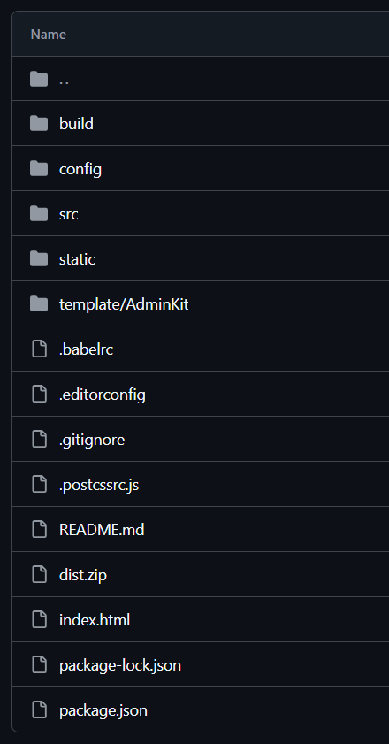
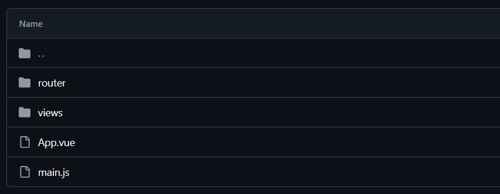
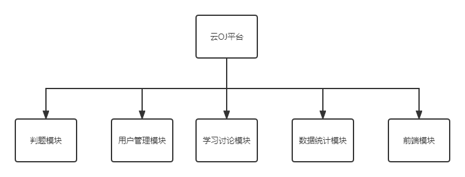
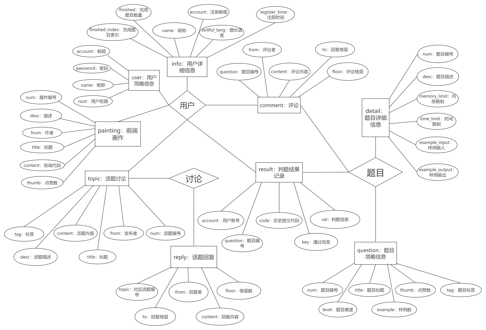
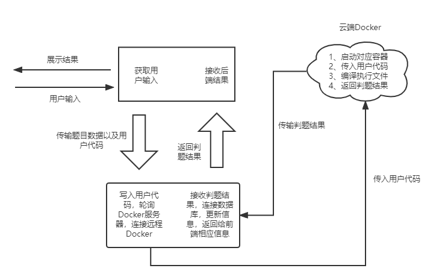
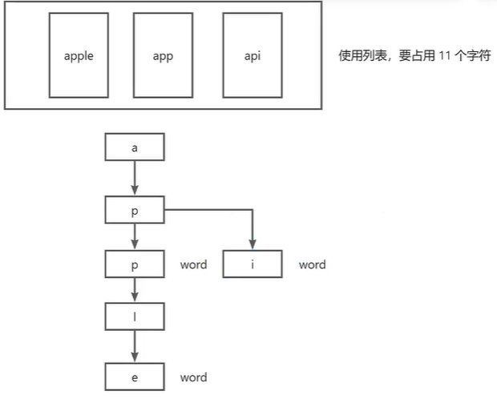

## 前期准备

### Talking with Alan

计算机网络

```markdown
计网基础

- 计算机网络 → 65535 个端口 → tcp/http 详解
- Unix sockets support：本地端口相通

网络编程

- json、rest api 与云计算
- netty → Nacos
- java 函数式编程
- implements Serializable 序列化
```

容器

```markdown
容器技术

- 一个容器 = 一个进程
- docker java 操作容器资源
```

JUC 编程

```markdown
Java 线程池

- corePoolSize：核心线程数
- maximumPoolSize：最大线程数
- keepAliveTime
- TimeUnit
- `BlockingQueue<Runnable> workQueue`
- 控制在内存的 75% 以下
- 尽量保证阻塞队列大小大于 5
- 四种拒绝策略
- 线程池的构造方法

容器池仿造线程池做 → 三种类型的容器池
```

安全问题

```markdown
Java 与沙箱安全

- java 执行：java -jar xxx.jar nohup &
- 安全问题：内存限制，时间限制（防止恶意代码）
- 提交次数：防止恶意提交（Submission ID）
```

思维导图：processon.com

### 编译执行 Java 程序

命令行编译执行 java 程序

1. 执行`javac -d . HelloWorld.java`，将在当前目录下生成一个 com 的文件夹，将 .class 文件统一编译到 com 文件夹下
2. 执行`java com/HelloWorld`，运行 HelloWorld 文件中的 Main 程序，该主程序将自动链接包（com）中的其他类，完成多个类的统一运行

如以下代码执行上述两条命令将会输出

```bash
nmsl
wdnmd
```

~~~java
package com;
public class HelloWorld{
    public static void main(String[] args){
        List<String> list = new ArrayList<>();
        list.add("nmsl");
        list.add("wdnmd");
        for(String str: list)
            System.out.println(str);
    }
}
~~~

这种执行将自动导入程序中导入的 java 自带类包（如 ArrayList 等等）

### Runner from Qin

实现覃辉给的接口 Runner

~~~java
public interface Runner {
    /**
     *      获取运行结果，如果任何一条命令出错则立即返回 并在exitCode 写入错误代码，不再执行下一条命令
     *      运行时间和内存此时可以直接返回负数，不用再计算
     *      样例届时也会放置在输入文件夹中。
     *      友情提示：一条命令结束后 执行echo $?可以得到它的返回值 其他方案也可以
     *      以下命令可以得到当前容器内存大小等信息
     *      docker stats --no-stream --format "{\"container\":\"{{ .Container }}\",\"memory\":{\"raw\":\"{{ .MemUsage }}\",\"percent\":\"{{ .MemPerc }}\"},\"cpu\":\"{{ .CPUPerc }}\"}"
     *      
     *      @param workPath  容器工作目录 目前都会传（/usr/codeRun/) ————> 暂时废弃
     *      @param inputFilePath - 输入文件路径目录，需要拷贝此目录下所有文件到容器的工作目录（即/var/temp/code/20002/所有都拷贝到/usr/codeRun/) ————> 暂时废弃
     *      @param commandLine - 待执行程序的命令行数组，多条命令，按顺序串行执行，包含完整目录(如javac /usr/codeRun/Hello.java )
     *      @param imageType -(0 未定 |10520 python |10730 gcc:7.3 |  20800 openjdk:8 | 21100 openjdk:11| 30114 golang:1.14|用于选择镜像)
     *      @param timeLimit - 每条命令的时间限制(单位ms, 0表示不限制)
     *      @param memoryLimit - 每条命令的内存限制(单位KB, 0表示不限制)
     *      @return 一个包含程序运行结果的Map<String, Object>对象（key有 "result":List<String>每条语句执行后的控制台输出,"exitCode":List<Integer>每条语句的运行后的状态代码
     *      "usedTime: List<Integer>"，usedMemory: List<Integer>" 每条命令执行耗费的内存  其中result顺序要和命令顺序一致，如果没输出则放入“”)
     **/

    public Map<String, Object> judge(String workPath, String inputFilePath, String[][] commandLine,
                                   int imageType, int[] timeLimit, int[] memoryLimit) throws Exception;

}
~~~

执行命令 comandLine

```java
String[][] command3 = {{"javac", "-d", ".", "Solution.java"}, {"java", "test/Solution"}};
```

返回结果

~~~shell
开始初始化docker
开始初始化
01:12:48.956 [main] DEBUG com.spotify.docker.client.DockerCertificates - Generated private key from spec using the 'RSA' algorithm
01:12:50.368 [main] DEBUG com.spotify.docker.client.DockerConfigReader - Using configfile: C:\Users\NorthBoat\.docker\config.json
docker_client初始化成功
开始创建docker容器
容器创建完毕
连接容器
01:12:53.205 [main] INFO com.spotify.docker.client.DefaultDockerClient - Starting container with Id: 36a71148a6c65c825f21c1ee27bf32b587ddc078dbe92196b011f90e2c5b11bb
开始编译...
编译成功
正在运行程序..
运行结束
停止容器成功
已移除容器
docker代理已关闭
本次判题结束，正在返回结果...

超时:false    超出内存限制:false    创建容器时间:5108ms    内存使用:0MiB    运行时间:1ms    停止容器时间:625ms    
运行结果：
hello,i am part 1
hello,i am part 2
ohhhhhhhhhhh!
finised


finished!

Process finished with exit code 0
~~~

在最终的版本中，应该先在容器外编译，只共享字节码文件到容器内进行`java -cp`执行

## 前端开发

> Vue + ElementUI
>

热部署与构建

~~~bash
npm run dev
npm run build
~~~

目录结构



src 目录



### 主入口 main.js

main.js

- 引入 element-ui
- 引入 Axios，添加请求前缀 /api，这里在 config/index.js 中重写 /api 为后端请求路径，如 localhost，实现跨域请求

~~~js
// The Vue build version to load with the `import` command
// (runtime-only or standalone) has been set in webpack.base.conf with an alias.
import Vue from 'vue'
import App from './App'

import ElementUI from 'element-ui'
import 'element-ui/lib/theme-chalk/index.css';
Vue.use(ElementUI);

import router from './router'
import Axios from 'axios'
import VueAxios from 'vue-axios'

Vue.use(VueAxios, Axios);
Vue.prototype.$axios = Axios;
Axios.defaults.baseURL = '/api';
Axios.defaults.headers.post['Content-Type'] = 'application/json';

Vue.config.productionTip = false

/* eslint-disable no-new */
new Vue({
  el: '#app',
  router,
  render: h => h(App) //ElementUI
})
~~~

### 配置 config

index.js

- 主要是重写请求路径实现跨域请求
- 这里后端 SpringBoot 也要作出相应配合，使用 @CrossOrigin 注解

~~~js
'use strict'
const path = require('path')

module.exports = {
  dev: {
    // Paths
    assetsSubDirectory: 'static',
    assetsPublicPath: '/',
    proxyTable: {
      '/api':{
        target: 'http://39.106.160.174:8089/',
        changeOrigin: true,
        pathRewrite:{
            '^/api':''
        } 
      }
    },

    // Various Dev Server settings
    host: 'localhost', // can be overwritten by process.env.HOST
    port: 8087, // can be overwritten by process.env.PORT, if port is in use, a free one will be determined
    autoOpenBrowser: false,
    errorOverlay: true,
    notifyOnErrors: true,
    poll: false,
    devtool: 'cheap-module-eval-source-map',

    cacheBusting: true,

    cssSourceMap: true
  },

  build: {
    // Template for index.html
    index: path.resolve(__dirname, '../dist/index.html'),

    // Paths
    assetsRoot: path.resolve(__dirname, '../dist'),
    assetsSubDirectory: 'static',
    assetsPublicPath: './',
    productionSourceMap: true,
    devtool: '#source-map',
    productionGzip: false,
    productionGzipExtensions: ['js', 'css'],
    bundleAnalyzerReport: process.env.npm_config_report
  }
}
~~~

### 路由转发 router

使用 vue-router 作页面的重定向与跳转，这里必须要注意各页面的层级关系，不然会导致渲染失败

index.js

~~~js
import Vue from 'vue'
import Router from 'vue-router'

import Main from '../views/Main'
import Lost from '../views/Lost'
import Dispatch from '../views/Dispatch'

import Login from '../views/login/Login'
import Register from '../views/login/Register'
import Improve from '../views/login/Improve'

import Hello from '../views/content/Hello'
import Profile from '../views/content/Profile'

import Repository from '../views/content/work/Repository'
import Detail from '../views/content/work/Detail'
import Introduce from '../views/content/work/Introduce'
import Result from '../views/content/work/Result'
import Comment from '../views/content/work/Comment'
import Board from '../views/content/work/Board'

import Discuss from '../views/content/discuss/Discuss'
import Topic from '../views/content/discuss/Topic'
import List from '../views/content/discuss/List'
import Write from '../views/content/discuss/Write'

Vue.use(Router)

export default new Router({
  //mode: 'history',
  routes: [
    {
      path: '/login',
      component: Login,
      name: 'login'
    },

    {
      path: '/register',
      component: Register,
      name: 'register'
    },

    {
      path: '/improve',
      component: Improve,
      name: 'improve'
    },

    {
      path: '/main',
      component: Main,
      name: 'main',
      redirect: '/main/hello',
      children:[
        {path: '/main/hello', component: Hello, name: 'hello'},
        {path: '/main/dispathch', component: Dispatch, name: 'dispatch'},
        {path: '/main/profile', component: Profile, name: 'profile'},

        {path: '/main/repository/:tag', component: Repository, name: 'repository'},
        {
          path: '/main/detail',
          redirect: '/main/repository/all',
          component: Detail,
          name: 'detail',
          props: true,
          children: [
            {path: '/main/detail/introduce/:num', component: Introduce, name: 'introduce'},
            {path: '/main/detail/result/:num', component: Result, name: 'result'},
            {path: '/main/detail/comment/:num', component: Comment, name: 'comment'}
          ]
        },

        {path: '/main/discuss/:tag', component: Discuss, name: 'discuss'},
        {
          path: '/main/topic',
          component: Topic, 
          name: 'topic',
          redirect: '/main/discuss/All',
          children: [
            {path: '/main/topic/detail/:num', component: Topic, name: 'topic'}
          ]
        },
        {path: '/main/write', component: Write, name: 'write'},
        {path: '/main/board', component: Board, name: 'board'},
        {path: '/main/list', component: List, name: 'list'}
      ]
    },

    {
      path: '/',
      redirect: '/main',
    },
    
    {
      path: '/*',
      component: Lost,
      name: 'lost'
    }
  ]
})
~~~

Main.vue

- 主页：侧边栏、导航栏、页眉、页脚
- 具体内容使用 router-view 展示

Lost.vue：404 页面

~~~vue
<template>
    <div id="lost">
        
    </div>
</template>

<script>
export default {
    name: 'Lost'
};
</script>

<style lang="scss" scoped>
    #lost {
        font-family: 'Avenir', Helvetica, Arial, sans-serif;
        -webkit-font-smoothing: antialiased;
        -moz-osx-font-smoothing: grayscale;
        text-align: center;
        color: #2c3e50;
        margin-top: 60px;
    }
</style>
~~~

DIspatch.vue

- 用于页面转发
- 重新渲染页面

~~~vue
<template>
    <div>
        
    </div>
</template>

<script>
export default {
    name: 'Dispatch',
    mounted() {
        //若在结果界面判题，通过这里作为跳板刷新结果界面
        if(this.$route.params.result !== undefined){
            this.$router.push({name: 'result', params: {num: this.$route.params.num, result: this.$route.params.result, code: this.$route.params.code}});
            //console.log(this.$route.params.result);
            return;
        }
        // 侧边栏仓库请求 
        else if(this.$route.params.repoTag != undefined){
            this.$router.push({name: 'repository', params: {tag: this.$route.params.repoTag}});
            return;
        } 
        // 侧边栏讨论请求
        else if(this.$route.params.discTag != undefined){
            this.$router.push({name: 'discuss', params: {tag: this.$route.params.discTag}});
            return;
        } 
        // 题目评论后跳转
        else if(this.$route.params.commentFloor != undefined){
            this.$router.push({name: 'comment', params: {num: this.$route.params.num, floor: this.$route.params.commentFloor}});
            return;
        } 
        // 话题评论后跳转
        else if(this.$route.params.replyFloor != undefined){
            this.$router.push({name: 'topic', params: {num: this.$route.params.num, floor: this.$route.params.replyFloor}});
            return;
        }
        // 发布新绘画后跳转 
        else if(this.$route.params.flag != undefined){
            this.$router.push({name: 'board'});
            return;
        }
        this.$router.push({name: 'hello'});
    },

    methods: {
        
    },
};
</script>

<style lang="scss" scoped>

</style>
~~~

### 内容 content

Main.vue

- 整个页面的框架
- 具体内容通过 router-view 进行展示

Hello.vue

- 主页一进去的内容，进行数据展示
- 其余内容页都差不多，只不过请求不同

Profile.vue：个人信息页

Login.vue：参考了 github 的登录页面

~~~vue
<template>
  <div id="login">
    

    <el-form ref="loginForm" :model="form" :rules="rules" label-width="80px" class="login-box">

      <h3 class="login-title">Login</h3>

      <el-form-item label="username" prop="username">
        <el-input type="text" placeholder="用户名或邮箱地址" clearable v-model="form.username"/>
      </el-form-item>

      <el-form-item label="password" prop="password">
        <el-input type="password" placeholder="请输入密码" show-password v-model="form.password"/>
      </el-form-item>

      <el-form-item id="login-button">
        <el-button type="primary"  round @click="login()">登录</el-button>
      </el-form-item>

    </el-form>

    <div id="tips">
      <p>New to OJ? <router-link type="primary" to="/register">Create an account</router-link></p>
      <p><router-link type="primary" to="/find">Maybe you forget password ?</router-link></p>
      
    </div>
    
  </div>
</template>

<script>
  export default {
    name: "Login",
    data() {
      return {
        form: {
          username: '',
          password: '',       
        },
        //表单验证，需要在el-form-item 元素中增加prop 属性
        rules: {
          username: [                       
            {required: true, message: " 账号不可为空", trigger: 'blur'}
          ],
          password: [
            {required: true, message: " 密码不可为空 ", trigger: 'blur'}
          ]
        },
      }
    },
    methods: {
      login() {
        if(this.form.username === '' || this.form.password === ''){
            this.$message.error('请完整填写用户名及密码');
            return;
        }
        let info = {username: this.form.username, password: this.form.password};
        this.$axios.post('/login', info).then(response => {
          let result = response.data;
          if(result.code !== 200) {
            this.$message.error(result.message);
          } else{
            this.$message({
              message: "登陆成功",
              type: 'success'
            });
            window.sessionStorage.setItem("loginUsername", result.data.name);
            window.sessionStorage.setItem("loginAccount", result.data.account);
            this.$router.push({name: 'dispatch'});
          }
        })
      }
    }
  }
</script>

<style lang="scss" scoped>
  .login-box {
    border: 1px solid #DCDFE6;
    width: 250px;
    margin: auto;
    margin-bottom: 20px;
    padding: 35px 35px 15px 35px;
    border-radius: 5px;
    -webkit-border-radius: 5px;
    -moz-border-radius: 5px;
    box-shadow: 0 0 25px #909399;
  }

  #tips {
    font: 13px Small;
    border: 3px solid #DCDFE6;
    width: 250px;
    margin: auto;
    border-radius: 4px;
    padding: 9px 32px 9px 32px;
  }

  .login-title {
    text-align: center;
    margin: 0 auto 40px auto;
    color: #303133;
  }

  #login-button{
    position: relative;
    left: -12%;

  }

  #login {
    font-family: 'Avenir', Helvetica, Arial, sans-serif;
    -webkit-font-smoothing: antialiased;
    -moz-osx-font-smoothing: grayscale;
    text-align: center;
    color: #2c3e50;
    margin-top: 60px;
  }

  .router-link-active{
    text-decoration: none;
  }
  
  a{
    text-decoration: none;
  }

  a:hover{
    text-decoration: none;
  }
</style>
~~~

## 后端开发

SpringBoot + MyBatis + Redis

### 设计与配置

总体设计



数据库 ER 图



正常用 MySQL 存就行

对于一些统计数据和临时数据，例如

- 注册时用的邮箱验证码
- 热门题目排行：根据点赞数排序
- 访问的较多的题目信息

采用 Redis 存储，分别使用

1. HMAP 存储键值对存储：`<register:code, <UserID/Email, Code>>`
2. SortedSet 存储题目 ID 和点赞次数（Double）：`<question:thumb, <QuestionID, Count>>`
3. HMAP 存储完整的题目信息：`<question:info, <QuestionID, {title, level, template...}>>`

环境

- JDK 1.8
- Spring 2.6.1
- Docker Client 8.16.0
- MyBatis 3.4.5
- Druid 1.2.8

配置文件

- maven - pom.xml：[Bears-OJ/backend/pom.xml at master · Arkrypto/Bears-OJ](https://github.com/Arkrypto/Bears-OJ/blob/master/backend/pom.xml)
- log4j - log4j.properties：[Bears-OJ/backend/src/main/resources/log4j.properties at master · Arkrypto/Bears-OJ](https://github.com/Arkrypto/Bears-OJ/blob/master/backend/src/main/resources/log4j.properties)
- springboot - application.yml

~~~yaml
spring:
  application:
    name: neuqoj
  datasource:
    username: root
    password: ""
    url: jdbc:mysql://39.106.160.174:3306/neuqoj?serverTimezone=UTC&useUnicode=true&characterEncoding=utf-8
    driver-class-name: com.mysql.cj.jdbc.Driver
    type: com.alibaba.druid.pool.DruidDataSource
    filters: stat,wall,log4j
  thymeleaf:
    cache: false
  redis:
    host: 39.106.160.174
    port: 6379
    password: ""


#整合mybatis
mybatis:
  type-aliases-package: com.oj.neuqoj.pojo

server:
  port: 8089
~~~

### Docker Client

判题流程



[DockerRunner.java](https://github.com/Northboat/Bears-OJ/blob/master/backend/src/main/java/com/oj/neuqoj/docker/impl/DockerRunner.java)，实现覃辉的 Runner 接口，如果现在实现，我会分三层写

1. interface Runner 接口 
2. abstract class AbstractRunner 实现容器的初始化和销毁
2. class DefaultRunner 实现 run 函数

具体实现：[Bears-OJ/backend/src/main/java/com/oj/neuqoj/docker/impl/DockerRunner.java at master · Northboat/Bears-OJ](https://github.com/Northboat/Bears-OJ/blob/master/backend/src/main/java/com/oj/neuqoj/docker/impl/DockerRunner.java)

记录超时时间，用 Spring 的 StopWatch，在执行方法中的关键步骤前后进行 start 和 stop，再获取最后一次的记录

```java
StopWatch stopWatch = new StopWatch();
// ...初始化
long time = 0L;
stopWatch.start();
// ... Docker 代码执行
stopWatch.stop();
// 记录时间
time = stopWath.getLastTaskTimeMillis();
executeMessage.setTime(time);
```

获取程序占用内存，考虑执行中的最大值，使用 DockerClient 的 API 对容器进行监控，维护一个 Integer 变量记录最大内存占用

```java
final long[] maxMemory = {0L};
StatsCmd statsCmd = dockerClient.statsCmd(containerId);
// 定义回调，这里的分析应该是不会停的
ResultCallback<Statistics> statisticsResultCallback = statsCmd.exec(new ResultCallback<Statistics>(){
	@Override
    public void onNext(Statistics statistics){
        maxMemory[0] = Math.max(statistics.getMemoryStats().getUsage(), maxMemory[0]);
    }
    @Override
    public void close() throws IOException{}
    @Override
    public void onStart(Closeable closeable){}
    @Override
    public void onError(Throwable throwable){}
    @Override
    public void onComplete(){}
});
executeMessage.setMemory(maxMemory[0]);
statsCmd.close();
```

这里的分析是不会停的，他是一个实时监控，onComplete 不确定会不会在 close 的时候触发，所以这里还是用外部 final 数组变量去实时记录最大值，在获取完毕后，记得关闭这个数据分析的命令行

### 接口 Controller

> 现在看有点不规范了

QuestionApi.java

~~~java
@RestController
@CrossOrigin
public class QuestionApi {
    
    private QuestionMapper questionMapper;
    @Autowired
    public void setQuestionMapper(QuestionMapper questionMapper){
        this.questionMapper = questionMapper;
    }
    
    // Autowire ... //

    @RequestMapping("/judge")
    public ResultUtil judge(@RequestBody Map<String, String> params){
        //获取用户代码
        String answer = params.get("answer");
        //获取用户名，用于创建用户代码文件
        String username = params.get("username");
        //获取语言编号
        int lang = Integer.parseInt(params.get("lang"));
        //获取题目名，用于共享文件夹（每道题一个文件夹）
        String name = params.get("name");

        //写入用户代码，false即为io报错，直接返回错误信息
        if(!new IOUtil().writeAns(answer, name, username, lang)){
            return ResultUtil.failure(ResultCode.JUDGE_IO_ERROR);
        }

        //获取内存限制，0为无限制
        long memoryLimit = Long.parseLong(params.get("memoryLimit"));
        //获取命令
        String[][] commandLine = new CommandUtil().createCommand(lang, username);


        //准备docker容器
        DockerRunner dockerRunner = new DockerRunner();
        //请求入队
        dockerRunner.offer(name, commandLine, lang, memoryLimit);


        //新建线程开启docker容器判题
        FutureTask<Map<String, Object>> task = new FutureTask<>(dockerRunner);
        new Thread(task).start();
        if(!task.isDone()){ System.out.println("The task is running"); }
        //获取结果并返回
        Map<String, Object> res;
        try {
            res = task.get();
        } catch (InterruptedException e) {
            return ResultUtil.failure(ResultCode.JUDGE_SERVER_ERROR, "判题线程中断");
        } catch (ExecutionException e) {
            return ResultUtil.failure(ResultCode.JUDGE_IO_ERROR, "判题执行错误");
        }


        int num = Integer.parseInt(params.get("num"));
        Info info = infoMapper.getInfo(username);
        //更新用户数据
        if((Integer)res.get("status") == 1 && !info.hasPassed(num)){
            info.pass(num, lang);
            info.goodAt();
        }
        infoMapper.updateInfo(info);

        return ResultUtil.success(res);

    }


    @RequestMapping("/storeRes")
    public ResultUtil storeResult(@RequestBody Map<String, String> params){
        String account = params.get("account");
        int num = Integer.parseInt(params.get("num"));
        String title = params.get("title");
        String key1 = params.get("key1");
        String key2 = params.get("key2");
        String key3 = params.get("key3");
        String key4 = params.get("key4");
        String val1 = params.get("val1");
        String val2 = params.get("val2");
        String val3 = params.get("val3");
        String val4 = params.get("val4");
        String code = params.get("code");
        Result result = new Result(account, num, title, key1, key2, key3, key4, val1, val2, val3, val4, code);

        if(result.getCode().length() > 520){
            result.setCode(result.getCode().substring(0, 520));
        }
        if(result.getVal2().length() > 200){
            result.setCode(result.getVal2().substring(0, 200));
        }

        if(resultMapper.getResult(account, num) != null){
            resultMapper.updateResult(result);
        } else {
            resultMapper.setResult(result);
        }
        return ResultUtil.success();
    }


    @RequestMapping("/getRes")
    public ResultUtil getRes(@RequestBody Map<String, String> params){
        //System.out.println(params.get("account"));
        String account = params.get("account");
        int num = Integer.parseInt(params.get("num"));
        Result res = resultMapper.getResult(account, num);
        if(res == null){
            return ResultUtil.failure(ResultCode.DATA_NOT_FOUND);
        }
        return ResultUtil.success(res);
    }


    @RequestMapping("/getComments")
    public ResultUtil getComments(@RequestBody Map<String, String> params){
        int question = Integer.parseInt(params.get("question"));
        List<Comment> comments = commentMapper.getComments(question);
        for(Comment c: comments){
            c.setComments(comments);
        }
        List<Comment> res = new ArrayList<>();
        for(Comment c: comments){
            if(c.getTo() == 0){
                res.add(c);
            }
        }
        return ResultUtil.success(res);
    }


    @RequestMapping("/comment")
    public ResultUtil comment(@RequestBody Map<String, Object> params){
        int question = Integer.parseInt(params.get("question").toString());
        String from = params.get("from").toString();
        int to = Integer.parseInt(params.get("to").toString());
        String content = params.get("content").toString();

        if(content.length() > 200){
            return ResultUtil.failure(ResultCode.PARAM_IS_INVALID);
        }
        commentMapper.comment(new Comment(question, from, to, content));
        return ResultUtil.success();
    }
}
~~~

### 响应 Result

ResultCode.java

~~~java
public enum ResultCode {

    //http状态码
    SUCCESS(200, "成功"),
    INTERNAL_SERVER_ERROR(500, "服务器错误"),
    REQUEST_TIME_OUT(408, "请求超时"),

    //判题反馈
    //JUDGE_PASS(1, "通过"),
    JUDGE_COMPILE_FAILURE(2, "编译失败"),
    JUDGE_TIMEOUT_FAILURE(3, "执行超时"),
    JUDGE_MEMORY_OUT_FAILURE(4, "内存超出"),
    JUDGE_NOT_MATCH_FAILURE(5, "解答错误"),
    JUDGE_SERVER_ERROR(6, "服务错误"),
    JUDGE_IO_ERROR(7, "写入用户代码错误"),

    //参数问题
    PARAM_IS_INVALID(1001, "参数无效"),
    PARAM_IS_BLANK(1002, "参数为空"),
    PARAM_TYPE_BIND_ERROR(1003, "参数类型错误"),

    //用户问题
    USER_NOT_LOGGED_IN(2001, "用户未登录"),
    USER_PASSWORD_ERROR(2002, "密码错误"),
    USER_ACCOUNT_FORBIDDEN(2003, "账号已被禁用"),
    USER_NOT_EXIST(2004, "用户不存在"),
    USER_HAS_EXISTED(2005, "用户已存在"),

    //邮件问题
    EMAIL_NOT_AVAILABLE(2006, "发送邮件出错"),
    CODE_VERIFY_FAILURE(2007, "验证码错误"),

    //sql问题
    DATA_NOT_FOUND(2008, "请求的数据不存在");

    private Integer code;
    private String message;

    ResultCode(Integer code, String message){
        this.code = code;
        this.message = message;
    }

    public Integer code(){
        return this.code;
    }

    public String message(){
        return this.message;
    }
}
~~~

ResultUtil.java

~~~java
package com.oj.neuqoj.utils;

import lombok.Data;

import java.io.Serializable;

@Data
public class ResultUtil implements Serializable {
    private Integer code;
    private String message;
    private Object data;

    public ResultUtil(){}

    public ResultUtil(ResultCode resultCode, Object data) {
        this.code = resultCode.code();
        this.message = resultCode.message();
        this.data = data;
    }

    public void setResultCode(ResultCode resultCode){
        this.code = resultCode.code();
        this.message = resultCode.message();
    }

    public void setData(Object data){
        this.data = data;
    }

    public static ResultUtil success(){
        ResultUtil resultUtil = new ResultUtil();
        resultUtil.setResultCode(ResultCode.SUCCESS);
        return resultUtil;
    }

    public static ResultUtil success(Object data){
        ResultUtil resultUtil = new ResultUtil();
        resultUtil.setResultCode(ResultCode.SUCCESS);
        resultUtil.setData(data);
        return resultUtil;
    }

    public static ResultUtil failure(ResultCode resultCode){
        ResultUtil resultUtil = new ResultUtil();
        resultUtil.setResultCode(resultCode);
        return resultUtil;
    }

    public static ResultUtil failure(ResultCode resultCode, Object data){
        ResultUtil resultUtil = new ResultUtil();
        resultUtil.setResultCode(resultCode);
        resultUtil.setData(data);
        return resultUtil;
    }
}
~~~

### Mapper 示例

QuestionMapper.java（偷懒用注解写了）

~~~java
@Mapper
@Repository
public interface QuestionMapper {

    @Select("select * from `question`")
    List<Question> getAllQuestions();

    @Select("select * from `question` where num=#{num}")
    Question getQuestion(int num);

    void addQuestion(Question question);

    @Select("select * from `question` where tag=#{tag}")
    List<Question> getQuestionByTag(String tag);
}
~~~

### 服务器部署

通过 nginx 部署

- 部署前端静态文件，做反向代理
- 对 java 程序端口做负载均衡

nginx.conf

~~~yaml
#user  nobody;
worker_processes  1;

#error_log  logs/error.log;
#error_log  logs/error.log  notice;
#error_log  logs/error.log  info;

#pid        logs/nginx.pid;


events {
    worker_connections  1024;
}


http {
    include       mime.types;
    default_type  application/octet-stream;

    #log_format  main  '$remote_addr - $remote_user [$time_local] "$request" '
    #                  '$status $body_bytes_sent "$http_referer" '
    #                  '"$http_user_agent" "$http_x_forwarded_for"';

    #access_log  logs/access.log  main;

    sendfile        on;
    #tcp_nopush     on;

    #keepalive_timeout  0;
    keepalive_timeout  65;
    
    #gzip  on;

    upstream NEUQ-OJ{
	# OJ后台服务负载均衡
	server 39.106.160.174:8089 weight=2;
	server 110.42.161.162:8089 weight=1;
    }
    server {
	listen       8087;
	server_name  localhost;
	location / {
	    root   html;
	    index  index.html index.htm;
        }
	location /api {
	    rewrite   ^.+api/?(.*)$ /$1 break;
	    proxy_pass   http://NEUQ-OJ;
	    proxy_redirect off;
	    proxy_set_header Host $host;
	    proxy_set_header X-Real-IP $remote_addr;
	    proxy_set_header X-Forwarded-For $proxy_add_x_forwarded_for;
	}
	error_page    500 502 503 504    /50x.html;
	location = /50x.html {
	    root    html;
	}
    }
}
~~~

## 代码安全

防护用户的恶意代码执行

### 超时控制：子线程监控

无限睡眠，这样的程序丢到沙箱执行，如果没有处理，只会造成无意义的系统资源消耗

```java
public class Main{
    public static void main(String[] args) throws InterruptedException{
        long ONE_HOUR = 60*60*1000L;
        Thread.sleep(ONE_HOUR);
        System.out.println("睡完了");
    }
}
```

解决办法：超时控制，定义超时时间，在主线程中开辟一个统计线程（相当于守护线程），监控用户代码的运行时间

```java
Process runProcess = Runtime.getRuntime().exec(runCmd);
new Thread(() -> {
    try{
        Thread.sleep(TIME_OUT);
        // 超时了，中断
        runProcess.destroy();
    } catch(InterruptedException e){
        throw new RuntimeException(e);  
    }
}).start();

// 正常跑 runProcess
ExecuteMessage executeMessage = ProcessUtils.runProcessAndGetMessage(runProcess);
```

先睡一段超时时间，如果这段时间内 runProcess 没执行完，就会被守护线程销毁，从而不会一直占用

### 内存资源：JVM -Xmx

占用内存不释放

```java
public class Main{
    public static void main(String[] args) throws InterruptedException{
        List<byte[]> btyes = new ArrayList<>();
        while(true){
            bytes.add(new byte[10000]);
        }
    }
}
```

解决办法：限制 JVM 的启动内存，比如只给 JVM 256MB 的堆内存

在执行 class 文件时，设置 JVM 的 -Xmx 参数（-Xms 是初始堆空间大小，一般二者保持一致）

```bash
java -Xmx256m -cp Main
```

但要注意，-Xmx 参数并不等于系统实际占用的最大资源，可能会超出，就是说，这个限制并不是严格的，他有可能在某一秒超出 256MB 的限制

如果在 Linux 系统，可以使用 cgroup 来实现堆某个进程的 CPU、内存等资源的分配

### 读写文件：字典树 + 敏感词归一化

读取当前目录相对路径获取文件，信息泄露

```java
public class Main{
    public static void main(String[] args) throws InterruptedException{
        String userDir = System.getProperty("user.dir");
        String filePath = userDir + File.separator + "src/main/resources/application.yml";
        List<String> allLines = Files.readAllLines(Paths.get(filePath));
        System.out.println(String.join("\n", allLines));
    }
}
```

写文件，越权植入木马

```java
public class Main{
    public static void main(String[] args) throws InterruptedException{
        String userDir = System.getProperty("user.dir");
        String filePath = userDir + File.separator + "src/main/resources/application.yml";
        String errorProgram = "java -version 2>&1";
        Files.write(Paths.get(filePath), Arrays.asList(errorProgram));
        System.out.println("写文件成功，你完了");
    }
}
```

解决办法：利用字典树限制代码，黑白名单和字符串匹配，在保存文件前进行代码校验

hutool 依赖引入

```xml
<dependency>
    <groupId>cn.hutool</groupId>
    <artifactId>hutool-all</artifactId>
    <version>5.8.8</version>
</dependency>
```

定义并使用字典树

```java
List<String> blackList = Arrays.asList("Files", "exec");

// From hutool
WordTree wordTree = new WordTree();
wordTree.addWords(blackTree);
FoundWord foundWord = wordTree.matchWord(code);
if(foundWord != null){
    Log.log("High Danger Word Matched: ", foundWord.getFoundWord);
    // 跳过逻辑...
    return null;
}
```

如果要更严格，可以修改 WordTree 的配置，添加更多的黑名单项，并且在实际项目中，这个 WordTree 应该是全局初始化的`WORD_TREE`

字典树原理：在单词末尾的节点标注其为一个单词



这样的数据结构，每层不会超过 26 个节点，高度由最长的单词决定，这样的字典树结构在敏感词黑名单中十分常用

在代码中，敏感词难以被替换，但在一些其他场景，用户可以修改敏感词，例如加空格，用拼音来躲避敏感词校验，这里就要用到**归一化技术**，对敏感词进行归一处理

### SecurityManager 管理

> 在 JVM 层面限制命令执行和网络连接

例如这样的命令

```bash
rm -rf /*
```

首先和危险代码一样，需要裹一层字典树 + 黑白名单的校验，但这样会留下隐患

- 无法覆盖所有的风险点
- 不同的编程语言，关键词都不一样，限制人工成本很大

解决办法：限制用户的操作权限，对文件、内存、CPU、网络等资源的操作和访问，通过 Java 安全管理器来实现更严格的限制

- Java 安全管理器（Security Manager），Java 自带的保护 JVM、Java 安全的机制

新建 security 包，定义 DefaultSecurityManager 继承 SecurityManager

```java
public class DefaultSecurityManager extends SecurityManager{
    @Override
    public void checkPermission(Permission perm){
        System.out.println("不做限制");
        System.out.println(perm);
        // 如果 super 了，就会默认检查所有权限
        // super.checkPermission(perm);
    }
}
```

实现安全管理器，只需要继承 SecurityManager 就可以了

在方法中加入检查

```java
public ExecuteCodeResponse executeCode(ExecuteCodeRequest executeCodeRequest){
    System.setSecutiryManager(new DefaultSecurityManager());
    // .. 正常跑流程
}
```

如果不想给某个方法权限，那么只需要修改对应的权限检查方法，令其抛出异常，这样 SecurityManager 在检查时，就会直接抛异常

例如想要拒绝所有权限

```java
public class DenySecurityManager extends SecurityManager{
    @Override
    public void checkPermission(Permission perm){
        throw new SecurityException("权限不足: " + perm.toString());
    }
}
```

这样在方法中碰到任何权限检查，都会触发 SecurityManager 的 checkPermission 方法，从而直接抛出异常

其他的权限检查

1. 文件执行权限：`checkExec(String cmd)`
2. 读文件权限：`checkRead(String file, Object context)`
3. 写文件权限：`checkWrite(String file)`
4. 删除文件：`checkDelete(String file)`
5. 网络连接权限：`checkConnect(String host, int port)`

那么可以实现这样一个 SecurityManager，先放行所有的 checkPermission，而后重写上面的 5 个方法，令其抛异常，这样就可以直接**从 JVM 层面禁用方法权限**

- 然后在一个公共的区域进行 System.setSecurityManager（比如 Application 启动类），类似于一个配置类加载

写白名单：在抛异常前，对放行的情况写 if-return 语句，这样就是写白名单，非常麻烦，尤其是读权限，会导致类直接加载不出来，放白名单非常麻烦

缺点

1. 如果要做严格的权限控制，粒度太细了（针对到包名），需要编程者自己判断，难以精细化控制
2. 程序上的限制，没到系统层面

## 容器安全

### 环境隔离：namespace 容器隔离

通过 Docker 容器隔离代码执行环境与宿主机，**我们需要的是一个持续可交互的容器**，即这个容器创建好之后，需要和我们的终端进行持续的输入输出交互

```java
// 根据镜像初始化容器
CreateContainerCmd containerCmd = dockerClient.createContainerCmd(image);

// 将本地目录绑定到容器内部
HostConfig hostConfig = new HostConfig();
hostConfig.setBinds(new Bind(userCodeParentPath, new Volume("/app")));
// 限制内存，很关键且好用
hostConfig.withMemory(100 * 1000 * 1000L);
// 限制 CPU 个数
hostConfig.withCpuCount(1L);

// 开启持续的容器交互窗口
CreateContainerResponse createContainerResponse = containerCmd
    .withHostConfig(hostConfig)
    .withAttachStdin(true)
    .withAttachStdout(true)
    .withAttachStderr(true)
    .withTty(true)
    .exec();

// 启动容器
String containerId = createContainerResponse.getId();
dockerClient.startContainerCmd(containerId).exec();

// 创建执行命令
String[] cmdArray = new String[]{"java", "-cp", "/app", "Main"};
ExecCreateCmdResponse execCreateCmdResponse = dockerClient.execCreateCmd(containerId)
    .withCmd(cmdArray)
    .withAttachStderr(true)
    .withAttachStdin(true)
    .withAttachStdout(true)
    .exec();
String execId = execCreateCmdResponse.getId();
// 定义回调，构造返回 ExcuteMessage
ExcuteMessage executeMessage = new ExecuteMessage();
final String[] message = {null}, errorMessage = {null};
String execId = execCreateCmdResponse.getId();
ExecStartResultCallback execStartResultCallback = new ExecStartResultClassback(){
    @Override
    public void onNext(Frame frame){
        StreamType streamType = frame.getStreamType();
        if(StreamType.STDERR.equals(streamType)){
            errorMessage[0] = new String(frame.getPayload());
            System.out.println("error: " + errorMessage[0]);
        } else {
            message[0] = new String(frame.getPayload())
            System.out.println(message[0]);
        }
        super.onNext(frame);
    }
};
// 执行命令
try{
    dockerClient.execStartCmd(execId)
        .exec(execStartResultCallback)
        .awaitCompletion(); // 等待完成返回
} catch (InterruptedException e){
    throw new RuntimeExeption(e);
} 

executeMessage.setMessage(message[0]);
executeMessage.setErrorMessage(errorMessage[0]);
```

容器内部的代码执行顺序必须是线性的，不然多线程下用户输出会混乱

### 容器安全：容器配置

#### 超时控制

无限循环代码执行，在 DockerClient 的 API 中，同步等待有一个时间限制

```java
dockerClient.execStartCmd(execId)
    .exec()
    .awaitCompletion(TIME_OUT, TimeUnit.MICROSECONDS);
```

如何判断是程序超时了，还是无限循环造成的超时？

- 重写执行命令的回调`onComplete()`，若执行完了，令一个外部布尔变量`timeout[0] = false`（默认为 true）
- 也就是说，容器执行完了就会让`timeout[0]`为假，若未执行完，而上述不等待，则`timeout[0]`将为真

#### 内存限制

内存泄漏：在创建容器时指定 HostConfig 限制容器最大内存占用

#### 网络资源

限制网络资源：在创建容器时配置`withNetworkDisabled(true)`，直接禁掉网络

#### 代码安全

在运行环境上做了隔离，不太重要

#### 权限管理

在软件和系统层面禁用读写、执行等权限

- 之前用了 SecurityManager 做了权限管理，但代码跑在 Docker 容器中，已经比较安全，但不排除从容器中影响宿主机的骚操作，这里也可以加上
- 限制用户不能向 root 根目录写文件
- 用 Linux 自带的一些安全管理措施，在 HostConfig 中设置容器`Seccomp`安全策略`hostConfig.withSecurityOpts(Arrays.asList("seccomp=配置json"))`

### API 管理：字段校验 / 签名分发

当我们把 Docker 的代码沙箱服务提供在公网，如果不做任何权限校验，是极其危险的

如果是内部使用，可以约定一个字符串来进行校验，只在服务器内部传递（最好加密），这是最常用的方法，直接在 Controller 中定义一个静态 String 变量，然后在接口 HttpServletRequest 的请求头中去拿，进行一个 if 判断就行

```java
@Controller
public class MainController(){
    private static final String AUTH_REQUEST_HEADER = "auth";
    private static final String AUTH_REQUEST_SECRET = "secret";
    
    @PostMapping("/run")
    public ResultUtil run(@RequestBody Map<String, Object> params, HttpServletRequest request, HttpServletResponse response){
        String authHeader = request.getHeader(AUTH_REQUEST_HEADER);
        if(!authHeader.equals(AUTH_REQUEST_SECRET)){
            response.setStatus(403);
            return null;
        }
        // ... 正常逻辑
    }
}
```

然后在调用方加上请求头进行请求就行

```java
public class RemoteCodeSandbox implements CodeSandbox{
    //定义鉴权请求头和密钥
    private static final String AUTH_REQUEST_HEADER "auth";
    private static final String AUTH_REQUEST_SECRET "secretKey";

    @Override
    public ExecuteCodeResponse executeCode(ExecuteCodeRequest executeCodeRequest){
        System.out.println("远程代码沙箱");
        String url "http://Localhost:8090/executeCode";
        String json JSONUtil.toJsonStr(executeCodeRequest);
        String responsestr Httputil.createPost(url)
            .header(AUTH_REQUEST_HEADER, AUTH_REQUEST_SECRET)
            .body(json)
            .execute()
            .body();
        if (Stringutils.isBLank(responsestr)){
            throw new BusinessException(ErrorCode.API_REQUEST_ERROR,"executeCode remoteSandbox error, message: "+ responseStr);
        }
        return JSONUtil.toBean(responseStr,ExecuteCodeResponse.class);
    }
}
```

这样实现最简单，适合内部调用，但缺点是不够灵活，如果 key 泄露或变更需要重启代码

API 签名认证：给允许调用的人员分配 accessKey 和 secretKey，然后校验这两组 Key 是否匹配
